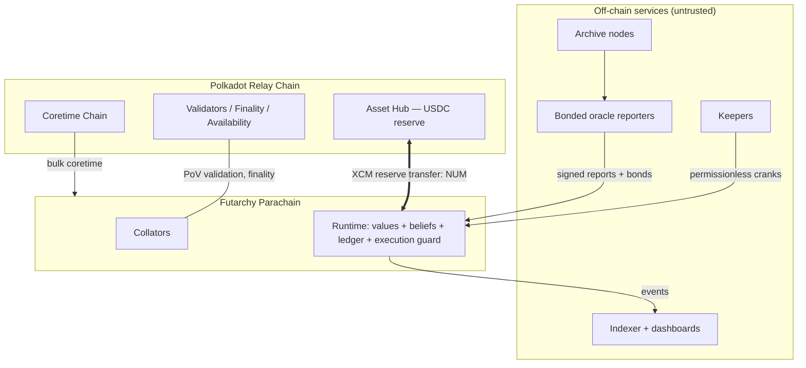
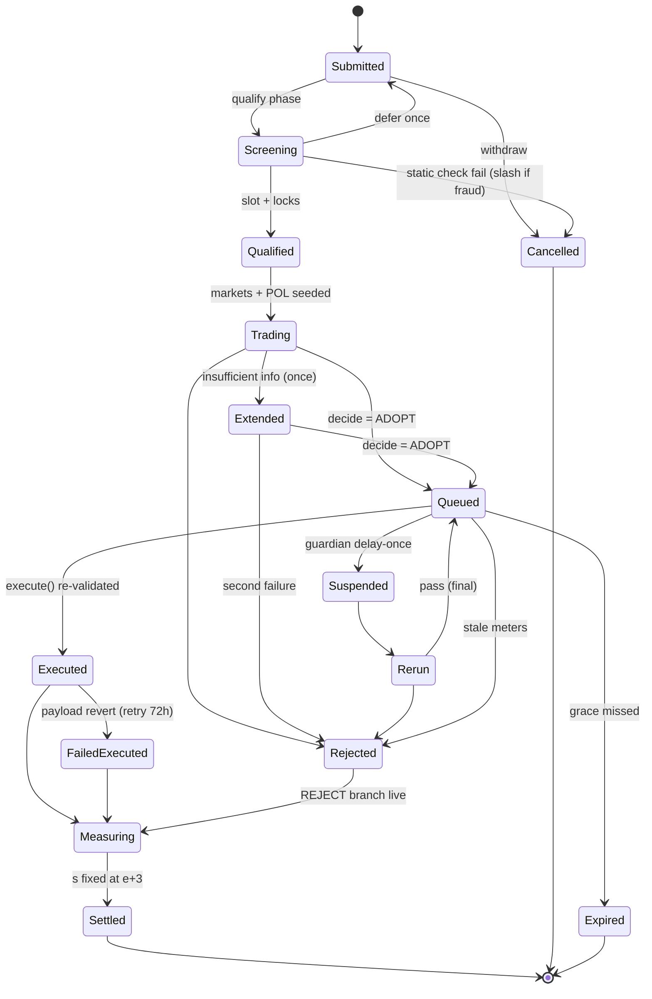

# Polkadot Futarchy Parachain
## Implementation-Ready Architecture Specification — Version 1.0 Draft

**Status:** Draft for engineering review, economic simulation, and independent audit scoping.
**Normative language:** RFC 2119 (MUST, MUST NOT, SHOULD, SHOULD NOT, MAY).
**Research cutoff:** Model knowledge through January 2026; Polkadot SDK repository state verified against `raw.githubusercontent.com/paritytech/polkadot-sdk` on **2026-07-11**. Claims that could not be verified from primary sources in this run are explicitly labeled **[VERIFY]** and MUST be validated before implementation begins.
**Verified in this run:** existence of release branches `polkadot-stable2412` … `polkadot-stable2606`; umbrella crate `polkadot-sdk = "2603.0.0"` on `polkadot-stable2603`; `frame_system::{authorize_upgrade, apply_authorized_upgrade, authorize_upgrade_without_checks}` dispatchables; presence of `pallet-parameters`, `pallet-referenda`, `pallet-conviction-voting`, `pallet-preimage`, `pallet-scheduler`, `pallet-assets`, `pallet-treasury`, `pallet-utility`, `pallet-proxy`, `pallet-multisig`, `pallet-migrations`, `frame-metadata-hash-extension`, `pallet-safe-mode`, `pallet-tx-pause`, `cumulus-pallet-parachain-system`, cumulus `pallet-collator-selection`; `sp-arithmetic` fixed-point types (`FixedU64/I64/U128/I128`); existence of Zombienet, Chopsticks, and `try-runtime-cli` repositories.

---

## Table of Contents

1. Executive Architecture Decision
2. Design Goals, Assumptions and Non-Goals
3. Source Synthesis and Architecture Decision Records
4. Polkadot Deployment Topology
5. Runtime Composition
6. Runtime Origins, Call Filters and Authority Matrix
7. Shared Type System
8. Proposal State Machine
9. Epoch and Cohort State Machines
10. Conditional Ledger and Solvency Model
11. Prediction-Market Design
12. Welfare Function
13. Gate-Risk Markets
14. Decision Engine
15. Oracle and Dispute System
16. Values Governance
17. Treasury and Protocol-Owned Liquidity
18. Execution Guard and Runtime-Upgrade Path
19. XCM Architecture
20. Guardian and Emergency Mode
21. Parameters
22. Threat Model
23. Protocol Invariants
24. Testing and Verification
25. Implementation Repository Architecture
26. Implementation Work Breakdown
27. Deployment and Genesis
28. Operations and Observability
29. Rollout Plan and Phase Gates
30. Worked End-to-End Examples
31. Known Limitations and Deferred Work
32. Bibliography and Source Provenance
Appendix A. Resolution of Required Polkadot-Specific Questions
Appendix B. Requirements-Traceability Matrix

---

## 1. Executive Architecture Decision

The protocol is delivered as **one application-specific Polkadot parachain** ("the futarchy chain") built with the Polkadot SDK, FRAME and Cumulus, secured by the Polkadot relay chain, pinned to release line **`polkadot-stable2603`** (§Appendix A, Q1). All consensus-critical futarchy logic is implemented as **native Rust FRAME pallets**. No smart-contract environment (Solidity, ink!, PVM, EVM) is part of the trusted computing base.

**Chain topology.** Production on the Polkadot relay via bulk Agile Coretime; public testing on the **Paseo** community testnet **[VERIFY current Paseo onboarding process at implementation time]**. The chain holds a single primary collateral asset **NUM** (Asset-Hub-issued USDC, reserve-based transfer from Polkadot Asset Hub) and a native governance/utility asset **GOV** (the parachain's native balance). Collators are permissioned invulnerables at launch, opening to bonded permissionless collation via cumulus `pallet-collator-selection` from rollout Phase 4.

**Governance model.** A two-layer constitution:

- A **values layer** using `pallet-referenda` + `pallet-conviction-voting` over GOV, with narrowly scoped custom tracks. It controls only: welfare-metric definitions and weights, entrenched floor tightening, constitutional-registry amendments within immutable meta-bounds, guardian election/recall, and ratification of META and runtime-upgrade outcomes. It can never enact operational proposals.
- A **beliefs layer** of conditional prediction markets deciding six proposal classes — PARAM, TREASURY, CODE, META, CONSTITUTIONAL (values-side), EMERGENCY (playbook activation) — through a recurring, pipelined **21-day epoch machine** (§9).
- An **immutable constitutional kernel**: compile-time runtime constants plus a runtime-upgrade attestation regime (§18, §19 of the invariant list) that makes silent removal of entrenched invariants detectable and socially non-executable, while acknowledging that Wasm replacement is technically always possible (§2.3).

**Market model.** Scalar **Mode B** futarchy is the sole binding mechanism in v1: complementary LONG/SHORT claims on the normalized realized welfare score `s ∈ [0,1]`, one conditional pair (ACCEPT-world, REJECT-world) per proposal plus an unconditional per-epoch Baseline market, priced by a treasury-subsidized **LMSR** market maker with worst-case loss `b·ln 2` per book, implemented in deterministic 64.64 fixed point with proven error bounds (§11). Decision statistics use a **slew-capped TWAP accumulator** with full-window and trailing-window tests, a convergence rule, and one bounded extension. **Ex-ante ruin-risk (gate-breach) markets** veto CODE, META and high-impact TREASURY adoptions independently of welfare uplift (§13, §14). Mode A price futarchy is advisory-only in v1.

**Collateral model.** NUM is the sole market collateral, bond currency and settlement unit. Conditional claims live in a purpose-built **conditional ledger pallet** with deterministic `PositionId`s, structurally restricted mint/burn/split/merge/transfer/redeem, and a machine-checked collateral-conservation invariant (§10). GOV is the native balance (values voting, collator bonds, guardian bonds). Ordinary fungibles (NUM and any future assets) live in `pallet-assets` instances.

**Oracle model.** Deterministic runtime-derived metrics are computed on-chain by the welfare pallet from bounded per-block counters. Non-derivable metrics settle through a **bonded optimistic reporting game** with escalating challenge rounds against content-hashed, versioned `MetricSpec`s, a hard settlement-latency cap, neutral settlement (`s = 0.5` / VOID) on irrecoverable failure, and values-layer adjudication only as the terminal factual backstop (§15).

**Execution model.** Passed proposals are exact preimage-committed call batches executed by a custom **execution-guard pallet** via a permissionless `execute()` that re-validates maturity, preimage hash, runtime version, capability limits and live constitutional rate limits at dispatch time, then dispatches with a **narrow class-specific custom origin** — never unrestricted Root (§18). Runtime upgrades use the two-phase `frame_system::authorize_upgrade(code_hash)` → permissionless `apply_authorized_upgrade(code)` path (verified), gated behind the CODE/META process plus values ratification.

**Rollout model.** Eight evidence-gated phases (0–7): reference model and simulation → local nets → public testnet with adversarial bounties → shadow futarchy → binding PARAM → limited TREASURY → CODE/META with guardians → mature self-governance with guardian sunset. `pallet-sudo` is removed by the Phase-3→4 runtime upgrade; no administrator Root remains thereafter (§29, §27).

---

## 2. Design Goals, Assumptions and Non-Goals

### 2.1 Protocol guarantees (enforced by code)

G-1. **Status-quo default.** Every ambiguity, liveness failure, dispute, liquidity shortfall or guard breach resolves to REJECT/no-op. No rejection or timeout path can execute a payload.
G-2. **Collateral conservation.** Conditional claims are always fully collateralized; no reachable state can create an unbacked claim (Invariants I-1…I-4).
G-3. **Annulment.** Trades in the unrealized branch are economically reverted by the complete-set accounting identity (I-2).
G-4. **Ruin gating.** No expected-welfare margin can override the survival/security gate vetoes for classes that carry them (I-14).
G-5. **Narrow authority.** Every privileged effect flows through an enumerated custom origin produced by an enumerated pallet; utility/proxy/multisig/scheduler/XCM wrappers cannot escalate (I-9…I-11).
G-6. **Bounded automation.** Every hook, queue and loop has a provable upper bound and an overload behavior (I-20…I-22).
G-7. **Deterministic settlement.** Markets settle only under the `MetricSpec` version frozen at their creation; no metric change alters in-flight cohorts (I-16).

### 2.2 Economic and social assumptions (not enforceable by code)

A-1. At least one rational, funded keeper exists (cranks are permissionless and rebated; if none exists, the chain adopts nothing — safe but stagnant).
A-2. Arbitrage capital of roughly `F ≈ L/2` per day flows against sustained mispricing (FGP §9.4's load-bearing empirical parameter; MUST be measured in Phases 3–4 and published as `F̂` before caps rise).
A-3. The values-layer electorate is not majority-captured; its supermajorities and delays make capture slow and visible, not impossible.
A-4. A community that observes an invariant-violating runtime upgrade will refuse to follow it (social-fork assumption). This is acknowledged as a backstop, **not** presented as a substitute for the on-chain safeguards of §18.
A-5. Polkadot relay-chain finality, availability and shared security function within their documented parameters.

### 2.3 The entrenchment honesty clause

A runtime upgrade can technically replace any runtime logic, including "immutable" rules. Entrenchment is therefore made *credible* rather than *absolute* by: (a) compile-time kernel constants whose removal requires a Wasm change; (b) the hash-committed two-phase upgrade path with mandatory metadata-hash verification (`frame-metadata-hash-extension`) and reproducible builds (§18.6); (c) a public **kernel attestation**: every CODE/META proposal must carry an independent attestation hash asserting the candidate Wasm preserves the kernel invariant set, checked as a queue-time precondition (I-19); (d) values-layer ratification for all upgrades; and (e) A-4 as final backstop. This is the Polkadot-native translation of FGP/SGF's "immutable contract" (FGP §3.3; SGF §9.3): what an EVM chain achieves with non-upgradable bytecode, a parachain achieves with process, attestation and verifiability.

### 2.4 Non-goals for v1

N-1. Combinatorial futarchy (interdependent proposals are bundled or serialized; EFP §14, GFP §15.7).
N-2. Arbitrary cross-chain governance execution over XCM (only reserve transfers and enumerated queries; §19).
N-3. On-chain continuous limit-order book (§11.9 records the analysis; batched matching deferred).
N-4. Per-address position limits and correlated-address clustering as consensus security (analytics only; AEGIS §8.2 rejected as core defense).
N-5. Reputation-weighted market influence (rejected; AEGIS Phase-7 reputation retained only as fee-rebate analytics outside consensus).
N-6. Multi-asset collateral baskets (single NUM; §17.1).
N-7. Sybil-proof usage metrics (usage metrics are cost-weighted, not identity-proofed).

---

## 3. Source Synthesis and Architecture Decision Records

The five source documents are design inputs, not authorities. Conflicts were resolved by the fixed platform direction and the selected design baseline; every consequential decision is recorded below. Source citation format: *DOC §n*.

| #      | Subsystem              | Alternatives in sources                                                                                                                                                      | Selected design                                                                                                                                                                                               | Provenance                                                                                            | Polkadot adaptation                                                                                                                                                                          | Rejected alternatives                                                                                                                                                              | Rationale                                                                                                                                                     | Residual risk                                                                                  |
| ------ | ---------------------- | ---------------------------------------------------------------------------------------------------------------------------------------------------------------------------- | ------------------------------------------------------------------------------------------------------------------------------------------------------------------------------------------------------------- | ----------------------------------------------------------------------------------------------------- | -------------------------------------------------------------------------------------------------------------------------------------------------------------------------------------------- | ---------------------------------------------------------------------------------------------------------------------------------------------------------------------------------- | ------------------------------------------------------------------------------------------------------------------------------------------------------------- | ---------------------------------------------------------------------------------------------- |
| ADR-1  | Constitutional model   | FGP §3.3 immutable contract + amendable invariant list; SGF §9.3 immutable Constitution I1–I9; GFP §10.5 entrenched clauses at 80%; EFP §8 values floors                     | FGP/SGF kernel: compile-time kernel constants + stored bounded constitutional registry + entrenchment attestation regime (§2.3, §16, §18)                                                                     | FGP §3.3; SGF §9.3; GFP §10.5                                                                         | "Immutable contract" → kernel constants in a `no_std` primitives crate + upgrade attestation; registry in a custom pallet, not `pallet-parameters` (needs typed bounds + change-rate limits) | Pure social-fork reliance (FGP §8.5 alone); pure storage-based constitution (silently upgradable)                                                                                  | Polkadot has no unupgradable code; credibility must come from process + verification                                                                          | Wasm replacement remains technically possible (§2.3)                                           |
| ADR-2  | Values/beliefs split   | All five agree on Hanson split; scopes differ (FGP §3.2 narrow table; EFP §8 exclusive/exhaustive table; GFP ValuesAssembly)                                                 | Narrow enumerated values powers (§16) exactly per baseline; beliefs decide all operations                                                                                                                     | FGP §3.2; EFP §8; GFP §7.2                                                                            | `pallet-referenda` + `pallet-conviction-voting` with 5 custom tracks and custom origins instead of EVM veGOV escrow contracts                                                                | Recreating vote-escrow ERC-20 mechanics; letting referenda dispatch arbitrary calls                                                                                                | Conviction voting is the native, audited analogue of ve-locking                                                                                               | Plutocracy within the narrow lane (GFP §15.9)                                                  |
| ADR-3  | Proposal classes       | FGP §5.1 five classes; EFP §6 three tiers; GFP §8.2 T1–T3; SGF §9.2 standard/meta                                                                                            | Six classes PARAM/TREASURY/CODE/META/CONSTITUTIONAL/EMERGENCY with full per-class rule table (§21)                                                                                                            | FGP §5.1 (structure); EFP §6 (mechanical tier assignment via scope registry); GFP §8.2 (tier bumping) | Class derived from call-domain classification of the committed batch (never proposer-declared downward)                                                                                      | Purely proposer-declared classes                                                                                                                                                   | Mechanical classification defeats class-shopping                                                                                                              | Classifier completeness must track runtime call surface                                        |
| ADR-4  | Epoch machine          | EFP §4 pipelined 14-d epochs, H=6; GFP §4 30-d epochs, k=2; AEGIS §4 35-d; FGP ad hoc per-proposal timelines                                                                 | Recurring pipelined **21-day** epoch (302,400 six-second blocks), measurement horizon k=2 epochs, ≤3 overlapping measurement cohorts + 1 settling                                                             | EFP §4 (recurrence, pipelining); GFP §4.1 (phase set, k=2)                                            | Block-number scheduling; bounded per-block hooks + permissionless cranks instead of timestamp cron                                                                                           | FGP's unsynchronized per-proposal windows (liquidity fragmentation); EFP H=6 (7 cohorts in flight — storage and attention cost)                                                    | 21 d balances liquidity concentration, oracle challenge windows and upgrade risk; k=2 keeps ≤4 cohorts live                                                   | Fixed horizon blurs slow-acting effects (GFP §15)                                              |
| ADR-5  | Conditional accounting | SGF §3.4/§5.1 dual-mint ERC-1155 vault; EFP §5.1 branch-scoped split; FGP §4.1 ERC-20 proxies; AEGIS CollateralVault                                                         | Custom **conditional ledger pallet**: dual-mint complete sets, deterministic `PositionId`, restricted ops; NUM in `pallet-assets`, GOV native                                                                 | SGF §3.4 (annulment identity); EFP §5.1 (solvency proof form); FGP §4.1 (deterministic ids)           | FRAME storage double-map ledger instead of token contracts; no `fungibles` admin surface exposed; holds on `pallet-assets` for escrow                                                        | Deterministic `pallet-assets` classes per position (admin powers + ED interactions violate conservation); fully non-transferable positions (kills secondary liquidity)             | Purpose-built ledger is the only design in which conservation is a local, machine-checkable invariant                                                         | Custom code is novel attack surface → property tests §24                                       |
| ADR-6  | Welfare objective      | GFP §2 ramped gates × linear composite; AEGIS §2 binary gates × weighted sum; EFP §3 weighted geometric mean, ratio/log settlement                                           | `W = g(S)·g(C)·GeoComposite(P,A)` — GFP ramped gates with entrenched floors, EFP geometric inner aggregation with ε-floors; settlement score `s` on absolute normalized W (not EFP's anchor ratio)            | GFP §2.2–2.3 (gates); EFP §3 (geometric aggregation); AEGIS §2 (pillar decomposition)                 | Metrics re-derived from Polkadot-native signals (§12.3); `FixedU64` (1e9) pillar space                                                                                                       | AEGIS binary gates (knife-edge manipulation lever, per GFP §2.2); EFP anchor-ratio settlement (adds anchor-manipulation surface and GOV-price reflexivity via its mcap component)  | Geometric composite prevents single-pillar compensation; ramp prevents cliff gaming                                                                           | Scalarization is lossy (GFP §15.1)                                                             |
| ADR-7  | Market mode            | FGP §4.2 Mode A default for ops; SGF §4.3 Mode B default; EFP §5 log-ratio scalar; GFP §5 scalar on W                                                                        | **Mode B scalar binding for everything**; Mode A advisory only, MAY become a bounded PARAM fast lane ≥ Phase 6                                                                                                | SGF §4.3; GFP §5.2; FGP §4.3 (LMSR spec)                                                              | GOV-price markets would import DOT-relative reflexivity and need external price oracles; scalar-on-W needs none beyond the metric oracle                                                     | Mode A binding for PARAM at launch (FGP §5.1)                                                                                                                                      | Reflexivity limitation: settlement against externally realized W makes beauty-contest equilibria unstable (SGF §10.4); token price excluded from W (GFP §3.5) | Slower feedback than Mode A (settles at e+3)                                                   |
| ADR-8  | Market maker           | SGF App-A / FGP §4.3 LMSR; GFP §5.0 LMSR + 60 s batch auctions; EFP §5.2 CPMM; AEGIS LMSR+book                                                                               | **LMSR only**, 64.64 fixed point, maker-adverse rounding, per-book loss ≤ b·ln 2; no order book, no batch auction in v1                                                                                       | SGF App-A; FGP §4.3; GFP §5.0                                                                         | `sp-arithmetic` types insufficient for exp/ln → custom verified `futarchy-fixed` crate (§11.4)                                                                                               | CPMM (needs external LPs, worse subsidy targeting, LP-token liability); on-chain FBA (weight, state, ordering complexity — §11.9)                                                  | Simplest bounded-loss mechanism meeting requirements; slew-capped TWAP already neutralizes intra-block games batchers would address                           | Approximation error (bounded, tested §11.6); MEV residue on fills                              |
| ADR-9  | Decision rule          | FGP §4.4 full+tail+extension; SGF §6.4 C1–C4 persistence; GFP §6 D1–D5 gate-first ordering; EFP §5.4–5.5 guards+conflict pruning                                             | GFP's gate-first ordered rule fused with FGP full/trailing/convergence and SGF coverage floors; 10-step check order of §14                                                                                    | GFP §6; FGP §4.4; SGF §6.4; EFP §5.5                                                                  | Executable-quality Rust pseudocode over runtime storage; reason codes as enum                                                                                                                | FGP ε-exploration random inversion (rejected: verified bias-resistant randomness unavailable to parachain runtime — Appendix A Q14; and inverting decisions undermines legitimacy) | Ordering guarantees no code path weighs upside against ruin                                                                                                   | Conditional-selection bias persists, priced into δ (FGP §14)                                   |
| ADR-10 | Ruin-risk gating       | GFP §5.3 M3b conditional breach markets + p_max/ε tests; AEGIS §6.3 single adopt-branch gate market                                                                          | GFP's four-market set (S,C)×(adopt,reject) for CODE/META/high-TREASURY; PARAM/low-TREASURY use conservative static classification                                                                             | GFP §2.4, §5.3; AEGIS §6.3 (subtracting baseline risk → adopted as the relative test)                 | Breach fact = deterministic on-chain gate-floor breach flag (§12.6), no oracle discretion                                                                                                    | Gate markets on every PARAM (liquidity cost exceeds information value for capped reversible deltas — FGP §9.4 PARAM analysis)                                                      | Settlement-time gating alone launders ruin through expectation (GFP §2.4)                                                                                     | Four extra books per big proposal cost subsidy                                                 |
| ADR-11 | TWAP                   | SGF App-B capped observations κ/crank; FGP §4.2 capped 60 s grid; GFP §5.0 240 VRF-sampled trimmed; EFP §5.6 slew-clamped                                                    | Slew-capped accumulator (SGF/FGP form): on-trade + cranked observations, cap κ per 60-block interval, O(1) window checkpoints; **no VRF sampling**                                                            | SGF App-B; FGP §4.2; EFP §5.6                                                                         | Block-number grid; observation reads previous-block price (FGP §4.6) via stored last-block quote                                                                                             | GFP VRF-hidden sampling (no verified bias-resistant parachain randomness; Appendix A Q14); AEGIS ±12 h VRF close                                                                   | Cap converts manipulation into capital×time; deterministic and auditable                                                                                      | Slew cap parameterization must be simulated                                                    |
| ADR-12 | Oracle                 | GFP §9 staked attestor pipeline (15 seats, ⅔ stake); FGP §6 optimistic + veGOV Schelling terminal; SGF §7 adapter hierarchy + dispute game; AEGIS 7 attestors + DisputeCourt | Deterministic on-chain adapters first (SGF §7.1 hierarchy); bonded optimistic reports with doubling challenge rounds for the rest; values-layer terminal adjudication; VOID/neutral settlement on deadlock    | SGF §7; FGP §6; GFP §9 (VOID-ALL rule)                                                                | Signed report extrinsics + OCW submission (never trusted); challenge adjudication by deterministic recomputation where the spec permits; terminal round = `OracleResolution` values track    | GFP standing 15-seat attestor committee at launch (operational heaviness; revisit ≥ Phase 6); external oracle parachains as settlement source in v1 (§19.6 analysis)               | Prefer determinism; optimistic game bounds latency; VOID caps damage (GFP §9.7)                                                                               | Values adjudication is stake-weighted (trust root A-3)                                         |
| ADR-13 | Guardians              | GFP §7.2 9-seat subtractive council; FGP §7.4 delay-once/rerun/presets + ratification markets; SGF §8 4-of-7 sunset guardian; EFP §8 veto-only 5-of-9                        | Bonded elected 7-seat council, 5-of-7; powers = pause-intake, delay-once, force-rerun, playbook activation, hard-gate suspension; power allowances, mandatory retro ratification, milestone-based sunset      | FGP §7.4 (delay→rerun, presets, ratification); GFP §7.2/10.5 (review loop); SGF §8 (hard sunset)      | Custom guardian pallet + membership managed by `ConstitutionalValues` origin; playbooks are preimage-committed calls with expiry                                                             | EFP outright veto power (a veto that kills rather than delays+reruns hands the council outcome authority)                                                                          | Delay-once + mandatory rerun preserves market sovereignty while adding one defense layer                                                                      | Council can obstruct ~1 cycle per item (FGP §10)                                               |
| ADR-14 | Capture resistance     | AEGIS §8 position caps + reputation + clustering; GFP §10; FGP §9.4 sizing rule                                                                                              | Bonds, POL floors, long windows, slew caps, class thresholds, resource locks, concurrency caps, review of guardian actions, staged rollout, status-quo default, sizing rule `AttackCost ≥ SF·MEV` with SF ≥ 3 | GFP §10.2–10.3; FGP §9.4; SGF §10.1                                                                   | Reject-leg floor adapted: adopt-leg compared against `max(reject-leg, Baseline − σ)` (GFP §10.3) using our unconditional Baseline market                                                     | AEGIS per-address caps and funding-graph clustering as consensus rules (no Sybil resistance proof); reputation-gated influence                                                     | Per baseline directive §17                                                                                                                                    | Deep-pocketed off-system attackers (GFP §15.5)                                                 |
| ADR-15 | Interference           | FGP §5.4 resource locks + recording harness; SGF §6.5 domain locks; EFP §5.4 conflict pruning; GFP §8.2 conflict sets + margin ordering                                      | Declared resource domains + static call-domain derivation; locks Screening→Executed; greedy margin-ordered scheduling; `N_active = 5`                                                                         | FGP §5.4; EFP §5.4; GFP §8.2                                                                          | Static derivation from call enum (no EVM access-recording harness exists; FRAME call introspection replaces it); false declarations slash                                                    | Runtime access-recording (not feasible in FRAME without invasive instrumentation)                                                                                                  | Static analysis of a closed call enum is *stronger* than EVM tracing                                                                                          | Two disjoint-domain proposals can still interact economically → rate limiters catch at execute |
| ADR-16 | Rollout                | FGP §8.4 metric-gated phases; EFP §13 hard-coded epoch arming; GFP §14.1; SGF §13.1                                                                                          | Eight-phase evidence-gated rollout (§29); advancement by measured criteria + META decision + values ratification, delays always allowed                                                                       | FGP §8.4 (evidence gating); EFP §13 (arming can be delayed, never accelerated)                        | Sudo removal wired into Phase-3→4 upgrade; graduation metrics from standing Baseline market calibration                                                                                      | Pure time-based arming (EFP alone)                                                                                                                                                 | Authority must be earned by measured performance                                                                                                              | Criteria gaming; mitigated by publishing raw evidence                                          |

Unresolved source conflicts: none remain silent. Every mechanism present in a source but absent here is either rejected in the ADR table, deferred in §31, or subsumed by a selected alternative.

---

## 4. Polkadot Deployment Topology

### 4.1 Networks and shared security

| Item              | Decision                                                                                                                                                                                                                                                                                                                                                                                                                                                     |
| ----------------- | ------------------------------------------------------------------------------------------------------------------------------------------------------------------------------------------------------------------------------------------------------------------------------------------------------------------------------------------------------------------------------------------------------------------------------------------------------------ |
| Production relay  | Polkadot                                                                                                                                                                                                                                                                                                                                                                                                                                                     |
| Public test relay | Paseo (community testnet) **[VERIFY current core allocation process]**; long-lived local Zombienet relay for CI                                                                                                                                                                                                                                                                                                                                              |
| Security          | Full shared security: relay validators execute and finalize parachain blocks; the futarchy chain inherits relay finality and availability                                                                                                                                                                                                                                                                                                                    |
| Coretime          | Bulk Agile Coretime purchased on the Coretime system chain; treasury holds a renewal budget line; renewal executed by an operational runbook (Phase ≤ 3: ops multisig on the Coretime chain funded by treasury XCM transfer; Phase ≥ 4: TREASURY-class proposal authorizing the transfer + keeper-executed renewal). On-demand coretime is the degraded fallback if renewal lapses (chain slows, does not halt) **[VERIFY current renewal-price mechanics]** |
| Block time        | 6-second parachain blocks (async backing) as the design basis; all block-denominated parameters in §21 scale by `MILLISECS_PER_BLOCK` if this changes                                                                                                                                                                                                                                                                                                        |
| Polkadot Hub      | Asset Hub is the NUM reserve and the canonical USDC location; no other Hub dependency in v1                                                                                                                                                                                                                                                                                                                                                                  |

### 4.2 Node roles and off-chain services

| Role             | Count (Phase 4 / Phase 7)                                                            | Notes                                                                                                                      |
| ---------------- | ------------------------------------------------------------------------------------ | -------------------------------------------------------------------------------------------------------------------------- |
| Collators        | 5 invulnerables / 8–12 bonded permissionless via cumulus `pallet-collator-selection` | Geographically and organizationally diverse; collator concentration feeds the Security pillar (§12.3)                      |
| RPC nodes        | ≥ 4 load-balanced public + dedicated internal                                        | Rate-limited; no signing                                                                                                   |
| Archive nodes    | ≥ 2                                                                                  | Required for oracle recomputation and dispute evidence                                                                     |
| Indexer          | ≥ 1 (SubSquid/Subquery-class **[VERIFY tooling currency]**)                          | Serves dashboards; never consensus-relevant                                                                                |
| Keeper service   | ≥ 2 independent operators + permissionless public                                    | Cranks: phase ticks, TWAP observations, decision finalization, execution, settlement, cleanup. All idempotent, all rebated |
| Oracle reporters | ≥ 3 bonded independent operators                                                     | Signed report extrinsics; OCW-assisted collection permitted, never trusted (§15)                                           |
| Monitoring       | Prometheus/Grafana + on-chain-event alerting                                         | §28                                                                                                                        |

### 4.3 Topology diagram



XCM relationships in v1 are exactly two: Asset Hub ⇄ futarchy chain reserve transfers of NUM (and DOT for fees), and treasury-authorized transfers to the Coretime chain for renewals. No cross-chain `Transact` governance in either direction (§19).

---

## 5. Runtime Composition

### 5.1 Pallet map

Cohesion rule applied: pallets are bounded by *trust domain and settlement lifecycle*, not by noun. The conditional ledger and the market maker are separate because the ledger is the solvency-critical custody domain (small, frozen early, heavily verified) while markets are the evolving pricing domain. Epoch orchestration and the decision rule share one pallet because every decision input is epoch-phase-scoped state.

**Standard pallets (all `polkadot-stable2603`):**

| Crate                                                                                                                                                               | Role                                           | Configured origin for privileged calls                                                                                                                        | Filtered/disabled calls                                                                                                                                                                          | Notes                                                                                                                                                                                                                                                                 |
| ------------------------------------------------------------------------------------------------------------------------------------------------------------------- | ---------------------------------------------- | ------------------------------------------------------------------------------------------------------------------------------------------------------------- | ------------------------------------------------------------------------------------------------------------------------------------------------------------------------------------------------ | --------------------------------------------------------------------------------------------------------------------------------------------------------------------------------------------------------------------------------------------------------------------- |
| `frame-system`                                                                                                                                                      | Base                                           | Root produced only internally by execution guard for the allowlisted upgrade set                                                                              | `set_code`, `set_code_without_checks`, `set_storage`, `kill_storage`, `kill_prefix`, `authorize_upgrade_without_checks` filtered for ALL origins post-bootstrap (I-19)                           | `authorize_upgrade`/`apply_authorized_upgrade` are the upgrade path (§18)                                                                                                                                                                                             |
| `pallet-timestamp`                                                                                                                                                  | Inherent time                                  | —                                                                                                                                                             | —                                                                                                                                                                                                | Never used for phase logic (informational only)                                                                                                                                                                                                                       |
| `pallet-balances`                                                                                                                                                   | GOV native balance                             | —                                                                                                                                                             | —                                                                                                                                                                                                | Holds/freezes for bonds, conviction locks, guardian bonds                                                                                                                                                                                                             |
| `pallet-assets` (instance `ForeignAssets`)                                                                                                                          | NUM + future fungibles                         | Asset admin = `ConstitutionalValues` origin only; NUM created at genesis as non-sufficient? **No — NUM is sufficient** (users must transact holding only NUM) | `create`, `destroy`, `freeze_asset`, `thaw_asset`, `set_team`, `force_*` filtered to `ConstitutionalValues`; `mint`/`burn` for NUM disabled entirely (supply changes only via XCM reserve logic) | Escrow uses `fungibles::hold` **[VERIFY holds support on pallet-assets in 2603; fallback: transfer-to-pallet-account escrow, which is the design default]**                                                                                                           |
| `pallet-transaction-payment` + `pallet-asset-tx-payment`                                                                                                            | Fees in GOV or NUM                             | —                                                                                                                                                             | —                                                                                                                                                                                                | Fee currency choice keeps NUM-only users viable                                                                                                                                                                                                                       |
| `pallet-referenda` (values instance)                                                                                                                                | Values referenda                               | Track-scoped origins (§16)                                                                                                                                    | Submission restricted to `CONSTITUTIONAL`-class deposits                                                                                                                                         | Dispatches only calls admitted by the values call filter                                                                                                                                                                                                              |
| `pallet-conviction-voting`                                                                                                                                          | GOV conviction locks                           | —                                                                                                                                                             | —                                                                                                                                                                                                | The Polkadot-native ve-analogue                                                                                                                                                                                                                                       |
| `pallet-preimage`                                                                                                                                                   | Payload + playbook preimages                   | —                                                                                                                                                             | —                                                                                                                                                                                                | All committed batches stored here, hash-addressed                                                                                                                                                                                                                     |
| `pallet-scheduler`                                                                                                                                                  | Referenda enactment only                       | Origin preserved from referenda track                                                                                                                         | Named-reserved scheduling from any other origin filtered                                                                                                                                         | Scheduler dispatches re-enter `BaseCallFilter` + origin checks, so it cannot bypass revalidation (§6.4); belief-side execution does NOT use scheduler (§18)                                                                                                           |
| `pallet-treasury`                                                                                                                                                   | NOT USED                                       | —                                                                                                                                                             | —                                                                                                                                                                                                | Rejected: its spend/payout model duplicates and conflicts with rate-limited class-gated treasury pallet; custom `pallet-futarchy-treasury` instead (ADR note below)                                                                                                   |
| `pallet-utility`                                                                                                                                                    | `batch`, `batch_all` inside committed payloads | —                                                                                                                                                             | `dispatch_as`, `as_derivative` filtered for non-internal origins                                                                                                                                 | Nested calls re-filtered per item (§6.4)                                                                                                                                                                                                                              |
| `pallet-proxy`, `pallet-multisig`                                                                                                                                   | User convenience                               | —                                                                                                                                                             | Cannot wrap governance-privileged calls: filter rejects any wrapped call whose required origin is a custom governance origin                                                                     | §6.4                                                                                                                                                                                                                                                                  |
| `pallet-migrations`                                                                                                                                                 | Multi-block storage migrations                 | Internal                                                                                                                                                      | —                                                                                                                                                                                                | Bounds migration weight across blocks (§18.5)                                                                                                                                                                                                                         |
| `frame-metadata-hash-extension`                                                                                                                                     | Metadata hash in signed extensions             | —                                                                                                                                                             | —                                                                                                                                                                                                | Upgrade verifiability (§18.6)                                                                                                                                                                                                                                         |
| `pallet-sudo`                                                                                                                                                       | Bootstrap only (Phases 0–3)                    | Founding multisig key                                                                                                                                         | —                                                                                                                                                                                                | Removed in the Phase-3→4 upgrade; migration asserts key purged (§27.5)                                                                                                                                                                                                |
| `cumulus-pallet-parachain-system`, `parachain-info`, `cumulus-pallet-xcmp-queue`, `pallet-message-queue`, `cumulus-pallet-xcm`, `pallet-xcm`, `xcm-executor` config | Parachain + XCM base                           | `pallet-xcm` privileged calls (`force_*`, `send`) → filtered off; `teleport_assets` disabled; `reserve_transfer` user-callable for NUM/DOT only               | §19                                                                                                                                                                                              |
| cumulus `pallet-collator-selection` + `pallet-session`, `pallet-aura`, `pallet-authorship`                                                                          | Collation                                      | Invulnerable set managed by `ConstitutionalValues`                                                                                                            | —                                                                                                                                                                                                | Permissionless candidacy enabled Phase ≥ 4                                                                                                                                                                                                                            |
| `pallet-parameters`                                                                                                                                                 | NOT USED for governance parameters             | —                                                                                                                                                             | —                                                                                                                                                                                                | Rejected: it stores untyped aggregated parameter enums without per-key bounds/max-delta/cooldown semantics; custom `pallet-constitution` provides typed, bounded, rate-limited keys. `pallet-parameters` MAY be reused later for non-constitutional operational knobs |
| `pallet-safe-mode` / `pallet-tx-pause`                                                                                                                              | NOT USED                                       | —                                                                                                                                                             | —                                                                                                                                                                                                | Rejected: overlapping pause semantics with the guardian pallet would create a second authority; guardian pause is scoped to intake/queue only (FGP §7.3 asymmetry)                                                                                                    |

**Custom pallets:**

| Crate                       | Responsibility                                                                                                                                                                                                                                           | Depends on                            | Security invariants owned |
| --------------------------- | -------------------------------------------------------------------------------------------------------------------------------------------------------------------------------------------------------------------------------------------------------- | ------------------------------------- | ------------------------- |
| `pallet-constitution`       | Kernel-bounded constitutional registry: typed parameter keys, per-key `[min,max]`, max-delta, cooldown, governing class; rolling rate meters (treasury outflow, issuance, upgrade spacing); capability/resource-domain tables; kernel constant re-export | `futarchy-primitives`                 | I-6, I-7, I-8, I-17       |
| `pallet-conditional-ledger` | Conditional position custody: split/merge/split-scalar/merge-scalar/transfer/resolve/redeem/settle; per-proposal collateral escrow accounting                                                                                                            | `pallet-assets` (NUM)                 | I-1…I-5                   |
| `pallet-market`             | LMSR books, trading, fees, TWAP accumulators, per-market lifecycle, POL seeding hooks                                                                                                                                                                    | ledger, constitution                  | I-12, I-13, I-20          |
| `pallet-epoch`              | Epoch/phase clock, proposal registry (bonds, payload commitments, class derivation, resource locks, slots), decision engine (§14), cohort registry                                                                                                       | market, ledger, constitution, welfare | I-9, I-14, I-15, I-21     |
| `pallet-welfare`            | Per-block bounded metric counters, epoch snapshotting, `MetricSpec` registry (values-controlled), pillar computation, gate-breach flags, settlement score derivation                                                                                     | oracle, constitution                  | I-16, I-18                |
| `pallet-oracle`             | Bonded reports, challenge rounds, escalation, slashing, neutral settlement, reporter registry                                                                                                                                                            | constitution, values origins          | I-18                      |
| `pallet-execution-guard`    | Queue of passed proposals, permissionless `execute()`, live re-validation, class-origin dispatch, upgrade authorization flow, execution records                                                                                                          | epoch, constitution, preimage, system | I-9, I-10, I-11, I-19     |
| `pallet-futarchy-treasury`  | Treasury accounts, NAV with haircuts, rate-limited class-gated outflows, cancellable streams, POL/keeper/oracle/reward budget lines                                                                                                                      | assets, constitution                  | I-7, I-17                 |
| `pallet-guardian`           | Council membership (values-elected), bonds, power allowances, pause-intake, delay-once, force-rerun, playbook activation, hard-gate suspension, mandatory review records                                                                                 | constitution, epoch, values origins   | I-15, I-23                |

### 5.2 Custom pallet implementation specifications

Format per pallet: purpose/trust boundary; `Config`; storage (all bounded, max-size argued); calls (origin, deposit, preconditions, effects, events, weight drivers, idempotency, atomicity); hooks (budget + overload behavior); errors; migrations; tests; audit concerns. Rust sketches are illustrative signatures, not boilerplate.

---

#### 5.2.1 `pallet-conditional-ledger`

**Purpose / trust boundary.** Sole custodian of market collateral and sole mint/burn authority for conditional positions. Everything else in the system may fail without loss of trader principal so long as this pallet's invariants hold. It exposes *no* admin calls, *no* general asset-management surface, and no configuration that can violate conservation.

```rust
pub trait Config: frame_system::Config {
    type RuntimeEvent: From<Event<Self>> + IsType<<Self as frame_system::Config>::RuntimeEvent>;
    type Collateral: fungibles::Mutate<Self::AccountId, AssetId = AssetId, Balance = Balance>; // NUM via pallet-assets
    type NumAssetId: Get<AssetId>;
    type MarketAuthority: EnsureOrigin<Self::RuntimeOrigin>;    // internal: pallet-market only
    type ResolveAuthority: EnsureOrigin<Self::RuntimeOrigin>;   // internal: pallet-epoch only
    type SettleAuthority: EnsureOrigin<Self::RuntimeOrigin>;    // internal: pallet-welfare/oracle path only
    type MaxPositionsPerAccount: Get<u32>;                      // default 64
    type PalletId: Get<PalletId>;                               // escrow account derivation
    type WeightInfo: WeightInfo;
}
```

**Storage** (SCALE-stable; widths in §7):

| Item                                                      | Type                                                                                                                                                  | Max size argument                                                                                                                                                 |
| --------------------------------------------------------- | ----------------------------------------------------------------------------------------------------------------------------------------------------- | ----------------------------------------------------------------------------------------------------------------------------------------------------------------- |
| `Vaults: map ProposalId → VaultInfo`                      | `{ escrowed: Balance, branch_pairs: Balance, scalar_sets: [Balance;2], state: VaultState, settlement: Option<SettleScore>, spec: MetricSpecVersion }` | ≤ `MaxLiveProposals(=32)` live + ≤ `MaxSettlingCohorts(=4)·N_active` settling; terminal vaults reaped after `RedemptionArchiveDelay` with residue swept per §10.6 |
| `Positions: double_map (AccountId, PositionId) → Balance` | —                                                                                                                                                     | per-account bounded by `MaxPositionsPerAccount`; global bounded by live vaults × 6 position kinds × accounts; dust rule §10.5 prevents zero-value litter          |
| `PositionTotals: map PositionId → Balance`                | supply per position kind                                                                                                                              | 6 kinds per live vault                                                                                                                                            |

`VaultState ∈ { Open, Resolved(Branch), ScalarSettled }`. Escrow held on the pallet's derived sovereign account in `pallet-assets` — plain balance, no holds required, no ED interaction because the pallet account is whitelisted as a sufficient-asset holder with existential state maintained by a 1-unit genesis endowment (§10.5).

**Calls** (all transactional/atomic; all permissionless unless noted):

| Call                                | Origin             | Preconditions                                                                                 | Effect                                                                                         | Events                | Weight drivers                                         | Idempotency                          |
| ----------------------------------- | ------------------ | --------------------------------------------------------------------------------------------- | ---------------------------------------------------------------------------------------------- | --------------------- | ------------------------------------------------------ | ------------------------------------ |
| `split(pid, amount)`                | Signed             | vault Open; `amount ≥ MinSplit`; transfer of `amount` NUM succeeds                            | escrow += a; mint a `AccNum(pid)` + a `RejNum(pid)`                                            | `Split`               | 1 asset transfer + 3 map writes                        | replay = new economic action (safe)  |
| `merge(pid, amount)`                | Signed             | vault Open; caller holds both                                                                 | burn both; escrow −= a; transfer out                                                           | `Merged`              | as split                                               | —                                    |
| `split_scalar(pid, branch, amount)` | Signed             | vault Open; caller holds `branch`-NUM                                                         | burn a branch-NUM; mint a LONG + a SHORT of branch                                             | `ScalarSplit`         | 3 writes                                               | —                                    |
| `merge_scalar(pid, branch, amount)` | Signed             | inverse                                                                                       | inverse                                                                                        | `ScalarMerged`        | —                                                      | —                                    |
| `transfer(pid, kind, to, amount)`   | Signed             | vault Open or Resolved; whole units ≥ `MinTransfer`; recipient under `MaxPositionsPerAccount` | move balance                                                                                   | `PositionTransferred` | 2–4 writes                                             | —                                    |
| `resolve(pid, branch)`              | `ResolveAuthority` | vault Open; exactly once (I-3)                                                                | state → Resolved(branch); void positions frozen                                                | `VaultResolved`       | O(1)                                                   | second call errors `AlreadyResolved` |
| `redeem(pid, amount)`               | Signed             | Resolved; caller holds winning branch-NUM                                                     | burn; escrow −= a; transfer NUM out                                                            | `Redeemed`            | 1 transfer                                             | —                                    |
| `settle_scalar(pid, s)`             | `SettleAuthority`  | Resolved; not yet ScalarSettled                                                               | record `s`; state → ScalarSettled                                                              | `ScalarSettlementSet` | O(1)                                                   | once-only                            |
| `redeem_scalar(pid, kind, amount)`  | Signed             | ScalarSettled; kind ∈ winning-branch {LONG, SHORT}                                            | LONG pays `floor(a·s)`, SHORT pays `a − floor(a·s)` **per complete-set pairing rule of §10.4** | `ScalarRedeemed`      | 1 transfer                                             | —                                    |
| `sweep_dust(pid)`                   | Signed (keeper)    | vault terminal + `RedemptionArchiveDelay` elapsed                                             | residual escrow → insurance account; storage reaped                                            | `VaultReaped`         | bounded map drain ≤ `ReapBatch(=100)` entries per call | idempotent batch crank               |

Note on I-8 (SGF §9.3 "settlement perpetuity") versus bounded state: SGF makes claims perpetual; unbounded state is unacceptable on a parachain. Resolution: `RedemptionArchiveDelay = 1 year of blocks`; after reaping, unredeemed claims remain redeemable through a Merkle-archived claims procedure executed by a TREASURY-class proposal (deliberate v1 compromise, recorded in §31).

**Hooks:** none. This pallet does no automatic work (I-20 trivially satisfied).

**Errors:** `VaultNotOpen`, `AlreadyResolved`, `NotResolved`, `InsufficientPosition`, `BelowMinimum`, `TooManyPositions`, `ArithmeticOverflow` (all conservation math is checked; overflow aborts the extrinsic).

**Invariants (machine-checked in `try-state`):** the full set I-1…I-5 of §23, e.g. `escrowed(pid) == branch_pairs(pid) + Σ_b scalar_sets(pid,b)` pre-resolution.

**Tests:** property tests over random op sequences asserting conservation and annulment (§24.3); differential redemption tests vs. the Python reference model; fuzz on rounding at `MinSplit` boundaries.

**Audit concerns:** rounding direction in `redeem_scalar` (must never over-pay: LONG rounds down, SHORT takes remainder within a paired set — §10.4); escrow-account ED edge cases; reap-vs-late-redeemer race.

---

#### 5.2.2 `pallet-market`

**Purpose / trust boundary.** Prices information; touches trader NUM only through the ledger's split/merge and its own fee transfers. A total failure of this pallet can produce bad prices but cannot mint claims or move escrow.

`Config` highlights: `type Ledger`, `type Constitution`, `type Treasury` (POL + fee routing), `MaxMarketsPerProposal = 7` (1 decision pair = 2 books + 4 gate books + margin), `MaxLiveMarkets = MaxLiveProposals·7 + 1` Baseline, `ObservationInterval = 10 blocks (60 s)`, `TwapCheckpoints = 8` per market.

**Storage:** `Markets: map MarketId → MarketState { book: LmsrBook, fees_accrued, twap: TwapAccumulator, phase, class_params_frozen }` — bounded by `MaxLiveMarkets ≈ 225`; settled markets reaped by keeper crank after cohort settlement + archive delay. `LmsrBook { b: FixedU64F64, q_long: i128, q_short: i128 }`. `TwapAccumulator { last_obs_block, last_obs_price: Fixed, cum: u256-as-(u128,u128), window_checkpoints: BoundedVec<(BlockNumber, Cum), 8> }` — checkpoints at decision-window and trailing-window boundaries give O(1) window means.

**Calls:**

| Call                                                                  | Origin                   | Notes                                                                                                                                                                                                                                                                        |
| --------------------------------------------------------------------- | ------------------------ | ---------------------------------------------------------------------------------------------------------------------------------------------------------------------------------------------------------------------------------------------------------------------------- |
| `buy(market, outcome, max_cost, amount)` / `sell(...)` (min_proceeds) | Signed                   | Charges LMSR cost + fee (30 bps, non-refundable even on voided branches — GFP §5.0); slippage bounds mandatory; per-trade min/max size from constitution; updates on-trade observation using **previous block's** stored quote (FGP §4.6); atomic with ledger position moves |
| `crank_observe(market)`                                               | Signed (keeper, rebated) | Records capped observation if ≥ `ObservationInterval` since last; cap widens `(1±κ)^k` over `k` missed intervals (FGP §4.2); pays rebate only when it advances the grid                                                                                                      |
| `close(market)`                                                       | internal (epoch)         | Freezes book at decision close; residual inventory accounted to POL reconciliation                                                                                                                                                                                           |
| `reap(market)`                                                        | Signed (keeper)          | After settlement + delay; bounded cleanup                                                                                                                                                                                                                                    |

**Hooks:** none in `on_initialize` beyond a constant-time phase-cursor read. All observation work is crank-driven (I-20). Missing cranks ⇒ staleness accounting in the TWAP (⇒ decision-grade failure ⇒ status quo), never wrong data.

**Invariants:** maker loss per book ≤ `b·ln2 + rounding_bound` (I-12); TWAP recorded drift per interval ≤ κ (I-13); fee conservation.

**Audit concerns:** fixed-point exp/ln domain enforcement `|q_L − q_S|/b ≤ 48`; maker-adverse rounding on both buy and sell; observation/trade same-block interaction.

---

#### 5.2.3 `pallet-epoch`

**Purpose.** The clock and the judge. Owns the epoch phase machine (§9), proposal registry and lifecycle (§8), slot allocation, resource locks, decision engine (§14), cohort registry, and is the only caller of `ledger.resolve` (I-3) and only writer to the execution queue (I-9).

`Config`: `EpochLength = 302_400 blocks`, phase offsets (§9.1), `MaxLiveProposals = 32` (all states), `N_active = 5` trading slots, `MaxResourceDomainsPerProposal = 8`, `MaxCallsPerBatch = 16`, `MaxPayloadBytes = 64 KiB` (preimage-side), class tables from constitution.

**Storage:** `Proposals: map ProposalId → Proposal` (bounded per §7); `EpochOf: EpochInfo { index, phase, phase_start_block }`; `Slots: BoundedVec<ProposalId, 5>`; `ResourceLocks: map ResourceId → ProposalId` (≤ 32·8); `Cohorts: map EpochId → CohortInfo` (≤ 4 live per I-21, older reaped after settlement); `DecisionRecords: map ProposalId → DecisionRecord` (reaped with proposal); `IntakeQueue: BoundedVec<ProposalId, 64>` (overflow ⇒ `IntakeFull` error, bond refused — hard bound, never silent growth).

**Calls:** `submit(class_hint, payload_hash, resource_domains, metric_ref)` (Signed + class bond held); `withdraw` (before qualification, full refund); `tick()` (keeper: advances phase when block threshold reached — O(1) plus a bounded per-tick work list of ≤ `TickBatch = 10` items; repeated ticks drain work idempotently); `decide(pid)` (keeper, only in Decide phase, runs §14); `extend/finalize` internal to decide; `settle_cohort(epoch, batch)` (keeper, bounded batches).

**Hooks:** `on_initialize` does exactly one comparison (current block vs. next scheduled boundary) and sets a `TickNeeded` flag — weight constant. All heavy work is in `tick()` cranks (I-20). If nobody cranks: phases stall in place; trading windows are block-ranges so a late `decide` still evaluates the same recorded accumulator data; stalls beyond `StaleEpochBound = 7 days` force-reject all in-flight proposals on the next tick (status-quo default).

**Audit concerns:** exactly-once resolve; slot allocation determinism; resource-lock release on every terminal path; reorg safety (all decisions read finalized parachain state by construction — parachain blocks are final once relay-finalized).

---

#### 5.2.4 `pallet-welfare`

**Purpose.** Computes W deterministically. Maintains bounded per-block counters (fees burned/paid in NUM, XCM send/fail counts, block-authored bitmap per session, weight utilization sum, distinct fee-payer HyperLogLog sketch — fixed 4 KiB, cost-weighted), snapshots them per epoch, combines with oracle-attested components, produces pillar values, gate values, `W_e`, breach flags, and `s` per cohort.

**Storage:** `Counters: CountersOf` (fixed-size struct, updated in `on_finalize` with a **constant** weight budget — every counter update is O(1)); `Snapshots: map EpochId → Snapshot` (kept `H + challenge + 12` epochs for normalization bands, then pruned — bound ≈ 20); `MetricSpecs: map MetricSpecVersion → SpecRecord { content_hash, activation_epoch, params }` (bounded 16 versions, values-controlled); `GateBreachFlags: map EpochId → { s_breached: bool, c_breached: bool, day_bitmap: [u32; 2] }`.

**Calls:** `note_external_component(...)` — internal from `pallet-oracle` only; `snapshot(epoch)` keeper crank at epoch boundary (bounded: fixed component count ≤ 16); values-origin `register_spec` / `activate_spec` (activation ≥ 2 epochs out; open cohorts always settle on creation-time spec — I-16).

**Hooks:** `on_finalize` constant-cost counter updates only. Overload impossible by construction (no iteration).

---

#### 5.2.5 `pallet-oracle`

**Purpose.** Settlement facts that cannot be derived on-chain. Bonded optimistic game per (epoch, component): `report(component, epoch, value, evidence_hash)` with bond `B_0` (signed reporter from bonded registry); 48 h challenge window; `challenge(...)` with matching bond opens round 2 at 2×; `R_max = 3` rounds; terminal round escalates to the `OracleResolution` values track (5-day conviction referendum restricted to the adjudication call); deadline breach ⇒ **neutral settlement** — component carries last-valid value and cohorts referencing it settle with that component's weight renormalized away; if the disputed component is a *gate input*, affected cohorts VOID (par refund, decisions already made stand, queued executions depending on the epoch's gates cancel) — GFP §9.7 fail-static rule.

OCWs MAY prepare and submit reports but submissions are ordinary signed extrinsics from bonded keys; nothing in consensus trusts OCW execution. Slashing: losing side of an adjudicated round forfeits bond (40% challenger / 60% insurance — GFP §9.5).

**Bounds:** ≤ 16 components × ≤ 4 concurrently-settling epochs × ≤ 3 rounds. All maps reaped at cohort settlement.

---

#### 5.2.6 `pallet-execution-guard`

Specified in full in §18. Owns: `Queue: map ProposalId → QueuedExecution` (≤ 32), `ExecutionRecords` ring buffer (≤ 256, then pruned to indexer), pending upgrade authorization state.

---

#### 5.2.7 `pallet-futarchy-treasury`

**Purpose.** All protocol funds. Accounts: `MAIN`, `POL`, `INSURANCE`, `KEEPER`, `ORACLE`, `REWARDS` (derived sub-accounts). NAV = Σ liquid balances at par + streamed-out remainder − obligations; cross-chain assets (none in v1 beyond in-flight XCM) marked 0 until arrival (conservative, Appendix A Q24). Outflow calls accept only `FutarchyTreasury` origin (from execution guard) and consult constitution rate meters (per-proposal ≤ 5% NAV, rolling 30-day ≤ 10%, rolling 180-day ≤ 30%, per-line budgets). Streams: `open_stream(recipient, total, start, duration)` — linear, claimable by recipient, cancellable by a later TREASURY decision (SGF §8 streaming rule; mandatory for grants > 1% NAV). Meter contention ⇒ execution stays queued and retries within grace (FGP §7.2).

---

#### 5.2.8 `pallet-guardian`

Specified in §20. Membership: `BoundedVec<AccountId, 7>` set by `ConstitutionalValues`; per-member GOV bond held; per-power epoch allowances; every action records `justification_hash` and schedules a mandatory retrospective values ratification; unratified action ⇒ 50% bond slash + recall referendum auto-scheduled.

---

#### 5.2.9 `pallet-constitution`

**Purpose.** The stored half of the constitutional kernel. Typed parameter registry: `Params: map ParamKey → ParamRecord { value, min, max, max_delta_per_decision, cooldown_blocks, last_change, class: ProposalClass }` where `min/max/max_delta/cooldown/class` are **genesis-fixed for kernel keys** and META-amendable within compile-time meta-bounds for others (FGP §8.1). Rolling rate meters (I-7). Capability table: `map CallDomain → CapabilityRule { allowed_origin_class, per_call_limits }`. Resource-domain catalog. Kernel constants (entrenched floors θ⁻, p_max ceiling, timelock floors, VOID rule, guardian scope, annulment requirement) re-exported from the `futarchy-primitives` crate as `Get<T>` consts — they have **no storage representation** and can change only via a Wasm change, which the attestation regime (§18.6) surfaces.


---

## 6. Runtime Origins, Call Filters and Authority Matrix

### 6.1 Custom origins

```rust
#[pallet::origin] // in a small `pallet-origins` shim crate
pub enum Origin {
    /// Produced by pallet-execution-guard when executing a passed proposal of the given class.
    FutarchyParam,
    FutarchyTreasury,
    FutarchyCode,
    FutarchyMeta,
    /// Produced by the values referenda tracks (via pallet-referenda track origins).
    ConstitutionalValues,        // metric registry, constitutional registry, elections
    OracleResolution,            // terminal oracle adjudication only
    /// Produced by pallet-guardian on 5-of-7 approval, scoped per power.
    GuardianHold,                // pause-intake / delay-once / force-rerun / gate-suspend
    EmergencyPlaybook,           // enumerated pre-audited playbook dispatch only
}
```

Every origin is produced by exactly one pallet through exactly one code path; none is obtainable from a signed extrinsic, XCM origin conversion, or wrapper call. There is **no path to unrestricted Root** after bootstrap: `EnsureRoot` succeeds only for the internal dispatch the execution guard performs for the two allowlisted `frame_system` upgrade calls, constructed inside the runtime (I-10) — no external origin converts to Root.

### 6.2 Authority matrix (call-level capability table, normative)

| Call domain (examples)                                                                                                                                             | FutarchyParam         | FutarchyTreasury | FutarchyCode | FutarchyMeta | ConstitutionalValues       | GuardianHold | EmergencyPlaybook | OracleResolution | Signed |
| ------------------------------------------------------------------------------------------------------------------------------------------------------------------ | --------------------- | ---------------- | ------------ | ------------ | -------------------------- | ------------ | ----------------- | ---------------- | ------ |
| `constitution.set_param` (in-bounds keys of class PARAM)                                                                                                           | ✔                     | —                | —            | —            | —                          | —            | —                 | —                | —      |
| `futarchy_treasury.{spend, open_stream, cancel_stream, fund_budget_line}`                                                                                          | —                     | ✔                | —            | —            | —                          | —            | —                 | —                | —      |
| Module logic changes not touching entrenched rules: `system.authorize_upgrade(hash)` (committed CODE artifact)                                                     | —                     | —                | ✔            | —            | ratify required            | —            | —                 | —                | —      |
| `constitution.set_param` (META-class keys), `constitution.set_capability`, `market.set_template`, `oracle.set_config`                                              | —                     | —                | —            | ✔            | ratify where rule-altering | —            | —                 | —                | —      |
| `welfare.register_spec/activate_spec`, `constitution.amend_registry` (within kernel bounds), `guardian.set_members`, entrenched-floor tighten                      | —                     | —                | —            | —            | ✔                          | —            | —                 | —                | —      |
| `guardian.{pause_intake, delay_once, force_rerun, suspend_on_gate}`                                                                                                | —                     | —                | —            | —            | —                          | ✔            | —                 | —                | —      |
| `guardian.activate_playbook(id)` → enumerated preimage dispatch                                                                                                    | —                     | —                | —            | —            | —                          | —            | ✔                 | —                | —      |
| `oracle.adjudicate(round, verdict)`                                                                                                                                | —                     | —                | —            | —            | —                          | —            | —                 | ✔                | —      |
| `epoch.submit/withdraw`, `market.buy/sell/crank`, `ledger.split/…/redeem`, `epoch.tick/decide/settle_cohort`, `execution_guard.execute`, `oracle.report/challenge` | —                     | —                | —            | —            | —                          | —            | —                 | —                | ✔      |
| `system.set_code`, `set_storage`, `kill_*`, `authorize_upgrade_without_checks`, `pallet_xcm.force_*`, asset `force_*`                                              | **nobody** (filtered) |                  |              |              |                            |              |                   |                  |        |

`epoch.submit` for CONSTITUTIONAL-class subjects routes to the values track (it is a referendum, not a market); the epoch pallet rejects values-scope resource domains from belief-class submissions and vice versa (§16.4).

### 6.3 `BaseCallFilter` and nested-dispatch closure

`BaseCallFilter = SafetyFilter`, a custom `Contains<RuntimeCall>` that (a) denies the "nobody" row above unconditionally, (b) denies governance-privileged calls unless dispatched with their matching custom origin — enforced again by each pallet's `EnsureOrigin`, giving two independent checks, and (c) recursively inspects wrapper calls:

```rust
impl Contains<RuntimeCall> for SafetyFilter {
    fn contains(c: &RuntimeCall) -> bool {
        match c {
            RuntimeCall::Utility(pallet_utility::Call::batch { calls })
            | RuntimeCall::Utility(pallet_utility::Call::batch_all { calls })
            | RuntimeCall::Utility(pallet_utility::Call::force_batch { calls })
                => calls.len() <= MAX_NESTED && calls.iter().all(Self::contains),
            RuntimeCall::Proxy(pallet_proxy::Call::proxy { call, .. })
            | RuntimeCall::Multisig(pallet_multisig::Call::as_multi { call, .. })
                => !is_privileged_domain(call) && Self::contains(call),
            RuntimeCall::Scheduler(..) => scheduled_inner_allowed(c), // values-enactment set only
            _ => static_domain_allowed(c),
        }
    }
}
```

Nesting depth is bounded (`MAX_NESTED = 4` levels, ≤ 16 calls total) — matching the payload bounds — so filter evaluation weight is bounded. Privilege escalation through `utility::dispatch_as` is prevented by filtering that call entirely for external origins; through XCM `Transact` by the XCM barrier refusing `Transact` from all locations (§19.4); through the scheduler because scheduled dispatch re-enters origin checks with the origin captured at scheduling, which for values enactments is the track origin and for anything else never a governance origin.

### 6.4 Why the scheduler cannot bypass revalidation

The scheduler is used solely as `pallet-referenda`'s enactment engine. A scheduled values call dispatches with `ConstitutionalValues`/`OracleResolution` origin and passes the same `SafetyFilter` + `EnsureOrigin` + in-pallet precondition checks at *dispatch* time as a direct call would; the values pallets' own preconditions (e.g. kernel bounds) are evaluated at execution, not scheduling. Belief-side execution never touches the scheduler: `pallet-execution-guard::execute` is the only path, precisely so that maturity, preimage, version, capability and rate-limit checks are repeated at dispatch (§18.2).

---

## 7. Shared Type System

Defined in the `no_std` crate `futarchy-primitives`, SCALE-encoded, versioned via a `#[codec(index)]`-stable discipline: enum variants and struct fields are append-only; removals require a new type + storage migration. All collections `BoundedVec`/`BoundedBTreeMap`. Numeric conventions: balances `u128` (NUM has 6 decimals at source, represented locally at 6 decimals; GOV 12 decimals); prices/scores `FixedU64` semantics (1e9 scale) at API boundaries, internal LMSR math in 64.64 (`u128`/`i128`).

```rust
pub type ProposalId = u64;                  // monotone, never reused
pub type EpochId    = u32;
pub type CohortId   = EpochId;              // cohort ≡ its origin epoch
pub type MarketId   = u64;                  // monotone
pub type MetricId   = u16;
pub type MetricSpecVersion = u16;
pub type ResourceId = [u8; 8];              // registered tag, e.g. *b"trsy.spd"
pub type ParamKey   = [u8; 16];

/// Deterministic: position identity is pure function of (proposal, branch, kind).
pub struct PositionId { pub proposal: ProposalId, pub branch: Branch, pub kind: PositionKind }
pub enum Branch { Accept, Reject }
pub enum PositionKind { BranchNum, Long, Short }          // 2×3 = 6 kinds per vault

pub enum ProposalClass { Param, Treasury, Code, Meta, Constitutional, Emergency }

pub enum ProposalState {
    Submitted, Screening, Qualified, Trading, Extended,
    Queued, Suspended, Rerun,
    Rejected(RejectReason), Executed, FailedExecuted,
    Measuring, Settled, Cancelled, Expired,
}
pub enum RejectReason {
    NotDecisionGrade, GateVetoSurvival, GateVetoSecurity, HurdleNotMet,
    ConvergenceFailed, SecondExtensionFailed, ProcessHold, ConstitutionViolation,
    ResourceConflict, RateLimited, VetoUpheldByReview, StaleQueue, PayloadReverted,
}

pub enum EpochPhase { Intake, Qualify, Seed, Trade, Decide, Review, Execute, Housekeeping }

pub enum DecisionOutcome { Adopt, Reject(RejectReason), Extend }
pub enum GateType { Survival, Security }
pub struct OracleRound { pub component: MetricId, pub epoch: EpochId, pub round: u8,
                         pub bond: Balance, pub value: FixedU64, pub deadline: BlockNumber }

pub struct RuntimeVersionConstraint { pub spec_name: [u8;16], pub spec_version: u32 }

pub struct Proposal {
    pub id: ProposalId, pub class: ProposalClass, pub proposer: AccountId,
    pub payload_hash: H256,                    // preimage hash of the exact SCALE-encoded batch
    pub payload_len: u32,                      // ≤ 65_536
    pub resource_domains: BoundedVec<ResourceId, ConstU32<8>>,
    pub metric_spec: MetricSpecVersion, pub bond: Balance,
    pub state: ProposalState, pub epoch: EpochId,
    pub decision_market: Option<(MarketId, MarketId)>,          // (accept, reject)
    pub gate_markets: Option<[MarketId; 4]>,                    // (S,C)×(acc,rej)
    pub version_constraint: RuntimeVersionConstraint,
    pub extended: bool, pub delayed_once: bool,
    pub attestation_hash: Option<H256>,        // CODE/META kernel attestation
}
pub struct ExecutionRecord { pub pid: ProposalId, pub block: BlockNumber,
    pub origin_class: ProposalClass, pub result: DispatchOutcomeCode,
    pub meters_consumed: BoundedVec<(ParamKey, Balance), ConstU32<4>> }
```

Maximum encoded lengths: `Proposal ≤ 512 B`; `MarketState ≤ 384 B`; `Snapshot ≤ 2 KiB`. These bounds feed PoV-size budgeting.

---

## 8. Proposal State Machine

### 8.1 Transition table (normative; anything absent is impossible and MUST error)

| #   | From → To                                 | Trigger (call)                                                                                                                       | Origin          | Timing constraint                                                         | Deposit/slash                                                                                                                                          | Events                                      |
| --- | ----------------------------------------- | ------------------------------------------------------------------------------------------------------------------------------------ | --------------- | ------------------------------------------------------------------------- | ------------------------------------------------------------------------------------------------------------------------------------------------------ | ------------------------------------------- |
| T1  | ∅ → Submitted                             | `epoch.submit`                                                                                                                       | Signed          | Intake phase only; intake queue not full; bond held                       | class bond held                                                                                                                                        | `ProposalSubmitted`                         |
| T2  | Submitted → Cancelled                     | `epoch.withdraw`                                                                                                                     | proposer        | before Qualify                                                            | full refund                                                                                                                                            | `ProposalWithdrawn`                         |
| T3  | Submitted → Screening                     | `tick`                                                                                                                               | keeper          | Qualify phase start                                                       | —                                                                                                                                                      | `ScreeningStarted`                          |
| T4  | Screening → Cancelled                     | `tick` (static checks fail: preimage missing/oversized, domain mismatch, kernel violation, class bond insufficient after class bump) | keeper          | —                                                                         | **100% slash** on constitution violation or false resource declaration; full refund on preimage-missing                                                | `ProposalCancelled(reason)`                 |
| T5  | Screening → Qualified                     | `tick` (checks pass, slot won by bond-priority among ≤ N_active, resource locks acquired)                                            | keeper          | Qualify phase                                                             | —                                                                                                                                                      | `ProposalQualified`                         |
| T6  | Screening → Submitted (rollover)          | `tick` (no slot / lock conflict)                                                                                                     | keeper          | rolls at most once, then refund                                           | —                                                                                                                                                      | `ProposalDeferred`                          |
| T7  | Qualified → Trading                       | `tick` (markets deployed, POL seeded, vault opened)                                                                                  | keeper          | Seed phase                                                                | —                                                                                                                                                      | `MarketsOpened`                             |
| T8  | Trading → Extended                        | `decide` (disagreement/insufficient-info, first time)                                                                                | keeper          | Decide phase                                                              | —                                                                                                                                                      | `DecisionExtended`                          |
| T9  | Trading/Extended → Queued                 | `decide` (all 10 checks pass, §14)                                                                                                   | keeper          | Decide close                                                              | —                                                                                                                                                      | `ProposalQueued { payload_hash, maturity }` |
| T10 | Trading/Extended → Rejected(r)            | `decide`                                                                                                                             | keeper          | —                                                                         | bond refunded (rejection is information — GFP §8.3); LowInfo classes refund 100% in v1 (FGP's 50% rejected as griefing-prone against honest proposers) | `ProposalRejected(r)`                       |
| T11 | Queued → Suspended                        | `guardian.delay_once`                                                                                                                | GuardianHold    | within timelock; once per proposal                                        | —                                                                                                                                                      | `ProposalDelayed { justification_hash }`    |
| T12 | Suspended → Rerun                         | `tick`                                                                                                                               | keeper          | next epoch's Seed                                                         | 2× POL, δ+1 pp                                                                                                                                         | `RerunOpened`                               |
| T13 | Rerun → Queued / Rejected                 | `decide`                                                                                                                             | keeper          | rerun outcome final and undelayable (FGP §7.4)                            | —                                                                                                                                                      | as T9/T10                                   |
| T14 | Queued → Executed                         | `execution_guard.execute`                                                                                                            | Signed (keeper) | `maturity ≤ now ≤ maturity + grace(class)`; all §18.2 re-validations pass | —                                                                                                                                                      | `Executed { record }`                       |
| T15 | Queued → Expired                          | `tick`                                                                                                                               | keeper          | grace elapsed                                                             | bond refunded                                                                                                                                          | `MandateExpired`                            |
| T16 | Queued → Rejected(RateLimited→StaleQueue) | `tick` after repeated meter contention past grace                                                                                    | keeper          | —                                                                         | refund                                                                                                                                                 | `ProposalRejected`                          |
| T17 | Executed → Measuring                      | automatic in T14                                                                                                                     | —               | —                                                                         | proposer reward paid                                                                                                                                   | `MeasurementStarted(cohort)`                |
| T18 | Queued/Executed-pending → FailedExecuted  | `execute` payload dispatch error (atomic revert of payload, state advances)                                                          | —               | retry window 72 h then terminal; ACCEPT branch stays live (EFP §5.7)      | 50% bond slash (proposer owns executability — SGF §6.1)                                                                                                | `ExecutionFailed`                           |
| T19 | Measuring → Settled                       | `settle_cohort`                                                                                                                      | keeper          | cohort epoch e+2 snapshot finalized + challenge closed                    | —                                                                                                                                                      | `CohortSettled { s }`                       |
| T20 | any pre-Queued → Rejected(ProcessHold)    | `tick` under emergency/VOID conditions                                                                                               | keeper          | —                                                                         | refund                                                                                                                                                 | —                                           |

Idempotency: every keeper call re-invoked in the same state is a no-op returning `Ok` with `NoOp` event or a benign error; no transition is repeatable with side effects. No rejection, timeout, veto, or expiry path enqueues execution (I-15 checked by state-machine model checking, §24.5).

### 8.2 Diagram



---

## 9. Epoch and Cohort State Machines

### 9.1 Epoch schedule (blocks; 14,400 blocks/day at 6 s; epoch = 302,400 blocks = 21 days)

| Phase             | Day (block offset)                      | Work                                                                                                                       | Bound                                 |
| ----------------- | --------------------------------------- | -------------------------------------------------------------------------------------------------------------------------- | ------------------------------------- |
| Intake            | d0–d3 (0 – 43,200)                      | submissions accepted                                                                                                       | queue ≤ 64                            |
| Qualify           | d3–d4 (43,200 – 57,600)                 | static checks, class derivation, bond-priority slotting (≤ 5), resource locks                                              | ≤ 64 screenings in ≤ TickBatch chunks |
| Seed              | d4 (57,600 – 72,000)                    | vaults, decision pairs, gate markets, Baseline; POL seeded                                                                 | ≤ 5·7 + 1 markets                     |
| Trade             | d4–d18 (72,000 – 259,200)               | trading; observations every 10 blocks                                                                                      | crank-driven                          |
| Decide window     | d15–d18 (final 72 h: 216,000 – 259,200) | TWAP decision window accrues; trailing window = final 24 h                                                                 | O(1) checkpoints                      |
| Decide            | d18 (259,200)                           | `decide(pid)` per slot; provisional set; extension = +3 d for that pair only (into next epoch's calendar; bounded overlap) | ≤ 5 decisions                         |
| Review (timelock) | d18–d18+T(class)                        | guardian window; values emergency review for META/upgrade                                                                  | —                                     |
| Execute           | per-proposal maturity                   | permissionless `execute()` within grace                                                                                    | ≤ 5                                   |
| Housekeeping      | d20–d21                                 | cohort settlement for epoch e−3, market reaping, normalization-constant freeze for e+1, Baseline(e+1) prep                 | batched cranks                        |

Measurement horizon k = 2: cohort e measures over epochs e+1, e+2; snapshot(e+2) finalizes and survives its challenge window during epoch e+3's opening days; settlement at e+3 Housekeeping ⇒ ~63–66 days capital duration for scalar positions (branch-NUM redeems at finalization, so only deliberate scalar exposure waits — SGF §5.1).

### 9.2 Cohort machine

`CohortInfo { epoch, proposals: BoundedVec<ProposalId, 5>, status: Measuring{until} | AwaitingOracle | Settling{cursor} | Settled | Void }`. At most 4 cohorts non-terminal simultaneously (2 measuring + 1 awaiting oracle/challenge + 1 settling) — I-21. `settle_cohort(e, batch)` processes ≤ 100 (market, position-total) items per call; cursor-resumable; settlement completeness is a precondition for cohort reap, and reap is a precondition for the epoch counter to prune snapshot e−20.

Overlap picture:

```
epoch:        e        e+1      e+2      e+3
cohort e:     trade →  measure  measure  settle
cohort e+1:            trade →  measure  measure   (settles e+4)
cohort e-1:   measure  measure  settle
```

---

## 10. Conditional Ledger and Solvency Model

### 10.1 Storage schema

Given in §5.2.1. Escrow lives as NUM balance on the pallet sovereign account; per-vault `escrowed` is the internal ledger of that pooled balance and `Σ_pid escrowed(pid) ≤ balance(sovereign)` is invariant I-4 (strict equality up to the 1-unit genesis endowment and swept dust).

### 10.2 Operation semantics and accounting equations

Let `B(pid)` = branch pairs outstanding, `Q_b(pid)` = scalar complete sets outstanding in branch b, `E(pid)` = escrow. State equations (all checked arithmetic):

```
split(a):          E += a;  B += a          // mints a·AcceptNum + a·RejectNum
merge(a):          E -= a;  B -= a          // burns one of each
split_scalar(b,a):           B_num(b) -= a; Q_b += a    // burns branch-NUM, mints a LONG_b + a SHORT_b
merge_scalar(b,a):           inverse
resolve(w):        void positions of branch ≠ w frozen; state = Resolved(w)
redeem(a):         burns a win-NUM;   E -= a;   payout a
settle_scalar(s):  records s ∈ [0,1] (FixedU64, 1e9)
redeem_scalar:     per complete set: LONG pays floor(a·s), SHORT pays a − floor(a·s)
```

**Conservation identity (pre-resolution):** `E = B + Q_Accept + Q_Reject` where each branch-NUM unit is counted inside `B` until scalar-split moves it into `Q_b`. Formally: `E = supply(AcceptNum) + Q_Accept = supply(RejectNum) + Q_Reject` and dual minting keeps the two right-hand sides equal (I-1, SGF §5.1 supply identity).

### 10.3 Collateral-conservation proof sketch

Claim: for every reachable state, total possible payouts ≤ E. Proof by induction on operations. Base: empty vault, E = 0, no claims. Inductive step: `split`/`merge` change E and claims by equal amounts (a unit of each branch is a claim on exactly 1 NUM in exactly one future world). `split_scalar` replaces a claim worth 1 (branch-NUM) by claims worth `s + (1−s) = 1` in the same world — payout-invariant for every s ∈ [0,1]. `resolve(w)` deletes all branch-≠w claims (payout can only fall). `redeem`/`redeem_scalar` decrement E and claims equally, with rounding strictly maker-of-last-resort-favoring: the LONG floor plus SHORT remainder of a paired set sums to exactly `a`, and an unpaired LONG redemption pays `floor(a·s) ≤ a·s`. Hence no operation increases (claims − E); it starts at 0 and payouts never exceed escrow. ∎ (EFP §5.1 solvency invariant, adapted to integer arithmetic.)

**Annulment corollary (I-2):** an account that splits and trades only inside branch b, holding its mirror (¬b)-NUM untouched, is made exactly whole if b voids — its ¬b-NUM redeems 1:1 (SGF §3.4). Enforced structurally: no code path mints a single-branch position against collateral.

### 10.4 Rounding, dust, fees, ED

R-1. All divisions round **against the claimant and in favor of escrow**; `redeem_scalar` uses the paired-set rule above so a holder of a complete set never loses a unit to double flooring.
R-2. `MinSplit = MinTransfer = 1 NUM-cent (10^4 base units)`; positions cannot be created below it; transfers leaving a remainder below it must move the whole balance.
R-3. Fees (30 bps) are charged by `pallet-market` in NUM *outside* the vault (trade cost + fee), routed 50% INSURANCE / 50% POL-offset (GFP §5.0); the ledger never sees fee flows — fee bugs cannot break conservation.
R-4. Existential deposit: NUM is a sufficient asset with `min_balance = 10^4`; the ledger sovereign, treasury sub-accounts and market accounts are endowed at genesis so they can never be reaped; user redemptions below min_balance are routed to the caller's existing balance or rejected with `BelowMinimum`.
R-5. Swept residue (rounding dust + unredeemed after archive delay) goes to INSURANCE, event-logged per vault (`VaultReaped { residue }`).
R-6. Asset recovery: NUM sent directly to pallet accounts outside protocol flows is recoverable only by TREASURY-class proposal (`recover_foreign`), never by any admin.

### 10.5 Failure-state behavior

VOID (from oracle deadlock on gate inputs or constitutional emergency): vault resolves as `Resolved(Reject)`-equivalent for decision purposes, but **both** branch-NUM kinds redeem 1:1 (par refund) and scalar sets redeem at `s = 0.5` per complete-set rule — total payout equals E exactly; fees are sunk (GFP §9.7). Decisions dependent on the voided epoch revert to REJECT; queued executions cancel (I-15).

### 10.6 Property-test specification

PT-1 conservation: random op sequences (10^6 cases) maintain §10.2 identities. PT-2 annulment: for random trader strategies confined to one branch, void ⇒ net principal delta = −fees only. PT-3 rounding: Σ payouts over all holders after full redemption ∈ [E − holders, E]. PT-4 no-mint-outside-split: model-based test that supply changes occur only in the four minting ops. PT-5 reap safety: reap never executes while any position balance > 0 unless archive delay elapsed, and archived residue equals Σ outstanding claims valued at settlement.

---

## 11. Prediction-Market Design

### 11.1 Market inventory per proposal class

| Class                         | Markets                                        | Books |
| ----------------------------- | ---------------------------------------------- | ----- |
| PARAM                         | decision pair (ACCEPT-scalar, REJECT-scalar)   | 2     |
| TREASURY ≤ 1% NAV             | decision pair                                  | 2     |
| TREASURY > 1% NAV, CODE, META | decision pair + 4 gate markets (S,C)×(acc,rej) | 6     |
| Per epoch (unconditional)     | Baseline welfare market on s_e                 | 1     |
| CONSTITUTIONAL / EMERGENCY    | none (referendum / playbook path)              | 0     |

All decision and Baseline books are scalar LONG/SHORT on the settlement score `s`; gate books are binary YES/NO on the breach fact (§13). Maximum live books: 5·6 + 1 = 31 per epoch, ≤ 4 cohorts ⇒ ≤ 121 with measuring cohorts' live-branch books (post-decision trading of the live branch continues through measurement as a running forecast — EFP M-1).

### 11.2 Payout definitions

Scalar: within the realized branch, `LONG` pays `s` NUM and `SHORT` pays `1 − s` per unit; sum = 1 collateral unit for every valid `s ∈ [0,1]` (complete-set property). Binary gate books: YES pays 1 iff the deterministic breach flag for the referenced gate and horizon is set, else 0; voided-branch instruments pay 0 (branch-NUM refunds principal per §10).

### 11.3 LMSR mathematics

Two-outcome LMSR per book with subsidy parameter b (NUM):

```
C(q_L, q_S) = b · ln(e^{q_L/b} + e^{q_S/b})
p_L = e^{q_L/b} / (e^{q_L/b} + e^{q_S/b}) ;  p_S = 1 − p_L
cost(buy Δ LONG) = C(q_L + Δ, q_S) − C(q_L, q_S)
displacement:  Δ = b·(logit p′ − logit p);  cost = b · ln((1 − p)/(1 − p′))
worst-case maker loss = b · ln 2   (from symmetric start)
```

(SGF App-A; FGP §4.3.) Subsidy sizing: `b = SubsidyBudget / ln 2` per book; per-class budgets in §21. The maker holds the ledger positions backing its quotes: at book creation the treasury splits `b·ln2 + headroom` NUM through the vault into the book's branch and scalar-splits into complete sets, so every LMSR obligation is pre-collateralized in the ledger — the maker cannot be insolvent (I-12 ties book state to held sets).

### 11.4 Fixed-point implementation (`futarchy-fixed` crate)

- Representation: unsigned 64.64 (`u128`, 64 integer + 64 fractional bits); signed ops on `i128` with explicit domain checks. `sp_arithmetic::FixedU128` (verified present) is used at API boundaries; it lacks exp/ln, hence the custom crate.
- Domain: enforce `|q_L − q_S| / b ≤ 48` (prices confined to `[e^{-48}/(1+e^{-48}), …] ≈ [1.4e-21, 1−1.4e-21]`, and practically clamped to `[0.001, 0.999]` for quoting). Trades that would exit the domain are rejected (`PriceBoundExceeded`).
- `exp2`/`log2` via range reduction to `[1,2)` + 64-bit polynomial/CORDIC-style iteration; `ln x = log2 x · ln 2` with `ln 2` as a 64.64 constant; log-sum-exp trick `C = max(q_L,q_S)/b·b + b·ln(1 + e^{−|q_L−q_S|/b})` for stability (SGF App-A numerics).
- **Maximum approximation error (normative):** each `exp2`/`log2` call ≤ 2 ulp of 64.64 (≈ 1.1e-19 relative); composed cost function error ≤ 8 ulp; therefore per-trade cost error ≤ `8·2^-64·b` NUM — below one base unit for every b ≤ 10^9 NUM. Verified by differential testing against MPFR at 256-bit precision over ≥ 10^7 sampled points including domain edges (§24.4).
- Rounding: every charge rounds **up**, every payout/proceed rounds **down** (maker-adverse from the trader's perspective, escrow-favoring); cumulative maker benefit is bounded by 1 base unit per trade and swept as dust.
- Overflow: all intermediate products in `u256` emulation (two-limb); checked throughout; overflow aborts the extrinsic, never wraps.

### 11.5 Trading rules

Order size: `MinTrade = 1 NUM`, `MaxTrade = b/4` per extrinsic (bounds single-trade price impact to `|Δlogit| ≤ 0.25`); slippage: `max_cost` / `min_proceeds` mandatory. Fees 30 bps of cost, non-refundable on voided branches. Market close: at decision close the book freezes; live-branch books reopen post-resolution at reduced POL for forecast trading; frozen inventory reconciles to POL at settlement.

### 11.6 Authoritative test vectors (normative; independent implementations MUST reproduce to stated precision)

b = 10,000 NUM (64.64). Start `q = (0,0)`, `p_L = 0.5`, `C = 10,000·ln 2 = 6,931.4718056…`

| #   | Action                        | Exact result (≥ 12 sig. figs)                                                              |
| --- | ----------------------------- | ------------------------------------------------------------------------------------------ |
| V1  | cost of buying 1,000 LONG     | `C(1000,0) − C(0,0) = 10000·ln((e^{0.1}+1)/2) = 512.925464970…` NUM                        |
| V2  | price after V1                | `p_L = e^{0.1}/(e^{0.1}+1) = 0.524979187479…`                                              |
| V3  | displace p 0.5 → 0.6          | `Δ = 10000·ln(1.5) = 4054.65108108…` LONG; cost `= 10000·ln(0.5/0.4) = 2231.43551314…` NUM |
| V4  | worst-case loss               | `10000·ln 2 = 6931.47180560…` NUM                                                          |
| V5  | round trip V1 then sell 1,000 | proceeds = cost of V1 (path independence) minus 2×30 bps fees; net −3.077552…−… fee only   |
| V6  | domain edge                   | buy pushing `q_L − q_S = 48·b` MUST be rejected                                            |

On-chain results MUST match within the §11.4 error bound plus one base unit of rounding.

### 11.7 TWAP accumulator (decision statistic)

Per book: observation `o_t = clamp(p_prev_block, o_{t−1}·(1−κ), o_{t−1}·(1+κ))` at most once per 10-block interval, from on-trade updates and keeper cranks; over `k` missed intervals the clamp widens to `(1±κ)^k` (FGP §4.2). κ = 0.5% per interval ⇒ recorded series slew ≤ ~0.5%/min: moving a mean over a 72 h window by δ requires holding displacement for hours against arbitrage (cost model FGP §9.4, SGF §10.1). Accumulator `A += o_t·Δblocks` in u256; checkpoints at window boundaries give O(1) `TWAP(w) = (A(end) − A(start))/blocks`. Staleness: any gap > 50 blocks inside the decision window increments `stale_events`; first event extends the pair once by 3 days, second forces reject (SGF App-B).

### 11.8 Coverage, close, settlement, cleanup

Decision-grade requirements per book (evaluated in §14 step 5): observation coverage ≥ 95% of scheduled intervals in the window; time-averaged effective POL ≥ class floor and POL undisturbed; non-POL contest notional ≥ V_min(class); `|spot_close − TWAP| ≤ Δ_max = 0.05` (EFP §5.5 convergence); `TWAP ∈ [0.02, 0.98]` sanity. Settlement: winning-branch scalar books settle at `s`; gate books at the breach flag; reaping per §5.2.2.

### 11.9 Order-book analysis (required justification)

A batched uniform-price auction layer (GFP §5.0's 60 s FBA) was analyzed and **excluded from v1**: (i) weight — batch settlement is O(orders) at a hostile-controllable order count, requiring its own bounded queue + spam pricing; (ii) state — resting orders are a growth surface; (iii) MEV — the slew-capped previous-block observation rule already removes the decision-relevant intra-block manipulation channel, leaving only ordinary fill MEV of bounded size (`MaxTrade` impact ≤ 0.25 logit); (iv) implementation risk in the solvency-adjacent path. Identified as a Phase-6+ optimization behind a META proposal (§31).

### 11.10 Worked numerical example

TREASURY proposal, decision pair, b = 25,000/branch. Books open at 0.5/0.5. Over 14 days informed flow moves ACCEPT-LONG to 0.560 and REJECT-LONG to 0.520. Decision window TWAPs: `P̄_acc = 0.5585`, `P̄_rej = 0.5210`, Baseline TWAP `= 0.5230`. Reject-leg floor: `r_eff = max(0.5210, 0.5230 − σ=0.005) = 0.5210`. Uplift `= 0.0375 ≥ δ_TREASURY = 0.025` ✔. Trailing 24 h TWAPs 0.5570/0.5222 ⇒ uplift 0.0348 ✔; convergence `|0.560 − 0.5585| = 0.0015 ≤ 0.05` ✔. Gate markets (§13): breach TWAPs S: 0.011 acc / 0.009 rej; C: 0.017/0.015 — under `p_max = 0.05` and within `ε = 0.02` ✔. Adopt. Maker loss realized: ACCEPT book walked 0.5→0.56 ⇒ treasury paid ≈ `25000·[ln 2 − H₂-cost residual] ≈ 1,507` NUM of divergence subsidy to informed traders (computed exactly as `C(final) − C(0) − revenue`, bounded by 17,329).

---

## 12. Welfare Function

### 12.1 Composite (normative)

```
W_e = g(S_e; θS⁻, θS⁺) · g(C_e; θC⁻, θC⁺) · GeoComposite(P_e, A_e)
GeoComposite(P, A) = max(P, ε)^{wP} · max(A, ε)^{wA},  wP + wA = 1,  ε = 0.01
g(x; lo, hi) = 0                         if x < lo
             = 3t² − 2t³, t=(x−lo)/(hi−lo)  if lo ≤ x < hi
             = 1                          if x ≥ hi
Defaults: θS⁻=0.90 θS⁺=0.98 θC⁻=0.85 θC⁺=0.95 wP=0.60 wA=0.40
```

All pillar values, gates and W in `FixedU64` (1e9) on [0,1]. Gates from GFP §2.2–2.3; geometric inner composite from EFP §3 (a collapsed P or A cannot be bought back by the other pillar; the ε floor keeps W finite and bounds the log-slope). Floors θ⁻ are kernel-entrenched: tightening is CONSTITUTIONAL-class; loosening requires the entrenched 80%-supermajority values path (§16.3).

**Settlement score:** `s_e = W measured over the cohort's horizon`, specifically `s = GeoMean(W_{e+1}, W_{e+2})` — already in [0,1], so no EFP-style ratio/anchor mapping is needed (ADR-6 records the rejection of anchor-ratio settlement).

### 12.2 Normalization discipline (GFP §2.5, normative)

Each raw metric: winsorize at the 5th/95th percentile of the trailing 12 finalized epoch values, `log1p` for heavy-tailed series, min–max map to [0,1]. Normalization constants for epoch e are computed from Snapshot(e−1) history and **frozen at epoch open before any epoch-e market opens**. Reflexivity exclusions (kernel): no input may be a price from the protocol's own markets; GOV market price is excluded from W (GFP §3.5).

### 12.3 Polkadot-native default metric set

| Pillar                      | Component (weight)                             | Formula                                                                                                                                                                                | Source class                                                     | Sanity bounds   | Missing-data rule                                | Chief gaming vector / min-cost note                                                                                 |
| --------------------------- | ---------------------------------------------- | -------------------------------------------------------------------------------------------------------------------------------------------------------------------------------------- | ---------------------------------------------------------------- | --------------- | ------------------------------------------------ | ------------------------------------------------------------------------------------------------------------------- |
| **S** (min of subs)         | Block production `U`                           | authored parachain blocks ÷ scheduled slots per epoch                                                                                                                                  | on-chain (authorship counter)                                    | [0,1]           | halted chain ⇒ no snapshot ⇒ dead-man rule §12.5 | collators padding empty blocks — empty blocks weighted 25% (GFP §3.1)                                               |
|                             | Relay inclusion/finality health `F`            | `1 − clamp(median (relay_parent_gap − target)/Λ_max, 0, 1)` from stored relay-parent numbers per block                                                                                 | relay-derived (parachain-system data)                            | [0,1]           | carry-last-valid + flag                          | hard to fake upward; relay disruption honestly reflected (Appendix A Q23)                                           |
|                             | Collator concentration `D`                     | `1 − HHI(blocks by collator)` normalized to `n_ref = 8`                                                                                                                                | on-chain                                                         | [0,1]           | —                                                | collator key-splitting — invulnerable-era value pinned to registry entities                                         |
|                             | XCM health `X`                                 | delivered ÷ (delivered + failed + timed-out) NUM-channel messages                                                                                                                      | on-chain counters                                                | [0,1]           | no traffic ⇒ component = 1 (absence of failure)  | self-sent failing XCM costs fees; failures also alarm §28                                                           |
| **C** (incident-multiplied) | Incident score `I`                             | `max(0, 1 − Σ severity)`; S1 (safety/ledger invariant breach, escrow loss) = 1.0; S2 (oracle failure w/ loss, gate suspension triggered) = 0.4; S3 (disclosed critical, patched) = 0.1 | attested IncidentRegistry, bonded filings + challenge (GFP §3.2) | [0,1]           | no filings ⇒ 1                                   | suppression — permissionless bonded filing, slash for wrong rejection                                               |
|                             | Economic security `E`                          | `clamp(CollatorBondValue + GuardianBonds + OracleBonds) / (3 · p99 epoch settled value)`                                                                                               | on-chain + attested price for bond valuation                     | [0,1]           | carry-last                                       | pumping bond asset — 30-day median external price, ≥ 5 venues, attested                                             |
|                             | Weight headroom `H`                            | `1 − mean(block weight used ÷ limit)` mapped so target utilization 40% ⇒ 1                                                                                                             | on-chain                                                         | [0,1]           | —                                                | spam lowers H (self-defeating: costs fees, reduces attacker's W)                                                    |
| **P**                       | Fees burned/paid `= N(log1p(fees_NUM))` (0.45) | protocol fee sink, NUM-denominated                                                                                                                                                     | on-chain                                                         | winsorized band | carry+flag                                       | costs exactly the fees (GFP §3.3)                                                                                   |
|                             | Economically qualified users (0.35)            | accounts paying ≥ dust-indexed fee on ≥ 3 distinct days, HLL-estimated, cost-weighted                                                                                                  | on-chain sketch                                                  | band            | carry+flag                                       | Sybils must pay repeatedly; imperfect, weight-capped                                                                |
|                             | Settled value (0.20)                           | fee-weighted transfer value, self-transfer down-weighted per spec heuristics                                                                                                           | on-chain                                                         | band            | carry+flag                                       | wash routing — fee weighting prices it                                                                              |
| **A**                       | Shipped audited upgrades (0.40)                | milestone points ÷ target from attested MilestoneRegistry, 4-day challenge                                                                                                             | attested                                                         | [0,1]           | 0 if none                                        | scope inflation — enumerated scope classes, challengeable                                                           |
|                             | Runtime performance (0.30)                     | benchmarked weight-per-op regression index on committed benchmark suite                                                                                                                | attested reproducible harness                                    | band            | carry                                            | benchmark-day gaming — full-epoch continuous sampling, not chosen days (VRF-day selection rejected, Appendix A Q14) |
|                             | Ecosystem integrations (0.30)                  | qualified independent integrations passing a 30-day on-chain fee-paying usage bar                                                                                                      | attested registry                                                | [0,1]           | 0                                                | shells — usage bar is on-chain-verifiable                                                                           |

Excluded from binding W (kernel): raw tx count, unadjusted TVL, GOV price, any protocol-market price (GFP §3.3/3.5; baseline directive).

### 12.4 MetricSpec record (every component, normative fields)

`{ id, formula_ref (content hash of the canonical spec document), units, fixed-point repr, source class ∈ {onchain, relay-derived, attested}, sampling cadence, normalization rule, sanity bounds, missing-data rule, enumerated gaming vectors + minimum manipulation-cost estimate, challenge procedure, version, activation_epoch (≥ current + 2), in-flight rule: open cohorts settle on creation-time version (I-16) }`. Registering a spec missing the gaming-vector section MUST be rejected (FGP §3.1 Goodhart clause).

### 12.5 Gates acting twice + dead-man switch

Ex post: gates inside W zero realized welfare on breach. Ex ante: gate markets veto (§13). Deterministic **daily breach flags**: each epoch day, `S_daily`/`C_daily` from that day's counters; flag set iff below θ⁻ (drives gate-market settlement and the guardian hard-gate suspension power). Dead-man: if no parachain block finalizes for 4,800 relay blocks (~8 h) or a snapshot is > 4 days overdue, the execution queue freezes, open decision windows extend day-for-day, the epoch clock pauses (GFP §4.3); recovery runs one proposal-free epoch.

### 12.6 Input provenance classes

On-chain (counters), relay-derived (relay-parent data via `cumulus-pallet-parachain-system`'s validation data — **[VERIFY exact accessible fields on stable2603 at implementation]**), attested (bonded oracle §15). XCM-delivered oracle data from third-party oracle chains is analyzed and excluded as settlement source in v1 (§19.6).

---

## 13. Gate-Risk Markets

For CODE, META and TREASURY > 1% NAV: four binary books per proposal — question: "Conditional on ADOPT (resp. REJECT), will the `S` (resp. `C`) daily floor breach flag be set on ≥ 1 day during epochs e+1…e+2?" (GFP §5.3 M3b). Instruments: YES/SHORT-YES complete sets against branch-NUM in the corresponding branch; settlement from the deterministic breach flags; unrealized branch voids. Subsidy b = 7,500 NUM each.

**Veto tests (evaluated before any welfare comparison; kernel-ordered):**

```
veto  iff  p̂ᵍ_adopt > p_max(g)            (absolute ruin cap, default 0.05, kernel ceiling 0.10)
       or  p̂ᵍ_adopt > p̂ᵍ_reject + ε(g)    (relative test, default 0.02)
       for either g ∈ {S, C}
```

No welfare margin overrides a veto (G-4, I-14). PARAM and small TREASURY use conservative static classification instead: their capability envelopes (bounded, reversible deltas; spend ≤ 1% NAV) are certified at class definition to lie below the gate-relevant blast radius, and the classification itself is META-governed (resolves baseline item 10's open question). The relative test subtracts ambient risk in the spirit of AEGIS §6.7's baseline-risk correction while remaining conditional-market-native.

---

## 14. Decision Engine

### 14.1 Ordered checks (normative; executable-quality pseudocode)

```rust
fn decide(pid: ProposalId, now: BlockNumber) -> DecisionOutcome {
    let p = Proposals::get(pid).ok_or(Reason::ProcessHold)?;                 // 1. state & payload
    ensure!(p.state.is_trading_or_extended() && now >= p.decide_at, NoOp);
    ensure!(Preimage::len(p.payload_hash) == Some(p.payload_len), Reject(ConstitutionViolation));
    ensure!(resource_locks_held(&p), Reject(ResourceConflict));

    // 2. process holds
    if Oracle::any_open_dispute_touching(p.metric_spec)
        || Guardian::hold_active(pid) || Emergency::restricted(p.class) || DeadMan::engaged() {
        return Reject(ProcessHold);                                          // never a noisy PASS
    }

    // 3–4. ruin gates FIRST (kernel ordering: upside can never be weighed)
    if p.requires_gate_markets() {
        let gm = p.gate_markets.ok_or(Reject(NotDecisionGrade))?;
        for g in [Survival, Security] {
            ensure!(decision_grade(gm[g].adopt) && decision_grade(gm[g].reject),
                    Reject(NotDecisionGrade));                               // 3. gate-market validity
            let (pa, pr) = (twap_full(gm[g].adopt), twap_full(gm[g].reject));
            if pa > P_MAX[g] || pa > pr + EPS[g] {
                return Reject(match g { Survival => GateVetoSurvival, Security => GateVetoSecurity });
            }                                                                // 4. absolute + relative caps
        }
    }

    // 5. decision-market grade: coverage ≥95%, staleness clean, POL floor & undisturbed,
    //    contest volume ≥ V_min(class), sanity band, both branches
    match grade(p.decision_market) {
        Grade::Ok => {}
        Grade::Insufficient if !p.extended => return Extend,                  // one bounded extension
        _ => return Reject(NotDecisionGrade),
    }

    // 6–8. welfare hurdle with reject-leg floor, trailing window, convergence
    let (a_f, r_f) = (twap_full(acc), twap_full(rej));
    let base = twap_full(baseline_market(p.epoch));
    let r_eff = max(r_f, base.saturating_sub(SIGMA[p.class]));               // GFP §10.3 floor
    let full_pass  = a_f >= r_eff + DELTA[p.class];                          // 6
    let (a_t, r_t) = (twap_trailing(acc), twap_trailing(rej));
    let tail_pass  = a_t >= max(r_t, base_trailing - SIGMA[p.class]) + DELTA[p.class]; // 7
    let converged  = spot_vs_twap_within(acc, DELTA_MAX) && spot_vs_twap_within(rej, DELTA_MAX); // 8
    match (full_pass && tail_pass && converged, full_pass != tail_pass, p.extended) {
        (true, _, _)      => {}
        (false, true, false) => return Extend,                               // disagreement, once
        _                 => return Reject(if converged { HurdleNotMet } else { ConvergenceFailed }),
    }

    // 9. live constitutional limits (capability, treasury/issuance meters, upgrade spacing, XCM)
    ensure!(Constitution::queue_time_check(&p).is_ok(), Reject(RateLimited));

    // 10. queue with exact payload hash + constraints
    ExecutionGuard::enqueue(pid, p.payload_hash, p.version_constraint,
                            maturity = now + TIMELOCK[p.class], grace = GRACE[p.class]);
    Adopt
}
```

TWAPs are the capped accumulator means of §11.7; a single block cannot move them by more than κ (I-13). A second insufficiency/disagreement always rejects (or rolls over per class rule: PARAM MAY resubmit after 14 days; CODE/META must resubmit fresh) — never a noisy PASS. Supplementary close-randomization is **disabled in v1** (Appendix A Q14: no verified bias-resistant parachain randomness).

### 14.2 Reason-code truth table

| Scenario                        | 1   | 2   | 3   | 4   | 5      | 6                    | 7   | 8   | 9   | Outcome / reason                  |
| ------------------------------- | --- | --- | --- | --- | ------ | -------------------- | --- | --- | --- | --------------------------------- |
| Valid pass                      | ✔   | ✔   | ✔   | ✔   | ✔      | ✔                    | ✔   | ✔   | ✔   | ADOPT → Queued                    |
| Valid fail                      | ✔   | ✔   | ✔   | ✔   | ✔      | ✘                    | –   | –   | –   | Reject(HurdleNotMet)              |
| Insufficient info (first)       | ✔   | ✔   | ✔   | ✔   | ✘grade | –                    | –   | –   | –   | Extend (once)                     |
| Insufficient info (second)      | ✔   | ✔   | ✔   | ✔   | ✘      | –                    | –   | –   | –   | Reject(NotDecisionGrade)          |
| Stale market                    | ✔   | ✔   | ✔   | ✔   | ✘cov   | –                    | –   | –   | –   | Extend → Reject(NotDecisionGrade) |
| Unresolved dispute              | ✔   | ✘   | –   | –   | –      | –                    | –   | –   | –   | Reject(ProcessHold)               |
| Gate-risk violation             | ✔   | ✔   | ✔   | ✘   | –      | –                    | –   | –   | –   | Reject(GateVeto{S,C})             |
| Resource conflict               | ✘   | –   | –   | –   | –      | –                    | –   | –   | –   | Reject(ResourceConflict)          |
| Guardian hold                   | ✔   | ✘   | –   | –   | –      | –                    | –   | –   | –   | Reject(ProcessHold)†              |
| Constitutional violation        | ✘   | –   | –   | –   | –      | –                    | –   | –   | –   | Reject(ConstitutionViolation)     |
| Extension path                  | ✔   | ✔   | ✔   | ✔   | ✔      | full≠tail first time |     |     |     | Extend                            |
| Final rejection after extension | ✔   | ✔   | ✔   | ✔   | ✔      | ✘/disagree again     |     |     |     | Reject(SecondExtensionFailed)     |
| Meters exhausted                | ✔   | ✔   | ✔   | ✔   | ✔      | ✔                    | ✔   | ✔   | ✘   | Reject(RateLimited)               |

† A guardian *hold on a queued item* instead suspends via T11; a hold active at decision time rejects, refundable and resubmittable.

---

## 15. Oracle and Dispute System

### 15.1 Adapter hierarchy

Priority order (SGF §7.1): (1) on-chain deterministic — no oracle at all; (2) relay-derived — read from validation data, deterministic; (3) bonded optimistic attestation — everything else. Only class-3 components enter the dispute system.

### 15.2 Reporters and rounds

Reporter registry: permissionless entry with `ReporterStake = 100,000 NUM` held; ≥ 3 registered reporters required before any attested component may be admitted to a MetricSpec. Per (component, epoch):

1. **Report** (within 2 days of epoch end): `report(component, epoch, value, evidence_hash)` — Signed by a bonded reporter, per-round bond `B_0 = 10,000 NUM` held; evidence must be retrievable (content-addressed raw data + recomputation instructions per the MetricSpec); unretrievable evidence is treated as absent (GFP §9.1).
2. **Challenge window** (48 h / 28,800 blocks): anyone MAY `challenge(component, epoch, counter_value, evidence_hash)` posting the current-round bond. Unchallenged ⇒ value final.
3. **Escalation**: bonds double per round, `R_max = 3` rounds. Where the spec permits deterministic recomputation from committed raw data, any keeper may submit a `recompute_proof` resolving the round mechanically; otherwise the round resolves by counter-report + counter-challenge.
4. **Terminal adjudication**: round-3 disputes escalate to the `OracleResolution` values track — a 5-day conviction referendum whose only admissible call is `oracle.adjudicate(round_id, verdict)`. Trust assumption documented: this backstop is stake-weighted (A-3) and exists to make earlier-round lying unprofitable, not to be used routinely (FGP §6).
5. **Slashing**: adjudicated-wrong side forfeits round bonds — 40% to the honest counterparty, 60% to INSURANCE (GFP §9.5). Reporter stake is slashed 50% on a second adjudicated-false report; ejected on the third.
6. **Latency cap**: total ≤ 2 d report + 3×(2 d) rounds + 5 d terminal + 2 d enactment ≈ **15 days** hard cap; the cohort-settlement schedule (§9.1) budgets for it.
7. **Neutral settlement**: deadline breach or no-report ⇒ component carries last valid value with the epoch flagged; two consecutive flagged epochs ⇒ affected not-yet-settled cohorts recompute W without the component, weights renormalized (EFP §3 rule); if the failed component is a **gate input**, VOID per §10.5. No path settles "forward" on contested data.

### 15.3 Keeper and OCW interaction

OCWs on reporter-operated nodes MAY compute values and submit the signed extrinsics automatically; consensus verifies only signatures, bonds and windows. No unsigned oracle transactions are accepted (`ValidateUnsigned` not implemented for oracle calls).

### 15.4 XCM oracle sources

Deferred (§19, last paragraph): no external oracle chain is a settlement source in v1. Rationale: source-chain finality and staleness would import a foreign trust domain into gate settlement; revisit for price-attestation components ≥ Phase 6 with explicit source authentication (origin allowlist + versioned query), staleness bounds and replay protection.

---

## 16. Values Governance

### 16.1 Tracks (pallet-referenda instance; all parameters are simulation hypotheses)

| Track          | Origin produced      | Scope (admissible calls)                                                   | Deposit    | Prepare/decision/confirm | Approval / support curves          | Enactment delay                |
| -------------- | -------------------- | -------------------------------------------------------------------------- | ---------- | ------------------------ | ---------------------------------- | ------------------------------ |
| `metric`       | ConstitutionalValues | `welfare.register_spec/activate_spec`, metric weights within kernel bounds | 10,000 GOV | 2 d / 14 d / 2 d         | linear 60%→50% / reciprocal 10%→2% | 14 d (+ activation ≥ 2 epochs) |
| `constitution` | ConstitutionalValues | `constitution.amend_registry` within meta-bounds; floor tightening         | 25,000 GOV | 2 d / 21 d / 3 d         | 67% / 15%→5%                       | 28 d                           |
| `entrenched`   | ConstitutionalValues | floor loosening; guardian-scope change; kernel-adjacent registry entries   | 50,000 GOV | 7 d / 28 d / 7 d         | **80% / 20%→10%**                  | 4 epochs                       |
| `guardian`     | ConstitutionalValues | `guardian.set_members`, recall, playbook-registry ratification             | 5,000 GOV  | 1 d / 7 d / 1 d          | 55% / 5%                           | 2 d                            |
| `ratify`       | ConstitutionalValues | ratification of META/upgrade adoptions; guardian retrospective review      | 1,000 GOV  | 1 d / 7 d / 1 d          | 50% / 5%                           | inherits proposal timelock     |
| `oracle`       | OracleResolution     | `oracle.adjudicate` only                                                   | 5,000 GOV  | 0 / 5 d / 1 d            | 50% / 3%                           | immediate                      |

Conviction locking via `pallet-conviction-voting` (1×–6×, locks up to 32 weeks) is the native ve-analogue (ADR-2). `pallet-preimage` stores referendum calls; `pallet-scheduler` enacts with the track origin (§6.4).

### 16.2 Keeping votes out of the beliefs lane

Structural, not procedural: each track origin passes a per-track `Contains<RuntimeCall>` filter enumerating admissible calls; `ConstitutionalValues` cannot invoke treasury spends, PARAM/META parameter keys, market calls or execution-guard calls — such a referendum fails at dispatch. Conversely, belief-class proposals whose resource domains include values-scope domains are cancelled at screening (T4). Neither layer can reach the other's scope (EFP §8's exclusive/exhaustive table, enforced in the filter; I-8).

### 16.3 Entrenchment path

Loosening θ⁻ floors, weakening the VOID rule, expanding guardian scope, or amending the entrenchment rule itself requires the `entrenched` track (80% approval, 20% support, 4-epoch enactment during which Baseline markets for post-activation epochs already trade — GFP §10.5's "priced second opinion") **and** a passing META market. Both layers must independently consent.

---

## 17. Treasury and Protocol-Owned Liquidity

### 17.1 Collateral: NUM

NUM = **USDC issued on Polkadot Asset Hub** (Assets-pallet ID **1337 [VERIFY at implementation]**), reserve-based XCM transfer, local representation in the `ForeignAssets` instance keyed by canonical Location `(parents: 1, X3(Parachain(1000), PalletInstance(50), GeneralIndex(1337)))` **[VERIFY pallet-instance index]**, 6 decimals preserved, `min_balance = 10^4` (1 cent), sufficient asset. Rejected: multi-asset basket (fragments the ≤ 31-book liquidity budget, adds intra-basket oracle complexity, breaks settlement fungibility — baseline §15 analysis). USDT judged equivalent on liquidity; USDC selected for issuer-attestation tooling; the choice is swappable via the collateral-migration procedure: META + values decision admits the successor, freezes new-market creation in legacy NUM, runs off open cohorts, migrates treasury. Depeg monitoring: attested 30-day median price feed (never a settlement input); sustained deviation > 2% for 24 h arms guardian playbook `PB-DEPEG` (freeze new market creation; open markets unaffected — payouts are NUM-denominated by construction, GFP F12).

### 17.2 Accounts, budgets, controls

Accounts (derived sub-accounts of `pallet-futarchy-treasury`): `MAIN`, `POL`, `INSURANCE`, `KEEPER`, `ORACLE`, `REWARDS`.

| Control              | Rule (defaults = simulation hypotheses)                                                                              |
| -------------------- | -------------------------------------------------------------------------------------------------------------------- |
| Per-proposal outflow | ≤ 5% NAV (kernel ceiling 10%)                                                                                        |
| Rolling caps         | ≤ 10% NAV / 30 d; ≤ 30% NAV / 180 d (monotone meters, I-7)                                                           |
| Asset exposure       | single-asset NUM; GOV holdings marked 0 in spendable NAV                                                             |
| POL budget           | subsidy spend ≤ 0.75% NAV per epoch, hard cap; slots shrink to fit (GFP F11)                                         |
| Keeper budget        | 3,000 NUM/epoch metered rebates                                                                                      |
| Oracle budget        | reporter fees + escalation float, per-epoch line                                                                     |
| Proposer rewards     | PARAM 500; TREASURY/CODE min(0.05%·Ask, 25k); META 25k NUM — paid on Executed                                        |
| Streams              | mandatory for grants > 1% NAV; linear, recipient-claimable, cancellable by a later TREASURY decision (SGF §8)        |
| NAV                  | liquid NUM at par + undisbursed stream remainders − obligations; in-flight XCM marked 0 until arrival (conservative) |
| Meter contention     | execution waits queued and retries within grace (FGP §7.2)                                                           |

### 17.3 POL mechanics

POL enters as dual-minted complete sets on both branches at book creation (decision-neutral by construction — EFP §9: the voided branch's seed is the free mirror of the live one), sized `b·ln2 + headroom` per book; MUST remain undisturbed through the decision window (a decision-grade condition); withdraws at settlement. Realized cost = divergence loss in the live branch = the explicit information subsidy. Fee routing: 30 bps → 50% INSURANCE / 50% POL offset (GFP §5.0).

---

## 18. Execution Guard and Runtime-Upgrade Path

### 18.1 Queue semantics

`enqueue` is callable only by `pallet-epoch`'s decision path (I-9). `QueuedExecution { pid, payload_hash, payload_len, class, maturity, grace_end, version_constraint, meters_declared, cancelled }`; queue bound = `MaxLiveProposals = 32`.

### 18.2 `execute(pid)` — permissionless, atomic

Checks in order, all at dispatch time:

1. queued, not cancelled, `maturity ≤ now ≤ grace_end`;
2. preimage fetched; hash and length match the trading-time commitment;
3. `RuntimeVersionConstraint` matches live `spec_name`/`spec_version` — mismatch (an intervening upgrade) transitions to `Rejected(StaleQueue)`, requiring resubmission (Appendix A Q18);
4. full constitutional re-check: capability rules per call domain, rate meters, resource locks still held, no guardian suspension, no active hard-gate breach flag, no dead-man;
5. decode batch (≤ 16 calls, ≤ 64 KiB, declared weight ≤ 25% of block limit, dispatch class Normal); re-derive call domains and assert ⊆ declared domains (I-11); recursively apply the SafetyFilter to nested wrappers;
6. dispatch each call with the class origin; the batch is atomic — any item error rolls back the batch's state and transitions per T18;
7. write `ExecutionRecord`, consume meters, release locks, emit `Executed`.

`pallet-scheduler` is deliberately absent from this path: scheduler agendas capture origin at scheduling and would not repeat checks 1–5; the guard is the revalidation point (baseline §13).

### 18.3 Runtime-upgrade flow (CODE or META class)

1. Proposer commits the artifact set: candidate Wasm **hash**, target `RuntimeVersion` (spec_version N+1), **metadata hash** (via `frame-metadata-hash-extension` tooling — verified crate), migration plan with benchmarked migration weight, audit-report hash, kernel **attestation hash** (§2.3(c)). The payload is exactly `system.authorize_upgrade(code_hash)` (verified dispatchable) plus the commitment record write.
2. Markets trade the committed artifact; gate markets mandatory; a values `ratify` referendum MUST be Passed by maturity (checked at queue time and again at execute).
3. After the timelock, `execute(pid)` dispatches `authorize_upgrade(code_hash)` with internally constructed Root restricted to this single call and hash (I-10, I-19). `authorize_upgrade_without_checks` and `set_code*` are filtered for every origin, always.
4. **Anyone** submits the matching artifact via `system.apply_authorized_upgrade(code)` (verified); `cumulus-pallet-parachain-system` performs the parachain code-upgrade signaling to the relay **[VERIFY current go-ahead mechanics on stable2603]**.
5. Migrations run under `pallet-migrations` (verified crate): multi-block, cursor-bounded, benchmarked; `try-runtime` + `try-state` gate the release in CI.
6. Post-upgrade: the guard records the observed spec_version; failed post-upgrade checks on testnet block the release; on mainnet, migration failure follows `pallet-migrations` halt-and-alarm semantics **[VERIFY exact failure semantics]** with pre-audited playbook `PB-MIGRATION` as recovery.

Edge handling: queued-under-N-executed-after-upgrade ⇒ rejected by check 3; storage-version mismatch ⇒ migration framework refuses ⇒ playbook; excessive migration weight ⇒ multi-block spreading within declared bound, else abort; metadata incompatibility ⇒ wallet-detectable via metadata hash; emergency rollback: **none on-chain** — a rollback is a forward upgrade through the same process (limitation, §31); collator binary compatibility handled by the ops release train (§28 runbook).

### 18.4 Reproducibility and supply chain

Deterministic Wasm builds (`srtool`-class **[VERIFY current recommended tooling]**). Every release publishes: source commit, build-environment digest, Wasm hash, metadata hash, and ≥ 2 independent build attestations reproducing the hash. Queue-time checks require the attestation record's presence; verifying its *content* is explicitly social/off-chain (A-4) and stated as such.

---

## 19. XCM Architecture

| Aspect                 | v1 rule                                                                                                                                                                                                                                                                                                                 |
| ---------------------- | ----------------------------------------------------------------------------------------------------------------------------------------------------------------------------------------------------------------------------------------------------------------------------------------------------------------------- |
| XCM version            | latest stable on `stable2603` **[VERIFY exact version const]**; version negotiation enabled                                                                                                                                                                                                                             |
| Accepted origins       | Asset Hub, relay chain, Coretime chain; all others barred                                                                                                                                                                                                                                                               |
| Barrier                | paid-execution allowlist + known query responses; **`Transact` refused from all locations**; no superuser origin conversion; `UnpaidExecution` refused                                                                                                                                                                  |
| Asset mappings         | NUM (Asset Hub USDC location ↔ local ForeignAssets id) and DOT (parent) only; unknown assets refused                                                                                                                                                                                                                    |
| Reserve model          | Asset Hub is reserve for NUM; relay/AH for DOT; **teleports disabled**                                                                                                                                                                                                                                                  |
| Fees/weight            | `WeightTrader` selling execution for DOT or NUM at governed rates                                                                                                                                                                                                                                                       |
| Failure handling       | protocol-initiated transfers (coretime funding, treasury recovery) are keeper-monitored with bounded retry and idempotency keys; user transfers follow standard XCM error semantics; **no XCM outcome participates in any decision or settlement path** (I-24) — an XCM failure can therefore never default to adoption |
| Trapped assets         | recovery via a TREASURY-class `claim_assets` call only                                                                                                                                                                                                                                                                  |
| Disabled instructions  | `Transact`, `HrmpNewChannelOpenRequest` handling beyond system defaults, any instruction not needed for reserve transfer + fee payment — default-deny posture                                                                                                                                                           |
| Governance restriction | `pallet_xcm::{send, force_*}` filtered for all origins; cross-chain governance execution deferred (N-2)                                                                                                                                                                                                                 |

External oracle-parachain feeds via XCM were analyzed and excluded as settlement sources in v1 (§15.4).

---

## 20. Guardian and Emergency Mode

Membership: 7 accounts elected on the `guardian` track; per-member bond 50,000 GOV held; approval threshold 5-of-7, aggregated inside `pallet-guardian` (not `pallet-collective`, to keep the power surface enumerated).

| Power                   | Bound                                                                                                                                                                                                                          | Allowance       |
| ----------------------- | ------------------------------------------------------------------------------------------------------------------------------------------------------------------------------------------------------------------------------ | --------------- |
| `pause_intake`          | ≤ 14 days per activation; affects intake only — live trading windows always run to finalization (FGP §7.3 asymmetry)                                                                                                           | 1 per 4 epochs  |
| `delay_once(pid)`       | one queued proposal, once ever; auto-schedules a Rerun at 2× POL and δ+1 pp; rerun outcome final and undelayable                                                                                                               | 2 per epoch     |
| `force_rerun(market)`   | one market rerun where telemetry anomaly is flagged                                                                                                                                                                            | 1 per epoch     |
| `activate_playbook(id)` | only while a verified on-chain emergency trigger is active (gate breach flag, depeg trigger, dead-man, VOID); playbooks are preimage-committed enumerated call batches, values-ratified in advance, each with scope and expiry | per-playbook    |
| `suspend_on_gate`       | freeze the execution queue while a hard-gate daily breach flag is active; auto-releases when the flag clears                                                                                                                   | condition-gated |

Kernel prohibitions: cannot enact proposals, move funds, alter market outcomes, install code, modify the constitution, or extend its own authority. Every action emits `GuardianAction { power, target, justification_hash }`, consumes allowance, and auto-schedules a `ratify`-track retrospective review; an unratified action slashes 50% of each approving member's bond and schedules a recall referendum (FGP C-10 mechanics). Sunset: allowances step down at rollout milestones (Phase 6 → delay-once + playbooks only; Phase 7 → playbooks only), enforced as phase-keyed constants; renewal or further reduction is an `entrenched`-track decision. Registered v1 playbooks: `PB-DEPEG`, `PB-MIGRATION`, `PB-ORACLE-VOID` (initiate VOID for a poisoned epoch), `PB-HALT-INTAKE`.

---

## 21. Parameters

**Every default is a simulation hypothesis, not an empirically validated value** (to be calibrated Phases 0–3). Storage: `pallet-constitution::Params` unless marked K (kernel constant, compile-time). Read path: one storage read per key at use time, never cached across proposals. Blocks at 6 s; NUM in whole units (6 decimals at base).

| Key                                                | Type    | Unit      | Default                           | Hard min                  | Hard max                    | Max Δ/decision | Class                      | Cooldown |
| -------------------------------------------------- | ------- | --------- | --------------------------------- | ------------------------- | --------------------------- | -------------- | -------------------------- | -------- |
| `epoch.length`                                     | u32     | blocks    | 302,400 (21 d)                    | 201,600                   | 604,800                     | 10%            | META                       | 2 epochs |
| `epoch.slots` N_active                             | u8      | —         | 5                                 | 1                         | 12                          | 2              | META                       | 1        |
| `epoch.horizon_k`                                  | u8      | epochs    | 2                                 | 1                         | 4                           | 1              | META+values                | 4        |
| `mkt.obs_interval`                                 | u32     | blocks    | 10                                | 5                         | 50                          | 5              | PARAM                      | 1        |
| `mkt.kappa` κ                                      | Fixed   | /interval | 0.005                             | 0.001                     | 0.02                        | 0.002          | META                       | 2        |
| `mkt.fee`                                          | Perbill | bps       | 30                                | 5                         | 100                         | 10             | PARAM                      | 1        |
| `mkt.min_trade` / `max_trade`                      | Balance | NUM       | 1 / b/4                           | K                         | K                           | —              | K                          | —        |
| `dec.window`                                       | u32     | blocks    | 43,200 (72 h)                     | 14,400                    | 86,400                      | 20%            | META (values floor)        | 2        |
| `dec.trailing`                                     | u32     | blocks    | 14,400 (24 h)                     | 3,600                     | 28,800                      | —              | META                       | 2        |
| `dec.extension`                                    | u32     | blocks    | 43,200 (3 d), once                | K                         | K                           | —              | K                          | —        |
| `dec.delta` δ (PARAM/TRS/CODE/META)                | Fixed   | s-units   | 0.015 / 0.025 / 0.040 / 0.060     | 0.005                     | 0.10                        | 0.005          | META (values floor)        | 2        |
| `dec.sigma` σ per class                            | Fixed   | s-units   | 0.003/0.005/0.008/0.010           | 0                         | δ/2                         | —              | META                       | 2        |
| `dec.delta_max` convergence                        | Fixed   | —         | 0.05                              | 0.02                      | 0.10                        | —              | META                       | 2        |
| `dec.coverage`                                     | Percent | %         | 95                                | 90                        | 99                          | —              | META (values floor)        | 2        |
| `gate.p_max` (S, C)                                | Fixed   | prob      | 0.05                              | —                         | **0.10 K ceiling**          | 0.01           | META+values                | 4        |
| `gate.eps` ε                                       | Fixed   | prob      | 0.02                              | 0.005                     | p_max/2                     | —              | META                       | 2        |
| `welfare.thetaS` lo/hi                             | Fixed   | —         | 0.90 / 0.98                       | **lo floor K-entrenched** | —                           | 0.01           | CONST (loosen: entrenched) | 4        |
| `welfare.thetaC` lo/hi                             | Fixed   | —         | 0.85 / 0.95                       | lo floor K                | —                           | 0.01           | CONST                      | 4        |
| `welfare.wP/wA`                                    | Fixed   | —         | 0.60 / 0.40                       | 0.30                      | 0.70                        | 0.05           | CONST                      | 4        |
| `prop.bond` per class                              | Balance | NUM       | 1k / 5k + 0.5%·Ask / 25k / 50k    | ×0.1                      | ×10                         | ×2             | META                       | 2        |
| `prop.max_calls`/`max_bytes`/`max_weight`          | —       | —         | 16 / 64 KiB / 25% block           | K                         | K                           | —              | K                          | —        |
| `pol.b` decision (per branch, PARAM/TRS/CODE/META) | Balance | NUM       | 10k / 25k / 60k / 100k            | budget-capped             | —                           | 25%            | TREASURY                   | 1        |
| `pol.b_gate`                                       | Balance | NUM       | 7,500                             | —                         | —                           | 25%            | TREASURY                   | 1        |
| `pol.budget_epoch`                                 | Percent | NAV       | 0.75%                             | —                         | **1.5% K**                  | —              | META                       | 2        |
| `dec.v_min` per class                              | Balance | NUM       | 100k / 250k / 600k / 1.2M         | ×0.1                      | ×10                         | ×2             | META (values floor)        | 2        |
| `exec.timelock` per class                          | u32     | blocks    | 2 d / 3 d / 7 d / 14 d            | **24 h K floor**          | 30 d                        | ×2             | META                       | 2        |
| `exec.grace`                                       | u32     | blocks    | 14 d                              | **7 d K floor**           | 30 d                        | —              | META                       | 2        |
| `trs.cap_proposal`                                 | Percent | NAV       | 5%                                | —                         | **10% K**                   | 1 pp           | META                       | 2        |
| `trs.cap_30d` / `cap_180d`                         | Percent | NAV       | 10% / 30%                         | —                         | 15% / 40% K                 | —              | META                       | 2        |
| `trs.stream_threshold`                             | Percent | NAV       | 1%                                | 0.5%                      | 5%                          | —              | META                       | 2        |
| `iss.inflation_cap`                                | Percent | /yr       | 2%                                | —                         | amendable **down only** (K) | —              | CONST                      | —        |
| `code.spacing`                                     | u32     | blocks    | 30 d                              | **14 d K floor**          | —                           | —              | META                       | 2        |
| `orc.bond0` / `rounds` / `window`                  | —       | —         | 10k NUM / 3 / 48 h                | 2.5k / 2 / 24 h           | 100k / 4 / 96 h             | —              | META                       | 2        |
| `orc.reporter_stake`                               | Balance | NUM       | 100k                              | 25k                       | 500k                        | ×2             | META                       | 2        |
| `grd.bond` / allowances                            | —       | —         | 50k GOV / §20 table               | —                         | scope K                     | —              | entrenched                 | —        |
| `keeper.rebate`                                    | Balance | NUM       | ≈3× fee cost per sanctioned crank | 1×                        | 10×                         | —              | PARAM                      | 1        |
| `keeper.budget_epoch`                              | Balance | NUM       | 3,000                             | 500                       | 30,000                      | ×2             | PARAM                      | 1        |
| `ledger.min_split`                                 | Balance | NUM       | 0.01                              | 0.01                      | 1                           | —              | META                       | 2        |
| `ledger.archive_delay`                             | u32     | blocks    | 1 yr                              | 90 d                      | —                           | —              | META                       | 2        |

Safety rationale (applies row-wise): kernel floors/ceilings exist so no captured decision sequence can walk a defense to zero — δ cannot reach 0, windows cannot reach one block, κ cannot open flash manipulation, timelocks and grace cannot vanish, p_max cannot exceed 0.10, guardian scope cannot grow (FGP §8.1 envelope argument).

---

## 22. Threat Model

| #     | Threat                             | Preventive controls                                                                                                                  | Detective controls                          | Recovery                                         | Residual risk                                                       |
| ----- | ---------------------------------- | ------------------------------------------------------------------------------------------------------------------------------------ | ------------------------------------------- | ------------------------------------------------ | ------------------------------------------------------------------- |
| TM-1  | TWAP manipulation                  | κ slew cap; full+trailing+convergence rule; δ hurdle; reject-leg floor vs Baseline; POL sizing `AttackCost ≥ 3·MEV` (assumption A-2) | dispersion telemetry, anomaly alerts        | guardian delay → rerun at 2×POL, δ+1 pp          | bounded by cost model; F̂ must hold                                  |
| TM-2  | Late-block manipulation            | trailing window + convergence + slew cap                                                                                             | spot-vs-TWAP monitor                        | extension / reject                               | negligible for the decision signal                                  |
| TM-3  | Block-author ordering              | observations read previous-block price; flat crank rebates; MaxTrade impact ≤ 0.25 logit                                             | —                                           | —                                                | ordinary fill MEV persists                                          |
| TM-4  | Collator censorship                | permissionless collation (≥ P4); staleness ⇒ status quo                                                                              | coverage metrics                            | invulnerable fallback                            | delay, never wrong PASS                                             |
| TM-5  | Thin-market capture                | decision-grade floors ⇒ NotDecisionGrade reject                                                                                      | volume/coverage dashboards                  | next-epoch subsidy auto-raise ≤ 25% (GFP F1)     | stagnation (accepted)                                               |
| TM-6  | Oracle bribery                     | doubling bonds; deterministic recomputation; 40% challenger bounty; values backstop                                                  | dispute-rate alert                          | VOID; reporter ejection                          | A-3 trust root                                                      |
| TM-7  | Welfare Goodharting                | costly-to-fake metric set; geometric composite; winsorization; kernel exclusions                                                     | pillar-vs-baseline divergence flag (GFP F3) | values MetricSpec amendment (delayed, versioned) | permanent arms race (GFP §15.2)                                     |
| TM-8  | Collateral depeg/freeze            | single monitored asset; PB-DEPEG                                                                                                     | attested price monitor                      | collateral migration                             | settlement value risk borne by holders                              |
| TM-9  | XCM failure                        | XCM outside all decision paths (I-24); bounded retries                                                                               | failure counters (feed S)                   | trapped-asset recovery proposal                  | fund delay                                                          |
| TM-10 | Malicious runtime call             | preimage-exact commitment; class origins; capability table; domain check; atomic batch                                               | ExecutionRecords                            | FailedExecuted + slash                           | in-cap loss on a novel exploit within an allowed domain             |
| TM-11 | Malicious runtime upgrade          | hash-committed 2-phase path; gate markets; values ratification; attestation + reproducible builds; metadata hash                     | independent build verification              | social refusal (A-4)                             | §2.3 honesty clause                                                 |
| TM-12 | State-growth attack                | every map bounded; bonds price entries; reaping cranks                                                                               | storage-growth metric                       | —                                                | —                                                                   |
| TM-13 | Weight underestimation             | benchmarked weights; MaxProposalWeight; multi-block migrations                                                                       | weight-regression CI                        | emergency playbook                               | benchmark drift                                                     |
| TM-14 | Unbounded hooks                    | hooks constant-time by design rule (I-20)                                                                                            | block-weight telemetry                      | —                                                | —                                                                   |
| TM-15 | Proposal spam                      | bonds; slots; bounded intake queue; resource locks                                                                                   | —                                           | —                                                | attention exhaustion partly social                                  |
| TM-16 | Liquidity-subsidy drain            | POL epoch cap; slots shrink to fit                                                                                                   | budget meter                                | budget review                                    | cost of parked capital                                              |
| TM-17 | Cross-proposal interference        | resource locks; margin-ordered scheduling; N_active                                                                                  | conflict telemetry                          | skip + resubmit                                  | economic interactions across disjoint domains caught only at meters |
| TM-18 | Governance capture (beliefs)       | class thresholds; gate vetoes; timelocks; rerun; sizing rule                                                                         | anomaly review                              | fork doctrine (A-4)                              | deep-pocketed off-system attacker (GFP §15.5)                       |
| TM-19 | Guardian capture                   | subtractive kernel scope; allowances; bonds; mandatory retro ratification; recall; sunset                                            | action feed                                 | slate re-election                                | ~1-cycle obstruction                                                |
| TM-20 | Values capture                     | narrow scope; supermajorities; conviction locks; delays; markets price amendments pre-activation                                     | Baseline price monitor                      | counter-mobilization window; exit                | slow plutocratic drift (A-3)                                        |
| TM-21 | Parameter drift                    | per-key max-delta + cooldown + kernel envelope                                                                                       | parameter-change feed                       | META reversal                                    | in-envelope drift                                                   |
| TM-22 | Metric adapter failure             | carry-last + flag + ex-ante renormalization rule                                                                                     | flag events                                 | spec amendment                                   | measurement blur                                                    |
| TM-23 | Keeper outage                      | rebates; anyone may crank; staleness ⇒ status quo; stale-epoch force-reject                                                          | keeper-inactivity alert                     | ops keepers                                      | delay                                                               |
| TM-24 | Collator outage / relay disruption | dead-man switch; S pillar reflects honestly                                                                                          | finality-lag alert                          | recovery epoch (no PROPOSE phase)                | halt inherits relay liveness                                        |
| TM-25 | Runtime migration failure          | pallet-migrations bounds; try-runtime CI; PB-MIGRATION                                                                               | migration telemetry                         | playbook + forward fix                           | no on-chain rollback                                                |
| TM-26 | Supply-chain compromise            | reproducible builds; multi-party attestations; metadata hash; dependency pinning + cargo-audit CI                                    | attestation mismatch alarm                  | refuse artifact                                  | sophisticated toolchain attack                                      |

Assumption column (uniform): adversary is rational and well-funded; can propose, trade, crank, report and vote; cannot break relay consensus, SR25519, or SCALE.

---

## 23. Protocol Invariants

| ID   | Invariant                                                                                     | Enforcing structure           | Dispatchables              | Tests / formal method                                            | Monitoring alert        | Incident response             |
| ---- | --------------------------------------------------------------------------------------------- | ----------------------------- | -------------------------- | ---------------------------------------------------------------- | ----------------------- | ----------------------------- |
| I-1  | Ledger conservation: escrow = pairs + scalar sets; payouts ≤ escrow                           | `pallet-conditional-ledger`   | split…settle               | PT-1/PT-3; TLA⁺ ledger model; `try-state`                        | collateralization gauge | PB-ORACLE-VOID / trading halt |
| I-2  | Annulment: no single-branch mint against collateral                                           | ledger structure              | —                          | PT-2/PT-4                                                        | —                       | —                             |
| I-3  | Exactly-once `resolve`, only by epoch pallet, only post-decision                              | ResolveAuthority + state flag | resolve                    | model check                                                      | event audit             | —                             |
| I-4  | Σ vault escrow ≤ ledger sovereign balance                                                     | accounting                    | all ledger calls           | PT-1                                                             | reconciliation alert    | freeze + investigate          |
| I-5  | Redemption exactness: win 1:1, void 0, scalar (s, 1−s) per paired set                         | ledger                        | redeem*                    | unit + fuzz                                                      | —                       | —                             |
| I-6  | No stored param outside [min,max]; Δ ≤ max_delta; cooldowns respected                         | `pallet-constitution`         | set_param                  | unit + SMT on bound logic                                        | parameter feed          | —                             |
| I-7  | Rate meters monotone in-window; kernel envelopes never exceeded                               | constitution meters           | treasury/code paths        | property tests                                                   | meter dashboards        | —                             |
| I-8  | Values scope ⟂ beliefs scope                                                                  | track filters + screening     | referenda dispatch, submit | filter-exhaustiveness test over `RuntimeCall`                    | —                       | —                             |
| I-9  | Only epoch-decide enqueues; only the guard executes                                           | origin plumbing               | enqueue/execute            | model check with I-15                                            | ExecutionRecords audit  | —                             |
| I-10 | No external origin reaches Root; internal Root limited to `authorize_upgrade(committed hash)` | SafetyFilter + guard          | —                          | negative tests via utility/proxy/multisig/scheduler/XCM wrappers | —                       | —                             |
| I-11 | Executed batch domains ⊆ declared; wrappers recursively filtered                              | guard step 5 + SafetyFilter   | execute                    | fuzz over nested wrappers                                        | —                       | bond slash                    |
| I-12 | LMSR loss ≤ b·ln2 + rounding bound; books pre-collateralized                                  | market + ledger               | buy/sell                   | differential vs MPFR; fuzz                                       | book P&L gauge          | —                             |
| I-13 | TWAP recorded drift ≤ (1±κ)^k per gap                                                         | accumulator                   | crank/trade                | fuzz + reference diff                                            | dispersion alert        | —                             |
| I-14 | Gate vetoes evaluated before welfare; no override path exists                                 | `decide()` kernel ordering    | decide                     | branch-coverage proof + model check                              | —                       | —                             |
| I-15 | No rejection/timeout/veto/expiry path enqueues or executes                                    | state machine                 | all epoch/guard            | exhaustive state-machine model check                             | —                       | —                             |
| I-16 | Cohorts settle on creation-time MetricSpec                                                    | welfare snapshot binding      | settle_cohort              | unit                                                             | —                       | —                             |
| I-17 | Issuance/outflow/upgrade-spacing kernel meters                                                | constitution                  | execute                    | property tests                                                   | meters                  | —                             |
| I-18 | Only challenge-closed values settle money; contested ⇒ neutral/VOID                           | oracle + welfare              | settle paths               | model check                                                      | dispute alerts          | VOID                          |
| I-19 | Only the committed hash is authorizable; `set_code*`/`*_without_checks` unreachable           | filter + guard                | authorize/apply            | negative tests                                                   | upgrade status page     | refuse artifact               |
| I-20 | Hooks constant-time; batch work cursor-bounded                                                | design rule + review          | tick/settle/reap           | benchmarks + weight-regression CI                                | block-weight telemetry  | —                             |
| I-21 | ≤ 4 non-terminal cohorts; ≤ 32 live proposals; all collections bounded                        | type bounds                   | —                          | `MaxEncodedLen` compile checks + tests                           | storage growth          | —                             |
| I-22 | Every rate limit sits on the dispatch path (never advisory)                                   | code-review checklist + tests | —                          | integration tests                                                | —                       | —                             |
| I-23 | Guardian actions ∈ enumerated power set; every action reviewed                                | guardian pallet               | guardian calls             | unit + scope tests                                               | action feed             | recall                        |
| I-24 | No XCM outcome participates in any decision or settlement path                                | architecture rule             | —                          | CI lint + review                                                 | —                       | —                             |

---

## 24. Testing and Verification

24.1 **Mock-runtime unit tests** per pallet: every extrinsic × every error path × origin misuse.
24.2 **Cross-pallet integration tests** on the full runtime in test externalities: complete lifecycles for all classes; all §30 scenarios scripted as regression tests.
24.3 **Property-based tests** (proptest): ledger PT-1…PT-5, meter monotonicity, TWAP drift bound, LMSR loss bound, state-machine legality.
24.4 **Differential testing**: `futarchy-fixed` exp/ln/cost vs MPFR-256 reference over ≥ 10^7 points including domain edges; decision engine and ledger vs an independent executable **Python reference model** driven by shared JSON scenario vectors (§11.6 vectors are the seed corpus).
24.5 **State-machine model checking**: TLA⁺ (or Quint) models of proposal machine + ledger resolution proving I-3, I-14, I-15, I-18 over all interleavings including guardian, oracle-dispute and VOID events.
24.6 **Fuzzing**: cargo-fuzz on SCALE decoding of payload batches, nested-wrapper filtering, LMSR trade paths.
24.7 **Migration tests**: `try-runtime-cli` (verified to exist) against testnet/mainnet state snapshots for every upgrade; storage-version assertions; `pallet-migrations` continuation/interruption tests.
24.8 **Benchmarking and weight regression**: `frame-benchmarking` for every call and hook; CI gates on > 10% regressions; PoV-size tracking.
24.9 **Multi-node**: **Zombienet** (verified) relay+parachain topologies exercising epoch progression under collator loss, keeper loss and relay finality stalls (dead-man test).
24.10 **State-fork rehearsal**: **Chopsticks** (verified) forked-state dry runs of upgrades and playbooks.
24.11 **XCM integration tests**: Zombienet Asset Hub ⇄ parachain reserve-transfer suites including failure, trap and recovery.
24.12 **Adversarial economic simulation**: agent-based harness (informed traders with planted ground truth, noise traders, arbitrage capital F, scripted manipulators with §22 budgets) across ≥ 10⁴ synthetic proposals; calibrates δ per class to a false-pass rate < 1%; validates A-2; sizes POL (FGP §13.1 M4 pattern).
24.13 **Public testnet contests** with paid bounties for wrongful PASS, oracle corruption or invariant breach (FGP M5).
24.14 **Independent audits**: ≥ 2 firms — scope A (ledger + constitution + guard), scope B (markets + decision + oracle) — plus a mechanism-design review; scope-A re-audit before Phase 6 on any change.
24.15 **Reproducible-build verification** (§18.4) and a **standing bug bounty** from genesis.

---

## 25. Implementation Repository Architecture

```
futarchy-chain/                       # cargo workspace
├── runtime/                          # the parachain runtime (depends on everything below it)
├── node/                             # collator/node binary (omni-node evaluated as alternative [VERIFY])
├── pallets/
│   ├── constitution/
│   ├── conditional-ledger/
│   ├── market/
│   ├── epoch/
│   ├── welfare/
│   ├── oracle/
│   ├── execution-guard/
│   ├── futarchy-treasury/
│   ├── guardian/
│   └── origins/                      # shared custom-origin shim
├── primitives/
│   ├── futarchy-primitives/          # no_std shared types (§7) + kernel constants
│   └── futarchy-fixed/               # verified 64.64 exp/ln/LMSR math (no_std)
├── runtime-api/                      # sp_api declarations (market quotes, epoch status, NAV, welfare)
├── rpc/                              # node-side RPC extensions over runtime-api
├── client/
│   ├── keeper/                       # crank bot (ticks, observations, decide, execute, settle, reap)
│   ├── oracle-reporter/              # metric pipelines + signed report submission
│   └── indexer/                      # event indexer + dashboard API
├── simulation/                       # agent-based economic harness (§24.12)
├── reference-model/                  # independent Python model (§24.4) + JSON test vectors
├── integration-tests/                # runtime-level + Zombienet + Chopsticks + XCM suites
├── deploy/                           # chain-specs, genesis tooling, Zombienet topologies, runbooks-as-code
├── specs/                            # this document, MetricSpec canonical texts, playbook texts
└── monitoring/                       # Prometheus rules, Grafana dashboards, alert routes
```

Dependency direction (strict, CI-enforced): `primitives → pallets → runtime → node`; `client/*`, `simulation`, `reference-model` depend only on `primitives`, `runtime-api` and released metadata — never on pallet internals. `futarchy-fixed` and `futarchy-primitives` have no `frame` dependencies (pure `no_std` + codec), so the reference model and auditors can consume them standalone.

---

## 26. Implementation Work Breakdown

Dependency-ordered epics; relative effort in points (1 pt ≈ smallest epic). No calendar estimates.

| Epic    | Objective / scope                                    | Depends on | Outputs                                                  | Acceptance criteria                                      | Specialty        | Major risks                           |
| ------- | ---------------------------------------------------- | ---------- | -------------------------------------------------------- | -------------------------------------------------------- | ---------------- | ------------------------------------- |
| E1 (3)  | `futarchy-primitives` + `futarchy-fixed`             | —          | crates + MPFR differential suite + §11.6 vectors passing | error bounds §11.4 proven by tests; no_std builds        | numerics         | approximation subtleties              |
| E2 (5)  | `pallet-conditional-ledger`                          | E1         | pallet + PT-1…5 + TLA⁺ model                             | invariants I-1…I-5 machine-checked                       | FRAME + formal   | rounding, reap races                  |
| E3 (5)  | `pallet-market` (LMSR + TWAP)                        | E1, E2     | pallet + fuzz + reference diff                           | I-12, I-13; V1–V6 vectors                                | FRAME + numerics | fixed-point domain handling           |
| E4 (3)  | `pallet-constitution` + origins shim + SafetyFilter  | E1         | typed registry, meters, filters                          | I-6…I-8, I-10 negative tests                             | FRAME + security | filter exhaustiveness vs call surface |
| E5 (8)  | `pallet-epoch` (clock, lifecycle, decision engine)   | E2–E4      | pallet + model-checked state machine                     | I-3, I-9, I-14, I-15; §14.2 truth table as tests         | FRAME            | phase/cursor complexity               |
| E6 (5)  | `pallet-welfare` + `pallet-oracle`                   | E4         | counters, snapshots, dispute game                        | I-16, I-18; latency cap tests                            | FRAME + data     | metric adapter correctness            |
| E7 (4)  | `pallet-execution-guard` + upgrade path              | E4, E5     | guard + upgrade flow on Zombienet                        | I-9…I-11, I-19; §30.4 e2e                                | FRAME + security | version-constraint edge cases         |
| E8 (3)  | `pallet-futarchy-treasury` + `pallet-guardian`       | E4         | budgets, streams, council                                | I-7, I-17, I-23                                          | FRAME            | meter interactions                    |
| E9 (4)  | Runtime assembly + XCM config + values tracks        | E1–E8      | runtime + chain-specs                                    | full integration suite green; XCM suite green; I-24 lint | runtime + XCM    | pallet-config coupling                |
| E10 (3) | Keeper, oracle-reporter, indexer                     | E9         | services + liveness tests                                | Zombienet epoch runs unattended ≥ 3 epochs               | infra            | crank economics                       |
| E11 (5) | Simulation harness + reference model                 | E1         | calibration report: δ, POL, F̂ methodology                | false-pass < 1% at defaults or params revised            | mechanism design | model realism                         |
| E12 (3) | Benchmarks, weights, try-runtime, migrations CI      | E9         | weight files + CI gates                                  | I-20 budgets documented                                  | FRAME perf       | PoV limits                            |
| E13 (3) | Testnet deployment + adversarial contest program     | E9–E12     | Paseo deployment + bounty program                        | §29 Phase-2 exit evidence                                | SRE + security   | —                                     |
| E14 (2) | Audit support, reproducible builds, genesis ceremony | all        | audit fixes, build attestations, genesis spec            | 2 audits closed; builds reproduce                        | security         | finding remediation scope             |

---

## 27. Deployment and Genesis

27.1 **Genesis state**: runtime Wasm (reproducibly built, hashes published); GOV distribution per token-generation event; NUM `ForeignAssets` entry registered (zero supply until XCM inflow); treasury sub-accounts endowed (GOV for ops, 1-unit NUM existential endowments); constitution registry at §21 defaults; kernel constants baked; MetricSpec v1 hashes registered; playbook preimages stored; guardian genesis slate (values election scheduled for epoch 2); values tracks live; epoch clock armed at block 1 in **shadow mode** (decisions computed, execution guard disconnected — EFP §13 pattern).
27.2 **Bootstrap authorities**: `pallet-sudo` held by a 4-of-6 founding multisig, powers used only for: incident response in Phases 0–2, arming phase flags on evidence, and authorizing the Phase-3→4 upgrade. Every sudo use MUST be announced with a justification hash; the sunset is the removal migration below.
27.3 **Collator keys**: 5 invulnerables, session keys rotated at genesis ceremony; `pallet-collator-selection` candidacy opens Phase 4.
27.4 **XCM configuration**: HRMP/bridge channels to Asset Hub opened during Phase 2 on Paseo, Phase 3 on Polkadot **[VERIFY current channel-establishment procedure]**; initial NUM treasury funding transferred in before Phase 4 arming.
27.5 **Sudo removal**: the Phase-3→4 runtime upgrade (a) removes `pallet-sudo` from the runtime, (b) runs a migration asserting the sudo key storage is purged and that no origin maps to Root outside the guard's internal path, (c) flips the execution guard from shadow to binding for PARAM. From that block, the authority matrix of §6.2 is complete and closed.
27.6 **Reproducibility & chain-spec management**: chain-specs generated from code (`deploy/`), committed, hash-pinned; production genesis ceremony: multi-party build reproduction, key generation on air-gapped hardware, public attestation of genesis hash before relay registration.

---

## 28. Operations and Observability

Metrics/dashboards/alerts (Prometheus + on-chain events via indexer), with runbooks-as-code in `deploy/runbooks/`:

| Domain            | Key series                                              | Alert (example)           | Runbook                      |
| ----------------- | ------------------------------------------------------- | ------------------------- | ---------------------------- |
| Epoch progress    | phase, blocks-to-boundary, tick lag                     | tick lag > 600 blocks     | RB-KEEPER                    |
| Proposal state    | per-state counts, queue depth                           | queue at bound            | RB-INTAKE                    |
| Markets           | price, depth, spread proxy, book P&L                    | book loss > 0.9·b·ln2     | RB-MARKET                    |
| TWAP              | coverage %, stale events, spot-vs-TWAP dispersion       | coverage < 96% mid-window | RB-KEEPER                    |
| Liquidity floors  | effective POL vs floor                                  | POL disturbed             | RB-POL                       |
| Oracle            | report timeliness, open disputes, round depth           | round 3 opened            | RB-ORACLE                    |
| Collateralization | Σ escrow vs sovereign balance drift                     | any drift ≠ 0             | RB-LEDGER (page immediately) |
| Treasury          | NAV, meter utilization, stream schedule                 | meter > 80%               | RB-TREASURY                  |
| XCM               | send/fail/timeout counters, trapped assets              | any trap                  | RB-XCM                       |
| Keepers           | rebate claims per role, inactivity                      | no crank 1 h              | RB-KEEPER                    |
| Guardian          | actions, allowance consumption, pending reviews         | any action                | RB-GUARDIAN                  |
| Upgrades          | authorized hash, applied version, migration cursor      | cursor stalled            | RB-UPGRADE (PB-MIGRATION)    |
| Storage           | per-map counts vs bounds, PoV sizes                     | > 80% of any bound        | RB-STORAGE                   |
| Numerics          | LMSR domain-rejection count, rounding-dust accumulation | anomaly spike             | RB-MARKET                    |

---

## 29. Rollout Plan and Phase Gates

| Phase                               | Enabled classes / authority                                          | Guardian powers             | Entry criteria                                           | Measurable acceptance / exit criteria                                                                      | Rollback/halt                                                                          | Audits                    |
| ----------------------------------- | -------------------------------------------------------------------- | --------------------------- | -------------------------------------------------------- | ---------------------------------------------------------------------------------------------------------- | -------------------------------------------------------------------------------------- | ------------------------- |
| 0 Reference & simulation            | none                                                                 | n/a                         | E1–E8 code-complete                                      | reference model ≡ pallets on shared vectors; sim false-pass < 1%; δ/POL calibration published              | n/a                                                                                    | internal review           |
| 1 Local nets                        | none                                                                 | n/a                         | Phase 0 exit                                             | Zombienet: 3 unattended epochs incl. collator/keeper loss + dead-man drill                                 | n/a                                                                                    | —                         |
| 2 Public testnet (Paseo) + bounties | all classes, testnet-binding                                         | full powers, penalty-free   | Phase 1 exit; bounty program funded                      | ≥ 6 epochs; zero invariant breaches; ≥ 1 full upgrade e2e; unclaimed core bounties or all findings fixed   | redeploy                                                                               | audit A begins            |
| 3 Mainnet shadow futarchy           | markets real, decisions advisory (guard disconnected); sudo present  | full                        | audits A+B passed; genesis ceremony                      | ≥ 6 epochs; standing-Baseline calibration error within band; F̂ measured ≥ L/2; zero oracle deadlocks       | sudo pause                                                                             | reproducible-build attest |
| 4 Binding PARAM                     | PARAM only; **sudo removed** (§27.5)                                 | pause/delay/rerun/playbooks | Phase 3 exit + values ratification of the arming upgrade | ≥ 12 binding PARAM decisions; zero constitutional slashes of the engine; zero reversal-consensus incidents | PB-HALT-INTAKE; values-voted retreat to shadow (guard disconnect is itself a playbook) | —                         |
| 5 + TREASURY                        | + TREASURY (streams mandatory > 1% NAV)                              | as P4                       | Phase 4 exit; V_min consistently met                     | 2 epochs at full treasury cadence; zero unratified guardian actions                                        | as P4                                                                                  | —                         |
| 6 + CODE/META                       | + CODE, META (values ratification mandatory)                         | delay-once + playbooks only | Phase 5 exit; scope-A re-audit                           | 1 CODE upgrade shipped and stable ≥ 60 d; dispute game exercised without deadlock                          | as P4                                                                                  | scope-A re-audit          |
| 7 Mature                            | all; guardian reduced to playbooks only; renewal by entrenched track | playbooks only              | Phase 6 exit; entrenched-track confirmation              | steady-state; guardian sunset vote scheduled                                                               | as P4                                                                                  | periodic                  |

Advancement at every step = published evidence + META decision + values ratification; delays always allowed, acceleration never (EFP §13).

---

## 30. Worked End-to-End Examples

Conventions: blocks relative to epoch start B0; prices in `s`-units; events abbreviated.

**30.1 PARAM proposal (pass).** Alice submits `constitution.set_param("mkt.fee", 25 bps)` (within bounds, Δ=5 ≤ 10): bond 1,000 NUM held at B+2,000; screening derives class PARAM, domain `prm.mktfee`, lock acquired; slot won. B+72,000 books open at 0.5/0.5, b=10k/branch, POL 2×(10,000·ln2+headroom)≈14.5k NUM in sets. Decision window TWAPs: ACC 0.548, REJ 0.529, Baseline 0.531 → r_eff = max(0.529, 0.528) = 0.529; uplift 0.019 ≥ δ=0.015 ✔; trailing 0.0175 ✔; convergence ✔; coverage 98% ✔; V=142k ≥ 100k ✔. `Queued{maturity=B+287,000}`. Guardian silent. Keeper `execute` at B+288,010: preimage matches, version matches, meters fine; dispatched with `FutarchyParam`; `Executed`; bond refunded + 500 NUM reward. Cohort settles at e+3 with s=0.552; ACC-LONG redeems 0.552/unit.

**30.2 Treasury stream.** "Grant 200,000 NUM (2.1% NAV) to Team X over 6 months": class TREASURY, Ask > 1% NAV ⇒ gate markets required + stream mandatory. Bond 5,000+1,000. Gate TWAPs S 0.012/0.011, C 0.018/0.016 — pass. Welfare uplift 0.031 ≥ 0.025 ✔. Executed as `futarchy_treasury.open_stream(teamX, 200_000, start, 180 d)` with `FutarchyTreasury`; 30-day meter consumes pro-rata disbursements. At day 70 evidence sours; a new TREASURY proposal `cancel_stream(id)` passes with uplift 0.041; remaining 122k NUM returns to MAIN (SGF streaming rationale: one big decision became reversible small ones).

**30.3 CODE rejected by security gate.** Proposal swaps the fee-currency router. Decision markets show uplift 0.055 ≥ δ=0.040 — the welfare leg would pass. But C-gate adopt-branch TWAP = 0.081 > p_max = 0.05. `decide` returns `Reject(GateVetoSecurity)` at step 4 — the welfare leg is never even compared (I-14). Bond refunded; markets settle; the ACCEPT branch voids at par for passive holders.

**30.4 Successful runtime upgrade.** META proposal commits (wasm_hash H, spec 102, metadata hash M, migration weight 40% of one block spread over 3 blocks, audit hash, attestation hash). Values `ratify` referendum passes day 12. Markets: uplift 0.071 ≥ 0.060; gates clean. Queued, timelock 14 d. `execute` dispatches `authorize_upgrade(H)` via restricted internal Root; event `UpgradeAuthorized{H}`. A keeper submits `apply_authorized_upgrade(code)`; parachain-system schedules the swap; migrations run over 3 blocks via `pallet-migrations`; guard records spec 102; `try-state` clean. A stale PARAM item queued under spec 101 later hits check §18.2(3) → `Rejected(StaleQueue)` and is resubmitted.

**30.5 Insufficient-liquidity rollover.** A niche PARAM proposal draws V=41k < 100k at decide. First failure ⇒ `Extend` (+3 d). Volume reaches only 67k ⇒ `Reject(NotDecisionGrade)`; bond refunded in full; resubmission permitted after 14 d; next-epoch PARAM subsidy auto-raises 25% (bounded).

**30.6 Oracle dispute.** Reporter R posts integrations-component value 0.62 for epoch 41. Challenger posts 0.44 with evidence that two "integrations" fail the usage bar; round 2 (20k bonds) — R counter-asserts; round 3 (40k) opens; a keeper submits the deterministic usage-bar recomputation proof ⇒ mechanical resolution at 0.44. R forfeits 70k across rounds (40% to challenger, 60% INSURANCE); second offense recorded. Settlement uses 0.44; total delay 9 days — inside the cap; cohort settlement proceeds on schedule.

**30.7 Guardian delay + review.** A TREASURY pass at uplift 0.0251 (razor-thin) coincides with a dispersion alert. Guardians invoke `delay_once` (5-of-7, justification hash J). Rerun next epoch at 2×POL, δ+1 pp = 0.035: TWAP uplift 0.019 ⇒ Reject — the anomaly does not reproduce. Retro `ratify` referendum reviews action J: ratified 71%; no slash; allowance consumed.

**30.8 Hard-gate emergency.** A relay disruption stalls finality; the daily S flag sets (F sub-score collapses). Automatic: `suspend_on_gate` condition freezes the execution queue; dead-man engages at 8 h — epoch clock pauses, windows extend. Guardians activate `PB-HALT-INTAKE`. Relay recovers after 26 h; flags clear; queue thaws; one recovery epoch runs without a PROPOSE phase (GFP F10); the S pillar for the epoch honestly reflects the outage; adopt-branch longs of in-flight cohorts bear it symmetrically with reject-branch (common shock, first-order cancelled in the uplift comparison).

---

## 31. Known Limitations and Deferred Work

**Deliberate v1 exclusions:** combinatorial futarchy (N-1); Mode A binding fast lane (ADR-7); batched order matching (§11.9); XCM oracle sources (§15.4); cross-chain governance (N-2); multi-asset collateral (N-6); on-chain guardian-free emergency automation; perpetual redemption without archive procedure (§5.2.1 note); randomized close (Q14).

**Unresolved safety questions (open, tracked):** conditional prices estimate correlation dressed as causation — δ, σ and horizons mitigate, none eliminates (GFP §15.4, FGP §14); scalarization discards distributional questions (GFP §15.1); Goodhart pressure is permanent (TM-7); the A-2 arbitrage-elasticity assumption is empirical and must be re-validated each phase; values-layer plutocracy within its lane (A-3); attackers with off-system payoffs (TM-18); markets price means, not tails, outside the two gated tails (GFP §15.3); the entrenchment honesty clause (§2.3) is a process guarantee, not a mathematical one.

**Bulletin Chain evidence artifacts (deferred):** once the Polkadot Bulletin Chain is live on mainnet and an authorization path exists **[VERIFY]**, large off-chain dispute-evidence and oracle-recomputation artifacts (§15) MAY be published to Bulletin by CID, with only the CID/hash referenced on the futarchy chain; this substitutes for ad-hoc archive-node hosting of evidence bundles and adds nothing consensus-critical. Retention renewal is the publishing party's burden; expiry of evidence storage MUST NOT affect the validity of any settled decision.

---

## 32. Bibliography and Source Provenance

**Primary Polkadot sources (verified in this run unless marked):** `paritytech/polkadot-sdk` repository — branches `polkadot-stable2412…2606`; umbrella crate versions 2512.0.0 / 2603.0.0; `substrate/frame/system/src/lib.rs` (`authorize_upgrade`, `apply_authorized_upgrade`); crate manifests for parameters, referenda, conviction-voting, preimage, scheduler, assets, treasury, utility, proxy, multisig, migrations, metadata-hash-extension, safe-mode, tx-pause, cumulus parachain-system and collator-selection; `substrate/primitives/arithmetic` fixed-point module. Tooling repositories: `paritytech/zombienet`, `AcalaNetwork/chopsticks`, `paritytech/try-runtime-cli`. Official Polkadot developer documentation and RFCs (docs.polkadot.com; polkadot-fellows RFCs) for Agile Coretime, async backing, Asset Hub asset registry and XCM v5 semantics — **consulted from pre-cutoff knowledge; itemized [VERIFY] tags mark every claim requiring fresh confirmation**. Foundational literature: R. Hanson, "Shall We Vote on Values, But Bet on Beliefs?"; Hanson, LMSR papers; MetaDAO conditional-market documentation (precedent noted in SGF §4.3).

**Component-to-source map:** kernel/constitution ← FGP §3.3, SGF §9.3, GFP §10.5/§14.3 · values scope ← FGP §3.2, EFP §8 · classes ← FGP §5.1, EFP §6, GFP §8.2 · epoch machine ← EFP §4, GFP §4 · conditional ledger ← SGF §3.4/§5.1, EFP §5.1, FGP §4.1 · welfare ← GFP §2–3, EFP §3, AEGIS §2 · LMSR ← SGF App-A, FGP §4.3, GFP §5.0 · TWAP ← SGF App-B, FGP §4.2, EFP §5.6 · decision rule ← GFP §6, FGP §4.4, SGF §6.4, EFP §5.4–5.5 · gate markets ← GFP §2.4/§5.3, AEGIS §6.3/§6.7 · reject-leg floor ← GFP §10.3 · oracle ← SGF §7, FGP §6, GFP §9 · guardians ← FGP §7.4, GFP §7.2, SGF §8, EFP §8 · treasury/streams ← SGF §8, FGP §7.2/C-1/C-2, EFP §5.4 cap · capture economics ← GFP §10.2, FGP §9.4, SGF §10.1 · interference ← FGP §5.4, EFP §5.4, GFP §8.2 · rollout ← FGP §8.4, EFP §13, GFP §14.1 · calibration/feedback instruments ← AEGIS §4 Phase 7 (retained as analytics only) · rejected mechanisms are recorded per-row in §3.

---

## Appendix A. Resolution of Required Polkadot-Specific Questions

1. **SDK pin:** `polkadot-stable2603` (umbrella `polkadot-sdk = "2603.0.0"`, branch existence and content verified 2026-07-11). `polkadot-stable2606` exists but is newest-line; 2603 is chosen for patch maturity. Pin exact patch tag at repo creation.
2. **Relays:** Paseo for public testing; Polkadot for production; ephemeral Zombienet relays for CI.
3. **Parachain vs Hub contracts:** dedicated parachain is clearly preferable: the design requires custom origins, `BaseCallFilter` control, bounded hooks, a native two-phase self-upgrade path, per-block metric counters and PoV-budgeted storage — none of which contracts on Polkadot Hub can provide; contracts would also reintroduce the EVM/PVM trust surface the fixed platform direction excludes.
4. **Coretime:** bulk coretime with treasury renewal budget + runbook (Phase ≤ 3 ops multisig; ≥ 4 TREASURY-class authorization); on-demand fallback. **[VERIFY renewal mechanics.]**
5. **Collators per phase:** P0–3: 5 invulnerables; P4–5: 8 (mixed); P6–7: 8–12 with permissionless bonded candidacy.
6. **Standard pallets reused:** §5.1 table (with explicit non-uses: `pallet-treasury`, `pallet-parameters` for governance keys, `safe-mode`/`tx-pause`).
7. **Custom origins/tracks:** §6.1, §16.1.
8. **No-Root enforcement:** §6 (SafetyFilter + origin plumbing), §27.5 (sudo-removal migration with assertion), I-10 negative tests.
9. **Conditional claims:** custom bounded ledger, §5.2.1/§10.
10. **NUM:** Asset Hub USDC (ID 1337 **[VERIFY]**), reserve on Asset Hub, reserve-based XCM transfer, 6 decimals, §17.1.
11. **Fixed-point/LMSR:** `sp-arithmetic` fixed types at boundaries; custom verified 64.64 `futarchy-fixed` for exp/ln/cost, §11.4.
12. **Approximation verification:** ulp-bounded per-op errors; MPFR-256 differential suite ≥ 10^7 points; normative vectors §11.6.
13. **Accumulators without unbounded hooks:** on-trade updates + rebated permissionless cranks; O(1) checkpointed window means; constant-time hooks (I-20), §11.7.
14. **Randomness:** none used. Verified-in-run: no bias-resistant randomness facility surfaced in `cumulus-pallet-parachain-system` for parachain runtimes; relay-derived BABE randomness is epoch-scale and author-influenceable; `pallet-insecure-randomness-collective-flip` is explicitly insecure. Slew-cap + trailing-window + convergence substitute deterministically. Revisit if a verified source ships.
15. **Proposal commitment:** SCALE-encoded call batch stored in `pallet-preimage`; hash + length committed at submission; byte-exact reload at execution, §18.2.
16. **Nested-call filtering:** recursive SafetyFilter over utility/proxy/multisig/scheduler; XCM `Transact` disabled; depth/count bounds, §6.3.
17. **Upgrade authorization:** two-phase `authorize_upgrade`/`apply_authorized_upgrade` behind CODE/META + ratification, §18.3.
18. **Queued call after intervening upgrade:** `RuntimeVersionConstraint` check at execute ⇒ `StaleQueue` rejection; resubmission required, §18.2(3).
19. **Migration bounding:** `pallet-migrations` multi-block cursors + benchmarked declared weights + try-runtime CI, §18.3(5).
20. **External observation authentication:** bonded signed reports, content-addressed evidence, challenge game; OCWs untrusted, §15.
21. **XCM vs bonded oracle data:** all attested data via bonded reports in v1; XCM feeds excluded from settlement (§15.4, §19).
22. **State growth / cleanup:** every map bounded (§7, I-21); keeper-cranked reaping with archive delays (§5.2.1, §9.2).
23. **Relay/parachain failure in S and C:** relay finality-lag sub-score F; block-production U; dead-man switch; incident registry — §12.3, §12.5.
24. **Conservative NAV:** liquid NUM at par, in-flight XCM at 0, GOV at 0, stream remainders netted, §17.2.
25. **Nobody trades / nobody cranks:** decision-grade floors ⇒ status-quo rejection; stalled cranks ⇒ staleness ⇒ extension ⇒ rejection; stale-epoch force-reject; the chain remains safe and merely stops changing (FGP "graceful degradation to zero throughput").

---

## Appendix B. Requirements-Traceability Matrix (condensed)

| Prompt requirement                                                                                                                                                                                                                                                                                                                                      | Section(s)                                                                                      |
| ------------------------------------------------------------------------------------------------------------------------------------------------------------------------------------------------------------------------------------------------------------------------------------------------------------------------------------------------------- | ----------------------------------------------------------------------------------------------- |
| Executive decision; goals; ADRs                                                                                                                                                                                                                                                                                                                         | §1; §2; §3                                                                                      |
| Topology (+ diagrams); runtime composition; pallet specs                                                                                                                                                                                                                                                                                                | §4; §5                                                                                          |
| Origins/filters/authority; shared types                                                                                                                                                                                                                                                                                                                 | §6; §7                                                                                          |
| Proposal, epoch, cohort machines                                                                                                                                                                                                                                                                                                                        | §8; §9                                                                                          |
| Conditional ledger + solvency proof; market design + vectors                                                                                                                                                                                                                                                                                            | §10; §11                                                                                        |
| Welfare (+ Polkadot metric set); gate markets; decision engine (+ truth table)                                                                                                                                                                                                                                                                          | §12; §13; §14                                                                                   |
| Oracle/disputes; values governance; treasury/POL                                                                                                                                                                                                                                                                                                        | §15; §16; §17                                                                                   |
| Execution guard + upgrades; XCM; guardian/emergency                                                                                                                                                                                                                                                                                                     | §18; §19; §20                                                                                   |
| Parameter table (labeled hypotheses); threat model; numbered invariants mapped                                                                                                                                                                                                                                                                          | §21; §22; §23                                                                                   |
| Testing (all named tools verified); repo tree; work breakdown (no calendar)                                                                                                                                                                                                                                                                             | §24; §25; §26                                                                                   |
| Genesis + sudo sunset; operations; rollout gates                                                                                                                                                                                                                                                                                                        | §27; §28; §29                                                                                   |
| Eight worked examples; limitations; bibliography + provenance map                                                                                                                                                                                                                                                                                       | §30; §31; §32                                                                                   |
| 25 Polkadot questions resolved                                                                                                                                                                                                                                                                                                                          | Appendix A                                                                                      |
| Per-pallet implementation detail; bounded storage/loops/hooks; extrinsic contracts                                                                                                                                                                                                                                                                      | §5.2 (+ §10, §11, §18)                                                                          |
| Consistency-audit obligations (no reject-executes, no unbacked claims, no filter bypass, no unbounded queue/hook, no advisory limits, no upgrade evasion, no retroactive metric change, no guardian enactment, no silent oracle authority, no XCM-default-adopt, stated numeric error bounds, labeled defaults, resolved conflicts, verified citations) | I-15; I-1…I-5; I-10/I-11; I-20…I-22; I-19; I-16; I-23; I-18; I-24; §11.4; §21; §3; front matter |

---

*Internal multi-perspective review (FRAME engineer, XCM security, mechanism designer, numerical methods, economic attacker, upgrade specialist, auditor, SRE) was performed before finalization; its material corrections are already incorporated (notably: rejection of scheduler-based privileged execution, rejection of VRF-dependent mechanisms pending a verified randomness source, the ledger-fee separation of §10.4 R-3, the StaleQueue version-constraint rule, and the bounded-archive compromise on settlement perpetuity). Where evidence was incomplete, the conservative default was chosen and tagged [VERIFY].*
