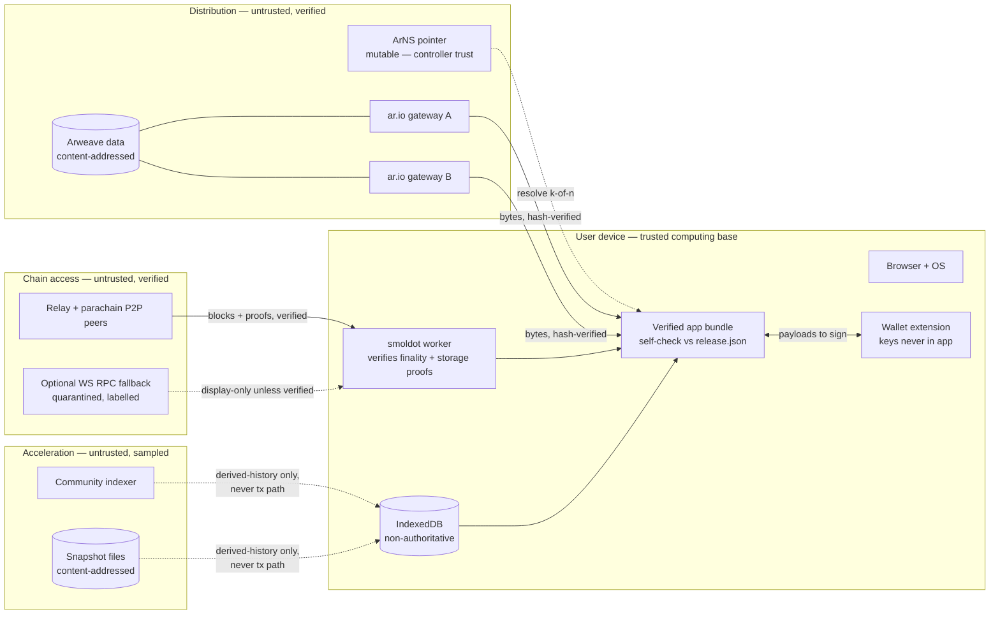
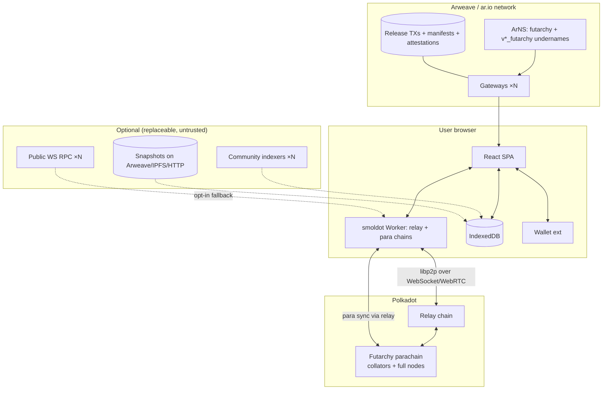
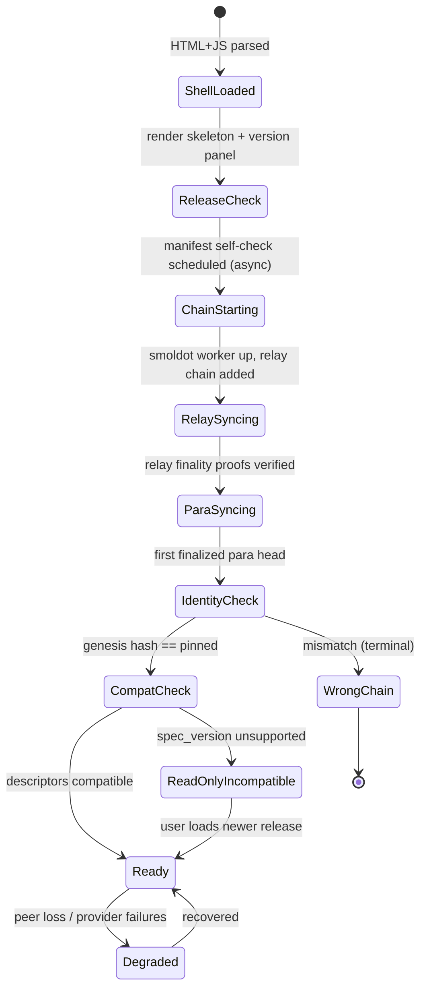
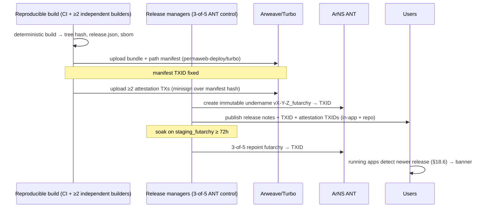
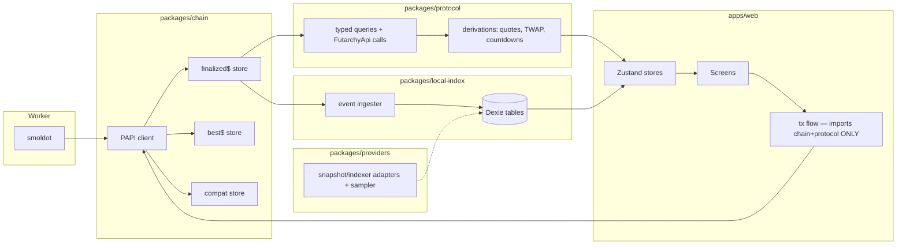
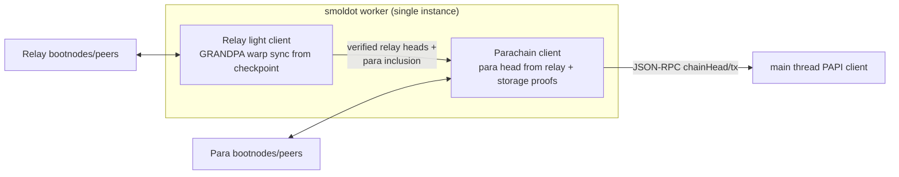
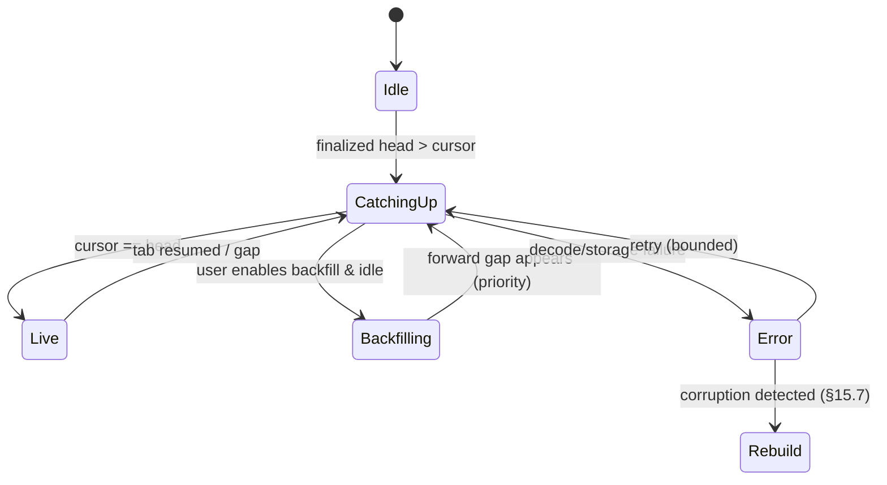
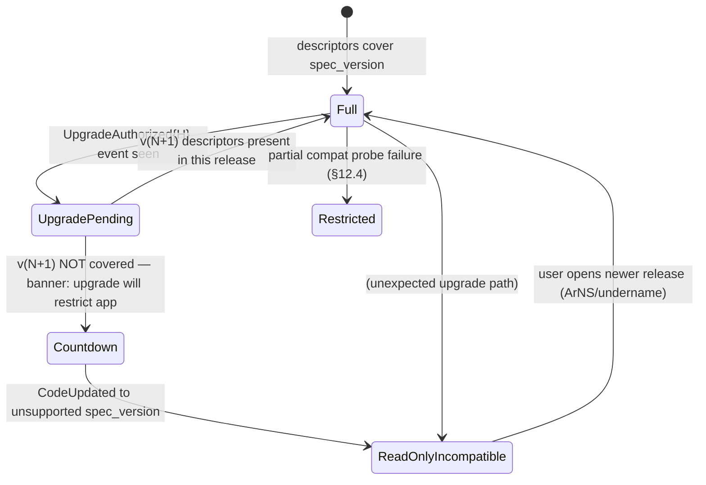

# Polkadot Futarchy Parachain — Canonical Decentralized Frontend
## Implementation-Ready Architecture Specification — Version 1.1 Draft

**Status:** Draft for engineering review and audit scoping. Companion to `BACKEND-PLAN.md` (the "parent architecture"); §30 of this document contains the exact patch to the parent.
**Normative language:** RFC 2119 (MUST, MUST NOT, SHOULD, SHOULD NOT, MAY).
**Verification date:** **2026-07-11.** All library versions and API shapes below were verified on this date against `registry.npmjs.org` and the primary GitHub repositories (`polkadot-api/polkadot-api`, `ar-io/wayfinder`) reachable from the build environment. Claims marked **[VERIFY]** could not be confirmed against a primary source in this run and MUST be validated in the Phase-FE-0 prototype (§31).
**Verified in this run:** `polkadot-api` 2.1.8 (published 2026-07-08) including the `createClient` / `getTypedApi` / `finalizedBlock$` / `getFinalizedBlock` APIs, the `polkadot-api/sm-provider` (`getSmProvider`) smoldot provider, the `polkadot-api/smoldot/from-worker` + `polkadot-api/smoldot/worker` Web-Worker integration pattern, bundled chain-spec subpath imports (`polkadot-api/chains/*`), and `WsProvider`; `smoldot` 3.3.1 (2026-07-02); `@substrate/connect` 2.1.8 (last publish 2025-05-19 — see §11.1 note); `vite` 8.1.4; `dexie` 4.4.4; `idb` 8.0.3; `@ar.io/wayfinder-core` 2.0.0 and `@ar.io/wayfinder-react` 2.0.1 including routing strategies (`random`, `fastest-ping`, `NetworkGatewaysProvider` sorted by operator stake) and verification strategies (`hash`, `data-root`, `remote`, `disabled`, `HashVerificationStrategy({ trustedGateways })`, `strict` mode, `resolveUrl`, `ar://` scheme); `@ar.io/sdk` 4.0.3; `permaweb-deploy` 5.0.0; `@ardrive/turbo-sdk` 1.42.0; `arkb` last published 2022 (rejected as unmaintained); `@reactive-dot/react` 0.72.0 (evaluated, not adopted — §10.2).

---

## Table of Contents

1. Executive Architecture Decision
2. Goals, Non-Goals and Normative Terminology
3. Extracted Constraints from the Parent Architecture
4. Architecture Alternatives
5. Selected Architecture and Rationale
6. Trust Model and Trust-Boundary Diagram
7. End-to-End Topology
8. Application Bootstrap Sequence
9. Arweave, Manifest, ArNS and Wayfinder Distribution
10. React Application Architecture
11. smoldot Light-Client Architecture
12. PAPI Integration and Descriptor Lifecycle
13. Runtime API and On-Chain Discovery Requirements
14. No-Indexer Current-State Data Model
15. Browser-Local Historical Index
16. Optional Community Indexers and Snapshot Acceleration
17. Wallet and Transaction Architecture
18. Runtime-Upgrade and Compatibility Handling
19. Detailed UX and Degradation Matrix
20. Security Architecture and Threat Model
21. Performance and Resource Budgets
22. Accessibility, Internationalization and Mobile Constraints
23. Testing and Verification Strategy
24. Reproducible Build and Release Process
25. Repository and Package Structure
26. Implementation Work Breakdown
27. Rollout and Migration Plan
28. Operations Without an Application Backend
29. Architecture Decision Records
30. Required Parent-Document Patch
31. Open Questions and Prototype Experiments
32. Acceptance Checklist
33. Source Register

---

## 1. Executive Architecture Decision

**Recommendation: the canonical system MUST have no required indexer, and MUST support optional, untrusted, interchangeable acceleration providers.** Of the three postures offered in the task:

- *No indexer capability at all* is rejected: it makes long-horizon price charts, address-history search and pre-first-visit history permanently impossible for every user, which the parent architecture's own operations, calibration and transparency goals (§28, §29, A-2 measurement of `F̂`) implicitly require, and it violates the decision bias "advanced historical analytics degrade gracefully rather than preventing protocol use" by degrading them to *nothing*.
- *A required decentralized indexing network* is rejected: it reintroduces a mandatory service dependency (a practical control point, however replicated), adds a token/incentive design problem unrelated to the protocol, and violates INV-FE-4 the moment the network is unhealthy. It also fails the anti-overengineering rule: the protocol's live state is deliberately tiny (≤ 32 proposals, ≤ ~225 live markets, ≤ 4 cohorts), so *no indexer is needed for anything transaction-critical*.
- **Selected:** a **verified-direct core** — every protocol workflow served exclusively by finalized, smoldot-verified chain state through PAPI — plus a **browser-local historical index** built by the client itself from finalized events, plus **optional community indexers and downloadable snapshots** that only ever pre-populate or accelerate the local index behind a verification firewall, are user-selectable, and are labelled non-authoritative everywhere they surface.

Concretely, the canonical frontend is:

1. A **Vite-built React 19 + TypeScript SPA**, delivered as immutable static files on **Arweave**, addressed by an **Arweave path manifest**, named through **ArNS** (canonical mutable pointer + immutable per-release records), retrieved and hash-verified through **Wayfinder** (`@ar.io/wayfinder-core` 2.x) with multi-gateway routing.
2. **PAPI 2.x** (`polkadot-api`) as the sole typed chain API, with committed generated descriptors per supported `spec_version`.
3. **smoldot 3.x** running in a dedicated Web Worker (SharedWorker where available) as the default and only required chain connection: one relay-chain light client (Polkadot / Paseo) plus the futarchy parachain client, both from bundled, hash-pinned chain specs.
4. **All transaction-critical reads from finalized, light-client-verified state**, re-checked immediately before signing (INV-FE-1/2), with an explicit `VerificationStatus` attached to every displayed data item.
5. **Browser wallet extensions** (PJS-compatible signers via `polkadot-api/pjs-signer`) and raw-payload external signers; no keys in the app (INV-FE-5).
6. **IndexedDB (Dexie 4)** as a non-authoritative cache and the substrate of the local historical index; loss of it is a performance event only (INV-FE-7).
7. **No backend, no SSR, no required RPC endpoint, no required indexer** (INV-FE-6, INV-FE-11–15 honored as specified below). An optional user-enabled WebSocket RPC fallback exists but is quarantined and labelled (§11.8).

One small set of **runtime additions** (§13) makes this practical: a read-only `FutarchyApi` runtime API family (epoch status, proposal summaries, market quotes, account positions, execution queue, welfare/constitution views) and one bounded ring buffer (`RecentCohortSummaries`, ≤ 16 entries). No new pallet, no unbounded state.

---

## 2. Goals, Non-Goals and Normative Terminology

### 2.1 Goals

FG-1. Every core workflow of INV-FE-4 operates against finalized, verified chain state with zero optional infrastructure available.
FG-2. Users can independently verify *which* application they run (release TXID, source commit, build manifest, attestations) and *which chain* it talks to (genesis hash, chain-spec hash) (INV-FE-10/11).
FG-3. No single operator — gateway, ArNS controller, RPC host, indexer, snapshot publisher, CI system — can silently alter the application or its interpretation of chain state without detection (INV-FE-8, §20).
FG-4. Historical analytics degrade gracefully: what the user's browser has verified is shown as verified; everything else is either absent with an explanation, or provider-supplied and labelled (INV-FE-15).
FG-5. Runtime upgrades fail safe into an explicit read-only/restricted mode (INV-FE-12, §18).
FG-6. First-load to interactive verified current-state is fast enough for real users on desktop and mobile (§21 budgets), because a "decentralized" app nobody can load is centralization by another name (decision bias: practical centralization).

### 2.2 Non-Goals

FN-1. Serving archive-grade historical queries (full trade history since genesis for arbitrary addresses) without a historical provider. Deliberately unavailable set defined in §15.9.
FN-2. Offline transaction construction workflows beyond raw-payload export for external signers.
FN-3. Push notifications, server-rendered previews, SEO — all require servers and are excluded by INV-FE-6. Consequence accepted: link previews in social clients show generic metadata from the static bundle only.
FN-4. Governance of the ArNS name by this document — §9.7 specifies the mechanism; key ceremony is an operational deliverable (WBS F-13).
FN-5. Any indexing network, GraphQL API or bespoke crypto protocol (anti-overengineering list).

### 2.3 Terminology

- **Verified**: obtained through smoldot from a finalized block, with storage proofs checked by the light client, or computed client-side purely from verified inputs.
- **Locally derived**: computed by this browser from previously verified finalized events/storage and persisted in IndexedDB; correct if IndexedDB is intact; always rebuildable; trust level "self".
- **Provider-supplied**: obtained from an optional community indexer or snapshot; untrusted; never transaction-critical; sampled against chain state where feasible (§16.4).
- **Unfinalized/best**: from the best (non-finalized) chain head; display-only, never transaction-critical (INV-FE-9).
- **Transaction-critical**: any value whose incorrectness could change what a user signs or their understanding of what signing does.

---

## 3. Extracted Constraints from the Parent Architecture

### 3.1 Frontend-relevant protocol facts (authoritative source: parent §§5–21)

| # | Fact (parent ref) | Frontend consequence |
|---|---|---|
| C-1 | Live state is tightly bounded: `Proposals ≤ 32`, `Slots ≤ 5`, `Markets ≤ ~225` live books, `Cohorts ≤ 4` non-terminal, `Queue ≤ 32`, `ExecutionRecords` ring ≤ 256, `Snapshots ≈ 20`, `MetricSpecs ≤ 16`, oracle rounds ≤ 16×4×3 (parent §5.2, I-21) | **Every current-state screen is renderable from bounded direct storage reads** — no discovery index needed beyond what exists. This is the load-bearing fact of the whole design. |
| C-2 | `Positions: double_map (AccountId, PositionId) → Balance`, per-account ≤ 64 (parent §5.2.1) | User positions are discoverable by a bounded storage-prefix iteration keyed by the user's account — no indexer needed. |
| C-3 | Proposal payloads are preimage-committed (`pallet-preimage`, hash + length in `Proposal`) (parent §7, §18.2) | Exact committed payload bytes readable from `Preimage` storage and hash-checkable client-side (INV-FE-4 "reading exact committed proposal payloads"). |
| C-4 | Decisions read finalized parachain state by construction; parachain blocks final once relay-finalized (parent §5.2.3 audit note) | Frontend finality = relay finality of the parachain block; smoldot's parachain sync gives exactly this. |
| C-5 | TWAP accumulators with 8 checkpoints, LMSR books with `b, q_long, q_short` in storage (parent §5.2.2) | Quotes and decision statistics are recomputable client-side from storage (`futarchy-fixed` math ported to TS, differential-tested — §14.6). |
| C-6 | Settled markets/vaults/cohorts are **reaped** after archive delays; `ExecutionRecords` "pruned to indexer" (parent §5.2.2, §5.2.6, §5.2.1) | Old-object deep links cannot be served from storage after reaping ⇒ served from local index if the browser saw the events, else from an optional provider, else an explicit "archived" explanation (§15.9, §19 E5). The parent's phrase "pruned to indexer" is replaced by §30's patch. |
| C-7 | Six-second blocks, 21-day epochs, phase offsets in blocks (parent §9.1) | Epoch/phase countdowns computed from `EpochOf` + block height; purely client-side. |
| C-8 | `frame-metadata-hash-extension` active (parent §5.1, §18.6) | Signed extensions include the metadata hash: the app MUST supply the correct hash per runtime; PAPI handles CheckMetadataHash when descriptors are current **[VERIFY PAPI behavior for this extension on the pinned version in FE-P1]**. |
| C-9 | Runtime upgrades via 2-phase authorize/apply; `RuntimeVersionConstraint` checked at execute (parent §18) | Frontend must handle spec-version changes mid-session (§18) and show `StaleQueue` semantics. |
| C-10 | Keeper cranks are permissionless (`tick`, `crank_observe`, `decide`, `execute`, `settle_cohort`, `reap`, `sweep_dust`) (parent §5.2) | The frontend SHOULD expose expert-mode crank buttons: any user can be a keeper — this is a decentralization feature, not just ops tooling. |
| C-11 | Events enumerated per pallet (Split/Merged/…, ProposalSubmitted/…, Executed, CohortSettled{s}, GuardianAction, VaultReaped{residue}) (parent §5.2, §8.1) | The finalized-event stream is sufficient to build the entire local historical index; §15.3 fixes the exact event subset. |
| C-12 | Runtime pins `polkadot-stable2603`; repo has `runtime-api/` ("market quotes, epoch status, NAV, welfare") and `rpc/` (parent §25, Appendix A Q1) | The runtime-api crate is where §13's `FutarchyApi` lands; node-side RPC extensions are NOT used by this frontend (light client cannot verify custom node RPCs — §13.4). |
| C-13 | Chain-specs generated from code, committed, hash-pinned; genesis ceremony publishes genesis hash (parent §27.6) | The frontend bundles those exact chain-specs and pins genesis hash + chain-spec hash (INV-FE-11, §11.3). |

### 3.2 Where the parent assumes an indexer / RPC / archive node, and classification

| # | Parent reference | Assumed service | Classification (task step 3) | Disposition |
|---|---|---|---|---|
| U-1 | §4.2 "Indexer ≥ 1 … serves dashboards; never consensus-relevant" | SubSquid/Subquery-class indexer | unbounded historical analytics + operational monitoring | Becomes `optional/indexer/` reference provider (§16, §30) |
| U-2 | §4.2 "RPC nodes ≥ 4 load-balanced public" | public RPC | current-state discovery (for wallets/tools) | Not required by this frontend; retained for ecosystem tooling; optional quarantined fallback only (§11.8) |
| U-3 | §4.2 "Archive nodes ≥ 2 … oracle recomputation and dispute evidence" | archive node | bounded recent-history (oracle evidence windows) | Unchanged — an oracle-reporter concern, not a frontend dependency |
| U-4 | §5.2.6 "`ExecutionRecords` ring buffer (≤ 256, then pruned to indexer)" | indexer as history sink | bounded recent-history + unbounded analytics | Ring stays (bounded recent); long history is event-derived: local index or optional provider (§30 rewording) |
| U-5 | §28 Operations "Prometheus + on-chain events via indexer" | indexer for ops | operational monitoring | Unchanged for operators; explicitly NOT a frontend dependency (§28 here) |
| U-6 | §24.12 / A-2 `F̂` measurement, §29 evidence publication | analytics pipeline | unbounded historical analytics | Served by optional indexer/snapshots; publication artifacts content-addressed on Arweave (§16.6) |
| U-7 | Implicit: dashboards for prices/TWAP dispersion (§28 table) | indexer + dashboards | bounded recent-history (in-window) + analytics | In-window series come from local index built live; long series optional-provider (§15) |
| U-8 | §5.2.1 archive-delay reap + "Merkle-archived claims procedure" | archive tooling | bounded (claims) | Frontend surfaces archived-claim status read-only; claim execution is a TREASURY proposal (out of frontend scope beyond display) |

**Consensus-critical:** none of U-1…U-8 (the parent already guarantees this). **Transaction-critical uses:** none may remain on any of these services — enforced by §14/§17. Everything a transaction needs is in bounded live storage (C-1…C-5).

---

## 4. Architecture Alternatives

### Alt-A. Strict no-indexer, direct-chain-only

Render exclusively from live storage + on-chain rings. No IndexedDB event history, no providers.

- **Pros:** smallest code; zero cache-consistency surface; trivially satisfies INV-FE-3/4.
- **Cons:** price charts limited to the 8 TWAP checkpoints + live samples collected while the tab is open; deep links to reaped objects dead-end; "proposals by address" impossible; ten-month chart (required UX E7) impossible for everyone forever; violates FG-4's "degrade gracefully" by making degradation permanent and universal.
- **Verdict:** rejected — fails required UX D7/E7/E8 and the parent's transparency goals.

### Alt-B. Direct-chain core + browser-local indexing

Alt-A plus: the client ingests finalized events from first visit onward into IndexedDB; bounded opportunistic backfill while the tab is open.

- **Pros:** all INV-FE invariants met; history accumulates for returning users with zero third parties; single trust domain (self).
- **Cons:** a new browser has no history before its first visit and cannot practically backfill months of blocks through a light client (light clients have no efficient historical-event query; per-block backfill at even 50 blocks/s [VERIFY achievable rate — FE-P4] covers ~9 days of chain per hour of tab time); every user pays the same ingestion cost; mobile storage/battery pressure.
- **Verdict:** correct core, insufficient alone for E5/E7/E8 on first visit.

### Alt-C (selected). Alt-B + optional interchangeable community indexers and content-addressed snapshots

Alt-B plus a provider abstraction: (i) **snapshot files** — content-addressed (Arweave TXID or SHA-256-pinned URL) compacted local-index exports that any operator can reproduce deterministically from chain data with the published `tools/snapshot` CLI, imported into IndexedDB and marked provider-derived; (ii) **live query providers** — community indexers implementing a small read-only HTTP interface, used only to fill the same local-index tables. Both are user-selectable, off by default in "sovereign mode", on by default (with a first-run disclosure) in normal mode, verifiable by deterministic re-derivation (snapshots) and by random sampling against chain state (live providers), and are barred by construction from the transaction path (the tx layer imports only the `chain` package — a dependency-direction rule enforced in CI, §25.2).

- **Pros:** first-visit deep history without trust concentration; providers replaceable/reproducible (INV-FE-15); acceleration never authoritative.
- **Cons:** more code (~2 packages); sampling verification is probabilistic (§16.4 states exactly what it does and does not guarantee).
- **Verdict:** **selected.** Minimum architecture satisfying all invariants and all required UX rows.

### Alt-D (evaluated, deferred). Polkadot Product/Host distribution + Bulletin Chain storage + Statement Store acceleration

Repackage the canonical client as a Polkadot **Product**: a third-party single-page application addressed by a `.dot` name (dotNS), loaded inside a **Host** (Polkadot Desktop / Polkadot App / Polkadot Web), reachable from the outside world only through the Host API (TrUAPI). Frontend assets stored on the **Bulletin Chain** (IPFS-compatible CIDs, `transaction-storage` pallet) instead of Arweave; historical-index acceleration and/or coordination gossip via the **Statement Store** (allowance-gated, signed, TTL-bounded pub/sub on the People Chain) instead of community indexers.

- **Pros:** single-ecosystem stack; content-addressed storage compatible with our hash-pinning discipline (Bulletin CIDs are structurally equivalent to Arweave TXIDs for INV-FE-11 purposes); human-readable `.dot` naming with PoP-gated squatting resistance; Host-standardized signing removes the per-wallet-extension test matrix (§23); zero Arweave/AR-token dependency; a future PoP-authorized storage path could remove the OpenGov authorization dependency **[VERIFY — stated as planned, not shipped]**.
- **Cons — trust model (disqualifying today):** a Product **cannot hold keys, cannot make arbitrary network requests, and cannot talk to chains directly**; all chain access is mediated by the Host. This structurally violates INV-FE-1 (client-embedded light client as the only authoritative read path — smoldot cannot run under the Host sandbox) and inverts INV-FE-3: the Host becomes transaction-critical and read-critical *by construction*, exactly the trust concentration Alt-C exists to avoid. `Verified<T>` provenance (§10.5) would degrade to "the Host said so" for every value on every screen. The Host is also a single vendor's distribution channel, in tension with the censorship-resistance goal the Arweave/Wayfinder pipeline (§9, §24) was selected for, and INV-FE-13 (no telemetry) cannot be attested for code we do not ship.
- **Cons — maturity:** Bulletin mainnet is roadmapped, not live (cross-repo roadmap targets **Sep 2026 [VERIFY]**); mainnet storage authorization is currently OpenGov-only — an external-governance dependency for publishing the canonical frontend; stored data has a **retention period requiring renewal** (a perpetual operational obligation and expiry failure mode, vs. Arweave pay-once permanence assumed by §24 and FE-P8); Statement Store allowance acquisition is undocumented even on TestNet; statement propagation has open correctness issues upstream (e.g. `polkadot-sdk#11411`, statements missed during major sync); Host API surfaces are marked Provisional. None of this meets the verification bar this document applies to its selected stack (§33: all selected components version-pinned against live registries).
- **Cons — fit:** Statement Store statements **decay after a short TTL**; they cannot serve E7 (ten-month chart) or E8 (proposals-by-address), which need durable history. Our markets are fully on-chain LMSR; there is no off-chain orderflow to gossip. The only near-term fits are ephemeral (keeper heartbeats, draft-proposal chatter) — none required by any INV-FE workflow.
- **Verdict:** **deferred, with a partial-adoption path.** Rejected as the canonical distribution and trust architecture (Host mediation is incompatible with INV-FE-1/3 regardless of maturity). Two subsets remain attractive and are scheduled in §31: (i) **Bulletin + dotNS as a secondary, non-canonical mirror** of the identical reproducible build once Bulletin mainnet is live — CIDs verify against the same release hashes, cost is low, and it reaches Host users; (ii) an optional thin **Product wrapper** pointing at that mirror, explicitly labeled *Host-trusted, non-canonical* in-app (same labeling class as the §11.8 quarantined RPC mode: convenience path, never the verification path).

Comparison summary:

| Criterion | Alt-A | Alt-B | Alt-C | Alt-D |
|---|---|---|---|---|
| INV-FE-1…14 | ✔ | ✔ | ✔ | ✘ (INV-FE-1/3/13 violated by Host mediation) |
| INV-FE-15 (replaceable acceleration) | n/a (none) | n/a | ✔ | ✘ (single-Host channel) |
| UX E5/E7/E8 first visit | ✘ | ✘ | ✔ (labelled) | ✘ (Statement Store TTL cannot carry history) |
| New attack surface | none | IndexedDB integrity (self) | + provider poisoning (contained by §16.4/§20 T-5/T-7) | + Host compromise = full read+tx compromise |
| Component maturity | shipped | shipped | shipped (§33 pins) | Provisional / pre-mainnet [VERIFY] |
| Code size | S | M | M+ | M+ (wrapper) |

---

## 5. Selected Architecture and Rationale

The selected architecture (Alt-C) partitions all data the UI can ever show into four classes with fixed sources and trust labels:

| Data class | Examples | Source | Authoritative? | Finality | Storage bound |
|---|---|---|---|---|---|
| **Live protocol state** | epoch/phase, proposals, markets, quotes, queue, positions, balances, params, welfare snapshot, oracle rounds, guardian state | smoldot-verified finalized storage + `FutarchyApi` runtime calls (§13) | **Yes** | finalized only for anything transaction-critical; best-head shown separately (INV-FE-9) | chain bounds (C-1) |
| **Bounded recent history** | last ≤ 256 execution records, ≤ 16 cohort summaries, ≤ 20 welfare snapshots, TWAP checkpoints | same | **Yes** | finalized | chain ring bounds |
| **Locally derived history** | price series since first visit, my tx history, event log, proposal archive | local index (§15) fed by finalized events | No (derived; rebuildable) | finalized-derived | §21 quotas |
| **Provider-supplied history** | pre-first-visit price series, proposals-by-address over all time, archived proposal details | optional providers (§16) | **No** — labelled, sampled | n/a | import quotas §16.5 |

Rationale anchors: (1) C-1 makes the authoritative set cheap to read directly — the design exploits the parent's own boundedness discipline rather than duplicating state; (2) the two-layer split "verified now / derived past" maps exactly onto what a light client can and cannot do; (3) optional providers write only into the *derived* layer, so INV-FE-3 is enforced structurally (type system + package boundaries), not by reviewer vigilance.


---

## 6. Trust Model and Trust-Boundary Diagram

### 6.1 Required-question block A (answers A1–A10)

**A1 — What must a user trust to load the application?** In the default flow: (i) the **AO/Arweave name-resolution result for the ArNS name** as reported by the gateways consulted (mitigated to k-of-n gateway agreement, §9.4); (ii) **at least one honest ar.io gateway** to serve bytes — but *not* to serve honest bytes, because content is hash-verified against the Arweave transaction IDs (Wayfinder `hash`/`data-root` strategies, verified present in `@ar.io/wayfinder-core` 2.0.0); (iii) their **browser and OS**; (iv) for the *very first* HTML document: the transport (HTTPS) and gateway of first contact, since the browser cannot verify bytes before executing code — this is the irreducible bootstrap trust, reduced by pinning an immutable TXID URL, by the Wayfinder browser extension, or by local verification + `file://`/self-host (A6, A9, A10).
**A2 — What does Arweave permanence guarantee; what stays gateway/name-dependent?** Arweave guarantees (economically, via the storage endowment) that the *bytes* of each release transaction remain retrievable and that their identity is fixed by the transaction ID (content addressing through the data root). It does NOT guarantee: that any particular gateway serves them, serves them quickly, or resolves names honestly. Retrieval availability = gateway layer; naming = ArNS (mutable by its controller). Documented guarantee vs. observed behavior: permanence is a protocol-level economic guarantee; individual gateway honesty is neither guaranteed nor assumed (hence verification).
**A3 — Single-gateway dependence avoided how?** Wayfinder routing over the ar.io network gateway list (`NetworkGatewaysProvider`, stake-sorted, verified in wayfinder-core 2.0.0), with `fastest-ping` routing, per-request failover, and a static fallback list of ≥ 5 diverse gateways baked into the bundle for the case where the network-provider query itself fails. The app also runs entirely from a raw `https://<gateway>/<txid>/` URL of *any* gateway (§9.5), and from a local folder.
**A4 — How does the client verify downloaded files match the intended release?** Two layers. *Distribution layer:* Wayfinder verification strategies check gateway responses against Arweave data (hash / data-root; `strict: true` fails the request on mismatch). *Application layer (self-check):* the bundle carries `release.json` (§9.6) listing every asset path → SHA-256; after boot, a background task re-hashes every loaded asset via `fetch` + SubtleCrypto and compares; the release manifest itself is signed (minisign/ed25519) by ≥ 2 release keys and its hash equals the ArNS record's `manifest` field. Mismatch ⇒ `FE-REL-002` banner + transaction signing disabled until the user acknowledges in expert mode (§20 T-1). This self-check is detection, not prevention (code already ran); prevention for high-assurance users is A6/A10.
**A5 — ArNS mutability effect on the trust model.** The canonical name `futarchy` is a *mutable pointer*: whoever controls the ArNS record can repoint users at a different (still Arweave-immutable) release. Therefore ArNS control = release-channel control, exactly like a DNS+registrar in Web2 but with two improvements: every historical target remains permanently reachable by TXID, and the pointer's on-chain (AO) update history is public and auditable. The app displays the resolved TXID and its release version prominently (INV-FE-11 panel) so a hostile repoint is at least visible.
**A6 — Pinning an exact immutable release.** Three supported paths, all documented in-app: (1) open `https://<any-gateway>/<manifest-txid>/` directly (immutable URL format, §9.5); (2) ArNS **undername per release** — `v1-2-3_futarchy` → immutable TXID, never repointed after creation **[VERIFY undername immutability is operationally enforceable — it is policy, not protocol; the release process (§24) publishes the undername→TXID table inside every release so clients can detect repoints]**; (3) download the release archive, verify with `tools/verify-release` (§24.6), open locally.
**A7 — Who updates the canonical ArNS pointer?** The ArNS name is held by a **k-of-n (3-of-5) controller set** using AO-native multisig control of the ANT (ArNS name token) **[VERIFY current ANT controller/multisig capabilities in @ar.io/sdk 4.x — if native n-of-m control is unavailable, the ANT owner key is itself a threshold key ceremony (FROST-ed25519) held by the same 5 parties; FE-P7]**. Holders: 2 core-team, 2 independent community operators, 1 audit-firm escrow. Every repoint MUST reference a release that carries ≥ 2 independent build attestations (§24.4). Phase ≥ 6: repoints additionally require a passed on-chain META "frontend release" record (advisory anchor the app can display; the chain cannot enforce ArNS).
**A8 — Reproducible builds and multi-party attestations represented how?** `release.json` embeds: source commit, toolchain lockfile digests, deterministic-build recipe hash, SBOM (CycloneDX) hash, output-tree SHA-256 root; attestations are detached minisign signatures over the manifest hash, published as separate Arweave transactions tagged `App-Attestation: <manifest-hash>`, discoverable by tag query and mirrored in the release GitHub release. Independent parties reproduce with `tools/release build --verify` (§24.3).
**A9 — What changes through an ordinary HTTPS gateway?** Everything downstream of load is unchanged (smoldot still verifies chain state; wallet still signs locally). What weakens: first-load integrity depends on that gateway + TLS until the self-check runs, and the gateway observes the user's IP + requested app (privacy). ArNS resolution via a single gateway also trusts that gateway's resolver. Mitigations: self-check banner, multi-gateway ArNS cross-check (§9.4), Wayfinder extension recommendation.
**A10 — Remaining unavoidable trust assumptions.** (1) Browser/OS/extension integrity; (2) first-contact bootstrap (A1-iv) unless side-loaded; (3) Polkadot relay validator-set honesty ≥ threshold (smoldot verifies GRANDPA finality against the authority set it tracked from a checkpoint — a long-range attack against a checkpoint older than the unbonding period is a documented light-client limitation; mitigated by shipping a recent checkpoint per release and refreshing checkpoints in releases, §11.3); (4) the wallet extension the user chose; (5) SR25519/ed25519/BLAKE2/SHA-256 cryptography; (6) ArNS controller honesty *for the mutable name only*.

### 6.2 Trust-boundary diagram (required diagram 1)



Boundary rules (normative): data crosses from *Untrusted2* into the app **only** through smoldot verification; from *Untrusted3* **only** into `local-index` tables flagged `origin ≠ self`; from *Untrusted1* **only** with content verification (or an explicit degraded banner). The wallet boundary carries only encoded payloads outward and signatures inward.

---

## 7. End-to-End Topology



Ownership of every component: app bundle + release tooling — frontend team (this spec); ArNS name — controller set (A7); gateways — ar.io operators (nobody specific — that is the point); chain — protocol per parent; community indexers/snapshots — anyone (reference implementation in `optional/indexer/`, §30); wallet — user's chosen vendor.

---

## 8. Application Bootstrap Sequence

### 8.1 Boot state machine (required diagram 5; required state machine 1)



States are exposed to React as a single `BootState` store (§10.3). Screens renderable per state: `ShellLoaded+`: static docs, verification panel, settings, cached (labelled-stale) dashboard from IndexedDB; `ParaSyncing+`: live best-head ticker (labelled unfinalized); `Ready`: everything.

### 8.2 Sequence (normative order)

1. **t0** HTML shell (inline critical CSS, no inline JS — CSP §9.8) → main bundle.
2. Read pinned constants compiled into the bundle: `CHAIN_IDENTITY` (genesis hash, chain-spec hashes, ss58 prefix), `RELEASE` (txid placeholder patched at deploy — §24.2), supported `spec_version` range.
3. Open IndexedDB (Dexie); on version/corruption error → recovery flow (§15.7); render last-known dashboard snapshot with `STALE` badges and timestamps.
4. Spawn smoldot worker; `addChain(relaySpec)` then `addChain(paraSpec, { potentialRelayChains: [relay] })` (both specs bundled, lazy-imported; §11).
5. Subscribe `finalizedBlock$` (verified PAPI API) on the parachain client; first finalized head triggers identity check: fetched genesis hash (block 0 hash from smoldot) MUST equal pinned value, else `WrongChain` (FE-BOOT-003) — hard stop, no override.
6. Fetch on-chain `RuntimeVersion`; run descriptor compatibility (§12.4). Compatible → `Ready`; else `ReadOnlyIncompatible` (§18).
7. In `Ready`: hydrate current-state stores via one batched round of storage reads + `FutarchyApi` calls (§14.2); start local-index ingestion from the persisted cursor (§15.4); start release self-check hashing (A4); start provider health checks if enabled (§16.3).
8. Wallet connection is lazy — only on user action (§17.1).

Failure at any step maps to the error taxonomy (§21.6) with a specific recovery path; no step silently substitutes an unverified source.

---

## 9. Arweave, Manifest, ArNS and Wayfinder Distribution

Answers required-question block F throughout.

### 9.1 Build tool (F1)

**Vite 8** (8.1.4 verified current). Justification: first-class static SPA output with `base: './'` relative asset paths (required for path-manifest hosting under both `/<txid>/` and `/` roots), native Web Worker bundling (`?worker` import used by PAPI's documented smoldot worker pattern — verified in the PAPI README), WASM asset handling, deterministic builds achievable with pinned toolchain + `build.rollupOptions.output` stable chunk naming by content hash, and the dominant ecosystem default (maintenance risk lowest). Next.js/Remix rejected (SSR-centric, violates INV-FE-6 posture even in export mode via runtime assumptions); plain Rollup/esbuild rejected (re-implements Vite's worker/wasm plumbing).

### 9.2 Routing strategy for an Arweave-hosted SPA (F2, F3)

**Hash-based routing** (`/#/proposal/42`). Rationale: Arweave **path manifests** map exact paths → TXIDs; deep links with BrowserRouter paths (`/proposal/42`) would require the manifest `fallback` record to serve `index.html` for unknown paths. Manifest schema `arweave/paths` version **0.2.0** includes a `fallback` id field **[VERIFY gateway-universal fallback behavior across major ar.io gateways; observed implementation behavior, not a protocol guarantee]** — because fallback handling is gateway-implementation-dependent, hash routing is the only option with *zero* gateway-behavior assumptions and is therefore REQUIRED. Assets use relative paths; the manifest lists every built file; `index.html` is the manifest `index` record. Deep links: `https://gw/<txid>/#/proposal/42` and `https://futarchy.<gw>/#/proposal/42` both work with no server logic.

### 9.3 URL formats (F4, F5, F6)

- **Immutable release URL:** `https://<gateway>/<manifest-txid>/` (canonical form printed in the verification panel and release notes). `ar://<manifest-txid>` for Wayfinder-extension users.
- **Canonical mutable URL:** `ar://futarchy` → gateway form `https://futarchy.<gateway>/` (ArNS subdomain resolution) **[VERIFY subdomain vs path resolution defaults on current gateways]**.
- **Environment names:** `futarchy` (production), `staging_futarchy` (staging undername), `dev_futarchy` (dev undername), `vX-Y-Z_futarchy` (immutable per-release undernames). Dev/staging MAY point at testnet-configured builds; the bundle's pinned genesis hash makes cross-environment confusion impossible to weaponize (a prod UI pointed at testnet refuses via FE-BOOT-003).

### 9.4 Multi-gateway retrieval and ArNS cross-check (F: gateways; A3, A5)

The app itself (not only its delivery) uses `@ar.io/wayfinder-core` for any Arweave fetch it performs at runtime (snapshots, attestations, archived MetricSpec documents): routing `fastest-ping` over `NetworkGatewaysProvider` (stake-sorted, top-N=20) with the baked static fallback list; verification `hash` strategy with `strict: true` against ≥ 2 trusted-gateway hash sources chosen from independent operators. For **ArNS resolution audit**: at boot, when loaded via a name (not TXID), the app queries the resolved TXID for the same name from 3 independent gateways (`/ar-io/resolver/records/<name>` **[VERIFY current resolver endpoint path]**); 2-of-3 disagreement ⇒ `FE-REL-004` warning banner naming the divergent gateway. This detects a single lying resolver; it cannot detect a hostile-but-consistent repoint by the real controller (that is A5/A7's domain).

### 9.5 Old releases remain reachable (F8)

Every release is a permanent Arweave transaction; the per-release undername table plus in-app release history (shipped as data in each release) let users open any prior version by immutable TXID. Rollback (F7) = repointing `futarchy` to the previous release's manifest TXID (one ANT `setRecord` by the controller quorum via `@ar.io/sdk`); nothing is deleted, so rollback is O(minutes) and reversible.

### 9.6 Release manifest and SBOM (F13)

`release.json` (schema in §24.1, TS interface §10.5 `ReleaseManifest`): version, source commit, build recipe digest, per-file SHA-256 map, Arweave manifest TXID (self-referential field patched post-upload with the two-pass deploy of §24.2), chain identity block (genesis hash, chain-spec hashes), supported spec_version range, descriptor metadata hashes, SBOM (CycloneDX 1.6 JSON) as sibling file `sbom.cdx.json` with its hash in the manifest, signing key IDs. F14/F15 (signing, attestation, independent verification) specified in §24.

### 9.7 ArNS update authority and process (F7, A7; required diagram 10)



### 9.8 CSP, service worker, SRI (F9–F12)

- **CSP (F9):** delivered as `<meta http-equiv="Content-Security-Policy">` (gateways control real headers; the meta tag is the only self-controlled channel — a documented limitation: meta-CSP cannot set `frame-ancestors`). Policy: `default-src 'none'; script-src 'self' 'wasm-unsafe-eval'; style-src 'self' 'unsafe-inline'; connect-src *; img-src 'self' data:; worker-src 'self' blob:; base-uri 'none'; form-action 'none'`. `connect-src *` is unavoidable (arbitrary user-chosen gateways, WS peers, providers); the compensating control is that *no fetched data is executed* — only parsed — and script-src excludes remote origins entirely. No third-party scripts, fonts, or analytics. Ever.
- **Service worker (F10, F11):** a minimal, release-scoped SW provides offline shell + asset caching. Rules: cache name = manifest TXID; SW fetches assets only by exact hashed filename from its own release; `skipWaiting` NEVER called automatically — update flow shows "release X available" and activates only on explicit user action; on activation the old cache is deleted; the SW MUST refuse (fail closed) any cached response whose hash mismatches `release.json` (it re-verifies opportunistically). A "pin this release" toggle disables update prompts. This prevents a SW from silently serving an unintended release: the SW can only ever serve the release whose TXID names its cache, and switching caches requires user action.
- **SRI (F12):** `index.html` carries `integrity` attributes for every `<script>`/`<link>` (SHA-384), generated at build. Because the HTML itself is the root of trust at first contact, SRI protects against a gateway tampering with sub-assets while serving honest HTML (a real attack class when HTML is cached by an extension/SW but assets are fetched), and complements the async self-check (A4).


---

## 10. React Application Architecture

### 10.1 Stack

React 19 + TypeScript 5 (strict), Vite 8, React Router (HashRouter), **Zustand** stores + RxJS observables bridged from PAPI (PAPI is natively Observable-based — verified), Dexie 4 for IndexedDB, TanStack Virtual for long lists, no CSS framework dependency beyond a small design-system package. i18n via compiled ICU messages (no runtime fetch).

### 10.2 Why not `@reactive-dot/react`

Evaluated (0.72.0 verified current): it wraps PAPI for React ergonomics, but (i) it abstracts precisely the layer where INV-FE-1/2/9 require explicit control (finalized-vs-best selection, pre-sign refresh); (ii) an extra dependency between the signing path and PAPI enlarges the audited surface. Decision: a thin in-repo `packages/chain` binding (~600 LoC) instead. Recorded as ADR-FE-6.

### 10.3 Data flow (required diagram 4)



Every store value is a `Verified<T>` (see §10.5): the payload plus `VerificationStatus` and provenance block hash. UI components render provenance badges from the wrapper; a component literally cannot display a value without a status because the design-system data components take `Verified<T>`.

### 10.4 Screen inventory → data-class mapping (D1 partially; completed in §14.1)

All INV-FE-4 workflows map to screens; each screen's table row in §14.1 names its exact storage keys / runtime APIs, proving direct renderability.

### 10.5 Core TypeScript interfaces (required implementation detail 3)

```ts
// packages/protocol/src/identity.ts
export interface ChainIdentity {
  network: 'polkadot' | 'paseo' | 'local';
  relayGenesisHash: HexString;          // pinned at build
  paraGenesisHash: HexString;           // pinned at build; boot MUST verify
  paraId: number;
  relayChainSpecSha256: HexString;      // hash of bundled spec file
  paraChainSpecSha256: HexString;
  ss58Prefix: number;
  tokenDecimals: { GOV: 12; NUM: 6 };
}

// packages/verify/src/release.ts
export interface ReleaseManifest {
  schema: 'futarchy-release/1';
  version: string;                      // semver
  sourceCommit: string;                 // git SHA
  buildRecipeDigest: HexString;         // hash of pinned toolchain + config
  files: Record<string, HexString>;     // path -> sha256
  sbomSha256: HexString;
  arweaveManifestTxId: string | null;   // patched in pass 2 (§24.2)
  chain: ChainIdentity;
  descriptors: DescriptorCompatibility[];
  signingKeyIds: string[];              // minisign key IDs (≥2 expected)
  releasedAt: string;                   // ISO date (informational)
}

// packages/chain/src/compat.ts
export interface DescriptorCompatibility {
  specName: string;                     // must equal on-chain spec_name
  specVersionMin: number;               // inclusive supported range
  specVersionMax: number;
  metadataHash: HexString;              // per generated descriptor set
  descriptorPackageVersion: string;     // committed @futarchy/descriptors ver
}

export type VerificationStatus =
  | { kind: 'verified-finalized'; blockHash: HexString; blockNumber: number }
  | { kind: 'verified-best'; blockHash: HexString; blockNumber: number }      // display-only
  | { kind: 'derived-local'; fromBlock: number; toBlock: number }            // local index
  | { kind: 'provider'; providerId: string; sampled: boolean }               // untrusted
  | { kind: 'stale-cache'; asOfBlock: number; ageMs: number };               // pre-sync IndexedDB

export interface Verified<T> { value: T; status: VerificationStatus; }

// packages/local-index/src/cursor.ts
export interface EventCursor {
  chainGenesis: HexString;              // cursor invalid if mismatch
  specVersionAtCursor: number;          // decode-safety check (§15.5)
  lastProcessedBlock: number;           // finalized height fully ingested
  lastProcessedBlockHash: HexString;    // detects impossible reorg/corruption
  backfill: { lowestBlock: number; complete: boolean } | null;
  updatedAt: number;
}

// packages/local-index/src/records.ts  (Dexie table row shapes, §15.2)
export interface EventRow { id: string; /* `${block}-${idx}` */ block: number;
  section: string; method: string; argsScale: Uint8Array; origin: 'self'|'snapshot'|'indexer';
  providerId?: string; }
export interface PriceSampleRow { marketId: bigint; block: number; pLong1e9: number;
  origin: EventRow['origin']; }
export interface ProposalArchiveRow { proposalId: bigint; class: string; proposer: string;
  payloadHash: HexString; terminalState: string; settledS1e9?: number;
  firstSeenBlock: number; lastEventBlock: number; origin: EventRow['origin']; }
export interface TxHistoryRow { account: string; block: number; extrinsicIdx: number;
  callSummary: string; outcome: 'ok'|'failed'; origin: EventRow['origin']; }

// packages/wallet/src/tx.ts
export interface TxPreparation<CallArgs> {
  call: TypedCall<CallArgs>;            // PAPI typed tx
  humanSummary: DecodedCallView;        // §17.7 rendering
  scaleHex: HexString;                  // exact payload bytes
  preconditions: PreconditionCheck[];   // each: name, storage key(s), expected, actual, ok
  feeEstimate: Verified<bigint> | null; // via typed-api fee estimation [VERIFY exact PAPI 2.x method name FE-P1]
  refreshedAt: { blockHash: HexString; blockNumber: number }; // MUST be finalized
  mortality: { period: number; fromBlock: number };
  nonce: number;                        // from finalized state, adjusted for in-flight
}

// packages/providers/src/provider.ts
export interface ProviderHealth { providerId: string; reachable: boolean;
  lastLatencyMs: number | null; lastSampleAudit: { checked: number; mismatches: number;
  at: number } | null; disabledReason?: string; }

export interface HistoricalProvider {
  id: string; kind: 'snapshot' | 'indexer';
  describe(): { name: string; operator: string; source: string };  // shown verbatim in UI
  // snapshot kind:
  fetchSnapshot?(range: BlockRange): Promise<SnapshotFile>;         // content-addressed
  // indexer kind (read-only, minimal):
  queryEvents?(filter: EventFilter, page: Cursor): Promise<EventRow[]>;
  queryPriceSeries?(marketId: bigint, range: BlockRange, res: Resolution): Promise<PriceSampleRow[]>;
  queryByProposer?(account: string): Promise<ProposalArchiveRow[]>;
}
```

---

## 11. smoldot Light-Client Architecture

Answers required-question block B.

### 11.1 Initialization (B1) and Substrate Connect note

Use PAPI's bundled smoldot integration (verified pattern from the PAPI README):

```ts
// packages/chain/src/smoldot.ts
import { startFromWorker } from 'polkadot-api/smoldot/from-worker';
import SmWorker from 'polkadot-api/smoldot/worker?worker';
export const smoldot = startFromWorker(new SmWorker(), {
  // forbidNonLocalWs etc. left default; logging surfaced to expert panel
});
```

`@substrate/connect` (2.1.8, last published 2025-05-19) is NOT used: PAPI ships its own smoldot wiring, connect's release cadence has stalled relative to smoldot 3.x, and the in-page-extension handshake it offers is optional convenience only. **[VERIFY at FE-P1 whether the Substrate-Connect browser extension can still be auto-detected profitably; if yes, using an extension-hosted smoldot MAY be offered as an expert opt-in.]**

### 11.2 Relay + parachain connection (B4; required diagram 3; skeleton 4.2)

```ts
// packages/chain/src/client.ts
import { createClient } from 'polkadot-api';
import { getSmProvider } from 'polkadot-api/sm-provider';
import { futarchy } from '@futarchy/descriptors';          // committed, generated (§12)
import { smoldot } from './smoldot';
import { CHAIN } from './identity';

const relayChain = import('./specs/relay')                  // lazy: large chainspec
  .then(({ chainSpec }) => smoldot.addChain({ chainSpec }));
const paraChain = Promise.all([relayChain, import('./specs/futarchy')])
  .then(([relay, { chainSpec }]) =>
    smoldot.addChain({ chainSpec, potentialRelayChains: [relay] }));

export const client = createClient(getSmProvider(paraChain));
export const relayClient = createClient(getSmProvider(relayChain)); // finality telemetry only
export const api = client.getTypedApi(futarchy);
```



Dependency (B4): the parachain client derives its finalized heads from relay-finalized para-inclusion data and verifies parachain storage via proofs; it cannot finalize anything the relay hasn't. Consequence: relay warp-sync latency dominates time-to-first-verified-state (§21).

### 11.3 Chain specs, checkpoints, bootnodes (B2, B3, B10)

- **Bundled specs (B2):** the relay spec for the target network (from `polkadot-api/chains/*` for Polkadot/Paseo — subpath verified to exist for well-known chains; the futarchy spec from the parent's `deploy/` chain-spec artifacts, committed into `packages/chain/specs/` with its SHA-256 pinned in `ChainIdentity`).
- **Checkpoints:** each release embeds a recent `lightSyncState` checkpoint in the relay spec (regenerated per release; releases older than the validator unbonding period display a long-range-risk warning in the verification panel — A10.3) **[VERIFY current checkpoint embedding format for smoldot 3.x specs]**.
- **Bootnodes (B3):** the futarchy spec lists ≥ 8 bootnodes across ≥ 4 operators with **WebSocket/WSS multiaddrs** (browser requirement) and, where supported, WebRTC **[VERIFY smoldot 3.x browser WebRTC transport status]**. Updates ship with releases; additionally the app refreshes peers via on-chain discovery once connected. Expert settings allow user-supplied bootnodes (stored locally; never remote-configured — INV-FE-13).
- **Genesis/identity check (B10):** §8.2 step 5; plus chain-spec file hashes displayed in the verification panel (INV-FE-11).

### 11.4 Sync progress in React (B5) and pre-sync rendering (B6)

`packages/chain` exposes `syncState$`: `{ relay: {peers, warpPhase?}, para: {peers, finalizedHeight?, lag}, phase: BootState }`, derived from smoldot events/log callbacks and `finalizedBlock$` **[VERIFY granularity of smoldot sync-progress introspection exposed through PAPI; fallback is peer-count + first-head heuristics — FE-P2]**. Screens before sync (B6): docs/help, settings, verification panel, wallet management (no signing), and every dashboard rendered from IndexedDB with `stale-cache` badges + "as of block N, T ago".

### 11.5 Peer discovery failure (B7)

If para peers = 0 for > 30 s after relay sync, or relay peers = 0 for > 60 s: state → `Degraded(FE-CHAIN-002)`; UI shows the peer panel with per-bootnode dial results; retries with exponential backoff (1s→60s cap) continue indefinitely; user options: (a) keep waiting, (b) add a bootnode, (c) enable the WS fallback (§11.8). Common cause called out in-text: corporate/mobile networks blocking non-443 WSS — the bootnode set MUST include ≥ 2 port-443 endpoints for this reason.

### 11.6 Finalized vs best (B11)

Two parallel subscriptions: `client.finalizedBlock$` and best-head **[VERIFY exact PAPI best-block observable name — `bestBlocks$` expected; FE-P1]**. All protocol stores key off finalized. Best head feeds only: the block ticker, "your tx is in best block N (not final)" states, and optimistic UI hints always paired with the finalized value (INV-FE-9). Programmatic distinction is the `VerificationStatus` union — there is no unlabeled path.

### 11.7 Worker lifecycle and multi-tab (B12, B13)

Default: dedicated `Worker` per tab (PAPI's documented pattern). Multi-tab optimization: a `SharedWorker` hosting smoldot with per-tab ports, feature-detected; fallback chain `SharedWorker → Worker` (Chrome/Firefox/Safari≥16 support SharedWorker on desktop; Chrome for Android lacks SharedWorker — dedicated worker there) **[VERIFY PAPI `startFromWorker` compatibility with SharedWorker ports; if unsupported, ship dedicated workers + a `BroadcastChannel`-based "primary tab" election so secondary tabs read finalized snapshots from the primary via structured clone, halving peer load — FE-P3]**. Cross-tab IndexedDB writes are serialized through a Web Locks API mutex (`navigator.locks.request('fut-index', …)`) held by the ingesting tab only (§15.4).

### 11.8 Optional WS RPC fallback (B8, B9)

Allowed: yes, OFF by default, per-endpoint user opt-in only (never remote-configured). Isolation: a separate PAPI client over `WsProvider` (verified API) whose data enters stores only wrapped as `provider`-status values *unless* smoldot is also connected and cross-checks the finalized hash at the same height (then promoted to `verified-finalized`). While in RPC-only mode: a persistent banner "UNVERIFIED RPC MODE — data from <endpoint> is not verified"; **signing remains enabled only for expert mode with an additional interstitial**, because INV-FE-1 says "ultimately… light-client-verified": normal mode disables signing in RPC-only operation. Labelled everywhere via `VerificationStatus.provider`.

### 11.9 Browser limitations (B14)

| Constraint | Impact | Handling |
|---|---|---|
| Browsers cannot open raw TCP; peers must expose WSS (valid TLS cert) or WebRTC | peer set smaller than native | bootnode ops requirement (§28); ≥ 8 WSS bootnodes; port 443 |
| WASM execution + memory (smoldot runs runtime Wasm for para verification) | CPU/memory on mobile | worker isolation; §21 budgets; Safari JIT-less WASM slower [VERIFY magnitude FE-P4] |
| Background tab throttling (timers ≥ 1 min; Safari suspends workers aggressively) | sync stalls in background | on visibilitychange resume: reconcile finalized gap via local-index catch-up (§15.4); never assume continuity |
| Safari/iOS: no SharedWorker on iOS < 16.4 [VERIFY], IndexedDB eviction under storage pressure | multi-tab + persistence | dedicated worker; `navigator.storage.persist()` requested; eviction handled as §15.7 |
| Firefox private mode: IndexedDB restricted | no persistence | app runs memory-only, labelled "no local history in private mode" |


---

## 12. PAPI Integration and Descriptor Lifecycle

Answers required-question block C.

### 12.1 Descriptor generation and commitment (C1, C2)

Descriptors are generated with the PAPI CLI against a **built runtime artifact, never a live node**: `papi add futarchy --wasm <runtime.wasm-or-metadata>` then `papi generate` **[VERIFY exact CLI flags for metadata-from-wasm in PAPI 2.x; the documented default is `.papi/polkadot-api.json` config + generated `@polkadot-api/descriptors` workspace package — FE-P1]**. The generated package is published in-repo as `@futarchy/descriptors` and **committed**, keyed by runtime: `descriptors/v<specVersion>/`. Each generation records a `DescriptorCompatibility` row (spec_name, spec_version, **metadata hash** of the exact metadata used, source runtime commit) into `release.json` — that ties descriptors to source commits and metadata hashes (C2). CI regenerates and diffs on every runtime release; drift fails the build.

### 12.2 Multi-version support (C3)

The bundle ships descriptor sets for every spec_version in `[specVersionMin, specVersionMax]` — normally the current and the next authorized runtime (the two-phase upgrade flow, parent §18.3, gives the frontend the candidate metadata *before* enactment: the release train adds `v(N+1)` descriptors when `UpgradeAuthorized{H}` appears). Selection is dynamic at boot and on every runtime-version change event (§18.2).

### 12.3 Typed calls vs custom runtime APIs (C5, C6)

- **Generated typed API for everything canonical:** storage queries (`api.query.Epoch.Proposals`, `…Market.Markets`, `…ConditionalLedger.Positions`, `…System.Account`, `…Preimage.*`), constants, events, and all transactions (`api.tx.Market.buy`, `…ConditionalLedger.split/merge/transfer/redeem*`, `…Epoch.submit/withdraw/tick/decide/settle_cohort`, `…ExecutionGuard.execute`, `…Oracle.report/challenge`).
- **Custom runtime APIs (§13) via PAPI typed runtime-call support** for derived views the client shouldn't recompute from many keys on hot paths: quotes with fees/slippage, decision-statistic snapshots, NAV. All are *also* recomputable client-side from raw storage (the expert panel does exactly that as a cross-check).

### 12.4 Compatibility gating (C3, C4, C9, C10; skeleton 4.5)

```ts
// packages/chain/src/compat.ts
export async function checkCompatibility(): Promise<CompatResult> {
  const v = await api.constants.System.Version();          // or runtime call; finalized ctx
  const set = DESCRIPTORS.find(d => d.specName === v.spec_name
      && v.spec_version >= d.specVersionMin && v.spec_version <= d.specVersionMax);
  if (!set) return { mode: 'read-only-incompatible', onChain: v };
  // PAPI ships token-level compatibility checking against live metadata:
  // every typed interaction point exposes isCompatible()/getCompatibilityLevel().
  // [VERIFY exact PAPI 2.x names & semantics of the compatibility API — FE-P1]
  const probes = await Promise.all(CRITICAL_SURFACE.map(p => p.getCompatibilityLevel()));
  return probes.every(ok) ? { mode: 'full', set }
       : { mode: 'restricted', set, failing: report(probes) };
}
```

`CRITICAL_SURFACE` enumerates every storage item, event and call the app uses (generated list, tested in CI against each committed descriptor set). Modes: `full`; `restricted` (specific screens/txs disabled with named reasons); `read-only-incompatible` (§18). **The signing gate (C10):** `TxPreparation` embeds the spec_version + metadata hash it was built against; the submit function re-reads the live runtime version at the final refresh (INV-FE-2) and refuses (`FE-TX-007`) on any change — see §17.6/§18.4.

### 12.5 Runtime-API authentication through the light client (C7)

Runtime calls execute as `chainHead`-scoped calls: smoldot runs the runtime locally against proof-backed storage for the chosen (finalized) block, so results carry the same verification as storage reads **[VERIFY: this is smoldot's documented design for chainHead_call — confirm PAPI 2.x routes typed runtime-calls through it and pins them to a finalized block hash; if any call is proxied to a peer unverified, that call MUST be excluded from transaction-critical use and recomputed client-side — FE-P2]**. Regardless of the verification outcome, the architecture is safe: every `FutarchyApi` result used on the tx path is cross-checked against direct storage reads in `prepareTx` (§17.6), so runtime APIs are an optimization, not a trust root.

### 12.6 Payload presentation (C8) and stale parameters (C9)

Every transaction renders three synchronized views (INV-FE-14): (1) human summary from typed args with unit-aware formatting (NUM 6dp, GOV 12dp, prices 1e9); (2) structured decoded tree (every field, SCALE type names); (3) raw SCALE hex + BLAKE2-256 payload hash, plus signed-extension view (nonce, mortality window, tip, metadata-hash extension mode). Staleness detection is the precondition system: each tx type declares `PreconditionCheck`s (exact storage keys + predicates, tables in §17.6); all are re-read at a single finalized block immediately before signing; any failure blocks with a diff view.

---

## 13. Runtime API and On-Chain Discovery Requirements

Smallest runtime changes making the no-indexer frontend practical (working-method step 5). **No new pallet. One new bounded storage item. One `sp_api` family.** Everything else already exists (C-1…C-5).

### 13.1 Proposed `FutarchyApi` (runtime-api crate; D4)

```rust
sp_api::decl_runtime_apis! {
    pub trait FutarchyApi {
        /// Epoch clock: index, phase, phase_start, next_boundary, dead_man, emergency flags.
        fn epoch_status() -> EpochStatusView;                          // ≤ 128 B
        /// All live proposals with per-proposal market ids, states, decide_at, maturity.
        fn proposal_summaries() -> BoundedVec<ProposalSummaryView, ConstU32<32>>;   // ≤ 32×256 B
        /// Exact quote incl. fee for a hypothetical trade at current book state.
        fn quote(market: MarketId, side: TradeSide, amount: Balance) -> QuoteView;  // ≤ 96 B
        /// Decision statistics as the decision engine would read them now.
        fn decision_stats(pid: ProposalId) -> Option<DecisionStatsView>;            // ≤ 512 B
        /// All positions of an account (mirrors Positions prefix scan).
        fn account_positions(who: AccountId) -> BoundedVec<PositionView, ConstU32<64>>;
        /// Execution queue view incl. maturity/grace/version constraints.
        fn execution_queue() -> BoundedVec<QueuedExecutionView, ConstU32<32>>;
        /// Current welfare pillars, gates, breach flags, active MetricSpec version.
        fn welfare_current() -> WelfareView;                                        // ≤ 1 KiB
        /// Typed constitution params for a requested key set (≤ 64 keys).
        fn params(keys: BoundedVec<ParamKey, ConstU32<64>>) -> BoundedVec<ParamView, ConstU32<64>>;
        /// Treasury NAV components (matches parent §17.2 definition).
        fn nav() -> NavView;                                                        // ≤ 256 B
        /// Ring of recent cohort settlements (see 13.2).
        fn recent_cohorts() -> BoundedVec<CohortSummaryView, ConstU32<16>>;
        /// Oracle rounds currently open.
        fn open_oracle_rounds() -> BoundedVec<OracleRoundView, ConstU32<192>>;      // 16×4×3
    }
}
```

All views are plain SCALE structs in `futarchy-primitives` (append-only discipline, parent §7) so the TS side decodes them with generated descriptors. Weight: read-only, executed off-chain by callers — no dispatch weight; implementations MUST be O(bounded-collection) with the bounds shown (feasible: every backing map is already bounded, C-1).

### 13.2 New storage item (D4–D6): `RecentCohortSummaries`

`pallet-epoch`: `RecentCohortSummaries: BoundedVec<CohortSummary, ConstU32<16>>` where `CohortSummary { epoch: EpochId, s_1e9: FixedU64, baseline_twap_1e9: FixedU64, proposals: BoundedVec<(ProposalId, ProposalClass, DecisionOutcomeCode), ConstU32<5>>, settled_at: BlockNumber }` — pushed at `settle_cohort` completion, FIFO-evicted. **Bounds/weight (D5, D6, impl-detail 7/8):** ≤ 16 × ≤ 176 B ≈ 2.8 KiB storage; one push per ~21 days (one `BoundedVec` mutate, ~2 storage ops amortized into the existing settle crank — negligible weight, no new hook). Justification (decision bias "bounded on-chain discovery when operationally essential and tightly bounded"): it lets a fresh browser render the settlement dashboard and ~11 months of cohort outcomes with zero history — the single highest-value bounded ring. Rejected additions (D7/D8 discipline): per-address proposal index (unbounded key-space; history stays event-derived), full price-history rings (TWAP checkpoints ≤ 8 already exist; more duplicates derivable data), event archive pallet (unbounded).

### 13.3 What each INV-FE-4 workflow reads (D1–D3 summary; full matrix §14.1)

Discovery without history scans: proposals ← `Proposals` map iteration (≤ 32 keys) or `proposal_summaries()`; markets ← ids inside each `Proposal` + `Baseline` id from `EpochOf`/epoch pallet storage; disputes ← `open_oracle_rounds()`/oracle maps (bounded); execution items ← `Queue` (≤ 32); user positions ← `Positions` prefix (≤ 64) or `account_positions()`; balances ← `System.Account` + `Assets.Account(NUM, who)`. **No workflow requires any historical scan.**

### 13.4 Node RPC extensions

The parent's `rpc/` crate remains for node operators/tooling, but this frontend MUST NOT depend on node-custom RPC methods: they are unverifiable through the light client and unavailable on it. (This resolves the parent's "RPC intentions" for the canonical client: runtime APIs yes, custom node RPCs no.)

---

## 14. No-Indexer Current-State Data Model

### 14.1 Screen → source matrix (D1; quality bar "source of every displayed data class")

| Screen / workflow (INV-FE-4) | Exact source (finalized) | Authoritative | Notes |
|---|---|---|---|
| Epoch & phase header | `Epoch.EpochOf` + finalized height; `epoch_status()` | yes | countdown client-computed (C-7) |
| Active proposal list | `Epoch.Proposals` full-map read (≤32) / `proposal_summaries()` | yes | filter client-side by state |
| Proposal detail + exact payload | `Proposals(pid)` + `Preimage.PreimageFor(payload_hash, len)`; client re-hashes bytes and compares to `payload_hash` | yes | payload decoded with current descriptors; undecodable ⇒ raw hex + warning (§18.5) |
| Decision & gate markets | `Market.Markets(id)` for ids in proposal; Baseline id from epoch storage | yes | |
| Quotes | `quote()` runtime call **and** client LMSR recompute from `LmsrBook` (must agree within §11.4 parent bounds; disagreement ⇒ FE-CHAIN-005, block trading) | yes | double-derivation is the INV-FE-8 tripwire |
| Trading (buy/sell) | tx via typed API; preconditions §17.6 | yes | |
| Positions view/transfer/redeem | `Positions` prefix scan / `account_positions()`; vault state from `Vaults(pid)` | yes | |
| Submit proposal | `epoch_status()` (Intake?), `IntakeQueue` depth, class bond params, preimage upload flow | yes | |
| Oracle report/challenge | oracle round maps / `open_oracle_rounds()` | yes | |
| Execution queue + execute | `ExecutionGuard.Queue` + `execution_queue()`; maturity vs finalized height | yes | |
| Welfare & constitution | `welfare_current()`, `params()`, `Welfare.Snapshots` (≤20), `MetricSpecs` (≤16) | yes | |
| Balances | `System.Account`, `Assets.Account` | yes | |
| Recent settlements | `recent_cohorts()` (§13.2), `ExecutionRecords` ring | yes | bounded recent |
| Guardian state | guardian pallet storage (membership ≤ 7, allowances) | yes | |
| Long price charts / address history / archived proposals | local index / providers | **no** | §15/§16, labelled |

### 14.2 Hot-path read strategy

One finalized block pin per render cycle: on each new finalized head, the current-state store refreshes via a *batched* set of reads pinned to that block hash (PAPI queries accept an `at` option **[VERIFY exact PAPI 2.x option name for at-block queries — FE-P1]**), so a screen is internally consistent (single-block snapshot semantics — quality bar "consistency semantics"). Watches: `finalizedBlock$`-driven polling of the ≤ ~40 keys the visible screen needs (bounded by C-1), not per-key subscriptions, to control light-client proof traffic.

### 14.3 Active proposal discovery for a new browser (D2)

Direct answer: read the whole `Proposals` map (≤ 32 entries × ≤ 512 B = ≤ 16 KiB of proofs) at the finalized head, or one `proposal_summaries()` call. No history, no scan, no index.

### 14.4 First synchronization cursor (D10)

`EventCursor.lastProcessedBlock` initializes to the **first finalized head seen minus 0** — i.e., live-forward ingestion starts immediately; backfill (optional, §15.6) proceeds backward from there. The genesis-anchored fields make the cursor self-invalidating on chain mismatch.

### 14.5 Client-side derivations

`packages/protocol` ports the exact fixed-point LMSR/TWAP math (`futarchy-fixed` semantics: 64.64, maker-adverse rounding, domain clamp |q_L−q_S|/b ≤ 48) to TypeScript using BigInt, differential-tested against the parent's normative vectors V1–V6 (§11.6 parent) and the MPFR-generated corpus (imported as JSON from `reference-model/`). Uses: quote cross-check (14.1), TWAP/decision preview from `TwapAccumulator` checkpoints, countdowns, uplift/veto previews rendered exactly as `decide()` would evaluate them.

---

## 15. Browser-Local Historical Index

Answers required-question block D9–D18.

### 15.1 Purpose and non-purpose

Purpose: charts beyond checkpoints, personal tx history, proposal archive after reaping, event log — accumulated from **finalized events this browser verified**. Non-purpose: anything transaction-critical (INV-FE-3/7 — deleting the DB loses convenience only).

### 15.2 IndexedDB schema (impl-detail 3/9; D14)

Dexie DB `futarchy@<paraGenesisHash-prefix8>` — one DB per chain identity; version = schema version.

| Table | Key | Indexes | Row shape | Growth driver |
|---|---|---|---|---|
| `meta` | key | — | cursor, schemaVersion, settings snapshot | O(1) |
| `events` | `id = block-idx` | `[section+method]`, `block` | `EventRow` (§10.5) | protocol events only (filtered set §15.3) |
| `priceSamples` | `[marketId+block]` | `marketId` | `PriceSampleRow` | 1 per observation (≤ 1/10 blocks/book) |
| `candles1h` | `[marketId+hourBucket]` | `marketId` | OHLC 1e9 | downsampled from samples |
| `proposalsArchive` | `proposalId` | `proposer`, `terminalState` | `ProposalArchiveRow` | ≤ ~32/epoch |
| `txHistory` | `[account+block+idx]` | `account` | `TxHistoryRow` | user's own extrinsics |
| `metadataCache` | `specVersion` | — | SCALE metadata bytes (for historical decode, §15.5) | 1/upgrade |
| `snapshotsImported` | `contentHash` | — | provenance record per import | per import |

### 15.3 Ingested event subset (C-11; D8)

Exactly: ledger `Split/Merged/ScalarSplit/ScalarMerged/PositionTransferred/VaultResolved/Redeemed/ScalarSettlementSet/ScalarRedeemed/VaultReaped`; epoch `ProposalSubmitted/Withdrawn/ScreeningStarted/Cancelled/Qualified/Deferred/MarketsOpened/DecisionExtended/ProposalQueued/ProposalRejected/ProposalDelayed/RerunOpened/MandateExpired/Executed/ExecutionFailed/MeasurementStarted/CohortSettled`; market trade/observation events **[the parent implies but does not enumerate a Traded event — §30 patch adds `Traded { market, side, amount, cost, p_after }` and `Observed { market, o_t }` to the event schema; without them price series would need per-block storage diffing]**; oracle report/challenge/adjudication; guardian `GuardianAction`; system `CodeUpdated`/upgrade events. Everything else (balances noise, XCM internals) is deliberately not stored (D8: remains event-derived-only *elsewhere*, i.e., providers).

### 15.4 Ingestion loop (skeleton 4.8/4.9; required diagram 7; state machine 5)

```ts
// packages/local-index/src/ingest.ts
export async function ingestLoop(client: FutClient, db: FutDb) {
  await navigator.locks.request('fut-ingest', async () => {       // single writer across tabs
    let cursor = await db.loadCursor();
    for await (const head of client.finalizedHeads()) {           // finalizedBlock$
      for (let n = cursor.lastProcessedBlock + 1; n <= head.number; n++) {
        const hash = await client.blockHashAt(n);                  // verified chain of finalized hashes
        const events = await client.eventsAt(hash);                // System.Events at finalized block
        const rows = mapProtocolEvents(events, n);                 // §15.3 filter + decode
        await db.transaction('rw', db.events, db.priceSamples,
                             db.proposalsArchive, db.txHistory, db.meta, async () => {
          await db.bulkInsertIgnoringDuplicates(rows);             // idempotent: PK = block-idx (D13)
          await db.applyDerivations(rows);                         // price samples, archive upserts
          await db.saveCursor({ ...cursor, lastProcessedBlock: n,
                                lastProcessedBlockHash: hash });   // same tx boundary (D11)
        });
      }
      cursor = await db.loadCursor();
    }
  });
}
```



Duplicate/partial-processing prevention (D13): primary keys are deterministic (`block-idx`), inserts are ignore-on-conflict, and the cursor advances in the **same IndexedDB transaction** as the rows (D11 exact transaction boundary) — crash anywhere replays idempotently. Resume (D11): from `lastProcessedBlock+1`; a hash mismatch at the cursor (impossible for finalized data ⇒ corruption) triggers §15.7.

### 15.5 Metadata changes during historical decoding (D12)

Every ingested block's events decode with the metadata for the runtime that produced them. The ingester tracks `spec_version` via `System.LastRuntimeUpgrade`/`CodeUpdated` events; on crossing an upgrade boundary (forward or during backfill) it loads the matching cached metadata (`metadataCache`), fetching it once from state at a block of that era **[VERIFY light-client retrievability of historical metadata for non-archive depths; where unavailable, releases ship the metadata blobs for all supported historical spec_versions — bounded, ~1–2 MB gz each — FE-P5]**. Undecodable events (unknown spec) are stored raw with `decoded=false` and surfaced as "N events pending decoder" — never guessed (INV-FE-12 spirit).

### 15.6 Backfill (bounded, opt-in)

OFF by default on mobile, prompt on desktop. Runs only when: tab visible or `requestIdleCallback` grants time, battery not low (where API exists), quota headroom > 25%. Proceeds newest→oldest in 1,000-block chunks; per-chunk budget 250 ms main-thread-equivalent (runs in the ingest worker); target rate and feasibility are FE-P4 measurements. UI shows "history verified back to block N (date)". Light-client caveat stated honestly in-UI: full backfill to genesis is impractical in-browser for old chains; snapshots exist for that (§16).

### 15.7 Storage failure, corruption, eviction (D15; INV-FE-7)

Open/upgrade failure or cursor-hash mismatch ⇒ `FE-IDX-001`: banner "Local history unreadable — rebuilding. Protocol functions unaffected." → DB dropped and recreated; cursor restarts at current finalized head; user is offered snapshot import to refill history. Browser eviction (Safari/quota) handled identically. **No code path consults the local index for a transaction precondition**, so corruption cannot affect correctness — enforced by package dependency direction (§25.2).

### 15.8 Growth estimates and eviction (D16; impl-detail 9; budgets §21)

Assumptions (labelled): avg 6 live proposals/epoch, 20 books, observation every 10 blocks/book during trade windows, 5,000 trades/epoch protocol-wide, ~120 B/row effective (Dexie overhead ×~1.6 included).

| Horizon | events | priceSamples (raw) | candles1h | total est. |
|---|---|---|---|---|
| 1 month | ~40 k rows ≈ 6 MB | ~600 k ≈ 45 MB raw → retained 90 d | ~15 k ≈ 1 MB | **~50 MB** |
| 1 year | 0.5 M ≈ 70 MB | rolling 90 d ≈ 135 MB | 180 k ≈ 12 MB | **~220 MB** |
| 5 years | capped by eviction | rolling | 0.9 M ≈ 60 MB | **~300 MB cap** |

Eviction rules (deterministic, user-visible): raw `priceSamples` > 90 days → downsampled to `candles1h` then deleted; `events` for settled+reaped proposals older than 2 years → compacted into `proposalsArchive` summaries; hard quota 300 MB desktop / 75 MB mobile with oldest-first compaction; all thresholds user-adjustable locally.

### 15.9 Deliberately unavailable without a provider (D17, D18)

Without providers and before local accumulation: (a) price series older than this browser's history, (b) exhaustive proposals-by-address over all time, (c) full trade tape, (d) details of proposals reaped before first visit beyond `RecentCohortSummaries` + `ExecutionRecords` rings. The UI explains incomplete history with a standard component: "Your device has verified history from <date>. Older data needs a snapshot or community indexer (optional, unverified). [Learn how] [Choose provider]" — never an empty chart without explanation (D18).

---

## 16. Optional Community Indexers and Snapshot Acceleration

Answers D19–D20 and INV-FE-15. Required diagram 9.

### 16.1 Shape

Two provider kinds behind one `HistoricalProvider` interface (§10.5). **Snapshots**: deterministic exports of the local-index tables for a block range, produced by `tools/snapshot` from any archive node; canonical serialization (sorted keys, fixed varint framing) so the same range yields byte-identical files ⇒ **content hash is reproducible by anyone** (INV-FE-15 "independently reproducible"); distributed as Arweave TXs (preferred; permanent + content-addressed) or hash-pinned HTTPS. **Live indexers**: the reference implementation in `optional/indexer/` (§30) exposing the 3 read-only queries of §10.5 over HTTPS+JSON; anyone can run it; the app ships with an empty provider list plus a curated suggestions file *inside the release* (auditable, not remote config — INV-FE-13).

### 16.2 Isolation (required diagram 9)

```mermaid
flowchart LR
    subgraph TxPath["transaction path (audited)"]
        CH[packages/chain] --> PR[packages/protocol] --> TX[tx flow]
    end
    subgraph Accel["acceleration (untrusted)"]
        P1[indexer adapter] & P2[snapshot importer] --> SAMP[sampler/verifier]
        SAMP --> LI[(local-index tables<br/>origin='indexer'|'snapshot')]
    end
    LI -->|read-only, labelled| UI[screens: history only]
    CH -->|verification reads| SAMP
    TX -.->|no import edge exists| LI
```

CI rule: `packages/wallet` and the tx modules of `apps/web` MUST NOT import `packages/providers` or `packages/local-index` (dependency-cruiser gate). Provider rows carry `origin` + `providerId` through to pixels.

### 16.3 Selection, health, degradation (state machine 7)

Providers: user-added or user-accepted from the shipped suggestions; per-provider toggle; health probe on enable and every 10 min (`ProviderHealth`). States per provider: `Healthy → Slow (>3 s p50) → Failing (3 consecutive errors) → Disabled(auto, reason shown)`; auto-disable also on sampling mismatch (16.4). Global: all providers down ⇒ the app behaves exactly as Alt-B (INV-FE-4 by construction) with §15.9 messaging.

### 16.4 Verification and sampling (D20; skeleton 4.11)

- **Snapshots:** (1) content hash verified against the user-provided/Arweave id before import; (2) **deterministic spot re-derivation**: the importer picks `k = 32` uniformly random blocks covered by the snapshot *that fall within light-client-reachable depth* and, where reachable, re-reads those blocks' events via smoldot and byte-compares against snapshot rows; (3) internal-consistency checks (monotone cursors, event↔derived-row consistency, conservation identities per parent §10.2 replayed over the snapshot). Honest statement of guarantee: (2) is probabilistic and depth-limited; (3) catches malformed/inconsistent forgeries; a fully self-consistent forgery of unreachable-depth history is detectable only by comparing two independent snapshot producers — the UI therefore supports importing two snapshots and diffing (`FE-PROV-004` on mismatch) and this limit is disclosed in the provider UI.
- **Live indexers:** continuous sampling: 1 in 16 result pages gets one row re-verified against chain state where the referenced object still exists on-chain (queue items, live proposals, recent cohorts, position rows) or against the local self-ingested overlap window; any mismatch ⇒ provider auto-disabled + `FE-PROV-002` with the offending row shown.
- **Absolute rule (INV-FE-3):** provider data never satisfies a precondition, never renders a "passed/settled/mature/final/safe" state without a chain read. Anywhere a provider-supplied object is actionable (e.g., deep-linked proposal that turns out live), the action button triggers a direct chain fetch first.

### 16.5 Import quotas

Snapshot import ≤ 400 MB uncompressed, ≤ 4 M rows, streamed with progress + cancel; rows exceeding local quota trigger the §15.8 eviction preview before import (protects mobile).

### 16.6 Calibration/evidence publication (U-6)

Operators publishing rollout evidence (parent §29) SHOULD publish the underlying snapshot TXIDs so any user can load the same data the evidence used — closing the loop between ops analytics and user-verifiable data without making the pipeline canonical.


---

## 17. Wallet and Transaction Architecture

Answers required-question block G.

### 17.1 Connection strategy (G1, G2)

Primary: PJS-compatible injected extensions via `polkadot-api/pjs-signer` (`connectInjectedExtension`, `getInjectedExtensions`) **[VERIFY exact export names on PAPI 2.1.x — pattern documented pre-cutoff; FE-P1]** — covers Talisman, SubWallet, Nova (in-app browser), polkadot-js. Secondary: **raw-payload flow** for air-gapped/external signers: the app displays payload QR/hex (+ metadata-hash mode) and accepts a signature or a signed extrinsic for submission — this also serves hardware wallets whose extensions expose PJS signing with metadata-hash support (G11) **[VERIFY Ledger Polkadot Generic App + CheckMetadataHash flow through injected signers for a custom chain; requires the chain's registry in the metadata portal or shortened-metadata QR — FE-P6]**. Account discovery: extension permission prompt on explicit "Connect" only; accounts held as `{address, name?, source}`; per-extension permission is revocable in-app (forget) and in the extension. No account data leaves the device.

### 17.2 Signer abstraction (G3)

```ts
export interface FutSigner {
  id: string; kind: 'injected' | 'raw-external';
  address: SS58String;
  signAndSubmit?(tx: TypedTx): TxObservable;      // injected: PAPI signSubmitAndWatch
  exportPayload?(tx: TypedTx): Promise<RawSigningPackage>;  // raw flow
  capabilities: { metadataHash: boolean; batch: boolean };
}
```

Multisig (G11): the app builds `Multisig.as_multi`-wrapped calls with the standard approval flow UI (who has approved is read from `Multisig.Multisigs` storage — live, bounded); it never holds threshold state itself. Proxy usage is supported read-only + as call wrapper with the same precondition system.

### 17.3 Transaction lifecycle (G4; required diagram 6; state machine 4)

```mermaid
stateDiagram-v2
    [*] --> Draft: user edits form
    Draft --> Prepared: prepareTx() at finalized block B
    Prepared --> Refreshing: user clicks Sign
    Refreshing --> Blocked: precondition failed (diff shown)
    Refreshing --> AwaitingSignature: all preconditions ok at B' (final pre-sign refresh)
    Blocked --> Draft
    AwaitingSignature --> Draft: rejected in wallet (G10)
    AwaitingSignature --> Broadcast: signature obtained
    Broadcast --> InBestBlock: seen in best chain (labelled unfinalized)
    Broadcast --> Dropped: invalid/dropped/timeout (mortality window)
    InBestBlock --> Finalized: block finalized — the ONLY success state
    InBestBlock --> Retracted: fork — back to Broadcast watch
    Dropped --> Draft: rebuild with fresh nonce/mortality
    Finalized --> [*]: dispatch events decoded; success/failure of the CALL shown separately
```



PAPI's tx observable events drive this machine **[VERIFY 2.x event vocabulary — `signed/broadcasted/txBestBlocksState/finalized` expected; FE-P1]**. `Finalized` is the only state rendered as success; in-best states are explicitly provisional (INV-FE-9). Post-finalization the app decodes the events of the extrinsic to distinguish extrinsic-included vs call-succeeded (e.g., `ExecutionFailed`).

### 17.4 Fees and dry-run (G5)

Fee estimation via the typed API's estimate call before signing (shown as "estimate"); where `TransactionPaymentApi` alternatives exist for NUM-denominated fees (`pallet-asset-tx-payment`, parent §5.1) the currency selector recomputes. Dry-run: no general dry-run against light clients (would require unverified node RPC); instead the precondition system statically checks every failure mode the runtime would (documented per-call tables), and expert mode allows optional dry-run through the quarantined RPC fallback, labelled "unverified simulation" (never gating success, only warning).

### 17.5 Mortality, nonce, races (G8, G9, G13/G-13 = "signing while chain advances")

Mortality: era period 64 blocks (~6.4 min) from the refresh block B′ — long enough for hardware signing, short enough to bound stale-broadcast risk; raw-external flow uses 256. Nonce: read from finalized `System.Account(who).nonce` at B′, plus locally tracked in-flight increments (per account, in-memory + mirrored to IndexedDB for crash display only); conflict on `InvalidTransaction::Stale/Future` ⇒ automatic re-read + user confirm. Chain advancing between refresh and signature is expected: preconditions were checked at B′; on finalization the app re-verifies postconditions and, for anything decision-adjacent (e.g., a trade near decide-close), warns pre-sign when the relevant phase boundary is < 25 blocks away ("phase may change before inclusion").

### 17.6 Final pre-sign refresh (G6; INV-FE-2; skeleton 4.10) and per-call preconditions

```ts
export async function refreshAndGate<T>(prep: TxPreparation<T>): Promise<Gate> {
  const at = await client.getFinalizedBlock();                 // B' — single pin
  const rt = await api.runtimeVersionAt(at.hash);              // §12.4 gate
  if (rt.spec_version !== prep.builtFor.specVersion) return blocked('FE-TX-007', rt);
  const results = await Promise.all(prep.preconditions.map(p => p.evaluateAt(at.hash)));
  const failed = results.filter(r => !r.ok);
  return failed.length ? blocked('FE-TX-004', failed /* diff view */)
                       : proceed({ at, results });
}
```

Precondition tables (transaction-critical set; each row = exact storage read at B′):

| Tx | Preconditions re-read at B′ |
|---|---|
| `market.buy/sell` | market phase == Trading; book `q_L,q_S,b` (recompute cost; recheck user `max_cost/min_proceeds` still satisfiable); user NUM/position balance; per-trade min/max params; proposal state Trading/Extended |
| `ledger.split/merge` | vault Open; NUM balance ≥ amount+fee headroom; MinSplit |
| `ledger.redeem/redeem_scalar` | vault Resolved/ScalarSettled; settlement `s` present; user winning-position balance; expected payout recomputed and displayed |
| `ledger.transfer` | vault Open/Resolved; recipient position-count < 64; MinTransfer |
| `epoch.submit` | phase == Intake; IntakeQueue < 64; bond balance; preimage noted with matching hash+len; resource-domain validity vs constitution tables |
| `execution_guard.execute` | item queued & !cancelled; maturity ≤ now ≤ grace; `RuntimeVersionConstraint` == live version; no guardian suspension/dead-man flags |
| `oracle.report/challenge` | round open; window not elapsed; bond balance; reporter registered (report) |
| crank calls | corresponding staleness precondition true (else "no-op — nothing to crank") |

All expected/actual values render in the confirm screen; expert mode shows the raw keys and SCALE values (INV-FE-14).

### 17.7 Presentation and anti-substitution (G7, G12)

Address substitution defenses: recipient addresses render with identicon + first/last 6 + checksummed SS58 for the chain prefix; paste events trigger a full-address review highlight; the confirm screen derives everything from `prep.scaleHex` (the bytes that will be signed), not from form state — the human summary is *decoded from the payload*, so UI-state tampering cannot desynchronize display from signature; the wallet extension independently decodes (with metadata hash) as the second display channel. Malicious-UI-state residual risk is a compromised bundle — handled at §20 T-1, not here.

### 17.8 Rejection / replacement / dropped (G10)

Wallet rejection → `Draft`, no error toast storm. Replacement (same nonce re-sign with higher tip) supported in expert mode. Dropped/mortality-expired → explicit "not included; nothing happened on-chain (verified at block N)" with a one-click rebuild. The app never shows an outcome it hasn't read from finalized events.

---

## 18. Runtime-Upgrade and Compatibility Handling

Answers C4, C9, C10 remainder and INV-FE-12. Required diagram 8; state machine 6.



Behavior in `ReadOnlyIncompatible` (C4): signing disabled globally (`FE-COMPAT-002`); reads continue **only** for surfaces whose compatibility probes still pass (storage layouts often survive upgrades); everything else shows raw SCALE with "cannot decode under this app version"; a pinned card explains: current on-chain spec_version, this release's supported range, the newer release's ArNS name/undername and TXID *if the newer release has been announced on-chain* — the release process (§24.5) writes a `system.remark`-anchored release pointer the old app can read and display **[design choice: remark-based announcement is advisory display data, not a trust root]**. Mid-session upgrade (C9/G9): the runtime-version watcher fires on `CodeUpdated`; any `Prepared` tx is invalidated (`FE-TX-007`), forms preserved, user re-prepares under the new version if supported.

§18.5 Undecodable payloads: proposal payload preimages whose calls reference future/unknown runtime surfaces render as structured-unknown (pallet/call indexes + raw args) with an explicit warning — never a guessed decode (INV-FE-12 "never guessing at encodings").
§18.6 Obsolete-release detection (UX E14): the app compares its own version against (a) the on-chain release pointer remark, (b) the ArNS `futarchy` resolution (when network reachable) — mismatch ⇒ non-blocking "newer canonical release exists" banner with immutable-TXID link; pinned-release users can dismiss permanently.

---

## 19. Detailed UX and Degradation Matrix

Format per required block E: **V** user-visible state · **L** loading behavior · **A** verified data available · **U** unavailable convenience data · **F** failure message · **R** recovery.

**E1 First visit, desktop.** V: shell < 1 s, verification panel + skeleton dashboard, sync progress bar ("verifying Polkadot finality…"). L: relay warp sync → para head; target ≤ 30 s p50 (§21, FE-P4 to confirm). A: after sync, all §14.1 rows. U: history charts limited to checkpoints + forward accumulation; banner §15.9. F: peer failure → E12 flow. R: n/a.
**E2 First visit, mobile.** V: same shell, reduced dashboard density; backfill offer suppressed; storage quota conservative. L: sync target ≤ 90 s p50 [VERIFY FE-P4]; background-tab warning if user switches away. A/U: as E1. F: if WASM/mem constraints kill the worker → `FE-BOOT-004` with device guidance + option to use another device or (expert) RPC mode. R: retry; reduced-memory mode (single chain at a time is impossible — para requires relay — so reduced mode only trims app features).
**E3 Returning visit, current local DB.** V: instant dashboard from IndexedDB, every tile stamped `STALE · as of #N (2h ago)`; badges flip to `verified` as the pinned-block refresh lands. L: sync in background; local-index catch-up of the gap. A: everything; history continuous. U: none. F/R: n/a.
**E4 Returning after runtime upgrade.** V: if release covers new version — seamless + "runtime upgraded to vN+1" toast; else ReadOnlyIncompatible card (§18). L: descriptor re-selection at boot. A: reads per probes. U: signing (if uncovered). F: `FE-COMPAT-002`. R: open newer release link; local DB remains valid (events decoded per-era, §15.5).
**E5 Deep link to an old proposal.** V: route resolves id → live storage first; if reaped: local archive; else provider (labelled); else "archived beyond local history" explainer with snapshot instructions. A: on-chain remnants (`RecentCohortSummaries`, rings) always shown. U: full detail w/o history source. F: none (informational). R: import snapshot/enable provider.
**E6 Viewing an active market.** V: book price, depth curve (client-computed from LMSR), TWAP-so-far vs thresholds, countdowns, POL/coverage status, my positions; all `verified-finalized`; best-head spot shown separately, badged. L: single-block-pinned refresh per finalized head (~6 s cadence). A: everything decision-relevant. U: pre-visit price history (labelled if provider). F/R: —.
**E7 Ten-month price chart.** V: composite chart: provider/snapshot region (hatched, "unverified"), locally verified region (solid), checkpoint markers (on-chain). A: local + rings. U: hatched region absent if no provider — chart still renders with §15.9 explainer. F: provider mismatch → `FE-PROV-002`, provider region hidden. R: switch provider; import second snapshot to diff.
**E8 All proposals by an address.** V: results table, per-row origin badges. Complete answer only with provider/snapshot; otherwise "complete within your verified range (from <date>)". A: live + local ranges. U: pre-history. F/R: as E7.
**E9 IndexedDB corruption.** V: `FE-IDX-001` banner (§15.7); dashboards fall back to live-only; protocol use unaffected (INV-FE-7). L: rebuild starts at head. A: all live. U: accumulated history (restorable via snapshot). R: automatic.
**E10 All optional providers down.** V: providers page shows health = failing; history sections show local-only messaging. Everything in INV-FE-4 works (verification-protocol check 4). F: per-provider `FE-PROV-001` (quiet). R: auto-probe.
**E11 Preferred Arweave gateway down.** V: nothing — Wayfinder routes around it; verification panel logs the failover. F: all gateways failing → the already-loaded app keeps working (assets cached by release-scoped SW); cold load fails at the browser level with no app to show — mitigation is the multi-gateway URL list in release notes + extension. R: alternate gateway/TXID URL.
**E12 Slow peer discovery.** V: sync screen with per-bootnode dial diagnostics after 30 s; suggestions (network/VPN/port-443 note); options per §11.5. F: `FE-CHAIN-002`. R: wait / add bootnode / expert RPC fallback (labelled, signing-restricted).
**E13 Signing while chain advances.** V: normal confirm; if a relevant boundary is near, the §17.5 proximity warning; post-broadcast the tx tracker shows best-vs-finalized truthfully; if preconditions changed between B′ and inclusion the *runtime* is the arbiter — the app then reports the actual dispatch outcome from finalized events (e.g., slippage bound saved the user: `market.buy failed: MaxCostExceeded — you paid nothing`). F: dispatch-error decoding with human text per error taxonomy. R: rebuild.
**E14 Obsolete release detected.** V: §18.6 banner: "You are on v1.2.0 (txid …); canonical is v1.4.1". Never auto-updates (SW pinning §9.8). R: one click to newer immutable URL; pinned users may dismiss.

---

## 20. Security Architecture and Threat Model

Uniform assumptions: attacker cannot break SR25519/BLAKE2/SHA-256, cannot violate relay consensus beyond A-5, may run gateways/indexers/RPC/peers, may publish snapshots, may attempt XSS/supply-chain. Format: attack · boundary · prevention · detection · user-visible behavior · recovery · residual.

| # | Threat | Boundary | Preventive control | Detection | User-visible failure | Recovery | Residual risk |
|---|---|---|---|---|---|---|---|
| T-1 | Altered static bundle (gateway swaps JS) | distribution→device | content addressing; Wayfinder hash/data-root verify; SRI in HTML; release-scoped SW | async self-check vs signed release.json (`FE-REL-002`); attestation diff by community | red banner; signing disabled pending expert ack | reload via immutable TXID; report gateway | first-contact HTML window (A1-iv) |
| T-2 | Compromised ArNS controller repoints name | naming | 3-of-5 control; ≥2 attestations required by policy; per-release immutable undernames | resolution cross-check (§9.4) can't catch consistent repoint; community monitors ANT history; in-app release provenance panel makes target visible | users on pinned TXIDs unaffected; others see new version banner + provenance | repoint back (any 3); publish incident | policy—not protocol—binds controllers (A5/A7); social layer |
| T-3 | Malicious Arweave gateway (bytes) | distribution | as T-1 | as T-1 | as T-1 | route away (automatic) | none beyond T-1 window |
| T-4 | Gateway censorship (refusal) | distribution | multi-gateway routing + static fallback list + SW cache | failover logs | none/slow first load | other gateways; self-host | total-gateway censorship ≈ network partition |
| T-5 | Malicious optional indexer | acceleration | quarantine (§16.2): can't touch tx path; labelled provenance | sampling audit (§16.4) → auto-disable `FE-PROV-002` | provider badge → disabled notice | switch provider | plausible fake *deep* history until sampled/diffed — disclosed limitation |
| T-6 | Stale client-side cache misleads | device | STALE badges + timestamps mandatory pre-sync; preconditions never read cache | badge system; refresh flip | stale-labelled data | auto on sync | user ignoring labels |
| T-7 | Forged historical snapshot | acceleration | content-hash pin; deterministic re-derivation sampling; internal-consistency + conservation replay; two-snapshot diff | `FE-PROV-004` | import rejected / provider flagged | alternate snapshot | self-consistent deep forgery w/o second source (§16.4, disclosed) |
| T-8 | Eclipse / peer isolation of smoldot | chain access | finality verification means isolation ⇒ *stall*, not false state (attacker can't forge GRANDPA justifications w/o keys) | finalized-head age monitor: >60 s lag ⇒ `FE-CHAIN-003` "finality stalled/possibly isolated"; cross-check via second network path optional | stall banner; signing warns | new bootnodes/network | withheld-liveness; stale-but-real state shown as old, never as fresh |
| T-9 | Malicious fallback RPC | chain access | off by default; quarantined client; verified-status gating; normal-mode signing disabled in RPC-only | hash cross-check vs smoldot when both live | UNVERIFIED banner | disable endpoint | expert users overriding warnings |
| T-10 | Compromised wallet extension | device | out of app TCB; app shows exact payload bytes + hash so honest-wallet-mismatch is visible; metadata-hash signing | user comparison; community | wrong-signature txs fail or user detects mismatch | remove extension; rotate keys | fully hostile wallet = key compromise (unmitigable app-side) |
| T-11 | XSS | app | CSP (no remote script, no inline JS); no `dangerouslySetInnerHTML`; strict TS + sanitized rendering of chain strings (proposal titles etc. rendered as text, never HTML); framework escaping | CSP violation reports unavailable (no server) → CI DOM-audit + e2e injection suite | n/a if prevented | patch release | meta-CSP can't stop clickjacking (`frame-ancestors`) — mitigate: JS frame-buster + wallet-confirm dependence |
| T-12 | Dependency/package-registry compromise | supply chain | pinned lockfile + integrity hashes; minimal deps; `npm audit`/OSV CI; vendored review for crypto-adjacent deps; reproducible build makes payload diffable | attestation reproduction fails → release blocked | none (blocked pre-release) | rebuild clean | 0-day in honest dep |
| T-13 | Malicious service worker persistence | device | SW scoped to release cache; no auto-`skipWaiting`; SW code itself hash-listed in release.json; SW served from same immutable tree | self-check covers SW file; browser devtools | E14-style banner if mismatch | unregister + reload from TXID | pre-existing hostile SW from a previously-loaded malicious release keeps serving old content → detection: app-vs-ArNS version check (§18.6) surfaces divergence |
| T-14 | Runtime metadata mismatch (wrong descriptors) | chain compat | metadata-hash pinning per descriptor set; compat probes; metadata-hash signed extension makes mismatched signing fail on-chain | `FE-COMPAT-*` | restricted mode | ship corrected release | none significant (fails closed twice) |
| T-15 | Unsupported runtime upgrade | chain compat | §18 machine; UpgradePending countdown | CodeUpdated watcher | ReadOnlyIncompatible card | newer release | window where no compatible release exists ⇒ read-only chain access (protocol unaffected) |
| T-16 | Stale transaction race (state changed between confirm and inclusion) | chain timing | INV-FE-2 refresh at B′; short mortality; slippage/amount bounds in calls themselves (runtime is final arbiter) | finalized dispatch-event decoding | truthful outcome report (E13) | rebuild | inherent to any chain UI; bounded by runtime guards |
| T-17 | Cross-tab state conflicts | device | Web Locks single ingest writer; BroadcastChannel store sync; per-tab tx nonces coordinated via lock | lock diagnostics | none expected | close tab | Safari lock quirks [VERIFY FE-P3] |
| T-18 | IndexedDB corruption | device | §15.7 rebuild; no correctness dependence (INV-FE-7) | open/upgrade errors; cursor-hash check | `FE-IDX-001` | auto rebuild | lost local history until re-accumulated/snapshot |
| T-19 | DoS via huge event history (malicious provider or hostile chain activity) | device | ingest quotas/chunking; import caps (§16.5); protocol event volume bounded by chain economics (fees) | quota monitor | eviction/import-cap notices | adjust quotas | none material |
| T-20 | Phishing via counterfeit ArNS/gateway domains | human | canonical-name education in-app; verification panel with TXID + genesis; wallet metadata-hash makes *foreign-chain* signing fail; identicon habits | user vigilance; community registries | n/a | — | classic phishing residual: a perfect clone pointing at the *real* chain can relay honest data and still substitute recipient addresses in its own UI — defense is wallet-side decode + payload display; irreducible for users who ignore both |
| T-21 | Privacy leakage via optional providers/analytics | privacy | **no telemetry, no analytics, ever** (INV-FE-13-adjacent; §28); providers receive queries → disclosed per-provider ("this operator sees the addresses you look up"); address-history queries against providers require per-use consent toggle | provider disclosure UI | consent prompts | use snapshots (offline) instead | gateway/peer IP metadata (inherent to networking); Tor/VPN note in docs |
| T-22 | Client telemetry becoming tracking | privacy | there is none; release diffing proves absence (reproducible build); CSP forbids remote script | community audit | n/a | n/a | none |

Security boundaries recap: device (browser sandbox, extension IPC), distribution (content addressing), chain (light-client verification), acceleration (package firewall + provenance typing), human (labelling + education).

---

## 21. Performance and Resource Budgets

Measured in CI (Lighthouse + custom Playwright timers) on reference hardware: desktop = mid-2023 laptop, 4× CPU throttle; mobile = Moto G-class Android, real device lab where available.

| Budget | Target (p50 / p95) | Enforcement |
|---|---|---|
| Initial JS (critical path, gz) | ≤ 350 KB / hard-fail 450 KB | bundle-size CI gate |
| smoldot WASM (worker, lazy) | ≤ 3.5 MB gz [VERIFY current smoldot 3.3 artifact size — FE-P4] | size gate + lazy load |
| Chain specs (relay + para, gz, lazy) | ≤ 2.5 MB combined (checkpoint-trimmed) | size gate |
| First meaningful render (shell) | ≤ 1.5 s / 3 s desktop; ≤ 3 s / 6 s mobile (warm gateway) | Lighthouse CI |
| First **verified** current-state render | ≤ 30 s / 90 s desktop; ≤ 90 s / 240 s mobile — **hypothesis, FE-P4 gates release** | Playwright sync timer vs live testnet |
| Finalized-head refresh work | ≤ 50 ms main-thread per head | perf marks |
| IndexedDB growth | §15.8 quotas (300 MB / 75 MB caps) | quota manager + tests |
| Memory (tab + worker) | ≤ 600 MB desktop / 350 MB mobile steady-state | Playwright memory probe |
| Mobile CPU | ≤ 15% avg of one core steady-state after sync | profiling budget, FE-P4 |
| Ingest throughput | ≥ 20 finalized blocks/s catch-up on desktop [VERIFY FE-P4] | perf test |

### 21.6 Error taxonomy (impl-detail 11)

`FE-BOOT-001` storage unavailable · `002` worker spawn failed · `003` **wrong chain (genesis mismatch — terminal)** · `004` WASM/memory failure. `FE-CHAIN-001` no relay peers · `002` no para peers · `003` finality stalled/possible isolation · `004` proof/decode error (bug-report path) · `005` quote cross-check divergence (trading blocked). `FE-COMPAT-001` restricted surface · `002` read-only incompatible. `FE-TX-001` wallet rejected · `002` no signer · `003` insufficient balance (pre-check) · `004` precondition failed (diff) · `005` dropped/expired · `006` dispatch error <decoded> · `007` runtime version changed. `FE-IDX-001` local history rebuilt · `002` quota. `FE-REL-001` self-check pending · `002` **asset hash mismatch** · `003` attestation missing · `004` ArNS resolver divergence. `FE-PROV-001` unreachable · `002` sample mismatch (auto-disabled) · `003` import cap · `004` snapshot diff mismatch. Every code has fixed user copy (i18n) + expert detail + documented recovery — no free-text "something went wrong".

### 21.7 Browser compatibility (impl-detail 13)

| Capability | Chrome ≥ 120 (desk/Android) | Firefox ≥ 120 | Safari ≥ 17 (mac/iOS) | Edge ≥ 120 |
|---|---|---|---|---|
| WASM + workers (smoldot) | ✔ | ✔ | ✔ (slower JIT-less wasm on iOS [VERIFY]) | ✔ |
| SharedWorker | ✔ desktop / ✘ Android | ✔ | ✔ ≥ 16.4 [VERIFY iOS] | ✔ |
| IndexedDB + persist() | ✔ | ✔ (restricted private mode) | ✔ (eviction pressure) | ✔ |
| Web Locks / BroadcastChannel | ✔ | ✔ | ✔ | ✔ |
| WSS to non-443 ports | network-dependent everywhere → 443 bootnodes required | ← | ← | ← |
| Injected wallets | ✔ | ✔ | limited (few extensions) → raw-payload flow | ✔ |
| Support tier | A | A | B (tested, reduced) | A |

---

## 22. Accessibility, Internationalization and Mobile Constraints

- WCAG 2.2 AA: full keyboard operability incl. trade forms and confirm dialogs; visible focus; `aria-live="polite"` for sync/tx state transitions; charts ship data-table equivalents; provenance badges have text equivalents (not color-only — verified/derived/provider each get distinct icons + labels); contrast tokens tested in CI (axe + manual screen-reader passes NVDA/VoiceOver per release).
- Reduced motion respected; countdowns pause-able.
- i18n: ICU MessageFormat compiled at build (en source; structure ready for community locales shipped *in releases*, never fetched — INV-FE-13); numbers/dates locale-aware; SS58 and hashes never localized.
- Mobile: touch targets ≥ 44 px; trade confirm uses full-screen sheet with the payload summary above the fold; backfill and provider defaults conservative (§15.6); Nova/SubWallet in-app browsers tested explicitly (wallet matrix §23).


---

## 23. Testing and Verification Strategy

Maps 1:1 to required block I.

| Layer | Scope & tooling | Gate |
|---|---|---|
| Unit | every package; Vitest; protocol math, cursor logic, compat gating, precondition evaluators, manifest verification | PR |
| Property tests | fast-check: TS LMSR/TWAP vs parent identities (cost path-independence, loss ≤ b·ln2, slew bound); ingest idempotency under random crash/replay interleavings; eviction never touches tx-path tables | PR |
| Generated-descriptor compatibility | CI regenerates descriptors from each supported runtime artifact; diffs vs committed; runs `CRITICAL_SURFACE` probe suite against each metadata; fails on drift | PR + runtime release |
| Mock-runtime tests | PAPI client against recorded chainHead fixtures (deterministic JSON-RPC transcripts) for every screen store | PR |
| Chopsticks | forked-state suites: runtime-upgrade transition (Full→ReadOnlyIncompatible→newer release), StaleQueue display, VOID epoch rendering, precondition failures manufactured by state edits | nightly |
| Zombienet integration | full relay+para net: e2e proposal lifecycle driven through the real UI data layer; keeper-crank buttons; execution; settlement; dead-man drill rendering | nightly + release |
| Playwright browser tests | boot machine paths, tx state machine (with a test signer extension), degradation matrix rows E1–E14 scripted, i18n/a11y (axe) | PR (smoke) / nightly (full) |
| Browser/device matrix | §21.7 grid via Playwright projects + BrowserStack for Safari/iOS/Android | release |
| Wallet integration | Talisman/SubWallet/polkadot-js extension automation; raw-payload round-trip; multisig approve flow; metadata-hash signing on/off [FE-P6 informs Ledger row] | release |
| Arweave manifest & routing | deploy to testweave/local arlocal [VERIFY current local-gateway tooling]; assert path-manifest resolution, hash-route deep links, relative assets under `/<txid>/` and ArNS subdomain | release |
| Gateway failover | Wayfinder with fault-injected gateways (tampered bytes → must fail closed; timeouts → must route around) | release |
| Malicious-provider tests | fixture indexer returning subtly wrong rows → sampler must disable (T-5); forged snapshot corpus (bad hash, bad conservation, bad cursor) → importer must reject each class (T-7) | PR |
| IndexedDB migration & corruption | Dexie schema-upgrade fixtures v1→vN; injected corruption (truncated DB, wrong cursor hash) → §15.7 path | PR |
| First-load performance | §21 timers on live testnet, throttled profiles | release gate |
| Large-history | 5-year synthetic corpus (≥ 3 M rows): ingest, query latency, eviction correctness, memory | nightly |
| Accessibility | axe CI + manual SR script per release | release |
| Reproducible build | two independent CI environments (GitHub Actions + independent runner) must produce identical tree hash; third-party rebuild instructions tested quarterly | release gate |
| Dependency/SBOM | lockfile-integrity, osv-scanner, SBOM completeness diff | PR |
| Release attestation | `tools/verify-release` run against every published release from a clean container; ≥ 2 attestation signatures verified | release gate |

---

## 24. Reproducible Build and Release Process

### 24.1 Deterministic build

Pinned Node version via container digest; `npm ci` from committed lockfile; `SOURCE_DATE_EPOCH` fixed; Vite configured for content-hash-only filenames and stable chunking; post-build normalizer strips nondeterminism (zip metadata none — plain tree); output: `dist/` + `release.json` (schema §10.5) + `sbom.cdx.json` (CycloneDX from the lockfile).

### 24.2 Two-pass deploy (F: manifests)

Pass 1: upload `dist/` files + path manifest via `permaweb-deploy` 5.x / Turbo SDK (verified current tooling; `arkb` rejected — unmaintained since 2022) → manifest TXID `M`. Pass 2: patch `release.json.arweaveManifestTxId = M`, re-upload `release.json` as a tagged sibling TX (`App-Release: <version>`, `App-Manifest: M`) and re-upload the path manifest including it **[implementation note: because the manifest references release.json, the final manifest TXID `M'` differs from `M`; `release.json` therefore records `M` = the asset-tree manifest and the app resolves its own base TXID at runtime from `location`; the verification CLI checks both — FE-P7 validates the exact flow against gateway behavior]**.

### 24.3 Independent verification commands (F15; impl-detail 12)

```bash
git clone https://github.com/<org>/futarchy-app && cd futarchy-app && git checkout <commit>
docker run --rm -v $PWD:/src futarchy/build@sha256:<digest> ./tools/release/build.sh
./tools/verify-release compare --local dist/ --arweave <manifest-txid> \
    --release-json ar://<release-json-txid> --require-attestations 2
# fetches via ≥2 gateways with hash verification, byte-compares every file,
# verifies minisign signatures against the published keyring, prints VERDICT
```

Deploy: `./tools/release/deploy.sh --env staging` (wraps permaweb-deploy + undername creation). Rollback: `./tools/release/repoint.sh futarchy <previous-manifest-txid>` (collects 3-of-5 signatures).

### 24.4 Signing and attestation (F14)

Release managers sign `release.json`'s hash with minisign (keys published in-repo + in-app + on Arweave); ≥ 2 independent builders (different org/infra) reproduce and publish attestation TXs (A8). The ArNS repoint checklist requires: green release gates (§23), 2 attestations, 72 h staging soak, changelog TX.

### 24.5 On-chain release pointer (feeds §18.6)

After repoint, a controller submits `system.remark_with_event(scale("FUT-FE-RELEASE", version, manifest_txid, release_json_hash))` from a well-known announcement account (published in `release.json`). Old apps display it; it is advisory (a compromised announcer can only cause a false "update available" banner pointing at a TXID users can verify).

### 24.6 Key management

Release minisign keys and ArNS controller keys: hardware-backed, geographically distributed, documented ceremony, annual rotation with overlap (old keyring retained in-app for verifying historical releases). CI holds **no** repoint or signing keys (verification-protocol check 8: CI compromise can block releases but cannot ship one alone).

---

## 25. Repository and Package Structure

### 25.1 Monorepo tree (impl-detail 1)

```
futarchy-app/                          # pnpm workspace + turborepo
├── apps/
│   └── web/                           # React SPA (routes, screens, stores)
├── packages/
│   ├── chain/                         # smoldot lifecycle, PAPI client, finalized/best stores,
│   │   ├── specs/                     #   bundled chain specs (hash-pinned)
│   │   └── src/                       #   identity, compat gating, sync state
│   ├── descriptors/                   # committed generated PAPI descriptors per spec_version
│   ├── protocol/                      # domain types, LMSR/TWAP TS math, derivations, views
│   ├── local-index/                   # Dexie schema, ingest loop, cursors, eviction, migration
│   ├── providers/                     # HistoricalProvider adapters, sampler, snapshot importer
│   ├── verify/                        # release manifest verification, Wayfinder integration
│   ├── wallet/                        # signer abstraction, tx preparation + lifecycle machine
│   └── ui/                            # design system, provenance badges, a11y primitives
├── tools/
│   ├── release/                       # deterministic build, deploy, repoint, keyring
│   ├── verify-release/                # independent verification CLI (also published standalone)
│   └── snapshot/                      # snapshot build/verify CLI (runs against archive node)
├── e2e/                               # Playwright suites + Zombienet/Chopsticks harnesses + fixtures
├── test-fixtures/                     # chainHead transcripts, forged-snapshot corpus, vectors from
│                                      #   ../futarchy-chain/reference-model (imported JSON)
└── specs/                             # this document, ADRs, error-copy registry
```

### 25.2 Dependency direction (impl-detail 2; enforced by dependency-cruiser in CI)

```
ui ← apps/web → chain → (smoldot, polkadot-api)
        │        ↑
        │     protocol → descriptors
        │        ↑
        ├→ wallet (imports chain, protocol ONLY)          # tx path firewall
        ├→ local-index (imports chain, protocol)
        └→ providers (imports local-index, protocol, verify) — NEVER imported by wallet
verify: standalone (fetch + crypto only)
```

Forbidden edges (CI-fatal): `wallet → {providers, local-index}`; `chain → anything above it`; `apps/web tx modules → providers|local-index`.

---

## 26. Implementation Work Breakdown

Dependency-ordered; points relative (1 pt ≈ smallest epic). Runtime epics land in the parent's repo.

| Epic | Scope | Depends | Acceptance | Pts |
|---|---|---|---|---|
| FE-R1 | Runtime: `FutarchyApi` (§13.1) + `RecentCohortSummaries` (§13.2) + `Traded`/`Observed` events (§15.3) + views in primitives | parent E5/E9 | APIs callable via chainHead on Zombienet; bounds asserted; parent §30 patch merged | 3 |
| FE-1 | `chain`: smoldot worker, dual chain, identity/compat gates, sync stores; **FE-P1..P4 prototype answers folded in** | FE-R1 (testnet) | boot machine green on Zombienet + Paseo; budgets instrumented | 5 |
| FE-2 | `descriptors` pipeline + CI drift gates | FE-1 | multi-version selection tested incl. simulated upgrade | 2 |
| FE-3 | `protocol`: TS fixed-point math + derivations, differential vs reference vectors | — | V1–V6 + MPFR corpus pass | 3 |
| FE-4 | `wallet`: signer abstraction, precondition system, tx machine, payload views | FE-1..3 | §17.6 tables implemented; Playwright tx suite | 5 |
| FE-5 | Current-state screens (all INV-FE-4 rows) | FE-1..4 | §14.1 matrix demo with providers disabled, cleared IDB | 5 |
| FE-6 | `local-index`: schema, ingest, migrations, eviction, corruption recovery | FE-1 | idempotency property tests; large-history suite | 4 |
| FE-7 | `providers` + `tools/snapshot` + sampler + forged-corpus tests | FE-6 | T-5/T-7 suites; reference indexer in parent `optional/indexer/` adapted | 4 |
| FE-8 | `verify` + release panel + self-check + ArNS cross-check | — | E11/T-1 suites | 3 |
| FE-9 | Distribution: Vite/Arweave/manifest/SW/CSP/SRI; deploy + repoint tooling | FE-8 | routing/failover suites; staging name live | 4 |
| FE-10 | Degradation UX (E1–E14), error-copy registry, a11y, i18n scaffold | FE-5..9 | matrix scripted in Playwright; axe clean | 4 |
| FE-11 | Reproducible build + attestations + verify-release CLI + key ceremony | FE-9 | two-environment identical hash; third-party rebuild doc tested | 3 |
| FE-12 | Perf hardening to §21 budgets; mobile lab | all | release gates green on device lab | 3 |
| FE-13 | Ops handbook §28, bootnode program, ArNS controller ceremony, launch | FE-11 | dry-run rollback executed | 2 |

---

## 27. Rollout and Migration Plan

Aligned to parent phases: **P2 (Paseo)** — dev/staging ArNS names live against testnet; providers = one reference indexer; adversarial bounty scope includes T-1/T-5/T-7 frontend classes. **P3 (shadow mainnet)** — production name launches read-only-by-default trading disabled until Phase-4 arming (feature keyed to on-chain phase flags the app reads — not remote config); genesis/identity pins switch to mainnet ceremony outputs. **P4+** — full function; per-release soak discipline §24.4; the *migration from today's parent assumption* is the §30 patch: `client/indexer/` moves to `optional/indexer/` in the same runtime release train as FE-R1. No user data migration exists (nothing server-side to migrate); IndexedDB schema migrations are forward-only with the §15.7 rebuild fallback.

## 28. Operations Without an Application Backend

What "ops" means when there is no server: (1) **Bootnode program** — ≥ 8 WSS(443-capable) bootnodes across ≥ 4 operators, liveness-monitored by operators (their Prometheus, not the app); publishing updated sets rides releases + on-chain discovery. (2) **Gateway relations** — none required; optional: run a project ar.io gateway as one among many. (3) **Release operations** — §24 ceremonies; status page is a static Arweave-hosted page. (4) **Monitoring** — the parent's §28 stack is untouched and explicitly not a frontend dependency; the *frontend's* only "telemetry" is user-initiated bug reports (a copy-to-clipboard diagnostic blob — nothing automatic, T-21/22). (5) **Support** — error-code documentation (static, in-bundle + Arweave). (6) **Incident response** — hostile-release playbook: repoint + announcement remark + community channels; wrong-chain-spec playbook: patch release; ArNS-key-loss playbook: undernames keep every release reachable while a new name is established (worst case).

---

## 29. Architecture Decision Records

| # | Decision | Alternatives rejected | Rationale anchor | Residual |
|---|---|---|---|---|
| ADR-FE-1 | Optional-acceleration posture (Alt-C) | Alt-A, Alt-B, required indexing network | §1, §4 | provider deep-forgery limit (§16.4, disclosed) |
| ADR-FE-2 | smoldot-only default; quarantined opt-in RPC | RPC-first + optional LC | INV-FE-1/8; §11.8 | first-sync latency (FE-P4) |
| ADR-FE-3 | Hash routing | BrowserRouter + manifest fallback | gateway-behavior independence (§9.2) | uglier URLs |
| ADR-FE-4 | Vite 8 | Next export, raw Rollup | §9.1 | — |
| ADR-FE-5 | Dexie 4 over raw IDB/`idb` | raw IndexedDB, idb 8 | schema versioning + tx ergonomics for §15.4 boundaries; both alternatives verified current but lower-level | dep surface (mitigated: local-index only) |
| ADR-FE-6 | Thin in-repo PAPI binding; no reactive-dot | @reactive-dot/react 0.72 | §10.2 | maintain ~600 LoC |
| ADR-FE-7 | Runtime API family over client multi-key recompute for hot paths — with mandatory client cross-check | pure client recompute; node RPC extensions | §12.5, §13.4 | duplicate logic (wanted: it is the tripwire) |
| ADR-FE-8 | One bounded ring (`RecentCohortSummaries`) only | per-address indexes, price rings, event archive | §13.2 decision biases | first-visit history still provider-dependent (by design) |
| ADR-FE-9 | 3-of-5 ArNS control + per-release undernames + attestation policy | single-key ANT; DAO-controlled name [no mature primitive verified] | A7 | policy-not-protocol (§20 T-2) |
| ADR-FE-10 | No telemetry of any kind | privacy-preserving aggregate metrics | T-21/22; INV-FE-13 | product decisions rely on user reports + on-chain data |
| ADR-FE-11 | Product/Host + Bulletin + Statement Store deferred; Bulletin+dotNS mirror planned post-mainnet | Alt-D as canonical channel; Statement Store as provider transport | §4 Alt-D; INV-FE-1/3/13; §31 D-Bulletin | canonical client unavailable inside Polkadot Hosts until the mirror ships; renewal duty on the mirror |

---

## 30. Required Parent-Document Patch

Apply to `BACKEND-PLAN.md`:

**P-1 — §4.2 table, "Indexer" row — replace with:**
> | Canonical frontend | 1 (Arweave-distributed static app) | Serves all protocol workflows via in-browser light client; no backend; see companion frontend architecture. |
> | Community indexers / snapshot publishers | ≥ 0, optional | Non-authoritative acceleration for historical analytics and operator dashboards; interchangeable; reference implementation in `optional/indexer/`; **no protocol action or canonical-frontend workflow depends on them** (frontend INV-FE-3/4). |

**P-2 — §4.2 "RPC nodes" row, append:** "The canonical frontend does not require these; they serve wallets, external tooling and an optional user-selected fallback."

**P-3 — §4.3 topology diagram — replace the `IX[Indexer + dashboards]` node and `RT -->|events| IX` edge with:**
```mermaid
    FE[Canonical frontend: browser light client]
    CIX[Optional community indexers / snapshots]
    RT ---|finalized state + events, light-client verified| FE
    RT -.->|events| CIX -.->|non-authoritative history| FE
```

**P-4 — §5.2.6 — replace** "`ExecutionRecords` ring buffer (≤ 256, then pruned to indexer)" **with** "`ExecutionRecords` ring buffer (≤ 256; older records are event-derived history reconstructible by any client or optional indexer from finalized events)".

**P-5 — new §5.2.x runtime-api note / `runtime-api/` crate scope — insert:** "The `runtime-api/` crate MUST implement the `FutarchyApi` read-only family (epoch_status, proposal_summaries, quote, decision_stats, account_positions, execution_queue, welfare_current, params, nav, recent_cohorts, open_oracle_rounds) with SCALE view types defined in `futarchy-primitives` under the append-only discipline of §7. `pallet-epoch` adds `RecentCohortSummaries: BoundedVec<CohortSummary, ConstU32<16>>` (≈ 2.8 KiB, pushed at cohort settlement). `pallet-market` MUST emit `Traded { market, side, amount, cost, p_after }` and `Observed { market, o_t }` events. Custom node-side RPCs in `rpc/` are operator conveniences; the canonical frontend consumes runtime APIs through the light client only."

**P-6 — §25 repository tree — change** `│   └── indexer/  # event indexer + dashboard API` **to:**
```
├── optional/
│   └── indexer/                      # reference NON-AUTHORITATIVE indexer + snapshot builder
│                                     # (serves the HistoricalProvider interface of the frontend spec)
```
(Answering the disposition question: the existing `client/indexer/` is **moved to `optional/indexer/` and retained as the reference non-authoritative implementation, extended with the snapshot-builder tooling**; it is not removed, because operators and the FE provider ecosystem need a reference; it is not canonical, ever.)

**P-7 — §26 WBS — modify E10 to** "Keeper, oracle-reporter (client/); reference indexer moves to optional/ and implements the frontend HistoricalProvider interface + deterministic snapshot export" **and add row:** "E15 (3): `FutarchyApi` + `RecentCohortSummaries` + market events (frontend FE-R1); acceptance: light-client-callable on Zombienet; bounds asserted; frontend §14.1 matrix renders with no indexer."

**P-8 — §28 first paragraph, append:** "This observability stack serves operators. The canonical frontend has no dependency on it and ships no telemetry."

**P-9 — §23 invariant table, add:** "| I-25 | No canonical-frontend protocol workflow depends on any off-chain service other than chain P2P and content-addressed static hosting | frontend architecture (package firewall + tests) | n/a | frontend CI: no-indexer/no-RPC e2e suite | release gate | frontend release blocked |"

**P-10 — §24 testing, add:** "24.16 **Frontend verification suites** (companion spec §23): descriptor-drift CI against every runtime release; Zombienet e2e driven through the canonical frontend data layer; runtime releases MUST NOT merge if they break `FutarchyApi` compatibility gates without a coordinated frontend release."

**P-11 — §29 rollout table — Phase 2 entry criteria append** "canonical frontend deployed to staging ArNS against Paseo"; **Phase 4 entry criteria append** "frontend release gates green incl. reproducible-build attestations".

---

## 31. Open Questions and Prototype Experiments

| ID | Question ([VERIFY] owner) | Experiment | Gate |
|---|---|---|---|
| FE-P1 | Exact PAPI 2.1.x surface: at-block query options, best-block observable, compatibility API names, fee estimation, pjs-signer exports, CheckMetadataHash handling | 2-day spike against Paseo; pin exact APIs into `chain` | blocks FE-1 |
| FE-P2 | chainHead runtime-call verification semantics through smoldot; sync-progress introspection | inspect smoldot docs/source + wire-level test with a lying mock peer | blocks trusting `FutarchyApi` on tx path (else client-recompute-only mode stands) |
| FE-P3 | SharedWorker with `startFromWorker`; Web Locks on Safari | matrix spike | informs §11.7 fallback choice |
| FE-P4 | Real sync latency, smoldot artifact size, ingest throughput, mobile CPU (budgets §21) | instrumented testnet runs on device lab | release gate values |
| FE-P5 | Historical metadata retrievability via light client at depth | probe; else ship metadata blobs per supported spec_version | affects backfill decode |
| FE-P6 | Ledger Generic App + metadata-hash flow for a custom chain | hardware test | G11 support tier |
| FE-P7 | ANT n-of-m controller capability in @ar.io/sdk 4.x; two-pass manifest flow; undername immutability practice; resolver endpoint; manifest 0.2 fallback behavior across gateways | ar.io testnet dry run of the full §24 pipeline | blocks FE-9 |
| FE-P8 | Long-range checkpoint policy: max safe release age before warning | analysis vs Polkadot unbonding period | copy in verification panel |

**Deferred item D-Bulletin — secondary distribution mirror.** When *all* re-evaluation triggers hold — (T1) Bulletin Chain live on Polkadot mainnet; (T2) a non-OpenGov authorization path (PoP or delegated) shipped, or an OpenGov authorization obtained; (T3) retention/renewal mechanics stable and priced; (T4) `tools/verify-release` extended to check CID ↔ release-hash equality — publish every release additionally to Bulletin under a dotNS name controlled by the same n-of-m policy class as ADR-FE-9, and add the Bulletin gateway URL set to release notes beside the Arweave list (§9). The mirror is a **distribution redundancy only**: INV-FE-11 pinning, the release-scoped service worker, and the verification CLI treat it identically to an Arweave gateway. Renewal is added to the operational runbook with an expiry alert ≥ 2 retention periods ahead; a lapsed mirror MUST fail visibly in the providers/health page, never silently.

| ID | Question ([VERIFY] owner) | Experiment | Gate |
|---|---|---|---|
| FE-P9 | Bulletin mirror dry run: chunked upload of `dist/` (~size vs 8 MiB/tx limit), CID determinism across re-uploads, Bitswap/gateway retrieval latency, renewal flow; dotNS registration + n-of-m control reality | TestNet run of the full pipeline against the Bulletin authorization faucet | blocks D-Bulletin; runs only after triggers T1–T3 |

**Deferred item D-Stmt — Statement Store uses.** Monitor only. Re-open if (a) allowance acquisition is documented and permissionless-ish, (b) upstream propagation issues close, and (c) a concrete ephemeral need appears (candidate: keeper liveness beacons surfaced on the providers page — cosmetic, never precondition-bearing per INV-FE-3).

Conservative assumptions in force until resolved: runtime-API results are cross-checked (FE-P2); dedicated workers per tab (FE-P3); hash routing regardless of FE-P7's fallback finding.

---

## 32. Acceptance Checklist and Invariant Compliance Table

Verification-protocol audit performed against this document; every required-question block answered at: A→§6.1/§9, B→§11, C→§12/§18, D→§13–§16, E→§19, F→§9/§24, G→§17, H→§20, I→§23, J→§30.

| Invariant | Enforcing component(s) | Test(s) |
|---|---|---|
| INV-FE-1 | `chain` finalized-pinned reads; `Verified<T>` typing; store design §14.2 | mock-runtime store tests; e2e no-RPC suite |
| INV-FE-2 | `refreshAndGate` §17.6 — structurally on every submit path | tx machine Playwright + Chopsticks manufactured-failure suite |
| INV-FE-3 | package firewall §25.2; provider quarantine §16.2; actionable-object chain-fetch rule §16.4 | dependency-cruiser CI; malicious-provider suite |
| INV-FE-4 | §14.1 matrix, all sources = chain | providers-disabled + cleared-IDB e2e (verification check 4) |
| INV-FE-5 | static bundle; no secrets by construction; CI secret-scan | repo scan; release diff |
| INV-FE-6 | Vite static output; SW optional; no server code exists | Arweave routing suite; repo has no server package |
| INV-FE-7 | §15.7 rebuild; tx path never reads IDB | corruption suite; firewall |
| INV-FE-8 | content verification (T-1/3), quote cross-check FE-CHAIN-005, precondition refresh, sampling | gateway-tamper, lying-peer (FE-P2), provider suites |
| INV-FE-9 | `VerificationStatus` union; badge-typed UI components | visual-regression + unit tests on components rejecting unlabeled data |
| INV-FE-10 | §24 reproducible build + content addressing | two-environment hash equality gate |
| INV-FE-11 | verification panel (release TXID, commit, manifest, genesis, spec hashes, descriptor ranges, runtime versions) | e2e assertion of panel contents vs release.json |
| INV-FE-12 | §18 machine; §18.5 no-guess decoding | Chopsticks upgrade suite |
| INV-FE-13 | no remote config paths exist; suggestions/locales ship in-bundle; settings local-only | code audit + release diff; CI grep-gates on fetch-to-config patterns |
| INV-FE-14 | expert mode: raw storage inspector, SCALE/payload/hash views, verification status pre-sign §12.6/§17.7 | e2e expert-mode suite |
| INV-FE-15 | `HistoricalProvider` interface; user selection; reproducible snapshots; labelling | provider suites; snapshot determinism test |

Additional verification-protocol checks: every new runtime item bounded (§13.2 only, 2.8 KiB) ✔; critical workflows with no indexer/backend/RPC/cleared-IDB/one-failed-gateway ✔ (§19 E9–E12, §23 gates); no indexer value reaches signing without revalidation ✔ (structural); upgrade paths fail safe ✔ (§18); interactive current-state without historical reconstruction ✔ (§14.3); centralization re-introduction audit — ArNS (A7 quorum + undernames), gateways (§9.4), bootnodes (§11.3 multi-operator + user-supplied), release keys (§24.6 multi-party, CI powerless alone), wallet metadata (metadata-hash from chain, not a portal dependency for injected flow), telemetry (none), CI/CD (cannot sign or repoint) ✔.

---

## 33. Source Register

Primary sources verified **2026-07-11** in this run: `registry.npmjs.org` records for `polkadot-api@2.1.8`, `smoldot@3.3.1`, `@substrate/connect@2.1.8`, `vite@8.1.4`, `dexie@4.4.4`, `idb@8.0.3`, `@ar.io/wayfinder-core@2.0.0`, `@ar.io/wayfinder-react@2.0.1`, `@ar.io/sdk@4.0.3`, `permaweb-deploy@5.0.0`, `@ardrive/turbo-sdk@1.42.0`, `arkb@1.1.61 (2022)`, `@reactive-dot/react@0.72.0`; `github.com/polkadot-api/polkadot-api` README (createClient, getSmProvider, smoldot worker pattern, finalizedBlock$, getFinalizedBlock, getTypedApi, chains subpaths, WsProvider, pjs-signer reference, papi.how docs pointer); `github.com/ar-io/wayfinder` root + `wayfinder-core` README (routing strategies, verification strategies hash/data-root/remote/disabled, HashVerificationStrategy trustedGateways, strict mode, NetworkGatewaysProvider stake sort, resolveUrl, ar:// scheme). Parent document: `BACKEND-PLAN.md` v1.0 draft (all §-references herein). Pre-cutoff knowledge used with [VERIFY] tags where primary confirmation was not reachable in this run: PAPI CLI flags and compatibility-API names, chainHead_call verification semantics, Arweave path-manifest 0.2 fallback behavior, ArNS/ANT controller mechanics and resolver endpoints, smoldot checkpoint format and browser transports, browser-specific worker/storage quirks, Ledger Generic App flows. No SEO or marketing sources were used.

Alt-D evaluation sources: `docs.polkadot.com` Apps/TrUAPI/Bulletin/Statement-Store/dotNS reference sections (consulted 2026-07-11; multiple pages self-labeled Provisional); `paritytech/polkadot-bulletin-chain` README + roadmap issue #631 (TS-SDK CI, "Target: Bulletin Mainnet Sep '26"); `paritytech/polkadot-sdk` issue #11411 (statement-store major-sync race, open as of 2026-03); `paritytech/polkadot-apps` (Host API demos incl. statement-store-demo, bulletin-demo). All Alt-D claims sourced here are evaluation-grade, not selection-grade: nothing in the selected architecture depends on them.

---

*Fresh-context review note (verification-protocol step 9): a second-pass audit of this document against INV-FE-1…15 and the required-question blocks was performed before finalization; corrections incorporated: (a) runtime-call results demoted from trusted to cross-checked pending FE-P2; (b) normal-mode signing disabled in RPC-only operation (was expert-warning only); (c) snapshot verification limits stated explicitly rather than implied; (d) service-worker fail-closed hash rule added; (e) the two-pass Arweave manifest self-reference issue surfaced as FE-P7 instead of being hand-waved.*
