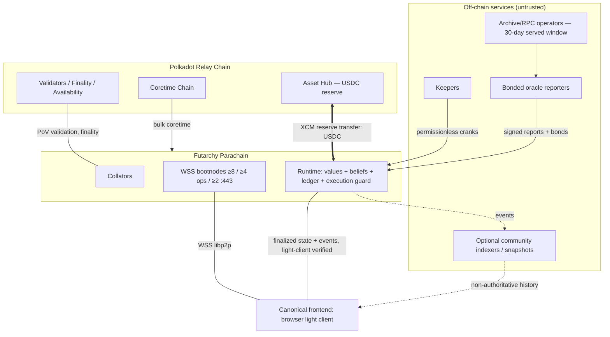

# 01 — System Overview

**Status: normative component specification. Supersedes the corresponding sections of BACKEND_PLAN.md/FRONTEND_PLAN.md** (BE §1–§6, §29 at overview level; FE §1 for the topology role of the canonical frontend).

**Boundary.** This document owns: the executive architecture decision, design goals/guarantees/assumptions, the ADR summary, the deployment topology (including node roles and the WSS bootnode requirement), the runtime pallet map, the origins/authority summary, the rollout-phase summary, and the map of the document set. It references, and never restates normatively: the frozen chain ↔ frontend contract ([02](02-integration-contract.md)), ledger semantics ([03](03-conditional-ledger.md)), market mechanics ([04](04-markets-and-pricing.md)), the welfare/decision engine ([05](05-welfare-and-decision-engine.md)), governance detail ([06](06-governance-and-guardians.md)), the full parameter table ([13](13-parameters.md)), and the full rollout plan ([09](09-execution-upgrades-and-rollout.md)). Normative language per RFC 2119. All decisions follow [00-decision-record.md](00-decision-record.md) (cited as D-n).

---

## 1. Executive Architecture Decision

The protocol is delivered as **one application-specific Polkadot parachain** ("the futarchy chain") built with the Polkadot SDK, FRAME and Cumulus, secured by the Polkadot relay chain, pinned to release line **`polkadot-stable2606`** (D-19). All consensus-critical futarchy logic is implemented as **native Rust FRAME pallets**. No smart-contract environment (Solidity, ink!, PVM, EVM) is part of the trusted computing base.

**Chain topology.** Production on the Polkadot relay via bulk Agile Coretime; public testing on the **Paseo** community testnet **[VERIFY current Paseo onboarding process at implementation time]**. The chain holds a single primary collateral asset **USDC** (Asset-Hub-issued, reserve-based transfer from Polkadot Asset Hub) and a native governance/utility asset **VIT**. Collators are permissioned invulnerables at launch, opening to bonded permissionless collation via cumulus `pallet-collator-selection` from rollout Phase 4. The **canonical client is a decentralized frontend**: an Arweave-distributed static app running an in-browser light client (smoldot) — the chain MUST be dialable from browsers (§4.2) and MUST serve the frozen integration contract of [02](02-integration-contract.md).

**Governance model.** A two-layer constitution:

- A **values layer** using `pallet-referenda` + `pallet-conviction-voting` over VIT, with narrowly scoped custom tracks. It controls only: welfare-metric definitions and weights, entrenched floor tightening, guardian election/recall, and ratification of rule-altering META and runtime-upgrade outcomes. Non-kernel constitutional-registry amendment is a `FutarchyMeta`-only belief action; kernel-bounded rows are immutable (SQ-150, [06](06-governance-and-guardians.md) §3.2, [13](13-parameters.md) rule 7). The values layer can never enact operational proposals.
- A **beliefs layer** of conditional prediction markets deciding **five proposal classes** — PARAM, TREASURY, CODE, META, CONSTITUTIONAL (values-side) — through a recurring, pipelined **21-day epoch machine**. `ProposalClass::Emergency` is **deleted** (D-7): emergencies are handled exclusively by guardian playbooks ([06](06-governance-and-guardians.md), [09](09-execution-upgrades-and-rollout.md)), which is what the mechanism always was in practice; the class-classifier completeness obligation (ADR-3) is thereby satisfiable.
- An **immutable constitutional kernel**: compile-time runtime constants plus a runtime-upgrade attestation regime that makes silent removal of entrenched invariants detectable and socially non-executable, while acknowledging that Wasm replacement is technically always possible (§2.3).

**Market model.** Scalar **Mode B** futarchy is the sole binding mechanism in v1: complementary LONG/SHORT claims on the normalized realized welfare score `s ∈ [0,1]`, one conditional pair (ACCEPT-world, REJECT-world) per proposal plus an unconditional per-epoch Baseline market, priced by a treasury-subsidized **LMSR** market maker with worst-case loss `b·ln 2` per book, implemented in deterministic 64.64 fixed point with proven error bounds. Books are denominated in **branch-USDC with an auto-split wrapper**: buyers pay USDC and receive the target position **plus the mirror-branch branch-USDC** (D-3), so losing-branch buyers recover principal at par under annulment. Decision statistics use a **slew-capped TWAP accumulator**; **ex-ante ruin-risk (gate-breach) markets** veto every market-bearing class (`PARAM | TREASURY | CODE | META`) independently of welfare uplift. PARAM uses the same system-wide S/C breach facts as a correlated-harm proxy, not causal attribution to its delta. **Forecast trading (post-resolution reopened books) is CUT from v1** (D-8): books close at branch resolution; recorded as deferred v2 work in [04](04-markets-and-pricing.md). Mode A price futarchy is advisory-only in v1.

**Collateral model.** USDC is the sole market collateral, bond currency and settlement unit. Conditional claims live in a purpose-built **conditional ledger pallet** with deterministic `PositionId`s, structurally restricted mint/burn/split/merge/transfer/redeem, per-branch machine-checked collateral-conservation invariants, a solvent **`Voided` recovery state** (merge-at-par + half-value unpaired redemption, D-1), first-class **gate instruments** and an epoch-keyed **Baseline vault** ([03](03-conditional-ledger.md)). VIT is the native balance (values voting, collator bonds, guardian bonds).

**Oracle model.** Deterministic runtime-derived metrics are computed on-chain from bounded per-block counters. Non-derivable metrics settle through a **bonded optimistic reporting game** with value-scaled bonds, escalating challenge rounds, a bonded-watchtower acknowledgment quorum on challenge windows, a hard settlement-latency cap, neutral settlement (`s = 0.5` / VOID) on irrecoverable failure, and a hardened values-layer adjudication track as the terminal factual backstop (D-18, [07](07-oracle-and-disputes.md)).

**Execution model.** Passed proposals are exact preimage-committed call batches executed by a custom **execution-guard pallet** via a permissionless `execute()` that re-validates maturity, preimage hash, runtime version, **values ratification (checked at execute-time — the single deadline, D-5)**, capability limits and live constitutional rate limits at dispatch time, then dispatches with a **narrow class-specific custom origin** — never unrestricted Root. Runtime upgrades use the two-phase `frame_system::authorize_upgrade(code_hash)` → permissionless `apply_authorized_upgrade(code)` path, gated behind the CODE/META market process plus values ratification, with an **enforced descriptor lead time** (`DescriptorLeadTime`, D-14) between authorization and permissionless application so the canonical frontend's descriptors always ship first ([09](09-execution-upgrades-and-rollout.md), [12](12-release-and-operations.md)).

**Economic security model.** The capture-resistance rule `AttackCost ≥ 3·MEV` is **operationalized**, not asserted (D-4): the decision engine computes `AttackCost̂` from measured depth at decide time and enforces `InCapPrize ≤ AttackCost̂ / 3` (reject reason `SecuritySizing`); liquidity parameters scale with the proposal's Ask ([05](05-welfare-and-decision-engine.md), [08](08-treasury-and-economics.md)).

**Rollout model.** Eight evidence-gated phases (0–7); `pallet-sudo` is removed by the Phase-3→4 runtime upgrade. The dangerous `frame-system` calls are **filtered from genesis for all origins including sudo** (D-13), and Phase 3 runs under a real-USDC exposure cap (§7 below, [09](09-execution-upgrades-and-rollout.md)).

---

## 2. Design Goals, Assumptions and Non-Goals

### 2.1 Protocol guarantees (enforced by code)

G-1. **Status-quo default.** Every ambiguity, liveness failure, dispute, liquidity shortfall or guard breach resolves to REJECT/no-op. No rejection or timeout path can execute a payload.
G-2. **Collateral conservation.** Conditional claims are always fully collateralized; no reachable state can create an unbacked claim. The conservation identity is **per-branch** over the enlarged instrument set (scalar + gate + Baseline) — [03](03-conditional-ledger.md).
G-3. **Annulment.** On **normal losing-branch resolution**, trades in the unrealized branch are economically reverted for the dominant user path: buyers hold the mirror branch-USDC (D-3) and redeem `cost` at par, losing only fees. Holders complete through **both** ledger layers (Accept *and* Reject branch-USDC) always recover par, including under VOID (D-1); same-branch LONG+SHORT completeness alone does not, since merging it yields one same-branch branch-USDC worth 0.5 under VOID. Under **protocol VOID** a wrapper buyer's whole package instead recovers its D-1 **neutral value** after pair-first netting — equal to the debit only when the realized average execution price is 0.5 — and a deliberately unpaired holder receives that same neutral valuation. No claim is ever haircut below the D-1 schedule, but VOID does not refund a premium paid over the neutral prior (SQ-171).
G-4. **Ruin gating.** No expected-welfare margin can override the survival/security gate vetoes for classes that carry them.
G-5. **Narrow authority.** Every privileged effect flows through an enumerated custom origin produced by an enumerated pallet; utility/proxy/multisig/scheduler/XCM wrappers cannot escalate — the wrapper-recursion set is closed, including `proxy_announced` and `as_multi_threshold_1` ([06](06-governance-and-guardians.md)).
G-6. **Bounded automation.** Every hook, queue and loop has a provable upper bound and an overload behavior.
G-7. **Deterministic settlement.** Markets settle only under the `MetricSpec` version frozen at their creation; intra-pillar aggregation formulas are fully specified so two conforming implementations cannot disagree ([05](05-welfare-and-decision-engine.md)).

### 2.2 Economic and social assumptions (not enforceable by code)

A-1. At least one rational, funded keeper exists (cranks are permissionless and rebated; if none exists, the chain adopts nothing — safe but stagnant).
A-2. Arbitrage capital of roughly `F ≈ L/2` per day flows against sustained mispricing (MUST be measured in Phases 3–4 and published as `F̂` before caps rise).
A-3. The values-layer electorate is not majority-captured; its supermajorities and delays make capture slow and visible, not impossible.
A-4. A community that observes an invariant-violating runtime upgrade will refuse to follow it (social-fork backstop, never a substitute for on-chain safeguards).
A-5. Polkadot relay-chain finality, availability and shared security function within their documented parameters.

### 2.3 The entrenchment honesty clause

A runtime upgrade can technically replace any runtime logic, including "immutable" rules. Entrenchment is made *credible* rather than *absolute* by: (a) compile-time kernel constants whose removal requires a Wasm change; (b) the hash-committed two-phase upgrade path with mandatory metadata-hash verification and reproducible builds; (c) a public **kernel attestation** — now a bonded attestor-registry regime (values-elected, ≥ 3 attestors, 2-of-3 signed attestations with a challenge window; no longer presence-only, D-18) checked as a queue-time precondition; (d) values-layer ratification for all upgrades; and (e) A-4 as final backstop.

### 2.4 Non-goals and v1 cuts

N-1. Combinatorial futarchy. N-2. Arbitrary cross-chain governance execution over XCM (only reserve transfers and enumerated queries). N-3. On-chain continuous limit-order book. N-4. Per-address position limits / address clustering as consensus security. N-5. Reputation-weighted market influence. N-6. Multi-asset collateral baskets. N-7. Sybil-proof usage metrics. **N-8 (new, D-8). Forecast trading** — post-resolution books are cut from v1; the reopened-book inventory problem is recorded with the deferral in [04](04-markets-and-pricing.md).

---

## 3. Architecture Decision Record Summary

Carried forward from the source ADR table; the **Amended by** column records where the decision record changed the selected design. Full provenance/rejected-alternatives detail remains in the owning component documents.

| # | Subsystem | Selected design (one line) | Amended by |
|---|---|---|---|
| ADR-1 | Constitutional model | Compile-time kernel constants + stored bounded constitutional registry + upgrade-attestation regime | D-18: attestation is bonded 2-of-3, no longer presence-only |
| ADR-2 | Values/beliefs split | Narrow enumerated values powers; beliefs decide all operations; conviction voting as the ve-analogue | — |
| ADR-3 | Proposal classes | **Five** classes PARAM/TREASURY/CODE/META/CONSTITUTIONAL, mechanically derived from the committed batch | **D-7: `Emergency` class deleted** — emergencies are guardian playbooks; classifier completeness now satisfiable |
| ADR-4 | Epoch machine | Recurring pipelined 21-day epoch, k = 2, ≤ 3 measuring + 1 settling cohorts | Phase offsets become fractions of `epoch.length` (B-med, [05](05-welfare-and-decision-engine.md)) |
| ADR-5 | Conditional accounting | Custom conditional-ledger pallet, dual-mint complete sets, deterministic `PositionId` | D-1 (solvent VOID), B-2/B-3/B-4/B-5 repairs: gate instruments, Baseline vault home, per-branch identity, SHORT rounding ([03](03-conditional-ledger.md)) |
| ADR-6 | Welfare objective | `W = g(S)·g(C)·GeoComposite(P,A)`, ramped gates, entrenched floors | D-18: C split into `C_onchain`/`C_attested`; coverage-ratio (not VIT-priced) E component |
| ADR-7 | Market mode | Mode B scalar binding for everything; Mode A advisory | **D-8: books close at branch resolution — no forecast trading** |
| ADR-8 | Market maker | LMSR only, 64.64 fixed point, maker-adverse rounding, loss ≤ b·ln 2 per book | D-3: branch-USDC denomination + auto-split wrapper + revenue recycling ([04](04-markets-and-pricing.md)) |
| ADR-9 | Decision rule | Gate-first ordered rule; full/trailing/convergence tests; reason codes as enum | D-4 adds the `SecuritySizing` step; D-5 adds the ratification check ([05](05-welfare-and-decision-engine.md)) |
| ADR-10 | Ruin-risk gating | Four-market (S,C)×(adopt,reject) set for PARAM/TREASURY/CODE/META | D-18: daily breach flags driven by `C_onchain` only (deterministic); gate books exempt from the sanity band |
| ADR-11 | TWAP | Slew-capped accumulator, cap κ per **10-block** observation interval, O(1) checkpoints, no VRF | B-low: interval label corrected (10-block, not 60) |
| ADR-12 | Oracle | Deterministic adapters first; bonded optimistic game; values terminal adjudication; VOID on deadlock | D-18: value-scaled bonds, 72 h windows + watchtower quorum, hardened 60%/10%/7-day track with pre-cohort snapshot |
| ADR-13 | Guardians | Bonded elected 7-seat council, 5-of-7; delay-once/rerun/pause/playbooks; retro ratification; sunset | D-9 adds PB-LEDGER-FREEZE + the expedited CODE lane to the playbook set |
| ADR-14 | Capture resistance | Bonds, POL floors, long windows, slew caps, sizing rule `AttackCost ≥ 3·MEV` | **D-4: sizing rule operationalized** — decide-time outflow cap from measured depth (primary) + Ask-scaled `pol.b`/`dec.v_min`/δ (secondary) |
| ADR-15 | Interference | Declared resource domains, static call-domain derivation, locks, `N_active = 5` | — |
| ADR-16 | Rollout | Eight evidence-gated phases; advancement by evidence + META decision + values ratification | D-13 (genesis filter, exposure cap), D-6/X-4 (bootnode gates), D-15 (economic gates) |

**Topology reclassification (not an ADR row):** the indexer is **not** a protocol node role. Canonical history is event-derived and chain-served within the committed window; community indexers are optional, non-authoritative acceleration (D-2). See §4.2.

---

## 4. Polkadot Deployment Topology

### 4.1 Networks and shared security

| Item | Decision |
|---|---|
| Production relay | Polkadot |
| Public test relay | Paseo **[VERIFY current core allocation process]**; long-lived local Zombienet relay for CI |
| Security | Full shared security: relay validators execute and finalize parachain blocks |
| Coretime | Bulk Agile Coretime; treasury renewal budget line; Phase ≤ 3 ops-multisig runbook, Phase ≥ 4 TREASURY-proposal-authorized keeper-executed renewal. On-demand coretime is the degraded fallback **[VERIFY current renewal-price mechanics]**. The enumerated coretime-renewal call is **exempt from the dead-man freeze** and keeper-executable during degraded mode (D-9, [09](09-execution-upgrades-and-rollout.md)) |
| Block time | 6-second parachain blocks (async backing); all block-denominated parameters scale by `MILLISECS_PER_BLOCK` |
| Polkadot Hub | Asset Hub is the USDC reserve and the canonical USDC location; the canonical frontend additionally maintains a second light-client connection to Asset Hub for the guided USDC funding flow (D-12, [11](11-frontend-workflows.md)) |

### 4.2 Node roles and off-chain services

| Role | Count (Phase 4 / Phase 7) | Notes |
|---|---|---|
| Collators | 5 invulnerables / 8–12 bonded permissionless | Geographically and organizationally diverse; collator concentration feeds the Security pillar (launch-set D cap phase-scheduled, D-15) |
| **WSS bootnodes** | **≥ 8 browser-reachable WSS endpoints across ≥ 4 operators, ≥ 2 on port 443** (D-6, X-4) | REQUIRED from Phase 3 mainnet genesis and on Paseo from Phase 2; listed in the production chain-spec ([02 §10](02-integration-contract.md)); protocol-funded budget line ([12](12-release-and-operations.md)); wired into rollout phase gates (§7) |
| RPC / archive operators | ≥ 4 load-balanced public RPC + ≥ 2 archive | Serve wallets, external tooling and the optional user-selected FE fallback — the canonical frontend does not require them. Archive nodes required for oracle recomputation and dispute evidence. Protocol-funded operators **commit to serving 30 days of state and block bodies** (D-6 layer 2); this commitment is a phase-gated ops line, not a courtesy |
| Canonical frontend | 1 (Arweave-distributed static app) | Serves all protocol workflows via in-browser light client; no backend; see [10](10-frontend-architecture.md)–[12](12-release-and-operations.md) |
| Community indexers / snapshot publishers | ≥ 0, optional | Non-authoritative acceleration for historical analytics and dashboards; interchangeable; reference implementation in `optional/indexer/`; **no protocol action or canonical-frontend workflow depends on them** (D-2) |
| Keeper service | ≥ 2 independent operators + permissionless public | Cranks: phase ticks, TWAP observations, decision finalization, execution, settlement, cleanup. All idempotent. Rebates are metered and tranched ([08](08-treasury-and-economics.md) §6.3) — the ≥ 80% reservation covers the five named decision-critical families, while general-tranche cranks are only partially subsidised and MUST NOT be assumed rebated |
| Oracle reporters | ≥ 3 bonded independent operators | Signed report extrinsics; OCW-assisted collection permitted, never trusted |
| Monitoring | Prometheus/Grafana + on-chain-event alerting | Serves operators; the canonical frontend has no dependency on it and ships no telemetry |

### 4.3 Topology diagram

XCM relationships in v1 are exactly two: Asset Hub ⇄ futarchy chain reserve transfers of USDC (and DOT for fees), and treasury-authorized transfers to the Coretime chain for renewals. No cross-chain `Transact` governance in either direction.

---

## 5. Runtime Composition

### 5.1 Pallet map

Cohesion rule: pallets are bounded by *trust domain and settlement lifecycle*, not by noun. The conditional ledger and the market maker are separate because the ledger is the solvency-critical custody domain (small, frozen early, heavily verified) while markets are the evolving pricing domain.

**Standard pallets (all `polkadot-stable2606`) — abbreviated; full config detail in the owning docs:**

| Crate | Role | Key configuration / filter decisions |
|---|---|---|
| `frame-system` | Base | **`set_storage`, `kill_storage`, `kill_prefix`, `set_code`, `set_code_without_checks`, `authorize_upgrade_without_checks` are filtered from genesis for ALL origins including sudo (D-13)** — not "post-bootstrap". `authorize_upgrade`/`apply_authorized_upgrade` are the sole upgrade path |
| `pallet-timestamp` | Inherent time | Never used for phase logic |
| `pallet-balances` | VIT native balance | Holds/freezes for bonds, conviction locks, guardian bonds |
| `pallet-vesting` | Genesis VIT vesting ([08 §2.1](08-treasury-and-economics.md)) | Genesis-configured linear lock schedules (founding-team 4-year/1-year-cliff curve pinned in 08 §2.1); `force_vested_transfer`/`force_remove_vesting_schedule` denied for ALL origins including sudo (D-13 nobody row — the vesting analog of `balances.force_*`) |
| `pallet-assets` (`ForeignAssets`) | USDC + future fungibles | USDC sufficient; admin surface filtered to `ConstitutionalValues`; USDC mint/burn disabled (supply via XCM reserve logic only). USDC identity constants frozen in [02 §8](02-integration-contract.md) |
| `pallet-transaction-payment` + `pallet-asset-tx-payment` | Fees in VIT or USDC | Conversion bound to constitution key **`fee.vit_usdc_rate`** (typed, bounded, PARAM-adjustable — D-12, [08](08-treasury-and-economics.md)); USDC-only users can always pay fees in USDC |
| `pallet-referenda` (values) + `pallet-conviction-voting` | Values layer | Track-scoped origins; served by canonical-frontend epic FE-14 (D-11) |
| `pallet-preimage` | Payload + playbook preimages | `request_preimage` pinning at qualification (B-13, [06](06-governance-and-guardians.md)) |
| `pallet-scheduler` | Referenda enactment only | Scheduled dispatch re-enters `BaseCallFilter` + origin checks; belief-side execution never uses the scheduler |
| `pallet-utility`, `pallet-proxy`, `pallet-multisig` | Committed batches / user convenience | Wrapper recursion closed incl. `proxy_announced`, `as_multi_threshold_1` (B-med); `dispatch_as`/`as_derivative` filtered for non-internal origins |
| `pallet-migrations`, `frame-metadata-hash-extension` | Migrations / upgrade verifiability | — |
| `pallet-sudo` | Bootstrap only (Phases 0–3) | Founding multisig; operates **under** the genesis call filter and the Phase-3 real-USDC exposure caps (D-13); modeled as an adversary in [14](14-threat-model.md); removed in the Phase-3→4 upgrade |
| Cumulus/XCM set (`parachain-system`, `xcmp-queue`, `message-queue`, `pallet-xcm`, …) | Parachain + XCM base | `force_*`/`send` filtered; `teleport_assets` disabled; `reserve_transfer` user-callable for USDC/DOT only (the FE withdraw flow, D-12) |
| `pallet-collator-selection` + session/aura/authorship | Collation | Permissionless candidacy Phase ≥ 4 |

**Rejected standard pallets (rationale preserved):** `pallet-treasury` — its spend/payout model duplicates and conflicts with the rate-limited class-gated custom treasury. `pallet-parameters` — stores untyped parameter enums without per-key bounds/max-delta/cooldown semantics; MAY be reused later for non-constitutional operational knobs. `pallet-safe-mode`/`pallet-tx-pause` — overlapping pause semantics would create a second authority; the narrowly-triggered ledger freeze is instead the guardian playbook PB-LEDGER-FREEZE, admissible only when the I-4 drift flag is set (D-9).

**Custom pallets:**

| Crate | Responsibility | Depends on | Owning doc |
|---|---|---|---|
| `pallet-constitution` | Typed, bounded, rate-limited parameter registry; rate meters; capability/resource-domain tables; kernel-constant re-export; **`PhaseFlags` bitset**; **`ReleaseChannel` fixed-layout raw storage key (D-14)**; `fee.vit_usdc_rate` | `futarchy-primitives` | [06](06-governance-and-guardians.md), [13](13-parameters.md) |
| `pallet-conditional-ledger` | Conditional custody: split/merge/scalar ops/transfer/resolve/redeem/settle; **`Voided` state + `redeem_void` (D-1)**; **gate instruments (B-2)**; **epoch-keyed `BaselineVaults` (B-3)**; per-branch supplies and per-branch conservation identity (B-4); `redeem_scalar_pair` (B-5) | `pallet-assets` (USDC) | [03](03-conditional-ledger.md) |
| `pallet-market` | LMSR books (branch-USDC denominated, D-3), trading wrapper, fees, TWAP, POL seeding; **`Traded`/`Observed` events ([02 §6](02-integration-contract.md))**; **`BaselineMarketOf` map ([02 §7](02-integration-contract.md), [04 §8.3](04-markets-and-pricing.md))**; books/proposal ≤ 6, with a 196-book active/POL envelope and independent 2,240-row retained-book envelope shared by proposal and Baseline books *(normative values: [13](13-parameters.md))* | ledger, constitution | [04](04-markets-and-pricing.md) |
| `pallet-epoch` | Epoch/phase clock, proposal registry, decision engine (incl. `SecuritySizing` step D-4 and ratification check D-5), cohort registry; **`RecentCohortSummaries` ring of 32 ([02 §7](02-integration-contract.md))** | market, ledger, constitution, welfare | [05](05-welfare-and-decision-engine.md) |
| `pallet-welfare` | Bounded per-block counters, snapshots, `MetricSpec` registry, pillar computation (`C_onchain`/`C_attested` split, D-18), gate-breach flags, settlement score | oracle, registry, constitution | [05](05-welfare-and-decision-engine.md) |
| `pallet-oracle` | Bonded reports, challenge rounds (72 h + watchtower quorum), escalation, slashing, neutral settlement, reporter registry; storage/event names frozen in [02 §7](02-integration-contract.md) | constitution, values origins | [07](07-oracle-and-disputes.md) |
| **`pallet-registry` (new)** | **Incident/Milestone registries** (B-med resolution): bonded filings, challenge windows, slashing, bounded storage, benchmarked weights; feeds `C_attested`; sub-games hold settlement, never decisions | constitution, oracle | [07](07-oracle-and-disputes.md) |
| `pallet-execution-guard` | Execution queue, permissionless `execute()` with full dispatch-time re-validation (incl. ratification and `DescriptorLeadTime`), class-origin dispatch, upgrade authorization flow, `ExecutionRecords` (≤ 256; older records are event-derived history reconstructible by any client — D-2) | epoch, constitution, attestor, preimage, system | [09](09-execution-upgrades-and-rollout.md) |
| `pallet-futarchy-treasury` | Treasury accounts, NAV with haircuts, rate-limited class-gated outflows, streams, budget lines (incl. bootnode/RPC/keeper/oracle-evidence/ArNS ops lines, D-16) | assets, constitution | [08](08-treasury-and-economics.md) |
| `pallet-guardian` | 7-seat council, bonds, allowances, pause-intake/delay-once/force-rerun/playbooks (incl. PB-LEDGER-FREEZE, D-9), mandatory retro ratification | constitution, epoch, values origins | [06](06-governance-and-guardians.md) |
| `pallet-attestor` | Thin attestation registry ([06 §7](06-governance-and-guardians.md)): attestor set (≥ 3 members, guardian-track elected, 25k-VIT bonds), `Attestation` lifecycle (`attest`/`challenge_attestation`, 72 h windows), 2-of-N quorum surfaced to `decide()` and the execution guard; shipped storage names and SCALE shapes are frozen in [02 §7.5](02-integration-contract.md) for the CODE/META execute-path frontend read | constitution, values origins | [06](06-governance-and-guardians.md) |
| `pallet-origins` | Shared custom-origin shim | — | [06](06-governance-and-guardians.md) |
| `pallet-inflow-caps` | Phase-3 real-USDC exposure meters (D-13, added 2026-07-17 with the SQ-110/111 resolution): the shared per-account cumulative deposit meter + the total-local-issuance global-cap admission check, consumed by the XCM inflow leg and the ledger split-path defense-in-depth read; state-only (no dispatchables — its checks run inside callers' weight envelopes) | constitution (caps via Params), assets (issuance) | [09](09-execution-upgrades-and-rollout.md) §5.2 |

### 5.2 Shared crates

`futarchy-primitives` (`no_std` shared types + kernel constants — the SCALE surface frozen by [02](02-integration-contract.md)) and `futarchy-fixed` (verified 64.64 exp/ln/LMSR math; it MAY depend on `futarchy-primitives`, importing the LMSR domain-bound and error-bound kernel constants from it per [13](13-parameters.md) reading rule 1 — never re-declaring them). Neither has `frame` dependencies, so the reference model, the frontend's TypeScript port and auditors consume them standalone. `futarchy-primitives` is the **single code home** of every 13-owned kernel constant and every 02-named contract type; downstream crates import, never re-declare.

---

## 6. Origins and Authority (summary)

Eight custom origins, each produced by exactly one pallet through exactly one code path; none is obtainable from a signed extrinsic, XCM origin conversion, or wrapper call:

`FutarchyParam`, `FutarchyTreasury`, `FutarchyCode`, `FutarchyMeta` (execution guard, per passed class) · `ConstitutionalValues`, `OracleResolution` (values referenda tracks) · `GuardianHold`, `EmergencyPlaybook` (guardian pallet, 5-of-7, scoped per power).

There is **no path to unrestricted Root** after bootstrap: `EnsureRoot` succeeds only for the internal dispatch the execution guard performs for the two allowlisted `frame_system` upgrade calls. `BaseCallFilter = RuntimeBaseCallFilter` denies the "nobody" call set unconditionally (from genesis, D-13) and recursively inspects the **closed** wrapper/carrier set — including `batch`/`batch_all`/`force_batch`, `proxy`, **`proxy_announced`**, `as_multi`, **`as_multi_threshold_1`**, the storing carrier `referenda.submit`, and the denied carriers `dispatch_as`, `dispatch_as_fallible`, `if_else`, `sudo_as`, `scheduler.*` and `pallet_xcm.execute`; the enumeration is owned by [06](06-governance-and-guardians.md) §3.3 and closed there, not here. Matching-origin enforcement is a genuinely separate second check, but it cannot live in the filter — a `Contains<RuntimeCall>` sees no origin — so it happens at the two governance dispatch boundaries: the execution guard's origin-aware re-check before `dispatch_bypass_filter` on the belief side, and the scheduler's ordinary *filtered* dispatch plus each pallet's `EnsureOrigin` on the values side (SQ-32; mechanics in [06](06-governance-and-guardians.md) §3.3/§3.4). The EmergencyPlaybook admissible call set is enumerated in the capability table. The full call-level authority matrix, track table, ratification plumbing and playbook catalog live in [06](06-governance-and-guardians.md).

---

## 7. Rollout Summary

Eight evidence-gated phases; advancement at every step = published evidence + META decision + values ratification; delays always allowed, acceleration never. Full gate tables, emergency lanes and upgrade path in [09](09-execution-upgrades-and-rollout.md).

| Phase | Authority | Key gates (including gates added by the decision record) |
|---|---|---|
| 0 Reference & simulation | none | Reference model ≡ pallets on shared vectors; sim false-pass < 1%; δ/POL calibration published |
| 1 Local nets | none | Zombienet: 3 unattended epochs incl. collator/keeper loss + dead-man drill |
| 2 Public testnet (Paseo) | all classes, testnet-binding | ≥ 6 epochs, zero invariant breaches, ≥ 1 full upgrade e2e; **canonical frontend deployed to staging ArNS against Paseo; testnet WSS bootnode set live (D-6); ss58 7777 registry submission filed (D-17)** |
| 3 Mainnet shadow | markets real, decisions advisory; sudo present | ≥ 6 epochs; Baseline calibration in band; F̂ ≥ L/2; **production WSS bootnode set live (≥ 8/≥ 4 ops/≥ 2 :443) with 30-day served-state commitments contracted (X-4/D-6)**; **real-USDC exposure caps active: global TVL cap + per-account deposit cap (D-13)**; **≥ 3 registered reporters fully staked (D-15)** |
| 4 Binding PARAM | PARAM; **sudo removed** | ≥ 12 binding PARAM decisions; **frontend release gates green incl. reproducible-build attestations**; genesis-filter migration assertion (D-13) |
| 5 + TREASURY | + TREASURY (streams > 1% NAV mandatory) | Phase 4 exit; V_min consistently met; **USDC treasury funding target ≥ 25M USDC and published min-viable NAV per class satisfied (D-15) — the gate is explicit and loud** |
| 6 + CODE/META | + CODE, META (values ratification mandatory) | 1 CODE upgrade shipped and stable ≥ 60 d incl. the `DescriptorLeadTime` discipline (D-14); dispute game exercised without deadlock; scope-A re-audit |
| 7 Mature | all; guardian → playbooks only | Steady state; guardian sunset vote scheduled |

---

## 8. How to Read This Document Set

Fifteen component documents replace the two monolithic plans. [00-decision-record.md](00-decision-record.md) is the normative resolution of the design review; each document below implements it for its subsystem and ends with a Resolves table. Constants have exactly two homes: the chain ↔ frontend contract ([02](02-integration-contract.md)) and the parameter table ([13](13-parameters.md)); every other document references them.

| Doc | Component | Read it for |
|---|---|---|
| [01-system-overview.md](01-system-overview.md) | This document | Goals, guarantees, topology, pallet map, rollout summary |
| [02-integration-contract.md](02-integration-contract.md) | **Frozen** chain ↔ frontend contract | Runtime API, events, storage names, chain identity, constants binding, test artifacts |
| [03-conditional-ledger.md](03-conditional-ledger.md) | Ledger & solvency | VOID, gate instruments, Baseline vault, per-branch conservation |
| [04-markets-and-pricing.md](04-markets-and-pricing.md) | LMSR, TWAP, trade path | Branch-USDC denomination, revenue recycling, gate + Baseline books |
| [05-welfare-and-decision-engine.md](05-welfare-and-decision-engine.md) | Welfare & decisions | W composition, state machines, decision rule incl. SecuritySizing |
| [06-governance-and-guardians.md](06-governance-and-guardians.md) | Values layer & guardians | Tracks, ratification, authority matrix, playbooks |
| [07-oracle-and-disputes.md](07-oracle-and-disputes.md) | Oracle & disputes | Reporting game, watchtowers, `pallet-registry` |
| [08-treasury-and-economics.md](08-treasury-and-economics.md) | Treasury & economics | Genesis economics, fees, keeper economics, security sizing |
| [09-execution-upgrades-and-rollout.md](09-execution-upgrades-and-rollout.md) | Execution & rollout | Execution guard, upgrade path, phases, emergency lanes |
| [10-frontend-architecture.md](10-frontend-architecture.md) | Frontend architecture | Boot, light client, data layer, three-layer history model |
| [11-frontend-workflows.md](11-frontend-workflows.md) | Frontend workflows | Screens, preconditions, governance/operator/funding surfaces |
| [12-release-and-operations.md](12-release-and-operations.md) | Release & operations | Release train, keys, ArNS permabuy, bootnode ops funding |
| [13-parameters.md](13-parameters.md) | Parameters | The single reconciled parameter/bounds/constants table |
| [14-threat-model.md](14-threat-model.md) | Threat model | All rows, incl. founder/sudo insider and signer disjointness |
| [15-invariants-and-testing.md](15-invariants-and-testing.md) | Invariants & testing | I-1…, INV-FE-1…15 verbatim, test regime, published artifacts |

Suggested order: 01 → 02 → 03/04/05 (protocol core) → 06–09 (governance/ops core) → 10–12 (frontend) → 13–15 (reference).

---

## 9. Bibliography and source provenance

The design synthesizes five internal predecessor design documents, cited throughout this set (and throughout the superseded plans) by the abbreviations **FGP**, **SGF**, **GFP**, **EFP**, and **AEGIS**. The superseded `BACKEND_PLAN.md` cited them without ever identifying them (a design-review low finding); this section is now their single identification point, and honesty requires stating what is and is not known from repository material:

| Abbrev. | Role in the synthesis (as evidenced by its citations) | Identification |
|---|---|---|
| FGP | Futarchy governance process: proposal lifecycle, LMSR spec, decision rule (full/trailing/extension), sizing rule `AttackCost ≥ SF·MEV`, guardian delay/rerun | **[VERIFY — full title, version, and hash to be supplied by the document owners before audit scoping]** |
| SGF | Scalar/conditional-market design: dual-mint vault, annulment identity, Mode B scalar futarchy, oracle adapter hierarchy, guardian sunset | **[VERIFY — as above]** |
| GFP | Gated welfare futarchy: ramped gates, gate-risk (breach) markets, entrenched clauses, capture-resistance analysis | **[VERIFY — as above]** |
| EFP | Epoch machine and values/beliefs table: pipelined epochs, geometric welfare aggregation, conflict pruning, arming schedule | **[VERIFY — as above]** |
| AEGIS | Threat-model and defense catalogue: pillar decomposition, attestor/dispute designs, position-cap analysis (largely rejected as consensus defense, retained as analytics) | **[VERIFY — as above]** |

Until the five [VERIFY] rows above are completed, no normative statement in this document set may rest on a source-document citation alone — every design element carried forward is restated normatively in its owning component document, so the bibliography gap does not weaken any binding text.

**External literature.** R. Hanson, "Shall We Vote on Values, But Bet on Beliefs?" and Hanson's LMSR papers; MetaDAO conditional-market documentation (precedent for dual-mint conditional markets).

**Platform-source verification (carried forward from the now-removed source plans, verified 2026-07-11).** These pins established feasibility and MUST be re-verified before implementation begins:

- **Backend / Polkadot SDK** — verified against `raw.githubusercontent.com/paritytech/polkadot-sdk`: release branches `polkadot-stable2412 … polkadot-stable2606`; umbrella crate `polkadot-sdk = "2606.0.0"` on `polkadot-stable2606` (the pinned line since [D-19](00-decision-record.md), 2026-07-17; previously `2603.0.0` on `polkadot-stable2603`); `frame_system::{authorize_upgrade, apply_authorized_upgrade, authorize_upgrade_without_checks}`; presence of `pallet-parameters`, `pallet-referenda`, `pallet-conviction-voting`, `pallet-preimage`, `pallet-scheduler`, `pallet-assets`, `pallet-treasury`, `pallet-utility`, `pallet-proxy`, `pallet-multisig`, `pallet-migrations`, `frame-metadata-hash-extension`, `pallet-safe-mode`, `pallet-tx-pause`, `cumulus-pallet-parachain-system`, cumulus `pallet-collator-selection`; `sp-arithmetic` fixed-point types; Zombienet, Chopsticks, `try-runtime-cli`. Model knowledge cutoff January 2026; Agile Coretime, async backing, Asset Hub registry and XCM v5 semantics were consulted from pre-cutoff knowledge and carry `[VERIFY]` in the owning docs.
- **Frontend stack** — verified against `registry.npmjs.org` and the primary GitHub repos: `polkadot-api` 2.1.8, `smoldot` 3.3.1, `@substrate/connect` 2.1.8, `vite` 8.1.4, `dexie` 4.4.4, `idb` 8.0.3, `@ar.io/wayfinder-core` 2.0.0, `@ar.io/wayfinder-react` 2.0.1, `@ar.io/sdk` 4.0.3, `permaweb-deploy` 5.0.0, `@ardrive/turbo-sdk` 1.42.0 (`arkb` last published 2022 — rejected as unmaintained; `@reactive-dot/react` 0.72.0 evaluated, not adopted). Details and the FE-P1…P10 prototype gates live in [10](10-frontend-architecture.md) and [12](12-release-and-operations.md).

**Pinning regime (normative).** Workspace manifests freeze **exact patch versions** (`=x.y.z`) of every crate in the pinned SDK family, asserted by a committed lockfile and `--locked` CI ([15 §4.5](15-invariants-and-testing.md) supply-chain gates). Adopting a maintenance tag of the pinned line (`polkadot-stable2606-N`) is a deliberate, atomic act: one commit bumps the affected `=` pins citing the upstream tag, re-runs the full gate suite, and records the adoption in PLAN.md's Verification log; security backports are adopted this way promptly, never via floating ranges. Moving to a different release line (e.g. stable2609) is a project decision recorded in [00](00-decision-record.md), not a pin bump — the stable2603 → stable2606 move is [D-19](00-decision-record.md).

The full historical text of the two source plans and the v2.0 design review is preserved in Git history (the commit prior to their removal) should the detailed derivations or the review's finding-by-finding arithmetic ever be needed.

---

## Resolves

| Finding | Resolution in this document |
|---|---|
| X-4 | §4.2 adds the WSS bootnode node-roles row (≥ 8 browser-reachable WSS, ≥ 4 operators, ≥ 2 on :443) as a protocol requirement, funded and phase-gated (§7 Phases 2–3); chain-spec listing requirement delegated to [02 §10](02-integration-contract.md) |
| X-1/X-3 (topology aspect) | §4.2/§4.3 reclassify the indexer as optional/non-authoritative, add the canonical-frontend role, and record the 30-day served-state operator commitment (D-2, D-6) |
| X-9 (filter aspect) | §5.1 `frame-system` row: dangerous calls filtered **from genesis** for all origins including sudo; sudo row notes exposure caps and adversary-model inclusion (D-13; owning docs [09](09-execution-upgrades-and-rollout.md), [14](14-threat-model.md)) |
| B-med (Incident/MilestoneRegistry) | §5.1 adds `pallet-registry` to the pallet map (specification owned by [07](07-oracle-and-disputes.md)) |
| D-7 (ADR-3 completeness) | §1/§3: `ProposalClass::Emergency` deleted; five classes; classifier completeness satisfiable |
| D-8 (X-5 backend side) | §1/§2.4/§3: forecast trading cut from v1, recorded as N-8 with deferral in [04](04-markets-and-pricing.md) |
| B-8/D-4, B-11/D-5, B-17/D-9 (overview level) | §1/§3 present the amended executive decisions (security sizing operationalized, single execute-time ratification deadline, PB-LEDGER-FREEZE) with ownership pointers |
| B-low (source documents never identified) | §9 is now the single identification point for FGP/SGF/GFP/EFP/AEGIS; full identifications are honestly [VERIFY]-gated and no binding text rests on a source citation alone |
