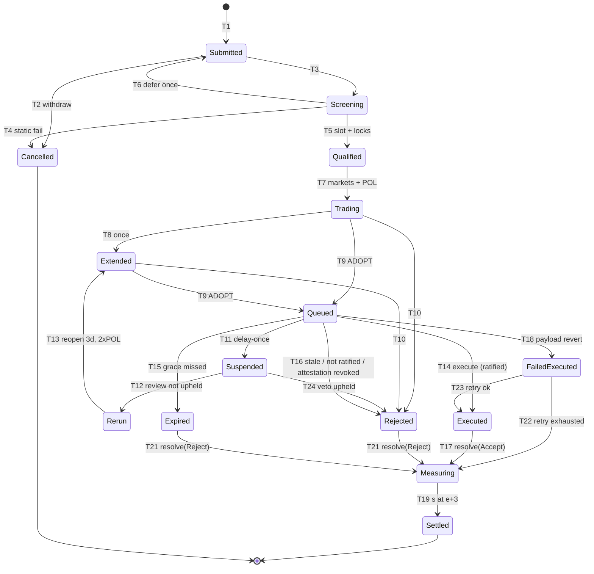

# 05 — Welfare Function, State Machines and Decision Engine

**Status: normative component specification. Supersedes the corresponding sections of BACKEND_PLAN.md/FRONTEND_PLAN.md** (BE §8, §9, §12, §13-veto-tests, §14; the welfare/decision rows of §5.2.3–5.2.4, §21, §23). Normative language: RFC 2119. Decisions implemented here: D-4, D-7, D-15 (cold start, collator-D cap), D-18 (gate split, VIT reflexivity), and the B-9/B-10/B-12/B-15 + medium-finding dispositions of [`00-decision-record.md`](./00-decision-record.md).

**Boundary.** This document owns: the proposal state machine, the epoch and cohort machines, the welfare function W and its aggregation/normalization discipline, the gate-veto tests, the settlement score `s`, and the decision engine `decide()`. It references but does not own: ledger mechanics and vault states ([`03-conditional-ledger.md`](./03-conditional-ledger.md)), LMSR/TWAP/Baseline market mechanics ([`04-markets-and-pricing.md`](./04-markets-and-pricing.md)), ratification, guardians and playbooks ([`06-governance-and-guardians.md`](./06-governance-and-guardians.md)), oracle rounds, registries and watchtowers ([`07-oracle-and-disputes.md`](./07-oracle-and-disputes.md)), security-sizing economics and defaults ([`08-treasury-and-economics.md`](./08-treasury-and-economics.md)), execution-guard dispatch checks ([`09-execution-upgrades-and-rollout.md`](./09-execution-upgrades-and-rollout.md)), parameter values ([`13-parameters.md`](./13-parameters.md)), and the canonical shared types ([`02-integration-contract.md`](./02-integration-contract.md)). Values quoted here for readability are *(normative value: §13)* unless marked kernel (K).

---

## 1. Proposal classes and canonical types

### 1.1 Class enum — `Emergency` is deleted (D-7)

```rust
pub enum ProposalClass { Param, Treasury, Code, Meta, Constitutional }
```

`ProposalClass::Emergency` is **removed** from the enum, from the class-derivation table, and from every state-machine and §21-equivalent row. Emergencies are handled exclusively by guardian playbooks ([doc 06](./06-governance-and-guardians.md)) — which is what every emergency path in the source spec already did in practice; no lifecycle, bond, market set, or decision rule ever existed for the class. Consequence: the ADR-3 classifier-completeness obligation ("class derived mechanically from call-domain classification, never proposer-declared downward") is now satisfiable — every classifiable batch maps to one of the five live classes, and CONSTITUTIONAL-class subjects route to the values track with **no markets** (referendum path). The classifier MUST reject (T4, `ProposalCancelled`) any batch whose domains map to no class.

### 1.2 `Proposal` — new fields (B-med: decide() fields)

The canonical `Proposal` (layout frozen as part of the [doc 02](./02-integration-contract.md) contract "by inclusion in `futarchy-primitives`") gains three fields the engine consumes (`ask`, `decide_at`, `rerun`); the base field list, which 02 and this document previously deferred to each other without either enumerating it, is **frozen here in full** — this declaration order is the SCALE layout:

```rust
/// Generic over the runtime `AccountId` (concrete instantiation: AccountId32, 02 §8);
/// carried by `futarchy-primitives` per 02 §2.
pub struct Proposal<AccountId> {
    pub id: ProposalId,
    pub proposer: AccountId,
    pub class: ProposalClass,
    pub state: ProposalState,
    pub epoch: EpochId,                     // creation epoch — the schedule anchor (§2.3)
    pub submitted_at: BlockNumber,
    pub payload_hash: H256,                 // pinned at qualification (06; re-checked 09 §1.2(2))
    pub payload_len: u32,                    // preimage byte length; (hash, len) is the pinned
                                             // commitment (09 §1.2(2); read by decide()'s §5.6
                                             // preimage check and listed in 09 §1.1's queued fields)
    pub ask: Balance,            // committed USDC outflow (TREASURY; 0 otherwise). Consumed by
                                 // bond formula, security sizing (§5.6), Ask-scaled liquidity (doc 08)
    pub bond: Balance,                      // class bond held (13 §1 `prop.bond`)
    pub resources: BoundedVec<[u8; 8], 8>,  // declared resource-domain keys (bound: 13 §4 "Resource locks")
    pub metric_spec: MetricSpecVersion,     // creation-time spec version (I-16)
    pub decide_at: BlockNumber,  // absolute; computed and stored at qualification from the
                                 // creation-time epoch schedule (§2.3); updated only by T8/T13
    pub rerun: bool,             // set at rerun open (T13); selects the 2×POL / δ+1pp regime
    pub extended: bool,                     // per-pair extension consumed (§2.1 T8)
    pub delayed_once: bool,                 // guardian delay-once consumed (06)
    pub markets: Option<MarketSet>,         // book ids once seeded (04)
    pub maturity: Option<BlockNumber>,      // execution-queue maturity (09 §1.2(1))
    pub grace_end: Option<BlockNumber>,     // execution grace deadline (09 §1.2(1))
    pub version_constraint: Option<RuntimeVersionConstraint>, // layout: 09 §1.2(3)
    pub decision: Option<DecisionOutcome>,  // set at decide()/terminal transition
}
```

### 1.3 `DecisionOutcome` and `RejectReason` (canonical)

```rust
/// Canonical name per doc 02 (the FE's `DecisionOutcomeCode` is renamed to this).
pub enum DecisionOutcome { Adopt, Reject(RejectReason), Extend }

pub enum RejectReason {
    NotDecisionGrade, GateVetoSurvival, GateVetoSecurity, HurdleNotMet,
    ConvergenceFailed, SecondExtensionFailed, ProcessHold, ConstitutionViolation,
    ResourceConflict, RateLimited, VetoUpheldByReview, StaleQueue, PayloadReverted,
    // new (D-4, D-5, D-18):
    NotRatified,         // execute-time ratification check failed / grace ended unratified
    SecuritySizing,      // InCapPrize > AttackCost̂ / 3 (§5.6)
    AttestationMissing,  // CODE/META attestation record absent or below attestor quorum
}
```

**Every variant has exactly one producing site, with one deliberate exception** (B-med: RejectReason; SQ-3): `AttestationMissing` is produced at **two** sites — `decide()` step 10 at decide time (T10) and the execution guard's dispatch-time re-check (T16) — because a queue-time `AttestationRecord` can be revoked, or have a challenge resolved against it, *after* queue time, which [doc 09](./09-execution-upgrades-and-rollout.md) §1.2(5) and [doc 15](./15-invariants-and-testing.md) I-19 require the guard to catch at `execute`. The producer map is otherwise normative — an implementation MUST NOT emit a variant from any site not listed below:

| Variant | Producer | Transition |
|---|---|---|
| `NotDecisionGrade` | `decide()` step 3 (gate books invalid) or step 5 (welfare books invalid, second insufficiency) | T10 |
| `GateVetoSurvival` / `GateVetoSecurity` | `decide()` step 4 | T10 |
| `HurdleNotMet` | `decide()` steps 6–7 (converged, hurdle failed) | T10 |
| `ConvergenceFailed` | `decide()` step 8 | T10 |
| `SecondExtensionFailed` | `decide()` steps 6–8: full/trailing disagreement recurring while `p.extended` (§5.4) | T10 |
| `ProcessHold` | `decide()` step 2; force-reject under VOID / stale-epoch / **active `PB-LEDGER-FREEZE`** (T20) | T10, T20 |
| `ConstitutionViolation` | `decide()` step 1 (preimage mismatch at decide time) | T10 |
| `ResourceConflict` | `decide()` step 1 (locks lost) | T10 |
| `SecuritySizing` | `decide()` step 9 | T10 |
| `AttestationMissing` | `decide()` step 10 (CODE/META) at decide time; **and** the execution guard's dispatch-time re-check when the queue-time `AttestationRecord` was revoked/challenge-resolved-against-it post-queue ([doc 09](./09-execution-upgrades-and-rollout.md) §1.2(5), [doc 15](./15-invariants-and-testing.md) I-19) | T10, T16 |
| `RateLimited` | `decide()` step 10 (constitutional meters/spacing) | T10 |
| `NotRatified` | execution guard: ratification referendum concluded **Failed**, or grace end reached unratified ([doc 06](./06-governance-and-guardians.md) mechanics, [doc 09](./09-execution-upgrades-and-rollout.md) dispatch check) | T16 |
| `StaleQueue` | execution guard: version-constraint mismatch; meter contention past grace | T16 |
| `VetoUpheldByReview` | guardian review flow: the mandatory retrospective review of a `delay_once` concludes with an upheld-veto verdict before the rerun opens — the `ratify`-track referendum enacts `guardian.uphold_veto(action_id)`, the single producing site ([doc 06](./06-governance-and-guardians.md) §5.4) | T24 |
| `PayloadReverted` | execution-failure recording: carried in `ExecutionFailed { reason }` and in `ExecutionRecord.result` at T18; copied into the cohort's `DecisionRecord` when T22 fires | T18 (annotation), T22 |

### 1.4 Canonical resource-domain keys (B1b; resolves the SQ-172/SQ-183 screening gap)

`Proposal.resources` (§1.2) declares the payload's resource-domain footprint; screening verifies the declaration mechanically (§2.1 T4/T5) and the execution guard re-derives its own surfaces at dispatch ([doc 09](./09-execution-upgrades-and-rollout.md) §1.2(8)/(11), I-11). The canonical payload → footprint mapping is fixed here; the frontend composes declarations with the same rule ([doc 02](./02-integration-contract.md) carries the `Proposal` type by inclusion; this section owns the key encoding).

**Leaf set.** Decode the committed payload under the [doc 09](./09-execution-upgrades-and-rollout.md) §1.2(11) bounds and recurse exclusively through `utility.batch_all` (≤ `MAX_NESTED` = 4 levels, ≤ 16 calls total, [13](./13-parameters.md) §2). Payloads dispatch under a single class origin, and the best-effort batch variants (`utility.batch`, `utility.force_batch`) are rejected by the class-origin dispatcher (SQ-96) — so no other call-carrying wrapper is payload-admissible: any other wrapper, and any leaf outside the family table below, makes the batch **unclassifiable** (T4, §1.1).

**Key encoding.** A resource key is 8 bytes: `key[0]` is the domain-family tag; `key[1..8]` is the first 7 bytes of `blake2_256(discriminator)` for keyed families and `[0u8; 7]` for singleton families.

| Tag | Family | Payload leaves | Discriminator |
|---|---|---|---|
| `0x01` | Parameter record | `constitution.set_param(key, _)`, `constitution.amend_registry(key, …)` | the 16-byte `ParamKey` |
| `0x02` | Capability record | `constitution.set_capability(record)` | SCALE(`record.class`) ++ SCALE(`record.capability`) |
| `0x03` | Runtime code | `system.authorize_upgrade(_)` | — (singleton) |
| `0x04` | Market template | `market.set_template(…)`\* | — (singleton) |
| `0x05` | Oracle config | `oracle.set_config(…)`\* | — (singleton) |
| `0x06` | Registry config | `registry.set_config(…)`\* | SCALE(instance discriminant: `u8`; incident = 0, milestone = 1) |
| `0x07` | Treasury beneficiary | `futarchy_treasury.spend(_, dest, _)`, `futarchy_treasury.open_stream(_, recipient, …)` | SCALE(`AccountId`) of the beneficiary |
| `0x08` | Treasury stream | `futarchy_treasury.cancel_stream(id)` | SCALE(`id: u64`) |
| `0x09` | Budget line | `futarchy_treasury.fund_budget_line(line, _)` | SCALE(`line`) |

\* Enumerated by the [doc 06](./06-governance-and-guardians.md) §3.2 matrix; a runtime whose live call surface does not (yet) include a listed call simply never produces that family. The table is exhaustive over the belief-payload-admissible surface: a leaf outside it has no key and the batch is unclassifiable (T4) — which structurally enforces the [doc 06](./06-governance-and-guardians.md) §1 / I-8 values-scope exclusion (values-scope calls appear in no row).

**Footprint and the screening rule.** `footprint(payload)` = the deduplicated set of leaf keys. If `|footprint| > 8`, the batch is unclassifiable (the [13](./13-parameters.md) §4 lock bound). "Domain mismatch" in T4 means **set inequality**: the declared `resources` MUST equal `footprint(payload)` as a set (order- and duplicate-insensitive). Set inequality in either direction is a **false resource declaration** carrying T4's 100%-slash disposition — under-declaration understates the footprint; over-declaration squats locks the payload never touches ([doc 06](./06-governance-and-guardians.md) §4 rule 5 prices both). Canonical presentation (recommended for composers, not consensus-enforced): ascending bytewise, no duplicates. Class derivation stays the §1.1 mechanical rule over the [doc 06](./06-governance-and-guardians.md) §3.2 matrix (for family `0x01`, `set_param`'s class follows the registered key's class; the `amend_registry` scope contest is SQ-150 and deliberately not resolved here); a batch admitting no single class origin — or an empty batch — is class-less → T4 with the §2.1 refund-vs-slash taxonomy.

**Collision domain.** Distinct families never collide (tag byte). Within a family, keys collide iff their truncated 56-bit `blake2_256` digests collide. A collision can only **over-lock** (a spurious T6 conflict/rollover): class admission and values-scope exclusion are decided on leaves before any key is computed, so no collision can admit an inadmissible call or forge a class — a liveness cost, never a safety cost. Targeted second-preimage grief costs ~2⁵⁶ hash evaluations with a bond at risk; accepted. A CI test asserts zero collisions across the concrete key universe (all registered `ParamKey`s × both `0x01` leaves, the enumerable discriminators, and the singletons).

**Lock persistence to dispatch.** Locks acquired at T5 are released only at terminal transitions, and every terminal transition of a queued proposal cancels its queue entry atomically (§2.1, [doc 09](./09-execution-upgrades-and-rollout.md) §1.1) — so [doc 09](./09-execution-upgrades-and-rollout.md) §1.2(8)'s "locks still held" is structural on the epoch side; the guard's step-8 meter locks and step-11 call-domain re-derivation (I-11) re-check the mechanically derived surfaces at dispatch time.

---

## 2. Proposal state machine

### 2.1 Transition table (normative; anything absent is impossible and MUST error)

Changes vs. the superseded table (B-12): **T21/T22/T23 added**, **T13 restructured** so a guardian rerun re-enters `Extended` (satisfying `decide()`'s `is_trading_or_extended` precondition), **T24 added** to wire `VetoUpheldByReview`, T16 generalized to carry `NotRatified` (and, per SQ-3, `AttestationMissing` from the guard's dispatch-time re-check), T20 gains its event (X-11f), Emergency triggers deleted (D-7).

| # | From → To | Trigger (call) | Origin | Timing / guard | Deposit / slash | Events |
|---|---|---|---|---|---|---|
| T1 | ∅ → Submitted | `epoch.submit` | Signed | Intake phase only; queue < 64; ≤ 4 entries/epoch/account ([doc 06](./06-governance-and-guardians.md)); bond held | class bond held | `ProposalSubmitted` |
| T2 | Submitted → Cancelled | `epoch.withdraw` | proposer | before Qualify | full refund | `ProposalWithdrawn` |
| T3 | Submitted → Screening | `tick` | keeper | Qualify phase start | — | `ScreeningStarted` |
| T4 | Screening → Cancelled | `tick` (static checks fail: preimage missing/unpinned/oversized, domain mismatch, kernel violation, unclassifiable batch, bond insufficient after class bump) | keeper | — | **100% slash** on constitution violation or false resource declaration; **10% slash to INSURANCE** on preimage-missing (B-13, [doc 06](./06-governance-and-guardians.md)) | `ProposalCancelled(reason)` |
| T5 | Screening → Qualified | `tick` (checks pass; slot won by bond priority among ≤ N_active; resource locks acquired; `decide_at` computed and stored per §3.3) | keeper | Qualify phase | — | `ProposalQualified` |
| T6 | Screening → Submitted (rollover) | `tick` (no slot / lock conflict) | keeper | rolls at most once, then refund | — | `ProposalDeferred` |
| T7 | Qualified → Trading | `tick` (markets deployed, POL seeded, vault opened — [doc 03](./03-conditional-ledger.md)/[04](./04-markets-and-pricing.md)) | keeper | Seed phase | — | `MarketsOpened` |
| T8 | Trading → Extended | `decide` (first insufficiency or full/trailing disagreement, §5.4) or first TWAP stale event ([doc 04](./04-markets-and-pricing.md)) | keeper | Decide phase; at most once per proposal (one shared extension budget); `decide_at += dec.extension` (3 d, K) | — | `DecisionExtended` |
| T9 | Trading/Extended → Queued | `decide` (all §5 checks pass) | keeper | `now ≥ decide_at` | — | `ProposalQueued { payload_hash, maturity }` |
| T10 | Trading/Extended → Rejected(r) | `decide` | keeper | — | bond refunded (rejection is information); then T21 fires | `ProposalRejected(r)` |
| T11 | Queued → Suspended | `guardian.delay_once` | GuardianHold | within timelock; once ever per proposal | — | `ProposalDelayed { justification_hash }` |
| T12 | Suspended → Rerun | `tick` | keeper | guardian review window closed without an upheld veto (else T24) | — | `RerunScheduled` |
| T13 | Rerun → Extended | `tick` at the next epoch's Seed phase: books **reopen at 2× POL**, hurdle **δ+1 pp**, TWAP accumulators reset, positions intact; sets `extended := true`, `rerun := true`, `decide_at := reopen_block + dec.extension` (3 d) | keeper | next epoch's Seed | 2× POL committed | `RerunOpened` |
| T14 | Queued → Executed | `execution_guard.execute` | Signed (keeper) | `maturity ≤ now ≤ maturity + grace(class)`; all [doc 09](./09-execution-upgrades-and-rollout.md) dispatch re-validations pass **including ratification Passed for CODE/META (D-5)** | — | `Executed { record }` |
| T15 | Queued → Expired | `tick` | keeper | grace elapsed with no execute attempt succeeding | bond refunded; then T21 fires | `MandateExpired` |
| T16 | Queued → Rejected(r) | `tick` / `execute` failure paths; r ∈ { `StaleQueue` (version-constraint mismatch after an intervening upgrade; repeated meter contention past grace), `NotRatified` (ratification referendum concluded Failed, or grace end reached with no Passed referendum), `AttestationMissing` (the queue-time `AttestationRecord` was revoked or a late challenge resolved against it post-queue — [doc 09](./09-execution-upgrades-and-rollout.md) §1.2(5), [doc 15](./15-invariants-and-testing.md) I-19) } | keeper | — | refund; then T21 fires | `ProposalRejected(r)` |
| T17 | Executed → Measuring | automatic in T14; vault `resolve(Accept)` | — | — | proposer reward paid | `MeasurementStarted(cohort)` |
| T18 | Queued → FailedExecuted | `execute` payload dispatch error (payload atomically reverted; proposal state advances) | — | retry window **72 h**, then T22; ACCEPT branch stays live | 50% bond slash (proposer owns executability) | `ExecutionFailed { reason: PayloadReverted }` |
| T19 | Measuring → Settled | `settle_cohort` (§7) | keeper | cohort epoch e+2 snapshot finalized + challenge closed; settlement at e+3 Housekeeping | — | `CohortSettled { s }` |
| T20 | any non-terminal pre-Executed → Rejected(ProcessHold) | `tick` **or `decide()`** under VOID conditions, stale-epoch force-reject (`StaleEpochBound = 7 d`), or an active `PB-LEDGER-FREEZE` ([doc 06](./06-governance-and-guardians.md) §6.3) — the disposition is identical whichever observes the proposal first (SQ-98) | keeper | if a vault exists it transitions to `Voided` ([doc 03](./03-conditional-ledger.md), D-1) — **no measurement**; queued executions cancel (I-15) | refund | `ProposalRejected(ProcessHold)` (+ ledger `VaultVoided`, [doc 02](./02-integration-contract.md)) |
| **T21** | **Rejected(r) / Expired → Measuring** | automatic, same block as entering Rejected/Expired | — | fires iff markets were deployed and the vault is open (not `Voided`): vault `resolve(Reject)`; the REJECT branch trades through measurement and settles — **the most common lifecycle path** | — | `MeasurementStarted(cohort)` |
| **T22** | **FailedExecuted → Measuring** | `tick` | keeper | 72 h retry window exhausted; vault `resolve(Accept)` — measured as **executed-with-failure** (the adopted world, including the failure's consequences, is what W measures); `DecisionRecord` carries `PayloadReverted` | — | `MeasurementStarted(cohort)` |
| **T23** | **FailedExecuted → Executed** | `execution_guard.execute` (retry) | Signed (keeper) | within the 72 h retry window; full dispatch re-validation repeats | slash from T18 not reversed | `Executed { record }` (then T17) |
| **T24** | **Suspended → Rejected(VetoUpheldByReview)** | guardian review flow: the retrospective `ratify`-track review of the delay enacts `guardian.uphold_veto(action_id)` ([doc 06](./06-governance-and-guardians.md) §5.4) | values enactment (via guardian pallet) | before the rerun opens; consumes the guardian's delay allowance permanently | bond refunded; then T21 fires | `ProposalRejected(VetoUpheldByReview)` |

Rules carried forward unchanged: idempotency (every keeper call re-invoked in the same state is a no-op returning `Ok` with a `NoOp` event or a benign error; no transition is repeatable with side effects); **no rejection, timeout, veto, or expiry path enqueues execution** (I-15, checked by state-machine model checking, [doc 15](./15-invariants-and-testing.md)).

**T4 disposition taxonomy (normative; SQ-191 resolution, 2026-07-20).** The governing principle is that **confiscation requires a verified culpable act**; any static failure that is residual, ambiguous, or unverifiable by the screening implementation resolves to cancellation with a **full refund** (G-1). Concretely:

- **100 % slash** — a *verified* constitution violation or a *verified* false resource declaration ([doc 06](./06-governance-and-guardians.md) §4). This includes a payload whose declared footprint does not match the derived one, a capability violation, an over-large resource declaration, and — the case SQ-191 raised — a payload carrying **no classifiable domain together with a non-empty resource declaration**, which is a false declaration on its face.
- **10 % slash to INSURANCE** — preimage missing, unpinned, or oversized at screening (B-13). The proposer controls preimage availability, so this is culpable, but it destroys no protocol state.
- **Full refund + cancel** — everything else, including: a payload with **no classifiable domain and an empty resource declaration** (a verifiable no-op / domain mismatch, which 06 §4 does not name as confiscable), an undecodable payload, a call the classifier cannot re-derive while its footprint is otherwise admissible, no bond floor defined for the derived class, a bond that fell below a floor raised after submission, and a TREASURY ask that does not match its declared in-cap prize.

Rejection at screening is information, not misconduct: the refund arm is the default and the two slash arms are the enumerated exceptions.

**T5/T6 ordering and rollover exhaustion (normative; SQ-91 resolution, 2026-07-20).** Qualification ranks candidates **bond-descending, then `pid`-ascending** — the tie-break is the deterministic submission order, so equal bonds never depend on iteration order. A candidate that wins no slot, or whose resource locks conflict, takes T6 and rolls over **exactly once**: the first deferral returns it to `Submitted` re-anchored to the next epoch (`ProposalDeferred`); a second deferral of the same proposal cancels it with a full refund. The single rollover allowance is **per proposal, not per cause** — a proposal deferred once by slot contention and then demoted by the [doc 08](./08-treasury-and-economics.md) §4.4 POL-budget shrink-to-fit has already consumed its allowance and cancels.

**T20 stale-epoch anchor (normative; SQ-86 resolution, 2026-07-20).** `StaleEpochBound` measures **epoch staleness, not per-proposal lifetime**: it is the overdue margin on the persisted **next phase boundary**, so a chain whose clock has stopped advancing trips it regardless of how new any individual proposal is. When the bound is exceeded the engine **latches a high-water proposal-id snapshot**; force-rejection then applies to exactly those proposals with `id ≤ cutoff`, and proposals submitted after the latch are immune (they never observed the stale epoch). The latch is **suppressed while the dead-man switch is armed or paused and during a recovery epoch** — a stalled clock that the dead-man already owns must not also be attributed to epoch staleness (§4.8) — and it **self-clears** once no proposal at or below the cutoff remains force-rejectable, so the mechanism is a bounded drain rather than a permanent mode.

**Rerun finality.** After T13, the proposal decides through T9/T10 exactly like any Extended proposal. The outcome is final and undelayable structurally, not by a special rule: `delayed_once` is already true so T11 cannot fire again, and `extended` is already true so no further extension is reachable (§5.4). A rerun that fails grade or hurdle rejects; it never re-extends.

**Terminal states.** `Settled`, `Cancelled`, `Expired`-without-vault (impossible — Expired implies Queued implies markets; listed for completeness), and `Rejected` where no vault exists (pre-Seed rejections via T20) or the vault is `Voided`. `Rejected` and `Expired` with a healthy vault are **transient** — T21 fires in the same block. This closes the superseded table's gap in which rejected and expired proposals' vaults could never resolve and their cohort settlement was unreachable (B-12).

### 2.2 Lifecycle diagram (re-verified against §2.1 — every edge below appears above and vice versa)



(T20 force-reject edges from every pre-Executed state, and the Voided-vault terminal `Rejected`, are omitted from the drawing for legibility; they are normative per §2.1.)

---

## 3. Epoch and cohort state machines

### 3.1 Phase schedule — offsets as fractions of `epoch.length` (B-med: epoch.length)

`epoch.length` is META-amendable *(bounds: §13; floor **201,600 blocks = 14 days**, K)* and MUST be a multiple of 21 blocks so all phase boundaries are exact. Phase offsets are **kernel-fixed rational fractions n/21 of `epoch.length`** — they scale automatically with any length change; there are no absolute phase offsets anywhere in storage. At the default `epoch.length = 302,400` blocks (21 days, 14,400 blocks/day at 6 s — frozen constants, [doc 13](./13-parameters.md)):

| Phase | Fraction of L | Blocks at L = 302,400 | Days | Work | Bound |
|---|---|---|---|---|---|
| Intake | [0, 3/21) | 0 – 43,200 | d0–d3 | submissions accepted | queue ≤ 64 |
| Qualify | [3/21, 4/21) | 43,200 – 57,600 | d3–d4 | static checks, class derivation, bond-priority slotting (≤ 5), resource locks | ≤ 64 screenings in ≤ TickBatch chunks |
| Seed | [4/21, 5/21) | 57,600 – 72,000 | d4–d5 | vaults, decision pairs, gate markets, Baseline; POL seeded; rerun reopenings (T13) | ≤ 5·6 + 1 markets |
| **Trade** | **[5/21, 18/21)** | **72,000 – 259,200** | **d5–d18 (13 days)** | trading; observations every 10 blocks ([doc 04](./04-markets-and-pricing.md)) | crank-driven |
| Decide window | [18/21·L − dec.window, 18/21·L) | 216,000 – 259,200 | final 72 h | TWAP decision window accrues; trailing window = final `dec.trailing` (24 h) | O(1) checkpoints |
| Decide | at 18/21 | 259,200 | d18 | `decide(pid)` per slot; extension = +3 d for that pair only (into next epoch's calendar; bounded overlap) | ≤ 5 decisions |
| Review (timelock) | from decide, per class | — | d18 + T(class) | guardian window; values review for META/upgrade | — |
| Execute | per-proposal maturity | — | — | permissionless `execute()` within grace | ≤ 5 |
| Housekeeping | [20/21, 1) | 288,000 – 302,400 | d20–d21 | cohort settlement for epoch e−3 (§7), market reaping, normalization-constant freeze for e+1, Baseline(e+1) prep | batched cranks |

The Trade phase labels are corrected to **d5–d18** (offsets 72,000–259,200 = 13 days) — the superseded "d4–d18" label contradicted its own offsets (B-low). `dec.window` and `dec.trailing` remain absolute block-count parameters anchored to Trade close; constraint (checked at parameter change): `dec.window ≤ 13/21 · epoch.length`.

### 3.2 `epoch.length` changes take effect next epoch; in-flight cohorts keep their creation-time schedule

A META change to `epoch.length` enacted during epoch e becomes effective at the **open of epoch e+1** — never mid-epoch. All schedule-derived absolute block numbers for a proposal/cohort (`trade_open`, `trade_close`, `decide_at`, extension deadline, measurement-epoch boundaries, settlement target) are computed **once, at qualification/cohort creation, from the then-effective length**, stored in `CohortSchedule`, and are never retro-modified by a later length change — exactly the MetricSpec freezing discipline (I-16). Measurement epochs e+1/e+2 for an in-flight cohort are the epochs as they actually occur (possibly under the new length); only the cohort's *own stored offsets* are frozen.

### 3.3 Cohort machine (carried forward)

`CohortInfo { epoch, proposals: BoundedVec<ProposalId, 5>, status: Measuring{until} | AwaitingOracle | Settling{cursor} | Settled | Void }`. At most 4 cohorts non-terminal simultaneously (2 measuring + 1 awaiting oracle/challenge + 1 settling) — I-21. Measurement horizon **k = 2** (frozen): cohort e measures over epochs e+1 and e+2; Snapshot(e+2) finalizes and survives its **72 h** challenge window ([doc 07](./07-oracle-and-disputes.md)) during epoch e+3's opening days; **settlement at e+3** Housekeeping via the single settlement path of §7. `settle_cohort(e, batch)` processes ≤ 100 (market, position-total) items per call, cursor-resumable; settlement completeness is a precondition for cohort reap; reap is a precondition for pruning a snapshot out of the retained window.

**Snapshot retention arithmetic (normative; SQ-200 resolution, 2026-07-20).** The retained window is **20 snapshots deep** (`MAX_SNAPSHOTS`, [doc 13](./13-parameters.md) §4) and that bound governs. The prune cutoff is expressed against the **current epoch index at prune time**, not against a cohort index: pruning removes every snapshot with index **≤ current − 20**, i.e. it uses the cutoff `current − 19`. This retains 19 snapshots and leaves exactly **one free slot** for the epoch's own record. The superseded phrasing ("reap is a precondition for pruning snapshot e−20") was ambiguous about whether `e` meant the cohort epoch or the settling epoch, and under the cohort reading it implied ≥ 22 retained epochs — unsatisfiable at `MAX_SNAPSHOTS = 20`. A cutoff of `current − 20` retains a full window and **permanently jams** `record_snapshot` (which requires strict spare capacity), deadlocking settlement and ultimately tripping the dead-man switch (§4.8). Implementations MUST use the `current − 19` cutoff; the reap-before-prune ordering is unchanged.

```
epoch:        e        e+1      e+2      e+3
cohort e:     trade →  measure  measure  settle
cohort e+1:            trade →  measure  measure   (settles e+4)
cohort e−1:   measure  measure  settle
```

---

## 4. Welfare function

### 4.1 Composite (normative; carried forward from ADR-6)

```
W_e = g(S_e; θS⁻, θS⁺) · g(C_e; θC⁻, θC⁺) · GeoComposite(P_e, A_e)
GeoComposite(P, A) = max(P, ε)^{wP} · max(A, ε)^{wA},   wP + wA = 1,   ε = 0.01
g(x; lo, hi) = 0                              if x < lo
             = 3t² − 2t³,  t = (x − lo)/(hi − lo)   if lo ≤ x < hi
             = 1                              if x ≥ hi
Defaults (normative values: §13): θS⁻ = 0.90, θS⁺ = 0.98, θC⁻ = 0.85, θC⁺ = 0.95, wP = 0.60, wA = 0.40
```

All pillar values, gates and W in `FixedU64` (1e9) on [0,1]. Floors θ⁻ are kernel-entrenched: tightening is CONSTITUTIONAL-class; loosening requires the entrenched 80%-supermajority values path ([doc 06](./06-governance-and-guardians.md)).

**Settlement score:** `s = GeoMean(W_{e+1}, W_{e+2})` over the cohort's k = 2 horizon — already in [0,1]; no anchor-ratio mapping (ADR-6). Computation discipline in §4.6; consumption in §7.

**Reflexivity exclusions (kernel):** no input may be a price from the protocol's own markets; **VIT price appears nowhere in W** — including, after the §4.3 E-component fix, in the C pillar (B-10 closed). Raw tx count, unadjusted TVL, and VIT price remain excluded from binding W.

### 4.2 The C split: `C_onchain` vs `C_attested` (B-9, D-18)

The superseded spec claimed daily gate-breach flags were "deterministic, no oracle discretion" while feeding C from attested components with challenge windows — a contradiction. C is now **split**:

- **`C_onchain`** — components that are deterministic and same-block computable from runtime state. **Only `C_onchain` (together with S, which is already fully on-chain/relay-derived) drives the DAILY gate-breach flags and gate-market settlement.** No attested value can move a gate flag, ever.
- **`C_attested`** — components requiring bonded attestation (incidents; any admitted external-price component) via the registries and dispute game of [doc 07](./07-oracle-and-disputes.md). These enter **settlement-time W only** (the epoch-end `C_e` used in `W_e` and hence in `s`), after their challenge windows close. A contested `C_attested` component follows the neutral-settlement/VOID rules of doc 07 and never blocks or back-dates a daily flag.

### 4.3 Metric set (restructured pillar table)

Changes vs. the superseded §12.3: XCM health `X` moves from S into `C_onchain` (it is a security/continuity fact, and the gate-driving set must be the deterministic set); new `C_onchain` components `R` (reserve health), `Π` (runtime integrity), `K` (collator-set adequacy); `E` re-based on coverage ratios and moved to `C_onchain` (it is now fully on-chain computable); `H` stays in C as on-chain. S becomes pure liveness: `min(U, F, D_eff)`.

| Pillar | Component (weight `w`) | Formula | Source class | Missing-data rule | Chief gaming vector / note |
|---|---|---|---|---|---|
| **S** = min(U, F, D_eff) | Block production `U` | authored parachain blocks ÷ scheduled slots per epoch; empty blocks weighted 25% | on-chain | halted chain ⇒ no snapshot ⇒ dead-man §4.8 | collator padding — priced by the 25% weight |
| | Relay inclusion/finality `F` | `1 − clamp(median(relay_parent_gap − target)/Λ_max, 0, 1)` | relay-derived from `PersistedValidationData.relay_parent_number` (the relay best/anchor; `relay_parent_gap` = its advancement across parachain blocks) — verified 2026-07-20 (SQ-282) as the only relay signal on stable2606: the relay **GRANDPA finalized head is not** exposed to the parachain runtime (a relay client-level property, absent from relay runtime storage / validation data / the relay state proof), so `F` is an inclusion/liveness measure, not a GRANDPA-finality one | carry-last-valid + flag | hard to fake upward |
| | Collator concentration `D_eff` | phase-capped, §4.5 | on-chain | — | key-splitting — invulnerable-era value pinned to registry entities |
| **C_onchain** (weighted geo, §4.4) | XCM health `X` (0.25) | v1 (local counters only, [09](./09-execution-upgrades-and-rollout.md) §6.4, SQ-113): locally-accepted sends ÷ (accepted + local send failures + reserve-probe timeouts) over the window — remote delivery/execution outcomes are not runtime-readable on stable2606 (XCM v5, re-checked at the D-19 line move), so X is partial by construction and the R fail-static fallback carries the flag | on-chain counters | no traffic ⇒ 1 (absence of failure) | self-sent failing XCM costs fees; alarms ops |
| | Reserve health `R` (0.25) | fail-static flag ∈ {0, 1}: 0 while a reserve-anomaly trigger is active (Asset Hub channel down past threshold, or sovereign-reserve reconciliation mismatch / PB-RESERVE armed — [doc 07](./07-oracle-and-disputes.md)/[08](./08-treasury-and-economics.md)); else 1 | on-chain trigger | trigger state is the value (fail-static) | closes the USDC-freeze blindness gap (B-med) |
| | Economic security `E` (0.20) | coverage ratios, §4.3.1 — **dimensionless, no price input** | on-chain | — | bond-asset pump is inert: no price enters (B-10) |
| | Weight headroom `H` (0.15) | `1 − mean(block weight used ÷ limit)`, mapped so 40% target utilization ⇒ 1 | on-chain | — | spam lowers H and costs fees (self-defeating) |
| | Runtime integrity `Π` (0.10) | `max(0, 1 − 0.25 · defensive_failure_events)` per window, from the runtime's defensive-path/integrity counter (`try-state`-adjacent alarms recorded on-chain) | on-chain counter | no events ⇒ 1 | — |
| | Collator-set adequacy `K` (0.05) | `min(1, distinct_active_authors / collator.n_min)` *(collator.n_min: §13, default 4)* | on-chain | — | — |
| **C_attested** (§4.4) | Incident score `I` (multiplier) | `max(0, 1 − Σ severity)`; S1 = 1.0, S2 = 0.4, S3 = 0.1; bonded filings + challenge in `pallet-registry` ([doc 07](./07-oracle-and-disputes.md)) | attested | no filings ⇒ 1 | suppression — permissionless bonded filing, slash for wrong rejection |
| | External-price components (admissible class; **none registered in v1**) | per registered MetricSpec via doc 07's registries | attested | per spec | value-scaled bonds (doc 07) |
| **P** (weighted geo) | Fees burned/paid (0.45) | `N(log1p(fees_USDC))`, protocol fee sink | on-chain | carry + flag | costs exactly the fees |
| | Economically qualified users (0.35) | accounts paying ≥ dust-indexed fee on ≥ 3 distinct days, HLL-estimated, cost-weighted | on-chain sketch | carry + flag | Sybils must pay repeatedly; weight-capped |
| | Settled value (0.20) | fee-weighted transfer value, self-transfer down-weighted | on-chain | carry + flag | wash routing — fee weighting prices it |
| **A** (weighted geo) | Shipped audited upgrades (0.40) | milestone points ÷ target, attested MilestoneRegistry ([doc 07](./07-oracle-and-disputes.md)) | attested | 0 if none | scope inflation — enumerated scope classes, challengeable |
| | Runtime performance (0.30) | benchmarked weight-per-op regression index, full-epoch continuous sampling | attested reproducible harness | carry | benchmark-day gaming — continuous sampling |
| | Ecosystem integrations (0.30) | qualified independent integrations passing a 30-day on-chain fee-paying usage bar | attested registry | 0 | shells — usage bar on-chain-verifiable |

**Canonical v1 `MetricId` assignments (added 2026-07-17, SQ-113).** The registered `MetricSpec` set assigns component ids; the v1 assignments are frozen here so runtime bindings, the oracle's per-component games and the FE agree without discovery (new components append, ids are never reused): `C_onchain` — `X` = 1, `R` = 2, `E` = 3, `H` = 4, `Π` = 5, `K` = 6; `S` — `U` = 10, `F` = 11, `D_eff` = 12; `P` — fees = 20, qualified users = 21, settled value = 22; `A` — shipped upgrades = 30, runtime performance = 31, ecosystem integrations = 32. Code mirror: `futarchy_primitives::metric_ids`.

#### 4.3.1 `E` — coverage ratios, no VIT price anywhere (B-10, D-18)

The superseded `E` valued VIT-denominated bonds through an attested VIT price — precisely the VIT → C → W → settlement reflexivity loop the kernel forbids, plus a 30-day-median pump vector into gate flags. Normative replacement:

```
E = Π_j max(cov_j, ε_C)^{v_j},    Σ v_j = 1,   ε_C = 0.01
cov_j = clamp(held_j / required_j, 0, 1)        // same-asset ratio, dimensionless
j ∈ { collator: Σ collator bonds held (VIT) / (collator.bond_req_vit · n_target),
      guardian: Σ guardian bonds held (VIT) / (grd.bond · 7),
      oracle:   Σ reporter stakes held (USDC) / (orc.reporter_stake · orc.n_min) }
Default v = (0.4, 0.3, 0.3)   (normative values incl. *_req keys: §13)
```

Every ratio divides a held amount by a **requirement denominated in the same asset** (VIT requirements in VIT, USDC requirements in USDC — requirements are constitution keys). No conversion rate, no external price, no oracle input exists in `E`; it is deterministic and same-block computable, hence lives in `C_onchain`. Raising security by raising requirements is a values/META decision on the `*_req` keys, not a market observable.

### 4.4 Intra-pillar aggregation — fully specified (B-med: C/P/A aggregation; G-7)

Two conforming implementations MUST compute bit-identical `FixedU64` pillar values, `W_e` and `s`. The formulas, weights, ε-floors, **and the evaluation order and rounding** are all normative.

```
S_e      = min(U, F, D_eff)                                   // unchanged: min, no weights
C_e      = I_e · Π_{j ∈ C_onchain} max(c_j, ε_C)^{w_j}        // settlement-time C: incident-multiplied
           · Π_{j ∈ C_attested \ {I}} max(c_j, ε_C)^{w_j}     // (external-price class; empty in v1)
C_daily  = Π_{j ∈ C_onchain} max(c_j^{day}, ε_C)^{w_j / Σ_onchain w}   // weights renormalized over the
                                                              // on-chain subset; NO attested term, ever
S_daily  = min(U^{day}, F^{day}, D_eff^{day})
P_e      = Π_i max(p_i, ε_P)^{w_i}          A_e = Π_i max(a_i, ε_P)^{w_i}
ε_C = ε_P = 0.01 (K);  all weight vectors sum to 1 exactly (checked at spec registration)
```

`I` is a pure multiplier (no weight, no ε-floor): an S1 incident zeroes `C_e`, which the g-gate turns into `W_e = 0` — the incident-multiplied semantics of the source, preserved deliberately.

**Weights live in the MetricSpec.** The `MetricSpec` record gains normative fields: `pillar ∈ {S, C_onchain, C_attested, P, A}`, `weight: FixedU64`, `epsilon_floor: FixedU64`, alongside the existing `{ id, formula_ref, units, repr, source class, cadence, normalization rule, sanity bounds, missing-data rule, gaming vectors + min-cost estimate, challenge procedure, version, activation_epoch ≥ current + 2, in-flight rule }`. Registering a spec whose pillar weights do not sum to 1, or missing the gaming-vector section, MUST be rejected. Open cohorts always settle on their creation-time spec version, weights included (I-16).

**Determinism discipline (normative):**
1. All component values are `FixedU64` (1e9) in [0,1] before aggregation.
2. Weighted geometric terms are evaluated in **ascending `MetricId` order** as `y = exp2(Σ w_i · log2(max(x_i, ε)))` in the 64.64 `futarchy-fixed` representation ([doc 04](./04-markets-and-pricing.md) §fixed-point); each `w_i · log2(·)` product is rounded toward −∞ at 64.64 before summation.
3. Every multiplication in `g(·)` (evaluated as `t·t·(3 − 2t)`) and in the `W_e` product `g(S)·g(C)·GeoComposite` rounds **down** to the 1e9 grid immediately.
4. Final `W_e` is clamped to [0,1]. `s = exp2((log2 max(W_{e+1}, ε_W) + log2 max(W_{e+2}, ε_W)) / 2)` with `ε_W = 1e−9` (one base unit; keeps the log finite for a zeroed epoch), rounded down to `FixedU64`.
5. Conformance vectors for the full pipeline (raw counters → components → pillars → W → s) are published and CI-regenerated per [doc 15](./15-invariants-and-testing.md).

### 4.5 Launch collator-D cap — phase schedule (D-15, B-med: collator-D cap)

`D = (1 − HHI(blocks by collator)) / (1 − 1/n_ref)` with `n_ref = 8` reads 0.914 for a healthy 5-collator launch set, dragging `g(S)` to ≈ 0.08 and making Phase-3 calibration exit criteria unmeetable. Normative fix — the normalization target is **phase-scheduled**:

```
D_eff = min(1, (1 − HHI) / (1 − 1/n_cap(phase)))
```

| Rollout phase ([doc 09](./09-execution-upgrades-and-rollout.md)) | `n_cap` |
|---|---|
| Phases 0–3 (bootstrap, shadow, real-USDC under sudo) | 5 |
| Phase 4 | 6 |
| Phase 5 | 7 |
| Phases 6+ | 8 (= n_ref; cap inactive) |

`n_cap` is monotone non-decreasing, steps only at phase-gate advancement, and is a phase-keyed constant (not PARAM-reachable). Cohorts in flight keep their creation-time `n_cap` (I-16 discipline). The cap neutralizes only the *set-size* penalty: a 5-collator set with equal authorship scores `D_eff = 1.0`, while genuine concentration is still punished (e.g. authorship 40/40/10/5/5% ⇒ HHI = 0.335 ⇒ `D_eff = 0.831` at `n_cap = 5`).

### 4.6 Normalization and cold start (B-15, D-15)

Steady state (unchanged): each raw metric is winsorized at the 5th/95th percentile of the trailing **12 finalized epoch values**, `log1p` for heavy-tailed series, min–max mapped to [0,1]; normalization constants for epoch e are computed from Snapshot(e−1) history and **frozen at epoch open before any epoch-e market opens**. **Percentile family (normative):** inclusive linear interpolation (the "type-7" estimator — rank `1 + f·(n−1)` on the ascending sample, linearly interpolated between the bracketing order statistics); on-chain it is evaluated on the `FixedU64` 1e9 grid with the interpolation product rounded **down**, per §4.4's discipline. With the always-12-element §4.6 sample this is never vacuous: p5 interpolates between x₁ and x₂, p95 between x₁₁ and x₁₂ (nearest-rank would degenerate to min/max here, which is not meant).

**Cold start (epochs 1–12).** Genesis ships, per normalized component:

```
PriorBounds: map MetricId → BoundedVec<FixedU64, 12>   // 12 pseudo-observations per component,
                                                        // declared from Phase-2 shadow-run data
```

For epoch e with `n = min(e − 1, 12)` finalized epochs available, the winsorization sample is the **most recent 12 elements of the sequence `PriorBounds[id] ++ finalized values`** — i.e., real values displace pseudo-observations oldest-first (`prior ∪ available`, trailing-12). The p5/p95 winsorization bounds and min–max constants are computed from that 12-element sample exactly as in steady state. Consequences: `s` is deterministically computable **from epoch 1**; at epoch 13 the sample is fully real and the rule reduces to the steady-state rule with no discontinuity in mechanism. `PriorBounds` is immutable post-genesis; correcting a bad prior is a new MetricSpec version via the `metric` track (activation ≥ 2 epochs out; in-flight cohorts unaffected, I-16). The declared pseudo-observations and the shadow-run evidence behind them MUST be published with genesis artifacts ([doc 15](./15-invariants-and-testing.md)).

### 4.7 Daily gate-breach flags (deterministic; gates acting twice)

Each epoch day, `S_daily` and `C_daily` (§4.4 — **on-chain components only**) are computed from that day's counters. The flag for gate g is set iff the day value is below θ_g⁻. Storage: `GateBreachFlags: map EpochId → { s_breached: bool, c_breached: bool, day_bitmap: [u32; 2] }`. These flags — and nothing else — settle the gate markets ([doc 04](./04-markets-and-pricing.md)) and arm the guardian `suspend_on_gate` power ([doc 06](./06-governance-and-guardians.md)). Ex post, gates inside `W_e` (which *does* include `C_attested` at settlement time) zero realized welfare on breach. Attested data can therefore lower a cohort's settlement `s`, but can never flip a gate flag or a gate-market settlement (B-9 closed).

### 4.8 Dead-man switch (carried forward)

If the relay best advances **≥ 4,800 relay blocks without the parachain anchoring a new block** (~8 h — the §4.3 `relay_parent_gap`, seen as a relay-parent jump on catch-up: a relay-liveness or parachain block-production/inclusion stall) or a snapshot is **> 4 days overdue**: the execution queue freezes, open decision windows extend day-for-day, the epoch clock pauses; recovery runs one proposal-free epoch. The enumerated coretime-renewal call is exempt (D-9, [doc 09](./09-execution-upgrades-and-rollout.md)).

**The recovery epoch (normative; SQ-90 resolution, 2026-07-20).** Recovery is one **proposal-free** epoch, and "proposal-free" is enforced by refusing the proposal-advancing entry points for its duration: `submit`, `qualify`, `open_markets`, `decide`, rerun-open (T13) and `settle_cohort` all fail with a phase error while a recovery epoch is set. Execution callbacks (`mark_executed`, `mark_failed_executed`, retry exhaustion, `veto_upheld`) and guardian transitions (`delay_once`, `force_rerun`, `schedule_rerun`, vault voiding) are **not** blocked — they resolve to the status quo or release funds, so blocking them would work against G-1. Mandate expiry is blocked only in its *automatic* form: the keeper's bounded `tick` sweep is a no-op for the recovery epoch's duration, while the dedicated `expire_or_stale_queue` entry point (Keeper or ExecutionGuard origin) stays callable, so a `Queued` mandate can still be expired or stale-rejected on demand. **Withdrawal is closed for the whole recovery epoch**: `withdraw` legally requires `proposal.epoch == CurrentEpoch`, recovery is a *fresh* epoch index (resume increments the clock, so recovery = pause epoch + 1) and `submit` is refused throughout it, so no proposal can satisfy that guard. This is a bounded deferral rather than a forfeiture — the intake bond stays held and withdrawal reopens as soon as carry-forward re-anchors the proposal on the roll that ends recovery. **This deferral is deliberate, not incidental (SQ-285 resolution, 2026-07-20).** G-1 constrains what the protocol *does* on a failure path, and declining to process an exit is inaction: no bond is forfeited, no claim is created, and the proposer's position is preserved exactly. Relaxing the guard would be the *active* choice — it would release funds and mutate intake bookkeeping while the epoch clock is paused and carry-forward re-anchoring is mid-flight, i.e. more state movement during an incident, not less. The recovery epoch is one epoch long by construction, so the deferral is bounded by the same clock the dead-man already governs. Proposals that were `Submitted` and still in the intake queue when the pause began are **carried forward**: on the epoch roll that ends recovery, their `epoch` field is re-anchored to the epoch the crank observes (a late crank therefore lands them later than recovery + 1 — the carry is defined by the observed clock, not by a fixed target). Deadlines are re-anchored by the pause-duration shift above, not re-derived. "Exactly one" holds absent re-trigger: a fresh trigger arriving mid-recovery re-pauses the clock and restarts the proposal-free epoch.

**Snapshot-overdue trigger under an active pause (normative; SQ-254 resolution, 2026-07-20).** The snapshot deadline is schedule-derived and keeps running while the clock is paused, but `record_snapshot` legally requires `epoch < CurrentEpoch` — so an epoch whose close is itself blocked by the pause can never be cranked. Evaluating the overdue trigger against such an epoch would latch a cause no crank can clear and make recovery unreachable (no origin can clear the flag). The snapshot-overdue trigger is therefore **suppressed for exactly those epochs whose close is blocked by the active pause** — i.e. while the clock is paused *and* the outstanding snapshot's due epoch is at or after the current epoch index. An epoch that had already closed before the pause began is **not** suppressed: it remains genuinely overdue and may re-arm the detector. Trigger 1 (relay-parent gap) is unaffected.

**Straddle semantics on resume (normative; SQ-255 resolution, 2026-07-20).** "Open decision windows extend day-for-day" binds the *registered market decision window*, not merely the proposal's `decide_at`. On resume the pause duration is added to `decide_at` for `Trading | Extended` proposals and to `maturity`/`grace_end` for `Queued | Suspended | FailedExecuted` ones, and each affected proposal's already-registered market window is **extended in place to the shifted boundary** (its end is moved; the window is not re-registered, and a window already sealed is refused). Without that extension the shifted boundary would fall outside the registered window and sealing would wedge. This is consistent with §5.4 step 2: while the switch is *engaged*, `decide()` resolves in-flight proposals to `Reject(ProcessHold)` — the extension governs windows that survive to a post-resume decision, not proposals decided during engagement.

**Observability (verified 2026-07-20, SQ-282).** Both triggers are on-chain-observable from the parachain runtime: trigger 1 from the `PersistedValidationData.relay_parent_number` advancement (§4.3 `F`), trigger 2 from the snapshot cadence. The relay's GRANDPA *finalized* head is **not** exposed to the parachain runtime on stable2606 (a relay client-level property, absent from relay runtime storage, the validation data, and the relay state proof), so a pure relay *finality* stall — the relay best keeps advancing and the parachain keeps building on the unfinalized best — is not detectable in-band. Its blast radius is bounded by XCM isolation (I-24: no XCM outcome enters a decision or settlement path) and the relay's own GRANDPA finality-gadget security; the detection layer for it is an **off-chain relay best-over-finalized monitor** — an ops obligation ([12](./12-release-and-operations.md) §6.3) not yet in the alert set (the existing keeper tick-lag alert reads the *parachain* finalized head and does not observe a relay finality stall; SQ-283). The dead-man detects the block-production/inclusion-stall and snapshot-liveness cases the parachain *can* see.

---

## 5. Decision engine

### 5.1 Gate-veto tests (kernel-ordered, carried forward)

For every market-bearing class (`PARAM | TREASURY | CODE | META`), four binary gate books per proposal trade the question "conditional on ADOPT (resp. REJECT), will the S (resp. C) daily floor-breach flag be set on ≥ 1 day during epochs e+1…e+2?" (book mechanics: [doc 04](./04-markets-and-pricing.md); settlement source: §4.7). For PARAM these are the same deterministic system-wide breach facts as for the other classes: `S_gate(pid, branch) = ∃ day ∈ epochs e+1…e+2: S_daily(day) < θS⁻`, and analogously for `C_gate`; this is a correlated-harm proxy, not causal attribution to the parameter delta.

```
veto  iff  p̂ᵍ_adopt > p_max(g)              // absolute ruin cap (default 0.05, kernel ceiling 0.10)
       or  p̂ᵍ_adopt > p̂ᵍ_reject + ε(g)      // relative test (default 0.02)
       for either g ∈ {S, C}
```

No welfare margin overrides a veto (G-4, I-14). No market-bearing class is exempt through static classification.

### 5.2 Sanity band and per-book validity (B-med: sanity band)

- **Welfare books** (the decision pair and the Baseline book): decision-grade requires `TWAP ∈ [0.02, 0.98]` (the sanity band), plus coverage ≥ 95% of scheduled observation intervals in the window, staleness clean, time-averaged effective POL ≥ class floor and POL undisturbed, non-POL **contest capital** ([doc 04](./04-markets-and-pricing.md) §7a — the time-weighted marked value of net outstanding trader positions; gross traded notional is *not* the measure, SQ-231 amendment 2026-07-18) ≥ **`dec.v_min(class)` per book** (the per-book resolution of the V_min ambiguity — each of the two decision books MUST individually clear it), and `|spot_close − TWAP| ≤ Δ_max = 0.05`. The **Baseline book carries no proposal class and grades at the TREASURY-tier floor `dec.v_min.trs`** — [doc 08](./08-treasury-and-economics.md) §4.3's mid-class manipulation-resistance rationale is the source of the tier, and the same tier already sizes its `pol.b_baseline` subsidy (SQ-232 resolution, 2026-07-18).
- **Gate books are exempt from the sanity band** — a healthy gated proposal's gate books legitimately trade near 0. They instead satisfy the **near-boundary validity rule (GB-NB)**: a gate book whose window TWAP lies outside [0.02, 0.98] is decision-grade iff coverage ≥ 98%, zero stale events, and `|spot_close − TWAP| ≤ 0.01` *(keys `gate.nb_coverage`, `gate.nb_conv`: §13)* — a book pinned near a boundary counts only if it is demonstrably alive and converged, not abandoned. Inside the band, gate books use the welfare-book validity checks. For **every market-bearing class**, gate books' contest floor is `gate.v_min = 0.1 · dec.v_min(class)` per book *(normative value: §13)*, graded over the same contest-capital measure.

### 5.3 Baseline consumption (backed by doc 04)

The reject-leg floor consumes the epoch's Baseline welfare market — now a fully specified instrument with a ledger home, `pol.b_baseline` subsidy, `BaselineMarketOf: map EpochIndex → MarketId` discoverability, and a settlement path ([doc 04](./04-markets-and-pricing.md), [doc 03](./03-conditional-ledger.md), B-3/X-10):

```
r_eff = max(r_f, base − σ(class))        // base = decision-window TWAP of BaselineMarketOf(p.epoch)
```

If the Baseline book fails decision-grade for the window, `base` carries the **previous epoch's settled Baseline decision-window TWAP** with the decision flagged (`BaselineCarried` event); two consecutive carried epochs force `Reject(NotDecisionGrade)` for every gate-bearing class. Rationale: silently dropping the floor would reward Baseline-book suppression (threat row: [doc 14](./14-threat-model.md)); bricking all decisions on one dead book is disproportionate for one epoch.

### 5.4 Ordered checks (normative; executable-quality pseudocode)

The 10-step rule is carried forward and becomes **11 steps**: step 9 (security sizing, D-4) is new; step 10 adds the attestation-presence check (D-5/D-18); the `Emergency::restricted` hold is deleted (D-7); the extension match now produces `SecondExtensionFailed` (previously unreachable).

```rust
fn decide(pid: ProposalId, now: BlockNumber) -> DecisionOutcome {
    // ── 1. state, payload, timing ────────────────────────────────────────────
    let p = Proposals::get(pid).ok_or(Error::UnknownProposal)?;
    ensure!(p.state.is_trading_or_extended(), Error::NoOp);   // reruns re-enter Extended (T13),
                                                              // so this precondition covers them
    ensure!(now >= p.decide_at, Error::TooEarly);
    ensure!(Preimage::len(p.payload_hash) == Some(p.payload_len), Reject(ConstitutionViolation));
    ensure!(resource_locks_held(&p), Reject(ResourceConflict));

    // ── 2. process holds ─────────────────────────────────────────────────────
    // any_open_dispute_touching is scoped to consumed MetricSpec components with
    // dispute bond ≥ dis.merit_min (doc 07); registry sub-games hold settlement, never decisions.
    if Oracle::any_open_dispute_touching(p.metric_spec)
        || Guardian::hold_active(pid) || DeadMan::engaged() {
        return Reject(ProcessHold);                           // never a noisy PASS
    }

    // ── 3–4. ruin gates FIRST (kernel ordering: upside is never weighed) ─────
    if p.requires_gate_markets() {                            // PARAM | TREASURY | CODE | META
        let gm = p.gate_markets.ok_or(Reject(NotDecisionGrade))?;
        for g in [Survival, Security] {
            ensure!(gate_decision_grade(gm[g].adopt)          // §5.2: band OR GB-NB rule,
                 && gate_decision_grade(gm[g].reject),        // gate.v_min per book
                    Reject(NotDecisionGrade));                // 3. gate-book validity
            let (pa, pr) = (twap_full(gm[g].adopt), twap_full(gm[g].reject));
            if pa > P_MAX[g] || pa > pr + EPS[g] {
                return Reject(match g { Survival => GateVetoSurvival,
                                        Security => GateVetoSecurity });
            }                                                 // 4. absolute + relative caps
        }
    }

    // ── 5. welfare-book decision grade ───────────────────────────────────────
    // coverage ≥ 95%, staleness clean, POL floor & undisturbed, contest capital
    // (04 §7a) ≥ dec.v_min(class) PER BOOK, sanity band [0.02, 0.98] (welfare books only), both branches.
    match grade_welfare(&p) {
        Grade::Ok => {}
        Grade::Insufficient if !p.extended => return Extend,  // one shared extension budget (T8)
        _ => return Reject(NotDecisionGrade),
    }

    // ── 6–8. welfare hurdle: reject-leg floor, trailing window, convergence ──
    let (a_f, r_f) = (twap_full(acc), twap_full(rej));
    let base   = baseline_twap_or_carry(p.epoch)?;            // §5.3; BaselineCarried flag
    let delta  = DELTA[p.class] + if p.rerun { ONE_PP } else { 0 };   // rerun: δ + 1 pp (T13)
    let r_eff  = max(r_f, base.saturating_sub(SIGMA[p.class]));
    let full_pass = a_f >= r_eff + delta;                                             // 6
    let (a_t, r_t) = (twap_trailing(acc), twap_trailing(rej));
    let tail_pass  = a_t >= max(r_t, base_trailing.saturating_sub(SIGMA[p.class])) + delta; // 7
    let converged  = spot_vs_twap_within(acc, DELTA_MAX)
                  && spot_vs_twap_within(rej, DELTA_MAX);                             // 8
    match (full_pass && tail_pass && converged, full_pass != tail_pass, p.extended) {
        (true,  _,     _)     => {}
        (false, true,  false) => return Extend,               // full/trailing disagreement, once
        (false, true,  true)  => return Reject(SecondExtensionFailed),  // recurred after extension
        (false, false, _)     => return Reject(
                                     if converged { HurdleNotMet } else { ConvergenceFailed }),
    }

    // ── 9. economic security sizing (D-4, new) ───────────────────────────────
    let attack_cost = attack_cost_hat(&p);                    // §5.6, measured depth, rounds DOWN
    let prize       = in_cap_prize(&p);                       // §5.6, rounds UP
    ensure!(prize.saturating_mul(3) <= attack_cost, Reject(SecuritySizing));

    // ── 10. attestation presence + live constitutional limits ────────────────
    if matches!(p.class, Code | Meta) {
        // presence + attestor quorum (≥ 2-of-3 bonded attestor signatures over the committed
        // artifact hash, challenge window clean — registry mechanics in docs 06/09).
        ensure!(Attestation::present_and_quorate(&p), Reject(AttestationMissing));
    }
    ensure!(Constitution::queue_time_check(&p).is_ok(), Reject(RateLimited));
    // NOTE: values ratification (D-5) is deliberately NOT checked here — the referendum may be
    // submitted any time after queue time and must be Passed at execute() dispatch (docs 06/09);
    // its failure surfaces as T16 Rejected(NotRatified), never as a decide-time outcome.

    // ── 11. queue with exact payload hash + constraints ──────────────────────
    ExecutionGuard::enqueue(pid, p.payload_hash, p.version_constraint,
                            maturity: now + TIMELOCK[p.class], grace: GRACE[p.class],
                            requires_ratification: matches!(p.class, Code | Meta));
    Adopt
}
```

TWAPs are the slew-capped accumulator means of [doc 04](./04-markets-and-pricing.md); a single block cannot move them by more than κ (I-13). `Extend` fires at most once per proposal across all causes (insufficiency, disagreement, first stale event — one shared budget, T8). A second insufficiency or disagreement always rejects — never a noisy PASS. PARAM MAY resubmit after 14 days; CODE/META must resubmit fresh. Close-randomization remains disabled in v1 (no verified bias-resistant parachain randomness).

**The `δ + 1 pp` rerun regime: one producer field, one consuming window (normative; SQ-188 resolution, 2026-07-20).** Both rerun kinds set the *same* durable flag — `Proposal.rerun` (§1.2) — and it is the sole input to the increment: step 7 reads it as `DELTA[p.class] + if p.rerun { ONE_PP }`. The keeper's T13 rerun-open (`Rerun → Extended`, after `delay_once` schedules it) and the guardian's `force_rerun` ([doc 06](./06-governance-and-guardians.md) §5.3, which goes `Trading`/`Extended`/`Queued → Extended` directly and never passes through the `Rerun` state) both set `rerun := true`, so the guardian path is **not** a second, unflagged regime. Uniqueness is enforced on the producer side, not the consumer: `force_rerun` is admissible only while `!rerun && !delayed_once`, which is the code-level form of 06 §5.3's "at most one guardian rerun of either kind per proposal, ever". The window that consumes the increment is the rerun's **own** Extended window and only that one: each producer sets `decide_at := now + dec.extension` and `extended := true` in the same transition, so exactly one `decide()` runs under the raised hurdle and no further extension is admissible (step 6 requires `!p.extended`). A rerun therefore cannot leak its raised hurdle into a later window, and a non-rerun proposal cannot inherit one.

### 5.5 Reason-code truth table (steps 1–11)

| Scenario | 1 | 2 | 3 | 4 | 5 | 6 | 7 | 8 | 9 | 10 | 11 | Outcome / reason |
|---|---|---|---|---|---|---|---|---|---|---|---|---|
| Valid pass | ✔ | ✔ | ✔ | ✔ | ✔ | ✔ | ✔ | ✔ | ✔ | ✔ | ✔ | ADOPT → Queued |
| Valid fail | ✔ | ✔ | ✔ | ✔ | ✔ | ✘ | – | – | – | – | – | Reject(HurdleNotMet) |
| Insufficient info (first) | ✔ | ✔ | ✔ | ✔ | ✘grade | – | – | – | – | – | – | Extend (once) |
| Insufficient info (second) | ✔ | ✔ | ✔ | ✔ | ✘ | – | – | – | – | – | – | Reject(NotDecisionGrade) |
| Stale market | ✔ | ✔ | ✔ | ✔ | ✘cov | – | – | – | – | – | – | Extend → Reject(NotDecisionGrade) |
| Gate book dead at boundary (GB-NB fail) | ✔ | ✔ | ✘ | – | – | – | – | – | – | – | – | Reject(NotDecisionGrade) |
| Gate book healthy near 0 (GB-NB pass) | ✔ | ✔ | ✔ | ✔ | … | … | … | … | … | … | … | proceeds normally |
| Unresolved dispute | ✔ | ✘ | – | – | – | – | – | – | – | – | – | Reject(ProcessHold) |
| Gate-risk violation | ✔ | ✔ | ✔ | ✘ | – | – | – | – | – | – | – | Reject(GateVeto{S,C}) |
| Full/trailing disagreement (first) | ✔ | ✔ | ✔ | ✔ | ✔ | full ≠ tail | – | – | – | – | Extend |
| Disagreement/fail after extension | ✔ | ✔ | ✔ | ✔ | ✔ | full ≠ tail again | – | – | – | – | Reject(SecondExtensionFailed) |
| Non-convergence | ✔ | ✔ | ✔ | ✔ | ✔ | ✔ | ✔ | ✘ | – | – | – | Reject(ConvergenceFailed) |
| **Prize outsizes measured depth** | ✔ | ✔ | ✔ | ✔ | ✔ | ✔ | ✔ | ✔ | ✘ | – | – | **Reject(SecuritySizing)** |
| **Attestation absent / below quorum (CODE/META)** | ✔ | ✔ | ✔ | ✔ | ✔ | ✔ | ✔ | ✔ | ✔ | ✘att | – | **Reject(AttestationMissing)** |
| Meters exhausted / spacing | ✔ | ✔ | ✔ | ✔ | ✔ | ✔ | ✔ | ✔ | ✔ | ✘lim | – | Reject(RateLimited) |
| Resource conflict | ✘ | – | – | – | – | – | – | – | – | – | – | Reject(ResourceConflict) |
| Constitutional violation (preimage) | ✘ | – | – | – | – | – | – | – | – | – | – | Reject(ConstitutionViolation) |
| Guardian hold at decide time | ✔ | ✘ | – | – | – | – | – | – | – | – | – | Reject(ProcessHold)† |
| Ratification failed / absent at execute | (post-queue) | | | | | | | | | | | T16 Rejected(NotRatified)‡ |
| Attestation revoked / challenge resolved against it at execute | (post-queue) | | | | | | | | | | | T16 Rejected(AttestationMissing)‡ |

† A guardian hold on a *queued* item suspends via T11 instead; a hold active at decision time rejects, refundable and resubmittable.
‡ Not a `decide()` outcome: the single ratification deadline is execute-time (D-5); the row is included so the table remains the complete reason-code map.

### 5.6 Security sizing: `InCapPrize ≤ AttackCost̂ / 3` (D-4, B-8 engine side)

The capture-resistance rule `AttackCost ≥ 3 · MEV` is now enforced *per decision, from measured depth* — it scales with the value at stake by construction. The **normative runtime estimator is doc 08 §5.2's flow-model form** (it is the review's own B-8 methodology, and the `v_min = 2·P` identity of doc 08 §5.3 guarantees it is satisfiable exactly when a proposal attracts organic depth proportional to its prize). The engine evaluates, in 64.64 math with `AttackCost̂` rounded DOWN and `InCapPrize` rounded UP (every approximation error makes the check *harder* to pass):

```
AttackCost̂ = F̂ · T_dec                          // normative gate input (doc 08 §5.2)
  T_dec = dec.window / 14,400 blocks-per-day     // = 3 days at default
  F̂     = min( L̂/2, F̂_pub ) per day             // conservative minimum
  L̂     = time-averaged effective POL depth of the decision pair (2·b·ln 2 as seeded,
          from I-12 telemetry)
        + min( min(ContestCapital_acc(window), ContestCapital_rej(window))
               (doc 04 §7a — the binding shallower book; the same per-book measure
                graded against dec.v_min in step 5; SQ-231: gross flow no longer
                feeds the certificate; doc 08 §5.4(b) adds one dec.v_min, not two),
               sec.flow_cap · (b_acc + b_rej) )   // the C_hold ceiling, now also in the gate
  F̂_pub = the published measured arbitrage-flow parameter (A-2 obligation);
          until published, F̂ = L̂/2

InCapPrize = match class {                       // doc 08 §5.2's table governs
    Treasury       => p.ask,                                    // committed USDC outflow
    Param          => certified capability-envelope value,      // floored at sec.prize.param
    Code | Meta    => max(p.ask, envelope value),               // floored at trs.cap_proposal ·
                                                                //   spendable-NAV for upgrade payloads;
                                                                //   sec.prize.{code,meta} are kernel floors
    Constitutional => unreachable (no markets),
}
```

**Rule (step 9):** `3 · InCapPrize ≤ AttackCost̂`, else `Reject(SecuritySizing)`. SF = 3 is a kernel floor (K). A proposal whose prize proxy is undefined MUST NOT pass (conservative default).

**Mandatory diagnostic — `ManipFloor̂` (not a gate in v1).** `AttackCost̂` above is an *upper bound* on manipulation bleed (doc 08 §5.5). The engine additionally computes and emits, per decision, the finer *lower-bound* estimate

```
ManipFloor̂ = C_disp + C_hold                     // emitted in DecisionDiagnostics, never gates in v1

C_disp = Σ_{book ∈ {acc, rej}} b_book · ln( ((p̄ + δc)·(1 − p̄)) / ((1 − p̄ − δc)·p̄) )
         // closed-form LMSR cost of displacing each decision book's window TWAP p̄ by
         // δc = DELTA[class] (+1 pp if rerun), inputs clamped to the quoting domain (doc 04)

C_hold = min(V_win, sec.flow_cap · (b_acc + b_rej)) · δc
         // adverse-selection bleed of holding a δc mispricing against measured organic flow;
         // the sec.flow_cap ceiling bounds wash-trade inflation of V_win (threat row: doc 14)
```

`ManipFloor̂` is part of the Phase 3–4 measurement obligation alongside `F̂` (doc 08 §5.5): if published `ManipFloor̂` persistently reads below `3 · InCapPrize` for adopted proposals, the values layer MUST tighten δ and/or the `dec.v_min`/`pol.b` slopes before caps rise — the diagnostic exists precisely because the flow-model gate is an upper bound. The Phase-0 exit simulation ([15](15-invariants-and-testing.md) §4.9) validates this envelope at the irreducible economic line: it flags a causal wrong-PASS flip as a security failure only when the *realized* attacker cost falls **below the prize** (a profitable capture); an unprofitable flip whose realized cost is ≥ the prize but below `3 · InCapPrize` is deep-pocket griefing (TM-18) that the SF = 3 margin conservatively guards against — recorded as a diagnostic, not a Phase-0 gate failure. Economic derivation, calibration, the worked recomputation at defaults, and the secondary Ask-scaled liquidity mechanism (`pol.b`, `dec.v_min`, δ scaling with `ask`, floors = current defaults) live in [doc 08](./08-treasury-and-economics.md).

---

## 6. SettleAuthority wiring — one path (B-med: SettleAuthority)

The superseded spec both assigned `SettleAuthority` to "pallet-welfare/oracle" and had `pallet-epoch::settle_cohort` drive settlement — contradicting the one-origin-per-path rule. Normative resolution — **exactly one path**:

```
pallet-epoch::settle_cohort(e, batch)                       [Signed keeper; cursor-resumable]
  └─ for each proposal in cohort e, and for Baseline(e):
       pallet-welfare::compute_settlement(pid | baseline e)  [callable ONLY from epoch's settle path]
         ├─ computes s = GeoMean(W_{e+1}, W_{e+2}) on the creation-time MetricSpec (I-16, §4.4)
         ├─ reads GateBreachFlags(e+1, e+2) for gate outcomes (§4.7)
         └─ dispatches with pallet-welfare's SettleAuthority origin:
              ledger.settle_scalar(pid, s)                   (doc 03)
              ledger.settle_gate(pid, gate, outcome)         (doc 03, B-2 instruments)
              ledger.settle_baseline(e, s)                   (doc 03, BaselineVaults, B-3)
```

Authority-table fragment (full table: [doc 06](./06-governance-and-guardians.md)):

| Ledger call | Origin | Sole producer |
|---|---|---|
| `resolve(pid, branch)` | `ResolveAuthority` = pallet-epoch | T17/T21/T22 transition handlers (§2.1) |
| `void(pid)` | `ResolveAuthority` = pallet-epoch | T20 / PB-ORACLE-VOID path ([doc 06](./06-governance-and-guardians.md)) |
| `settle_scalar(pid, s)` | `SettleAuthority` = **pallet-welfare only** | `compute_settlement`, itself reachable only via `pallet-epoch::settle_cohort` |
| `settle_gate(pid, gate, outcome)` | `SettleAuthority` = pallet-welfare only | same path |
| `settle_baseline(epoch, s)` | `SettleAuthority` = pallet-welfare only | same path |

No other pallet, origin, playbook, or values track can invoke any settlement call. Oracle outcomes influence settlement exclusively through the components `pallet-welfare` reads (with challenge windows closed — I-18); `pallet-oracle` holds no ledger authority.

---

## 7. Cohort settlement semantics

1. **Timing.** Cohort e settles at e+3 Housekeeping (frozen constant), after Snapshot(e+2) finalizes and every consumed attested component's challenge window has closed ([doc 07](./07-oracle-and-disputes.md)). Any component not challenge-closed by its **`OracleSettleDeadline`** — the start of the consuming epoch's Housekeeping, d20 ([doc 07](./07-oracle-and-disputes.md) §11; consolidated in [doc 13](./13-parameters.md) §2) — settles neutrally, so cohort settlement always proceeds in its scheduled Housekeeping and never waits on a live dispute.
2. **Score.** One `s` per cohort epoch, per §4.4(4), on each proposal's creation-time MetricSpec. Realized-branch scalar books settle at `s`; gate books settle on the §4.7 flags; the Baseline book settles at the same `s` ([doc 04](./04-markets-and-pricing.md)).
3. **Branch semantics.** Executed and executed-with-failure proposals (T17, T22/T23) measure the ACCEPT branch; rejected/expired proposals (T21) measure the REJECT branch. Both settle against the *same* realized `s` — the score measures the world, the branch records which counterfactual was realized.
4. **Failure interplay.** Neutral settlement (component carry + renormalization) and VOID (vault `Voided`, par recovery per D-1) follow doc 07/doc 03; VOIDed cohorts skip this section entirely (`CohortInfo.status = Void`, T20) — "this section" being **welfare scoring**: a voided cohort computes no `s`, so no proposal book settles on one, and its proposal vaults reach `Voided` instead.
5. **The one settlement a VOID still performs.** Skipping the score does **not** skip the epoch's **Baseline** vault. Per [doc 03](./03-conditional-ledger.md) §2.3/§5 the void path settles it at the fixed neutral `s = 0.5` under the same SettleAuthority, in the same transaction that voids the cohort. This is a terminal transition carrying a spec-fixed constant, not a computation — which is exactly why it survives a VOID, where no measurement is trustworthy. It is **mandatory, not optional**: `BaselineState` has no `Voided` variant ([doc 03](./03-conditional-ledger.md) §6.4) precisely because this settlement always happens, and both Baseline redemption calls require `Settled`. Omitting it leaves the vault `Open` forever and strands every single-sided Baseline holder of the voided epoch, while full-pair holders exit at par via `merge_baseline` and mask the defect from every solvency invariant. Owning transition: the epoch-VOID path (T20 cohort void), **not** T21 and not per-proposal `void(pid)` — per-proposal vault voiding is a different VOID and settles no Baseline.

---

## Resolves

| Finding | Resolution in this document |
|---|---|
| B-8 (engine side) | §5.4 step 9 + §5.6: `InCapPrize ≤ AttackCost̂/3` computed from measured depth at decide time, `RejectReason::SecuritySizing`; conservative rounding; economics and Ask-scaled secondary mechanism in [doc 08](./08-treasury-and-economics.md) (D-4) |
| B-9 | §4.2/§4.4/§4.7: C split into `C_onchain` (X, R, E, H, Π, K — deterministic, same-block) driving daily flags and gate settlement, and `C_attested` entering settlement-time W only (D-18) |
| B-10 | §4.3.1: E is dimensionless same-asset coverage ratios against constitution-key requirements; no VIT price (or any price) anywhere in W |
| B-12 | §2.1/§2.2: T21 `Rejected/Expired → Measuring`, T22 `FailedExecuted → Measuring`, T23 `FailedExecuted → Executed`; T13 restructured so reruns re-enter `Extended` for 3 days and decide via T9/T10, satisfying `decide()`'s precondition; table re-verified edge-for-edge against the diagram |
| B-15 | §4.6: genesis `PriorBounds` (12 pseudo-observations/component from Phase-2 shadow data); epochs 1–12 winsorize against the trailing-12 of prior ∪ available; `s` deterministic from epoch 1 (D-15) |
| D-7 | §1.1: `Emergency` deleted from class enum, classifier, and every state-machine/parameter row; guardian playbooks ([doc 06](./06-governance-and-guardians.md)) own emergencies; ADR-3 completeness satisfiable |
| B-med: sanity band | §5.2: [0.02, 0.98] applies to welfare books only; gate books get the GB-NB near-boundary validity rule; `V_min` resolved to per-book (`dec.v_min` per decision book; `gate.v_min` per gate book) |
| B-med: epoch.length | §3.1/§3.2: phase offsets are kernel fractions n/21 of `epoch.length` (floor 14 d); length changes effective next epoch; in-flight cohorts keep creation-time absolute schedules |
| B-med: SettleAuthority | §6: single path `pallet-epoch::settle_cohort → pallet-welfare::compute_settlement → ledger` under welfare's SettleAuthority origin; authority fragment updated |
| B-med: collator-D cap | §4.5: phase-scheduled `n_cap` ∈ {5, 6, 7, 8} in `D_eff`; monotone, phase-gate-stepped, creation-time-frozen per cohort (D-15) |
| B-med: C/P/A aggregation | §4.4: full weighted-geometric formulas with ε-floors, weights/pillar/ε carried in MetricSpec, normative evaluation order and rounding — two conforming implementations compute identical W_e and s (G-7) |
| B-med: decide() fields | §1.2/§1.3: `Proposal` gains `ask`, `decide_at` (+ `rerun`); canonical `DecisionOutcome` defined (name per [doc 02](./02-integration-contract.md)) |
| B-med: RejectReason | §1.3: `NotRatified`, `SecuritySizing`, `AttestationMissing` added; `VetoUpheldByReview` (T24, guardian review flow), `PayloadReverted` (T18/T22 execution-failure recording), `SecondExtensionFailed` (§5.4 extension match) wired to their producers — each single-sited except `AttestationMissing`, which is dual-sited by design (T10 decide-time + T16 dispatch-time re-check, SQ-3) |
| B-med: Emergency class | Same as D-7 above |
| B-11/D-5 (interface) | §5.4 step 10 + §5.5‡ + T14/T16: attestation presence checked in `decide()`; single ratification deadline at `execute()` dispatch producing `NotRatified` — mechanics owned by [doc 06](./06-governance-and-guardians.md)/[doc 09](./09-execution-upgrades-and-rollout.md) |
| B-med: force_rerun / rerun integration | §2.1 T12–T13 + §5.4: TWAP reset, books reopen 2× POL for a 3-day Extended window, positions intact, one final decide; guardian-side definition in [doc 06](./06-governance-and-guardians.md) |
| B-low: Trade-phase labels | §3.1: Trading **d5–d18** (offsets 72,000–259,200 = 13 days), matching the frozen constants of [`00-decision-record.md`](./00-decision-record.md) Part 3 |
| X-11f (T20 event) | §2.1 T20 emits `ProposalRejected(ProcessHold)` + ledger `VaultVoided` (event names frozen in [doc 02](./02-integration-contract.md)) |
