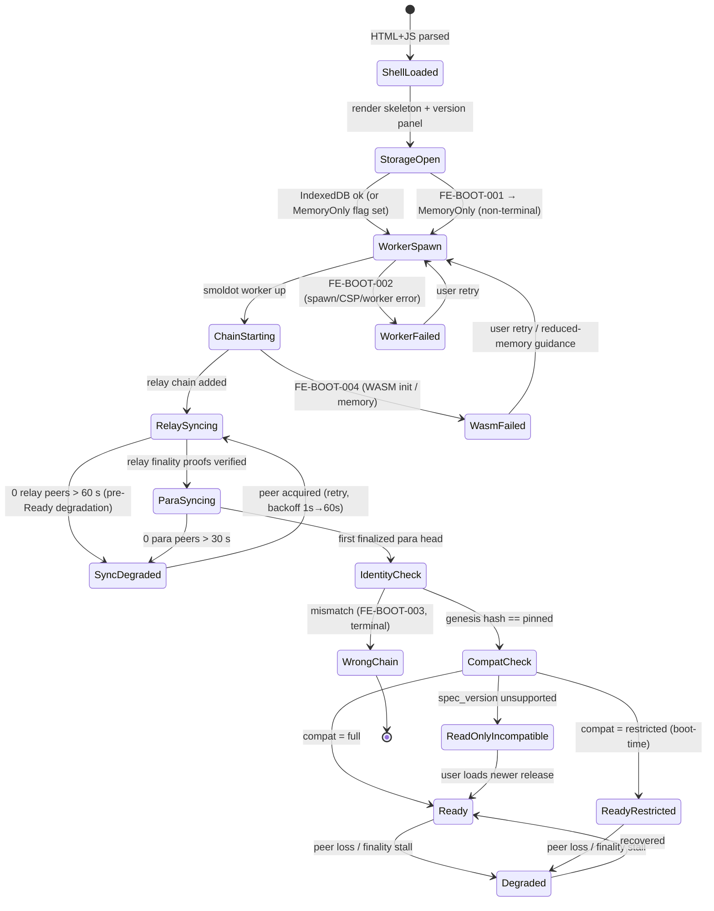

# 10 — Frontend Architecture

**Status: normative component specification. Supersedes the corresponding sections of BACKEND_PLAN.md/FRONTEND_PLAN.md** — specifically FRONTEND_PLAN.md §4–§5, §8, §10–§16, §21, §25, §31, and the frontend halves of §11.8/§18. Normative language: RFC 2119. `[VERIFY]` tags mark genuinely unresolved facts and are gated on the prototype experiments in §12.

**Boundary.** This document owns: the boot state machine, the smoldot light-client architecture, the runtime-compatibility machine, the data layer (current-state model, three-layer history model, local index, optional providers), the verification/provenance model, resource budgets, and the package/firewall structure. It references, and does not restate: the frozen chain↔frontend contract ([02-integration-contract.md](02-integration-contract.md)), upgrade/descriptor lead-time mechanics ([09-execution-upgrades-and-rollout.md](09-execution-upgrades-and-rollout.md)), screens/preconditions/workflows ([11-frontend-workflows.md](11-frontend-workflows.md)), release train, bootnode program and operator commitments ([12-release-and-operations.md](12-release-and-operations.md)), all shared constants ([13-parameters.md](13-parameters.md)), threat rows ([14-threat-model.md](14-threat-model.md)), and invariants/testing ([15-invariants-and-testing.md](15-invariants-and-testing.md)).

---

## 1. Architecture summary (carried forward)

The selected architecture is unchanged in shape from the reviewed design and is re-affirmed here deliberately (decision-record Part 3, content fidelity):

1. A **Vite-built React 19 + TypeScript SPA**, delivered as immutable static files on Arweave, named through ArNS, hash-verified through Wayfinder (release/distribution mechanics: [12-release-and-operations.md](12-release-and-operations.md)).
2. **PAPI 2.x** as the sole typed chain API, with committed generated descriptors per supported `spec_version` (§5).
3. **smoldot 3.x** in a Web Worker as the default and only required chain connection: relay light client + futarchy parachain client from bundled, hash-pinned chain specs. An optional WS-RPC fallback exists, quarantined and labelled (§4.5) — and its data is **never** promoted to verified status (§2.2).
4. **All transaction-critical reads from finalized, light-client-verified state**, re-checked immediately before signing (INV-FE-1/2; precondition tables in [11-frontend-workflows.md](11-frontend-workflows.md)).
5. **`Verified<T>` provenance typing** on every displayed value, enforced at the component level — one of the design's verified strengths, carried forward and tightened (§2).
6. **IndexedDB (Dexie 4)** as a non-authoritative cache and the substrate of a **gap-tolerant** local historical index (§7). Loss of it is a performance event only (INV-FE-7).
7. **No backend, no SSR, no required RPC endpoint, no required indexer.** Optional acceleration providers exist behind a structural firewall and **ship as an empty list, strictly opt-in** (§8).

What changed relative to FRONTEND_PLAN.md, and why, is the subject of the rest of this document: the history model is rebuilt on three truthful layers (D-6, §6), the RPC promotion rule is deleted (F-2, §2.2), the boot machine gains its missing states (§3), the growth/backfill arithmetic is recomputed honestly at maximum chain load (§9), providers are opt-in everywhere (§8.1), the firewall becomes structural inside `apps/web` (§10), and every chain constant is read from the chain (§5.4).

---

## 2. Trust, provenance and the never-promote rule

### 2.1 Provenance typing

Every store value is a `Verified<T>`: payload plus `VerificationStatus` and provenance block reference. UI data components accept only `Verified<T>`; a component cannot render a value without a status.

```ts
export type VerificationStatus =
  | { kind: 'verified-finalized'; blockHash: HexString; blockNumber: number }
  | { kind: 'verified-best'; blockHash: HexString; blockNumber: number }      // display-only
  | { kind: 'derived-local'; coverage: CoverageRef }                          // local index, layer 3
  | { kind: 'provider'; providerId: string; sampled: boolean }                // untrusted, labelled
  | { kind: 'stale-cache'; asOfBlock: number; ageMs: number };                // pre-sync IndexedDB

export interface Verified<T> { value: T; status: VerificationStatus; }

/** The only type the transaction path accepts. Constructible solely inside
 *  packages/chain from a smoldot-verified finalized read. */
export type Finalized<T> = Verified<T> & { status: { kind: 'verified-finalized' } };
```

`Finalized<T>` has **no public constructor outside `packages/chain`**. Provider-status and derived-local values are unrepresentable as `Finalized<T>` at the type level; the promotion bug class of F-2 is therefore not merely forbidden but untypeable.

### 2.2 The never-promote rule (F-2 — unconditional)

FRONTEND_PLAN.md §11.8 promoted WsProvider data to `verified-finalized` when smoldot "cross-checks the finalized hash at the same height." That rule is **deleted**. Hash equality authenticates the *header*, not RPC-served storage values: a hostile endpoint returns the genuine public finalized hash and lies about every value under it.

Normative rules:

- Data obtained through the RPC fallback, an operator endpoint (layer 2, §6.2), a snapshot, or an indexer carries `provider` status **forever**. There is no promotion path.
- `verified-finalized` status is assigned **only** to values read through smoldot with storage proofs checked, or computed client-side purely from such values.
- If a provider-served value must become verified, the key MUST be **re-read through smoldot** inside smoldot's pinned window — in which case the provider contributed nothing verified and is dropped from the provenance chain.
- The RPC fallback remains: OFF by default, per-endpoint user opt-in, separate quarantined PAPI client, persistent "UNVERIFIED RPC MODE" banner in RPC-only operation, signing disabled in normal mode (expert interstitial required). All unchanged — minus promotion.

### 2.3 Transaction-critical: the honest, narrowed definition

**Transaction-critical** (narrowed from FRONTEND_PLAN.md §2.3): any value that is (a) read by the precondition system, (b) embedded in or derived into a payload the user signs, or (c) rendered in the confirm surface as the stated basis of a signature. Such values MUST be `Finalized<T>`.

Values that shape a user's *discretionary judgment* — price charts, history tables, provider-filled series — are **not** transaction-critical under this definition. Provider-fed charts influencing trading decisions are declared an **accepted residual risk**, mitigated by mandatory, non-suppressible provenance labelling (hatched/badged rendering, distinct icons, text equivalents), never by a verification claim the system cannot honor. The corresponding threat row (chart-shaping via a poisoned provider) lives in [14-threat-model.md](14-threat-model.md), not here.

Consistently with this honesty: the §8.4 sampling regime is stated for what it is — it detects sloppy and inconsistent forgeries and liveness failures; **it does not detect a self-consistent forgery of history at unreachable depth**. The only cross-check for deep history is comparing two independent snapshot producers, which the UI supports and discloses.

---

## 3. Boot state machine

### 3.1 States (F-medium: boot machine — completed)

The reviewed machine lacked states for three of its own error codes, lacked a boot-time `restricted` outcome, and had no pre-`Ready` degradation. The complete machine:



New states, normatively:

- **`StorageOpen` / MemoryOnly** (`FE-BOOT-001`): IndexedDB open/upgrade failure is **non-terminal**. The app proceeds memory-only: no persistence, no local index, `stale-cache` tiles unavailable, a persistent "no local history this session" label. All protocol function (reads, signing) is unaffected — the tx path never touches IndexedDB (§10).
- **`WorkerFailed`** (`FE-BOOT-002`): worker spawn failure (CSP, browser policy, resource exhaustion). Renderable surface: docs, settings, verification panel, cached dashboard (if storage is up) with `stale-cache` badges. No verified reads exist; signing is unavailable in normal mode. Expert-mode RPC-only operation is offered with the full §2.2 quarantine (provider-labelled, signing behind interstitial).
- **`WasmFailed`** (`FE-BOOT-004`): smoldot WASM instantiation or memory failure (observed class: iOS memory pressure). Same surface as `WorkerFailed`, plus device guidance. Reduced-memory mode trims app features only — the parachain client cannot run without the relay client, so "single-chain mode" does not exist.
- **`ReadyRestricted`**: boot-time `restricted` mode. Compatibility probing (§5.2) is a lattice, not a boolean; when only part of `CRITICAL_SURFACE` passes at boot, the app boots directly into restricted mode with named disabled surfaces — it does not pretend to be `Ready` and fail lazily.
- **`SyncDegraded`**: pre-`Ready` degradation is now a state with the same peer-diagnostics panel as post-`Ready` `Degraded` (per-bootnode dial results, port-443 note, add-bootnode, expert RPC option). Previously the machine could only degrade after `Ready`, leaving the most common real-world failure (cannot reach peers on first load) stateless.

### 3.2 Relation to the compatibility machine (explicit mapping)

The boot machine and the runtime-compatibility machine (§5.3, the FRONTEND_PLAN §18 successor) are **one composite**: the boot machine's `CompatCheck` state invokes the compat machine's classifier, and the compat machine's mode is a session-scoped variable that the boot machine's terminal healthy states parameterize.

| Compat mode | Reached at boot as | Reached mid-session by | Signing |
|---|---|---|---|
| `full` | `Ready` | descriptor re-selection after covered upgrade | enabled |
| `restricted` | `ReadyRestricted` | partial probe failure on `CodeUpdated` | per-surface |
| `read-only-incompatible` | `ReadOnlyIncompatible` | uncovered upgrade enacted | disabled |

Orthogonal session flags, all combinable with any compat mode: `Degraded` (peer/finality health), `MemoryOnly` (storage), `RpcOnly` (expert fallback). The UI state is therefore the product `compatMode × {nominal, degraded} × storageMode`, and every combination has defined rendering (degradation matrix, [11-frontend-workflows.md](11-frontend-workflows.md)).

---

## 4. smoldot light-client architecture

### 4.1 Topology

Unchanged: one smoldot instance hosting the relay light client (GRANDPA warp sync from a per-release checkpoint) and the parachain client (`potentialRelayChains` linkage); parachain finality derives from relay-finalized para-inclusion; storage read via proofs. PAPI `createClient(getSmProvider(...))`, typed API from committed descriptors. Bundled hash-pinned chain specs; genesis identity check per §3.1 (`WrongChain` on mismatch, no override).

### 4.2 What smoldot can and cannot serve — stated plainly

**smoldot exposes the `chainHead` JSON-RPC group only. There are no `archive_*` methods.** Events are state (`System.Events`), readable only for blocks inside smoldot's pinned-block window (recent finalized blocks; peers additionally prune state at ~256 blocks by default). Consequences, normative:

- Historical reads at arbitrary depth through the light client **do not exist**. Every design element that assumed `eventsAt(hash)` at depth (the old §15.4 loop unbounded, §15.6 backfill past the window, E3's "history continuous") is replaced by the three-layer model of §6.
- Runtime calls execute as `chainHead`-scoped calls: smoldot runs the runtime locally against proof-backed storage for a pinned (finalized) block, so results carry the same verification as storage reads **[VERIFY: confirm PAPI 2.x routes typed runtime calls through `chainHead_call` pinned to a finalized hash; any call proxied to a peer unverified MUST be excluded from transaction-critical use and recomputed client-side — FE-P2, pivotal]**. Until FE-P2 resolves, every `FutarchyApi` result used on the tx path is cross-checked against direct storage reads (the conservative mode is the default, not the fallback).

### 4.3 Bootnodes and connectivity

The futarchy chain spec lists ≥ 8 browser-reachable WSS bootnodes across ≥ 4 operators, ≥ 2 on port 443 *(normative value: [13-parameters.md](13-parameters.md); operator program and phase-gating: [12-release-and-operations.md](12-release-and-operations.md), backed by the backend node-roles row per D-6)*. This is now a chain-side requirement, not a frontend hope — X-4 is resolved at the source. Expert settings allow user-supplied bootnodes (local-only, never remote-configured). Peer-discovery failure enters `SyncDegraded`/`Degraded` per §3.1. Browser-WSS peer behavior remains **[VERIFY — FE-P4]** with the D-6 layer-2 operator set as the guaranteed dial set (the decision record's designated fallback).

### 4.4 Multi-tab: dedicated worker + Web Locks leader election (F-medium: multi-tab)

The SharedWorker-first design is replaced. Default, normative design:

- **One dedicated `Worker` per tab**, but only the **leader tab** runs smoldot and the ingest loop. Leadership is a Web Locks election: `navigator.locks.request('fut-leader', …)` — the lock holder is leader; followers block on the same lock and take over on leader death (tab close/crash releases the lock). The ingest writer lock (`fut-ingest`) is held by the leader only.
- **Followers** render from finalized-state snapshots broadcast by the leader over `BroadcastChannel` (structured clone of `Verified<T>` store slices, provenance preserved). Follower reads are labelled with the leader's block pin; they are `verified-finalized` values verified *by the leader tab* — same origin, same release, same TCB, so this is not a provenance downgrade.
- **Follower transactions**: a follower that needs to sign either proxies preparation/submission through the leader channel or spawns a transient smoldot instance of its own for the duration of the flow. Which is viable is unresolved: **[VERIFY SharedWorker compatibility with `startFromWorker`, Web Locks behavior on Safari, BroadcastChannel snapshot latency — FE-P3; the prototype gates the final choice]**. Until FE-P3 resolves, the transient-second-instance path is assumed.
- **Android memory is budgeted for 2× smoldot explicitly** (§9.4): Chrome for Android has no SharedWorker, and both leader-handoff transients and follower tx flows can put two live smoldot instances on one device. The mobile memory budget carries a named line for this; it is no longer an unbudgeted surprise.
- SharedWorker (single smoldot serving all tabs via ports) remains a desktop optimization behind FE-P3, never a correctness dependency.

### 4.5 Optional WS-RPC fallback

Retained exactly as reviewed *except* the promotion rule (deleted per §2.2): OFF by default, per-endpoint opt-in, quarantined client, `provider` labels, persistent banner, normal-mode signing disabled in RPC-only operation.

---

## 5. Runtime compatibility, descriptors and contract binding

### 5.1 Descriptor pipeline

Descriptors are generated from built runtime artifacts (never a live node), committed per `spec_version`, tied to metadata hashes and source commits in `release.json`, drift-gated in CI. Every primary runtime and its exact paired terminal-recovery runtime are separate live-capable `spec_version`s and MUST both have published descriptors before the primary is eligible (contract v11 / A12; paired recovery was added by B16). Three additions:

1. **The Asset Hub descriptor set is part of the pipeline** (D-12): the funding flow ([11-frontend-workflows.md](11-frontend-workflows.md)) opens a second light-client connection to Asset Hub; its pinned chain spec and descriptor set ride the same commitment, drift-gating and release discipline as the futarchy set.
2. **v(N+1) descriptors are release-gated, not conventional** (D-14): they MUST be generated from the queue-time artifact commitment and live on the release channel **before execute maturity** — see §5.3.
3. **Paired recovery coverage is equally release-gated** (B16): the exact v(N+2) recovery metadata committed with v(N+1) is generated and published in the same window. Recovery may become current under `OnlyInherents`, so treating its descriptor as operator-only would intentionally strand the canonical frontend during an incident.

### 5.2 Compatibility gating

`CRITICAL_SURFACE` (every storage item, event, call, constant and runtime API the app uses; generated; CI-tested against each committed descriptor set) drives a three-mode classifier: `full` / `restricted` (named disabled surfaces) / `read-only-incompatible`. `TxPreparation` embeds the spec_version + metadata hash it was built against; the final pre-sign refresh re-reads the live runtime version and refuses on any change (`FE-TX-007`). Compatibility-API surface details remain **[VERIFY exact PAPI 2.x names/semantics — FE-P1]**.

### 5.3 The `ReadOnlyIncompatible` window is now bounded

Under the reviewed design an upgrade could enact one block after authorization while the FE release train needed ≥ 72 h — a global signing outage (X-7). Now:

- The backend enforces `now ≥ authorized_at + DescriptorLeadTime` between `UpgradeAuthorized` and permissionless application — `DescriptorLeadTime` = 43,200 blocks = 72 h *(normative value: [13-parameters.md](13-parameters.md); mechanism: [09-execution-upgrades-and-rollout.md](09-execution-upgrades-and-rollout.md))*.
- The frontend release train MUST publish v(N+1) descriptors before execute maturity — a release-gating check ([12-release-and-operations.md](12-release-and-operations.md)); the **expedited descriptor-only release** (2 attestations, no 72 h soak, 3-of-5 repoint; zero app-code delta) exists precisely so this gate is meetable inside the lead time.
- Consequently `ReadOnlyIncompatible` is an **exceptional state indicating process failure**, with a bounded exposure window (≤ DescriptorLeadTime from the moment the FE process misses its gate), not an expected consequence of every upgrade.
- Pinned/stranded releases read the **`ReleaseChannel` fixed-layout raw storage key** in `pallet-constitution` (SCALE layout frozen forever, readable without current metadata — D-14) to display the newer-release pointer. The `system.remark` announcement mechanism is deleted: stranded apps could not decode it, which was its only job.

### 5.4 Contract binding: no hardcoded chain values (F-4, X-11a/h)

The integration contract is frozen in [02-integration-contract.md](02-integration-contract.md) (D-2); the FE binds to it and to nothing else. Normative binding rules:

- **All kernel constants and bounds** the FE re-checks or renders — `MinSplit`, per-trade min/max, `MaxPositionsPerAccount` (64), `IntakeQueue` (64), `MaxLiveProposals` (32), §21-class tunables — are read from the **runtime constants API** (metadata) at boot per descriptor set, into a `ChainConstants` store of `Finalized<T>` values. **No numeric chain constant may appear as a literal in FE source**; CI enforces via a lint gate on the protocol packages plus a review-listed allowlist (UI-only numbers). The FE build fails if a constant named by `CRITICAL_SURFACE` is absent from metadata.
- **USDC balances** are read from `ForeignAssets.Account(USDC_LOCATION, who)` — the instance is `ForeignAssets`, keyed by the pinned XCM `Location` from `ChainIdentity` (D-17: `{parents: 1, X3(Parachain(1000), PalletInstance(50), GeneralIndex(1337))}` **[VERIFY asset index 1337]**), not `Assets.Account(assetId, who)`.
- **Trading enablement and the sudo-era banner** bind to the `pallet-constitution` `PhaseFlags` bitset (D-17/D-13) — chain-read, never remote config.
- **The fee-currency selector** binds to the constitution key `fee.vit_usdc_rate` (D-12): USDC-denominated fees via `pallet-asset-tx-payment` are quoted from this chain-read rate; the selector is disabled with an explanation if the key is unreadable, never silently defaulted.
- `ChainIdentity` additionally pins ss58 prefix (7777), paraId, genesis hashes, chain-spec hashes, decimals (VIT 12 / USDC 6) per D-17 — these are identity pins (used to *verify* the chain), not protocol tunables, and are the only chain-shaped values legitimately compiled into the bundle.

### 5.5 Reserve-health / NAV haircut surface (B-med: USDC freeze — FE half)

The data layer types carry the reserve-health trigger from [07-oracle-and-disputes.md](07-oracle-and-disputes.md)/[08-treasury-and-economics.md](08-treasury-and-economics.md):

```ts
export interface NavView {
  navNum: bigint;                      // components per 08 §NAV definition
  spendableNavNum: bigint;             // 0 while reserve health is degraded
  meterUtilizationBps: number;         // rolling-meter utilization
  classFloors: readonly [bigint, bigint, bigint, bigint]; // Param/Treasury/Code/Meta
  components: NavComponentView[];
  reserveHealth: {
    flagged: boolean;                  // 02 §4 haircut_flag ≡ 08 §1.2 reserve_impaired
    haircut1e9: bigint | null;         // active NAV haircut, if flagged
    pbReserveActive: boolean;          // PB-RESERVE split-inflow halt in force
  };
}
```

Every NAV rendering MUST apply and display the haircut when `flagged` — the FE MUST NOT report full backing while the R trigger is set. Split screens surface `pbReserveActive` as a precondition-level notice (workflow rows in [11-frontend-workflows.md](11-frontend-workflows.md)).

---

## 6. The three-layer history model (D-6; resolves F-1, X-3)

All history the UI can ever show comes from exactly three layers, each truthfully labelled. There is no fourth, implicit layer, and no layer impersonates another.

### 6.1 Layer 1 — chain-served, light-client-verified (zero infrastructure dependency)

Served from bounded on-chain state through smoldot, `verified-finalized`, available to every user forever with no operator, provider, or prior visit:

- `RecentCohortSummaries` ring — last **32** cohorts *(normative value: [13-parameters.md](13-parameters.md); shape and ownership: [02-integration-contract.md](02-integration-contract.md))* ≈ 22 months of settlement outcomes;
- the 8-checkpoint TWAP series per live market;
- `ExecutionRecords` ring (≤ 256), Welfare `Snapshots` (≈ 20), `MetricSpecs` (≤ 16), `BaselineMarketOf`.

**The archive-independence claim (old U-3/"archive nodes are not a frontend dependency") is scoped to this layer and this layer only.** Layer 1 is complete for every transaction-critical workflow and for the core settlement/history dashboard. Everything deeper depends on layer 2 or 3 and says so.

### 6.2 Layer 2 — committed operator window (30 days, `provider`-labelled)

Protocol-funded bootnode/RPC operators commit to serving **30 days** *(normative value: [13-parameters.md](13-parameters.md))* of state and block bodies — an honest, funded ops line ([12-release-and-operations.md](12-release-and-operations.md)), wired into the rollout phase gates. Frontend semantics:

- Backfill (§6.4) operates **within this window only**. Data read from operator endpoints carries `provider` status (per §2.2) — the operators are protocol-aligned but not a verification root.
- The only path to `verified-finalized` for historical data is a **smoldot re-read inside smoldot's pinned window**. The pinned window is far smaller than 30 days; therefore the overwhelming majority of backfilled history is honestly `provider`-labelled, and the UI shows it that way.
- Operator-window data is still subject to the snapshot-grade integrity checks of §8.4 (internal consistency, conservation replay) — cheap detection, honestly bounded.

### 6.3 Layer 3 — gap-tolerant local index (holes are first-class)

The local index no longer models history as a single contiguous cursor. It models **coverage**:

```ts
export interface CoverageRange {
  fromBlock: number; toBlock: number;          // inclusive, contiguous
  origin: 'self' | 'operator' | 'snapshot' | 'indexer';
  providerId?: string;                          // origin ≠ self
  ingestedAt: number;
}
export interface CoverageRef { ranges: CoverageRange[]; holes: Array<[number, number]>; }
```

Normative rules:

- **Holes are first-class states.** Every history query returns data *plus* the coverage it came from; charts render holes as visible gaps with an explainer, tables state "complete within [ranges]". A hole is never interpolated over, never elided.
- **Never silently spliced**: adjacent ranges with different origins are never merged; an `origin ≠ self` range keeps its origin forever (there is no promotion, §2.2). A range boundary is a rendered fact.
- **The corrected E3 promise** *(degradation matrix owned by [11-frontend-workflows.md](11-frontend-workflows.md))*: on returning after a gap, forward ingestion resumes from the live pinned window; the gap between the old coverage edge and the new one becomes a **visible hole, provider-fillable** from layer 2 (labelled) — *not* "local-index catch-up; history continuous". A 2-hour gap (1,200 blocks) exceeds the pinned window and cannot be closed with verified data; the old promise was impossible and is withdrawn.
- Cursor integrity checks (hash-at-edge, genesis binding, spec-version-at-edge) apply per range; corruption of one range invalidates that range, not the index.

### 6.4 Backfill — honest arithmetic (F-medium: backfill math)

The reviewed text was inconsistent three ways (50 blk/s claimed; "~9 days of chain per hour" — actually 12.5 at that rate; §21 budgeted 20 blk/s). Standardized: the budgeted ingest rate is **20 finalized blocks/s** on desktop **[VERIFY achieved rate — FE-P4]**. At 6 s blocks (14,400 blocks/day):

| Quantity | Value at 20 blk/s |
|---|---|
| Chain time backfilled per hour of tab time | 72,000 blocks = **5.0 days** |
| Full 30-day operator window (432,000 blocks) | **6.0 hours** of tab time |
| Backfill beyond the operator window | **does not exist** (no serving infrastructure; smoldot has no archive access — §4.2) |

Backfill remains opt-in, OFF by default on mobile, idle/battery/quota-gated, newest→oldest in 1,000-block chunks, and its UI copy states the layer-2 provenance of what it fetches. Deep history beyond 30 days is the province of snapshots (§8) — by design, not by omission.

### 6.5 Ingestion loop and txHistory (F-medium: txHistory)

The ingest loop consumes finalized **events** (headers + `System.Events` per block). Events do not contain extrinsic bodies, and `TxHistoryRow` (call summary, extrinsic index) needs bodies. Corrected design:

- The loop watches event phases: for each finalized block, if any event in `ApplyExtrinsic(i)` phase attributes to one of the user's watched accounts (signer-bearing events per the [02-integration-contract.md](02-integration-contract.md) event schema, incl. `Traded`, ledger events, `system.ExtrinsicSuccess/Failed` correlation), the loop **fetches the block body for that block only** and decodes extrinsic `i`.
- Bodies fetched inside smoldot's pinned window are `verified-finalized`. Bodies fetched during layer-2 backfill are `provider` (the body's extrinsics-root check against a header is only as good as the header's provenance, which at depth is layer-2).
- Blocks containing none of the user's extrinsics never trigger a body fetch. Worst-case overhead is proportional to the user's own activity, not chain activity.
- Ingest writes remain idempotent (deterministic PKs, cursor-range advance in the same IndexedDB transaction), single-writer via the leader's `fut-ingest` lock (§4.4).

Ingested event subset, per-era metadata decode discipline (decode with the producing runtime's metadata; undecodable rows stored raw, "N events pending decoder", never guessed) — carried forward. Historical metadata retrievability at depth remains **[VERIFY — FE-P5]**; where unavailable, releases ship metadata blobs for supported historical spec_versions, bounded per §9.3.

### 6.6 Current-state reads and the proof-size correction (F-medium: proof-size conflation)

Current-state model unchanged: single finalized-block pin per render cycle, batched reads of the ≤ ~40 visible keys, `FutarchyApi` runtime calls cross-checked client-side (LMSR/TWAP TS port differential-tested against the reference vectors — V1 = 512.494795136 per the corrected corpus *(normative value: [13-parameters.md](13-parameters.md))*).

Corrected sizing: the old "≤ 32 entries × ≤ 512 B = ≤ 16 KiB of proofs" **conflated encoded value size with storage-proof size**. 16 KiB is the encoded-value bound; a storage proof additionally carries the trie nodes on each key's path (hundreds of bytes to a few KiB per key, partially shared across keys in a batched read). Honest statement: a full `Proposals`-map read costs on the order of **tens to low hundreds of KiB of proof traffic** — still trivially cheap, which is why the conclusion (no index needed for discovery) survives the corrected arithmetic. A per-refresh proof-traffic budget is added in §9.4 and measured at **[VERIFY — FE-P4]**.

---

## 7. Local index schema

Dexie DB `futarchy@<paraGenesisHash-prefix8>`, one DB per chain identity. Tables as reviewed (`meta`, `events`, `priceSamples`, `candles1h`, `proposalsArchive`, `txHistory`, `metadataCache`, `snapshotsImported`) with these changes:

| Change | Reason |
|---|---|
| `meta.cursor` → `meta.coverage: CoverageRange[]` (+ derived holes) | gap tolerance (§6.3) |
| every row's `origin` gains `'operator'` | layer-2 backfill is distinguishable from opt-in third-party providers |
| `candles4h`, `candles1d` tables added | auto-tuned downsampling ladder (§9.2) |
| `metadataCache` gains `lastUsedAt`, byte size; bounded (§9.3) | metadata blobs were unbounded |
| corruption invalidates per-range, not whole-index (where detectable); whole-DB rebuild (`FE-IDX-001`) remains the fallback | §6.3 |

No code path consults any of these tables for a transaction precondition — enforced structurally (§10).

---

## 8. Optional providers (snapshots and indexers)

### 8.1 Strictly opt-in, empty by default (F-medium: Alt-C corrected)

The Alt-C selection stands, with its text corrected to match what the mechanism sections always said: **the app ships an EMPTY provider list. Providers are strictly opt-in in every mode.** There is no "on by default in normal mode," and no "sovereign mode" toggle that implies a less-sovereign default. A curated suggestions file ships *inside the release* (auditable, not remote config); accepting a suggestion is an explicit user action with a disclosure of exactly what the operator learns (the addresses/objects you query). With zero providers enabled the app is exactly the layer-1+2+3 system, and every INV-FE-4 workflow works — this is the tested default configuration, not an edge case.

### 8.2 Provider kinds

Unchanged: **snapshots** (deterministic, canonically-serialized, content-addressed exports reproducible byte-identically by anyone from `tools/snapshot` against an archive node) and **live indexers** (minimal read-only HTTP interface; reference implementation in `optional/indexer/`). Both write only into layer-3 tables with `origin ∈ {snapshot, indexer}`; both are barred from the tx path structurally (§10).

### 8.3 Health and degradation

Per-provider health probe on enable + every 10 min; `Healthy → Slow → Failing → Disabled(auto, reason)`; auto-disable on sampling mismatch. All-providers-down ⇒ the default (provider-less) behavior with the standard incomplete-history explainer.

### 8.4 Verification and sampling — honest limits (F-medium: transaction-critical/sampling)

- **Snapshots:** content-hash pin before import; deterministic spot re-derivation for the covered blocks that fall inside light-client-reachable depth; internal-consistency checks (monotone coverage, event↔derived-row agreement, conservation-identity replay per [03-conditional-ledger.md](03-conditional-ledger.md) identities).
- **Live indexers:** 1-in-16-page row re-verification against live chain state where the referenced object still exists, or against the self-ingested overlap window.
- **Honest guarantee statement (normative UI copy):** sampling and re-derivation catch malformed, internally inconsistent, and shallow forgeries, and catch liveness failures. **They do not detect a self-consistent forgery of history at depths the light client cannot reach.** The only available cross-check is diffing two independent snapshot producers (`FE-PROV-004` on mismatch), which the import UI supports and recommends. This limit is disclosed in the provider UI, and the corresponding residual-risk rows live in [14-threat-model.md](14-threat-model.md).
- **Absolute rule (INV-FE-3):** provider data never satisfies a precondition, never renders a "passed/settled/mature/final/safe" state without a chain read; any actionable provider-supplied object triggers a direct chain fetch before the action is enabled.

Import quotas (≤ 400 MB uncompressed, ≤ 4 M rows, streamed, eviction preview before import) — unchanged.

---

## 9. Resource budgets — recomputed honestly

### 9.1 Load model (F-medium: growth arithmetic)

The reviewed growth table assumed ~20 live books. The chain permits **196 active books** (`MaxLiveMarkets` = 32·6 + 4, *normative value: [13-parameters.md](13-parameters.md)*) and separately retains at most **2,240 readable book rows** (`MaxStoredMarkets`). Terminal observation removes each book's TWAP-checkpoint and decision-window auxiliaries before releasing its active slot, so retained archive rows emit no new observations and do not multiply the ingest/history budget below. Budgets are derived from both a **typical** early-life load and the **maximum sustained active** load, and browser retention is a function of budget, not a promise.

Row-rate model (assumptions labelled): observations 1 per 10 blocks per book during the trading window (d5–d18 = 13 of 21 days ⇒ duty ≈ 0.62); ~120 B effective per row (Dexie overhead included). Sustained average sample rows/day ≈ `books × 890`:

| Load | Live books | priceSamples rows/day | bytes/day |
|---|---|---|---|
| Typical (early phases) | 20 | ~17.8 k | ~2.1 MB |
| Half load | 98 | ~87 k | ~10.5 MB |
| **Max sustained** | **196** | **~175 k** | **~21 MB** |

### 9.2 Retention auto-tunes to budget (degrades depth, never correctness)

Hard caps: **300 MB desktop / 75 MB mobile** *(normative values: [13-parameters.md](13-parameters.md))*. Fixed internal shares (user-adjustable locally): raw samples 60%, candles 20%, events+archive 15%, metadata 5%. The quota manager computes retention from the *measured* ingest rate — there is no fixed "90 days" promise. Honest verified-depth table at the caps:

| Raw-sample depth (share: 180 MB desktop / 45 MB mobile) | Typical (20 books) | Max load (196 books) |
|---|---|---|
| Desktop | ~84 days | **~8.5 days** |
| Mobile | ~21 days | **~2.1 days** |

| candles1h depth (share: 60 MB / 15 MB) | Typical | Max load |
|---|---|---|
| Desktop | ~2.9 years | ~106 days |
| Mobile | ~8 months | ~26 days |

Degradation ladder, applied oldest-first and in this order, deterministic and user-visible: raw samples → `candles1h` → `candles4h` → `candles1d` (a `candles1d` row costs `books × 120 B/day` ≈ 23.5 KB/day even at max load — effectively unbounded depth); `events` for settled+reaped proposals → compacted into `proposalsArchive` summaries; imported provider rows evicted before self-ingested rows at equal age. The ladder **degrades chart resolution and event granularity only**. It never touches: the tx path (structurally isolated, §10), layer-1 data (chain-served, not stored here), coverage metadata (holes stay truthful even after eviction — an evicted range becomes a labelled "downsampled" range, not a hole, and never a silent splice).

At maximum chain load, deep raw-resolution history in the browser is **not achievable within the caps** — stated plainly. The honest offer at max load is: layer-1 verified summaries forever, ~days of raw verified samples, ~months of hourly candles, unbounded daily candles, and provider snapshots for everything deeper, labelled as such.

### 9.3 Metadata blobs bounded (F-medium: metadata blobs)

`metadataCache` (historical SCALE metadata for per-era decode, ~1–2 MB gz each): bounded at **≤ 8 blobs / ≤ 16 MB desktop, ≤ 3 blobs / ≤ 6 MB mobile**, LRU-evicted; the current and next-authorized runtime's metadata are pinned non-evictable. Eviction of a blob needed by old undecoded rows is acceptable: those rows already carry the raw-bytes "pending decoder" state (§6.5) and re-fetch/re-ship paths exist (FE-P5). Release-shipped blobs (the FE-P5 fallback) count against the same bound.

### 9.4 Budget table

Measured in CI (Lighthouse + Playwright timers) on reference hardware (desktop = mid-2023 laptop 4× throttle; mobile = Moto G-class Android).

| Budget | Target (p50 / p95) | Enforcement |
|---|---|---|
| Initial JS (critical path, gz) | ≤ 350 KB / hard-fail 450 KB | bundle-size CI gate |
| smoldot WASM (worker, lazy) | ≤ 3.5 MB gz **[VERIFY artifact size — FE-P4]** | size gate + lazy load |
| Chain specs (relay + para + Asset Hub, gz, lazy) | ≤ 3.5 MB combined (checkpoint-trimmed) | size gate |
| First meaningful render (shell) | ≤ 1.5 s / 3 s desktop; ≤ 3 s / 6 s mobile | Lighthouse CI |
| First **verified** current-state render | ≤ 30 s / 90 s desktop; ≤ 90 s / 240 s mobile — **hypothesis, FE-P4 gates release** | Playwright sync timer vs live testnet |
| Finalized-head refresh work | ≤ 50 ms main-thread per head | perf marks |
| Per-refresh storage-proof traffic | ≤ 512 KiB per pinned-block screen refresh **[VERIFY measured proof sizes — FE-P4]** | perf test |
| IndexedDB growth | §9.2 caps (300 MB / 75 MB) with auto-tuned retention | quota manager + tests |
| Memory, desktop (tab + worker) | ≤ 600 MB steady-state | Playwright memory probe |
| Memory, mobile | ≤ 350 MB steady-state, **including a named 2× smoldot line: 2 × ≤ 120 MB instances [VERIFY per-instance footprint — FE-P3/P4]** for leader-handoff and follower-tx transients (§4.4) | memory probe incl. dual-instance scenario |
| Mobile CPU | ≤ 15% avg of one core steady-state after sync | profiling budget, FE-P4 |
| Ingest throughput | ≥ 20 finalized blocks/s catch-up on desktop **[VERIFY — FE-P4]**; all backfill arithmetic in §6.4 derives from this single number | perf test |

Error taxonomy: as reviewed (`FE-BOOT-001..004`, `FE-CHAIN-001..005`, `FE-COMPAT-001..002`, `FE-TX-001..007`, `FE-IDX-001..002`, `FE-REL-001..004`, `FE-PROV-001..004`), now with every `FE-BOOT` code owning a state in §3.1. Fixed user copy + expert detail + documented recovery per code; no free-text errors.

---

## 10. Package structure and the two-level provider firewall

### 10.1 Monorepo and dependency direction

As reviewed: `apps/web`; `packages/{chain, descriptors, protocol, local-index, providers, verify, wallet, ui}`; `tools/{release, verify-release, snapshot}`. CI-fatal forbidden edges (dependency-cruiser): `wallet → {providers, local-index}`; `chain → anything above it`; `providers` never imported by `wallet`.

### 10.2 Structural firewall inside `apps/web` (F-medium: provider firewall)

The reviewed design enforced the firewall structurally *between packages* but only by lint *inside* `apps/web`, where provider-fed store data could seed transaction form state. Corrected, normative:

- `apps/web` is split into **separate build-time compilation units**: `apps/web/src/tx/**` (transaction surfaces, form state, confirm flows) is its own TypeScript project (project references) whose reference set is exactly `{chain, protocol, wallet, ui}`. `apps/web/src/history/**` (provider-fed and local-index-fed stores and screens) references `{local-index, providers, protocol, ui}`. An import from `tx/**` into `history/**` or into `providers`/`local-index` **fails compilation** — module resolution cannot see it. dependency-cruiser remains as the second, redundant gate.
- **Type-level enforcement on top of the import boundary**: transaction form state and every `PreconditionCheck` input are typed `Finalized<T>` (§2.1). Since `Finalized<T>` is constructible only inside `packages/chain`, a provider- or index-fed value cannot inhabit tx state even if a future refactor breached the import boundary.
- Cross-unit UI composition happens only through `ui`-package components that accept already-rendered, provenance-badged children — data does not flow from history stores into tx stores through props, context, or global state; the stores live in different compilation units with no shared mutable module.

This makes INV-FE-3 structural at both levels: package graph and in-app module graph, with the type system as a third, independent layer.

---

## 11. Data-layer surface summary

For orientation (screens and full source matrix: [11-frontend-workflows.md](11-frontend-workflows.md)):

| Data class | Source | Status kinds | Bound |
|---|---|---|---|
| Live protocol state (epoch, proposals, markets, quotes, positions, balances, params, welfare, NAV+reserve-health, oracle rounds, guardian state, `PhaseFlags`) | smoldot finalized storage + `FutarchyApi` (cross-checked pending FE-P2) | `verified-finalized` (+ `verified-best` display-only) | chain bounds ([02](02-integration-contract.md)) |
| Layer-1 history (32-cohort ring, TWAP checkpoints, rings) | same | `verified-finalized` | chain ring bounds |
| Layer-2 window (≤ 30 days state/bodies) | operator endpoints; smoldot re-read inside pinned window only | `provider` (origin `operator`), except pinned-window re-reads | 30-day commitment ([12](12-release-and-operations.md)) |
| Layer-3 local index | self-ingested finalized events + opt-in imports | `derived-local` (with coverage) / `provider` | §9.2 auto-tuned |
| Opt-in providers | snapshots/indexers, empty default list | `provider`, sampled | §8.4 quotas |

---

## 12. Prototype experiments and open questions (carried forward, updated)

The [VERIFY]/prototype epistemics of the reviewed design are retained deliberately — honesty over polish. Conservative assumptions in force until resolved: runtime-API results are cross-checked (FE-P2); dedicated workers + leader election with transient second instances (FE-P3); hash routing regardless of FE-P7's finding; backfill arithmetic at 20 blk/s until FE-P4 measures reality.

| ID | Question ([VERIFY] owner) | Experiment | Gate |
|---|---|---|---|
| FE-P1 | Exact PAPI 2.x surface: at-block query options, best-block observable, compatibility API, fee estimation, pjs-signer exports, CheckMetadataHash handling | 2-day spike against Paseo; pin exact APIs into `chain` | blocks FE-1 |
| FE-P2 | **(pivotal, unchanged)** chainHead runtime-call verification semantics through smoldot; sync-progress introspection | smoldot docs/source + wire-level test with a lying mock peer | blocks trusting `FutarchyApi` on the tx path (else client-recompute-only mode stands permanently) |
| FE-P3 | Web Locks leader election + BroadcastChannel snapshot latency on Safari; SharedWorker with `startFromWorker`; follower-tx path (proxy vs transient instance); dual-instance memory on Android | matrix spike on device lab | gates §4.4 final design; §9.4 dual-instance budget line |
| FE-P4 | Real sync latency, smoldot artifact size + per-instance memory, ingest throughput (the 20 blk/s anchor), measured proof sizes, mobile CPU | instrumented testnet runs on device lab | release-gate values for §9.4 |
| FE-P5 | Historical metadata retrievability via light client at depth | probe; else ship bounded metadata blobs per supported spec_version (§9.3) | affects backfill decode |
| FE-P6 | Ledger Generic App + metadata-hash flow for a custom chain | hardware test | wallet support tier ([11](11-frontend-workflows.md)) |
| FE-P7 | ANT n-of-m controller capability; two-pass manifest flow; undername immutability practice; resolver endpoints; manifest fallback behavior | ar.io testnet dry run of the full release pipeline | blocks distribution epic ([12](12-release-and-operations.md); D-16: single-key custody prohibited — launch blocks if neither n-of-m nor FROST materializes) |
| FE-P8 | Long-range checkpoint policy: max safe release age before warning | analysis vs unbonding period | verification-panel copy |
| FE-P9 | Bulletin mirror dry run (deferred D-Bulletin triggers T1–T4) | TestNet pipeline run | secondary mirror only; never canonical |
| FE-P10 | Multi-MB Wasm extrinsic submission through smoldot/PAPI in-browser: transaction-pool/gossip size limits, peer banning on oversized transactions, mobile memory headroom ([11](11-frontend-workflows.md) §11.8.4) | instrumented testnet submission of a real runtime artifact (extends FE-P4) | gates the FE-15 upgrade-crank submission tier; the in-browser fetch + hash-verify path ships regardless, with the operator-CLI handoff as fallback |

---

## Resolves

| Finding | Resolution in this document |
|---|---|
| F-1 | §4.2 states plainly that smoldot exposes `chainHead` only (no `archive_*`; events are state, pinned-window only); §6 replaces depth-assuming ingest/backfill with the three-layer model; §6.3 makes the local index gap-tolerant with holes as first-class, never-spliced states; §6.4 confines backfill to the 30-day operator window. |
| F-2 | §2.2 deletes the RPC promotion rule unconditionally: hash equality authenticates headers, not values; `provider` data is never promoted; verified status requires a smoldot re-read; §2.1's `Finalized<T>` makes promotion untypeable. |
| F-4 | Moot per D-2: §5.4 binds the FE exclusively to the frozen contract ([02](02-integration-contract.md)) via constants API/metadata with zero hardcodes; the contingency if any deeper layer is unavailable is the D-6 layer-1 fallback (§6.1), which is complete for all transaction-critical function. |
| X-3 (FE) | §6 gives history three truthful owners: chain-served layer 1 (zero infra), the funded 30-day operator window (layer 2, `provider`-labelled), and the gap-tolerant local index (layer 3); the corrected E3 semantics ("gaps are visible and provider-fillable, never silently spliced") in §6.3; U-3's archive-independence claim scoped to layer 1 in §6.1. |
| F-med: transaction-critical | §2.3 narrows the definition honestly to precondition/payload/confirm values; provider-fed charts are a declared accepted residual with mandatory provenance labelling; §8.4 states the sampling limits (no detection of self-consistent deep forgeries); the threat row moves to [14-threat-model.md](14-threat-model.md). |
| F-med: boot machine | §3.1 adds the missing states (`WorkerFailed`/FE-BOOT-002, `WasmFailed`/FE-BOOT-004, `StorageOpen`→MemoryOnly/FE-BOOT-001), boot-time `ReadyRestricted`, and pre-Ready `SyncDegraded`; §3.2 defines the composite mapping to the compat machine. |
| F-med: growth arithmetic | §9.1–§9.2 recompute at 196-book max load (~21 MB/day raw), publish the honest verified-depth table against the 300 MB / 75 MB caps, and make retention auto-tune to budget — degrading depth/resolution, never correctness. |
| F-med: provider firewall | §10.2 makes the firewall structural inside `apps/web`: separate TypeScript compilation units for `tx/**` vs `history/**` (imports fail at build), dependency-cruiser as redundant gate, and `Finalized<T>`-typed tx state as a third layer. |
| F-med: backfill math | §6.4 standardizes on the single budgeted rate (20 blk/s): 5 days of chain per hour of tab time, 6 hours for the full 30-day window; the 50 blk/s / "~9 days" inconsistency is corrected and the rate is anchored to the §9.4 budget line FE-P4 measures. |
| F-med: txHistory | §6.5: the ingest loop detects the user's extrinsics via event phases and fetches extrinsic bodies **only** for blocks containing them, with honest provenance for bodies fetched beyond the pinned window. |
| F-med: proof-size conflation | §6.6 separates encoded value size (≤ 16 KiB for the Proposals map) from storage-proof size (trie-path overhead; tens–hundreds of KiB), adds a per-refresh proof-traffic budget (§9.4), and notes the design conclusion survives the corrected arithmetic. |
| F-med: metadata blobs | §9.3 bounds `metadataCache` (8 blobs/16 MB desktop, 3/6 MB mobile) with LRU eviction, pinned current+next blobs, and the raw-bytes "pending decoder" fallback for evicted eras. |
| F-med: multi-tab | §4.4 replaces SharedWorker-first with dedicated worker + Web Locks leader election; Android 2× smoldot memory is an explicit named budget line (§9.4); the FE-P3 unknowns are retained as [VERIFY] with the prototype gate. |
| F-med: Alt-C providers | §8.1 corrects the Alt-C text to match the mechanism: the app ships an EMPTY provider list, strictly opt-in in every mode, suggestions in-bundle only, provider-less operation as the tested default. |
| B-med: USDC freeze (FE surface) | §5.5 adds the reserve-health/NAV-haircut flag to the data-layer types (`NavView.reserveHealth`) with a MUST-render rule: never report full backing while the R trigger is set. |
| X-11a/h (FE binding) | §5.4: USDC balances via `ForeignAssets` keyed by the pinned XCM Location; all kernel constants from the constants API (no FE hardcodes, CI-gated); `PhaseFlags` binding for trading enablement and the sudo banner; fee selector bound to `fee.vit_usdc_rate`. |
| X-7 (FE half) | §5.3 bounds the `ReadOnlyIncompatible` window by `DescriptorLeadTime` + the release gate + the expedited descriptor-only release, and replaces the `system.remark` pointer with the fixed-layout `ReleaseChannel` raw key; D-12's Asset Hub descriptor set joins the pipeline (§5.1). |
