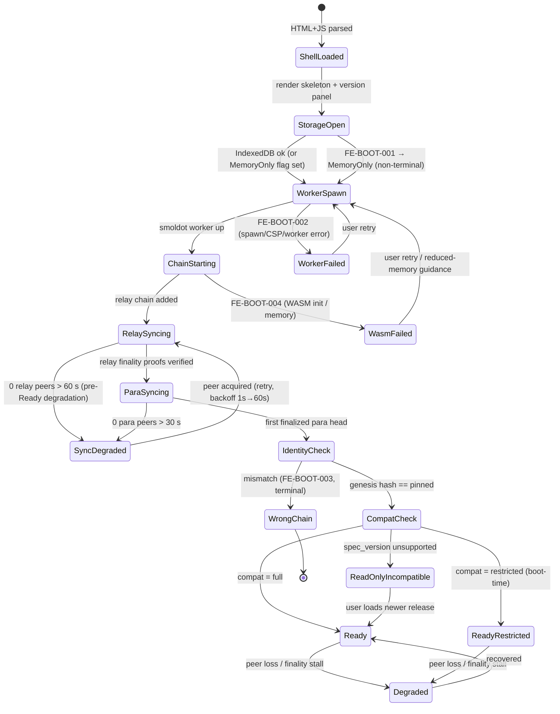

# 10 — Frontend Architecture

**Status: normative component specification. Supersedes the corresponding sections of BACKEND_PLAN.md/FRONTEND_PLAN.md** — specifically FRONTEND_PLAN.md §4–§5, §8, §10–§16, §21, §25, §31, and the frontend halves of §11.8/§18. Normative language: RFC 2119. `[VERIFY]` tags mark genuinely unresolved facts and are gated on the prototype experiments in §12.

**Boundary.** This document owns: the boot state machine, the smoldot light-client architecture, the runtime-compatibility machine, the data layer (current-state model, three-layer history model, local index, optional providers), the verification/provenance model, resource budgets, and the package/firewall structure. It references, and does not restate: the frozen chain↔frontend contract ([02-integration-contract.md](02-integration-contract.md)), upgrade/descriptor lead-time mechanics ([09-execution-upgrades-and-rollout.md](09-execution-upgrades-and-rollout.md)), screens/preconditions/workflows ([11-frontend-workflows.md](11-frontend-workflows.md)), release train, bootnode program and operator commitments ([12-release-and-operations.md](12-release-and-operations.md)), all shared constants ([13-parameters.md](13-parameters.md)), threat rows ([14-threat-model.md](14-threat-model.md)), and invariants/testing ([15-invariants-and-testing.md](15-invariants-and-testing.md)).

---

## 1. Architecture summary (carried forward)

The selected architecture is unchanged in shape from the reviewed design and is re-affirmed here deliberately (decision-record Part 3, content fidelity):

1. A **Vite-built React 19 + TypeScript SPA**, delivered as immutable static files on Arweave, named through ArNS, hash-verified through Wayfinder (release/distribution mechanics: [12-release-and-operations.md](12-release-and-operations.md)).
2. **PAPI 2.x** as the sole typed chain API, with committed generated descriptors per supported `spec_version` (§5).
3. **smoldot 3.x** in a Web Worker as the default and only required chain connection: relay light client + futarchy parachain client from bundled, hash-pinned chain specs. An optional WS-RPC fallback exists, quarantined and labelled (§4.5) — and its data is **never** promoted to verified status (§2.2).
4. **All transaction-critical reads from finalized, light-client-verified state**, re-checked immediately before signing (INV-FE-1/2; precondition tables in [11-frontend-workflows.md](11-frontend-workflows.md)).
5. **`Verified<T>` provenance typing** on every displayed value, enforced at the component level — one of the design's verified strengths, carried forward and tightened (§2).
6. **IndexedDB (Dexie 4)** as a non-authoritative cache and the substrate of a **gap-tolerant** local historical index (§7). Loss of it is a performance event only (INV-FE-7).
7. **No backend, no SSR, no required RPC endpoint, no required indexer.** Optional acceleration providers exist behind a structural firewall and **ship as an empty list, strictly opt-in** (§8).

What changed relative to FRONTEND_PLAN.md, and why, is the subject of the rest of this document: the history model is rebuilt on three truthful layers (D-6, §6), the RPC promotion rule is deleted (F-2, §2.2), the boot machine gains its missing states (§3), the growth/backfill arithmetic is recomputed honestly at maximum chain load (§9), providers are opt-in everywhere (§8.1), the firewall becomes structural inside `app/src` (§10), and every chain constant is read from the chain (§5.4).

---

## 2. Trust, provenance and the never-promote rule

### 2.1 Provenance typing

Every store value is a `Verified<T>`: payload plus `VerificationStatus` and provenance block reference. UI data components accept only `Verified<T>`; a component cannot render a value without a status.

```ts
export type ChainId = HexString;                                             // genesis hash, §3.1

export type VerificationStatus =
  | { kind: 'verified-finalized'; chain: ChainId; blockHash: HexString; blockNumber: number }
  | { kind: 'verified-best'; chain: ChainId; blockHash: HexString; blockNumber: number } // display-only
  | { kind: 'derived-local'; coverage: CoverageRef }                          // local index, layer 3
  | { kind: 'provider'; providerId: string; sampled: boolean }                // untrusted, labelled
  | { kind: 'stale-cache'; asOfBlock: number; ageMs: number }                 // pre-sync IndexedDB
  | { kind: 'external-proposal' };                                           // imported request, §13

export interface Verified<T> { value: T; status: VerificationStatus; }

/** Declared inside packages/chain-client and NOT exported. Nothing outside that
 *  module can name this symbol, so nothing outside it can produce the field. */
declare const FINALIZED: unique symbol;

/** The only type the transaction path accepts. Constructible solely inside
 *  packages/chain-client from a smoldot-verified finalized read. The brand is
 *  part of the type, not a comment about it: without the phantom field a value
 *  is merely structurally shaped like a finalized read, and any package could
 *  mint one by writing an object literal. */
export type Finalized<T> = Verified<T>
  & { status: { kind: 'verified-finalized' } }
  & { readonly [FINALIZED]: true };
```

**The two verified statuses name their chain, and that is normative rather than an implementation convenience.** §11.9.1 connects a **second** light client (the Asset Hub of the relay this release targets, 02 §7.7), and a status that named only a block does not identify an observation once there is more than one chain to observe: `blockNumber` collides trivially — every chain has a block 1,000 — so *"these two reads are comparable"* was being inferred from the block rather than stated. The chain is its **genesis hash**, which is the one identifier the light client has already proved for itself (§3.1's identity check) rather than one taken on the word of whatever served the read. It is what lets a derivation over two reads refuse a cross-chain combination *for the stated reason* instead of by a collision argument that holds only accidentally — a deposit figure read on Asset Hub and one read here would otherwise sit side by side as indistinguishable "verified" values.

`Finalized<T>` has **no public constructor outside `packages/chain-client`**. Provider-status and derived-local values are unrepresentable as `Finalized<T>` at the type level; the promotion bug class of F-2 is therefore not merely forbidden but untypeable.

Three implementation constraints follow, and all three are normative because the invariant is silent when they are violated:

- **The brand is part of the type, not a remark about it.** A structural intersection over `status.kind` alone is satisfied by any object literal, so a package that never touches the light client could mint a value the transaction path accepts. The non-exported `unique symbol` field is what makes the type nominal; it is unnameable outside `chain-client`, so no literal, spread, or `satisfies` can produce it, and only a deliberate double assertion can — which is grep-able and lint-banned.
- **`Verified<T>` and `VerificationStatus` live in the dependency-free `shared-types` package; `Finalized<T>`'s brand MUST NOT.** If the brand lives in the package every other package depends on, every package can construct it, and this section's guarantee is void — silently, with green CI. `chain-client` imports `Verified<T>` and defines `Finalized<T>` locally.
- **The brand is a module-private phantom, not a class private member.** These values cross `postMessage` from the smoldot worker (§4.1) and are written to IndexedDB (§7). Structured clone strips prototypes, so a class instance arrives as a plain object and nominality is lost at exactly the one boundary that matters. A phantom field has no runtime representation, so structured clone is a no-op on it. The single assignment site, an ESLint ban on `Finalized`-shaped type assertions and on `as unknown as`, and a `package.json` `exports` map restricted to `"."` and `"./testing"` are the three enforcement layers; the production build aliases `"./testing"` to a module that throws at import. The §10.2 negative-compilation corpus carries a fixture that **forges a finalized-shaped object literal and asserts it fails to typecheck** — without it the brand is a claim rather than a tested property.

**`external-proposal` (§13).** A value carried by an imported document — a requested ceiling, a requested size — is a *request*, not an observation of the chain, and it is the only status with no block reference because there is nothing it is true *at*. It exists so that INV-FE-9's obligation holds without exception on the import surface: an asked ceiling rendered beside its chain-derived clamp is a displayed item, and every displayed item carries a typed status. `external-proposal` is inert by construction — it satisfies no precondition, is never promoted, never persists, and the transaction payload is built from the clamped result rather than from it.

### 2.2 The never-promote rule (F-2 — unconditional)

FRONTEND_PLAN.md §11.8 promoted WsProvider data to `verified-finalized` when smoldot "cross-checks the finalized hash at the same height." That rule is **deleted**. Hash equality authenticates the *header*, not RPC-served storage values: a hostile endpoint returns the genuine public finalized hash and lies about every value under it.

Normative rules:

- Data obtained through the RPC fallback, an operator endpoint (layer 2, §6.2), a snapshot, or an indexer carries `provider` status **forever**. There is no promotion path.
- `verified-finalized` status is assigned **only** to values read through smoldot with storage proofs checked, or computed client-side purely from such values.
- If a provider-served value must become verified, the key MUST be **re-read through smoldot** inside smoldot's pinned window — in which case the provider contributed nothing verified and is dropped from the provenance chain.
- The RPC fallback remains: OFF by default, per-endpoint user opt-in, separate quarantined PAPI client, persistent "UNVERIFIED RPC MODE" banner in RPC-only operation, signing disabled in normal mode (expert interstitial required). All unchanged — minus promotion.

### 2.3 Transaction-critical: the honest, narrowed definition

**Transaction-critical** (narrowed from FRONTEND_PLAN.md §2.3): any value **the client sources** that is (a) read by the precondition system, (b) embedded in or derived into a payload the user signs, or (c) rendered in the confirm surface as the stated basis of a signature. Such values MUST be `Finalized<T>`.

**A value the user *chooses* is not made transaction-critical by reaching the payload.** An amount, a limit, a fee asset, a selected account, or a request imported from an external tool *is* the thing being decided — no verification can establish whether someone meant to trade 100 or 1,000, and a definition that demanded one would forbid the transaction screens themselves. This is the same sourced-versus-chosen line INV-FE-1 draws ([15 §2](15-invariants-and-testing.md)), and it is stated here because a narrowing definition that disagreed with its own invariant would be worse than either being wrong alone. What is required of a chosen value is the three obligations INV-FE-1 states: it carries a **non-verified status** (`external-proposal` when imported, §2.1), it **satisfies no precondition**, and it is **evaluated against `Finalized<T>` chain values** before it can reach a signature.

**The distinction is not an implementer's judgement call, and this list is exhaustive of the chosen side.** Chosen: the trade size, a cost ceiling or proceeds floor, the fee asset, the signing account, the action selected, and the target's id where the user picked it from a chain-read list. **Everything else the payload carries is sourced and MUST be `Finalized<T>`** — nonce, era and mortality anchor, `spec_version`, metadata hash, genesis hash, market and vault ids resolved from chain state, every quote or cost the client recomputes, every balance, phase, rate or flag a precondition reads, and — named explicitly because it is the one an implementer is most likely to take from a wallet or an RPC — **the transaction fee estimate and the fee headroom a precondition checks against**. A fee figure that is not derived from finalized runtime inputs is **advisory only**: it may be displayed as such, and it MUST NOT gate, satisfy, or be presented as the basis of a signature (FE-P1 leaves the exact PAPI fee-estimation surface open, so until it resolves the conservative reading is in force). A value does not become "chosen" because a user typed it: if the client will render it as true of the chain, or evaluate anything against it, it is sourced. **Reclassifying a sourced value as chosen to escape the finalized-state obligation is the failure mode this paragraph exists to foreclose.**

Values that shape a user's *discretionary judgment* — price charts, history tables, provider-filled series — are **not** transaction-critical under this definition. Provider-fed charts influencing trading decisions are declared an **accepted residual risk**, mitigated by mandatory, non-suppressible provenance labelling (hatched/badged rendering, distinct icons, text equivalents), never by a verification claim the system cannot honor. The corresponding threat row (chart-shaping via a poisoned provider) lives in [14-threat-model.md](14-threat-model.md), not here.

Consistently with this honesty: the §8.4 sampling regime is stated for what it is — it detects sloppy and inconsistent forgeries and liveness failures; **it does not detect a self-consistent forgery of history at unreachable depth**. The only cross-check for deep history is comparing two independent snapshot producers, which the UI supports and **recommends**.

**On that verb, ruled 2026-08-06.** §8.4 owns the clause and designates it *normative UI copy*; this sentence is a summary of it, so it uses §8.4's verb rather than a second one. The two sections spelled it differently until this ruling — *"discloses"* here, *"recommends"* there — and a client shipping one fixed string can satisfy only one of them. **Recommending is the stronger obligation and the safe one.** A diff is a **falsifier**: urging a user to run one can reveal a forgery and can never certify one away, because §2.2's never-promote rule already bars a passing diff from becoming verification and §8.4 already scopes `FE-PROV-004` to a flag on the pair rather than a verdict on either member. *Disclosing* is also already carried by the clauses beside it, which state the limit; **recommending** is the only word in the sentence that tells a user what to do about the limit they were just shown.

### 2.4 Checkpoint age and the long-range bound (FE-P8 resolved, 2026-08-05)

The relay light client warp-syncs from a **checkpoint compiled into the release** (§4.1). That checkpoint is the root of everything the client later calls `verified-finalized`, and its trustworthiness expires.

**The threat.** A client warp-syncing from a checkpoint at era `E` trusts the GRANDPA authority set at `E`. Validators in that set who later unbond and withdraw their stake face no slashing, so once their stake is gone they can sign an alternative finalized chain forking from `E` at no cost. A client that begins from a stale checkpoint has no way to distinguish that chain from the real one — both carry valid signatures from the authority set it was told to trust. This is the standard weak-subjectivity bound, and it is not detectable after the fact: **everything the client learns through a compromised sync is compromised, including any figure it might use to check the sync.**

**The bound, derived from the relay's own constants** (verified 2026-08-05 against the Fellowship-maintained Polkadot relay runtime and the Paseo relay runtime, which agree exactly — `SessionsPerEra = 6`, `EpochDuration = 4 h`, so an era is 24 h):

| Constant | Value | What lapses |
|---|---|---|
| `SlashDeferDuration` | 27 eras = **27 days** | The deterrent. A slash for an offence at `E` is applied at `E + 27`; past that, an equivocation by the era-`E` set may no longer be punishable. |
| `BondingDuration` | 28 eras = **28 days** | The stake. Bonded stake from era `E` may be withdrawn at `E + 28`, after which equivocating from that checkpoint is free. |

Three normative rules follow:

1. **A release whose checkpoint is 28 days or older MUST NOT present any value as `verified-finalized`.** The long-range guarantee has lapsed, so the claim is false — not weaker, false. The client enters a mode with the same surface as `WorkerFailed` (§3.2): the verification panel, docs and settings render, cached data renders with `stale-cache` badges, and signing is unavailable in normal mode. This is refusal, not degradation, and it is deliberately **not** `restricted` or `read-only-incompatible` — those describe a runtime whose *surface* is partly unknown, whereas this describes a client that cannot establish which chain it is on.
2. **At 27 days the client warns prominently**, in the verification panel and above the fold. The deterrent has lapsed while the stake has not, which is exactly the window in which an attack becomes cheap before it becomes free.
3. **The age is measured against the device clock, and that is deliberate.** The device clock is untrusted, but it is *independent of the attacker's chain*: an adversary who controls the network cannot move it. Deriving the age from chain state would ask the possibly-forged sync how old its own checkpoint is. The release therefore records the checkpoint's wall-clock timestamp in the signed release document, and the client compares that against the device clock. A device clock **behind** the checkpoint is itself a refusal (`FE-BOOT-005`) rather than an age of zero — a clock set to the past would silently disable this control entirely, which is the cheapest possible attack on it.

**An earlier advisory is permitted and needs no derivation.** Warning sooner than 27 days is strictly conservative, so a release MAY set a lower advisory threshold; what may not move is the 28-day refusal, which is a chain constant and not a policy choice. If the relay's `BondingDuration` is ever amended, this bound moves with it — the client reads the two figures from the release document, which is produced from the verified relay constants rather than from a literal in frontend source (§5.4).

---

---

## 3. Boot state machine

### 3.1 States (F-medium: boot machine — completed)

The reviewed machine lacked states for three of its own error codes, lacked a boot-time `restricted` outcome, and had no pre-`Ready` degradation. The complete machine:


```mermaid
stateDiagram-v2
    [*] --> ShellLoaded: HTML+JS parsed
    ShellLoaded --> StorageOpen: render skeleton + version panel
    StorageOpen --> WorkerSpawn: IndexedDB ok (or MemoryOnly flag set)
    StorageOpen --> WorkerSpawn: FE-BOOT-001 → MemoryOnly (non-terminal)
    WorkerSpawn --> ChainStarting: smoldot worker up
    WorkerSpawn --> WorkerFailed: FE-BOOT-002 (spawn/CSP/worker error)
    ChainStarting --> RelaySyncing: relay chain added
    ChainStarting --> WasmFailed: FE-BOOT-004 (WASM init / memory)
    RelaySyncing --> ParaSyncing: relay finality proofs verified
    RelaySyncing --> SyncDegraded: 0 relay peers > 60 s (pre-Ready degradation)
    ParaSyncing --> SyncDegraded: 0 para peers > 30 s
    SyncDegraded --> RelaySyncing: peer acquired (retry, backoff 1s→60s)
    ParaSyncing --> IdentityCheck: first finalized para head
    IdentityCheck --> CompatCheck: genesis hash == pinned
    IdentityCheck --> WrongChain: mismatch (FE-BOOT-003, terminal)
    CompatCheck --> Ready: compat = full
    CompatCheck --> ReadyRestricted: compat = restricted (boot-time)
    CompatCheck --> ReadOnlyIncompatible: spec_version unsupported
    Ready --> Degraded: peer loss / finality stall
    ReadyRestricted --> Degraded: peer loss / finality stall
    Degraded --> Ready: recovered
    WorkerFailed --> WorkerSpawn: user retry
    WasmFailed --> WorkerSpawn: user retry / reduced-memory guidance
    ReadOnlyIncompatible --> Ready: user loads newer release
    WrongChain --> [*]
```

New states, normatively:

- **`StorageOpen` / MemoryOnly** (`FE-BOOT-001`): IndexedDB open/upgrade failure is **non-terminal**. The app proceeds memory-only: no persistence, no local index, `stale-cache` tiles unavailable, a persistent "no local history this session" label. All protocol function (reads, signing) is unaffected — the tx path never touches IndexedDB (§10).
- **`WorkerFailed`** (`FE-BOOT-002`): worker spawn failure (CSP, browser policy, resource exhaustion). Renderable surface: docs, settings, verification panel, cached dashboard (if storage is up) with `stale-cache` badges. No verified reads exist; signing is unavailable in normal mode. Expert-mode RPC-only operation is offered with the full §2.2 quarantine (provider-labelled, signing behind interstitial).
- **`WasmFailed`** (`FE-BOOT-004`): smoldot WASM instantiation or memory failure (observed class: iOS memory pressure). Same surface as `WorkerFailed`, plus device guidance. Reduced-memory mode trims app features only — the parachain client cannot run without the relay client, so "single-chain mode" does not exist.
- **`ReadyRestricted`**: boot-time `restricted` mode. Compatibility probing (§5.2) is a lattice, not a boolean; when only part of `CRITICAL_SURFACE` passes at boot, the app boots directly into restricted mode with named disabled surfaces — it does not pretend to be `Ready` and fail lazily.
- **`SyncDegraded`**: pre-`Ready` degradation is now a state with the same peer-diagnostics panel as post-`Ready` `Degraded` (per-bootnode dial results, port-443 note, add-bootnode, expert RPC option). Previously the machine could only degrade after `Ready`, leaving the most common real-world failure (cannot reach peers on first load) stateless.

**Where the peer count comes from, and what happens when it does not (normative; SQ-597, 2026-08-05).** The two `SyncDegraded` entry conditions above are written in **peer counts**, and the light client publishes those only through the **legacy** JSON-RPC method `system_health` — the newer interface spec that owns `chainHead_v1_*` has no peer or sync-progress surface at all. That dependency is therefore named here rather than discovered later, with its three properties stated:

1. **It is real.** Measured against the pinned client, offline: `system_health` returns `{ isSyncing, peers, shouldHavePeers }`, including the **zero-peer** reading — which is the one these transitions need, and the one no connected test can produce.
2. **It is not spec-compliant, so the release pins it and gates it.** The light client warns on every call that legacy functions *"cannot be properly implemented on a light client"*, and the RPC layer reaches them only through an escape hatch marked unstable across minor versions. A release therefore pins both packages exactly and carries a build-time check that the pinned client still serves what the pinned RPC layer issues — an unstable dependency behind an exact pin is a **bump-time** risk, and it is caught at the bump.
3. **An unavailable reading is `unknown`, never zero.** If the call errors, is unimplemented, or does not return, the client MUST NOT treat that as *no peers*: it degrades on the weaker, spec-compliant observable instead — no `chainHead` follow progress for the same window — and labels the diagnosis **indeterminate**, because that observable cannot distinguish *no peers* from *a chain that has stalled*. Reading a broken introspection path as a peer count of zero would send the user to a peer-diagnostics panel for a fault that is not theirs, and would do it exactly when the client is otherwise healthy.

The first call to `system_health` is **not free and must never be first**: on the pinned client it completes only when the sync service publishes its first status — measured at ~30 s with no peers — and it head-of-line blocks that chain's whole JSON-RPC queue until it does, which the client's own reads share. Subsequent calls return immediately. So boot MUST NOT gate on it, and it MUST NOT be the first request issued on a chain; polling it thereafter costs nothing.

### 3.2 Relation to the compatibility machine (explicit mapping)

The boot machine and the runtime-compatibility machine (§5.3, the FRONTEND_PLAN §18 successor) are **one composite**: the boot machine's `CompatCheck` state invokes the compat machine's classifier, and the compat machine's mode is a session-scoped variable that the boot machine's terminal healthy states parameterize.

| Compat mode | Reached at boot as | Reached mid-session by | Signing |
|---|---|---|---|
| `full` | `Ready` | descriptor re-selection after covered upgrade | enabled |
| `restricted` | `ReadyRestricted` | partial probe failure on `CodeUpdated` | per-surface |
| `read-only-incompatible` | `ReadOnlyIncompatible` | uncovered upgrade enacted | disabled |

Orthogonal session flags, all combinable with any compat mode: `Degraded` (peer/finality health), `MemoryOnly` (storage), `RpcOnly` (expert fallback). The UI state is therefore the product `compatMode × {nominal, degraded} × storageMode`, and every combination has defined rendering (degradation matrix, [11-frontend-workflows.md](11-frontend-workflows.md)).

---

## 4. smoldot light-client architecture

### 4.1 Topology

Unchanged: one smoldot instance hosting the relay light client (GRANDPA warp sync from a per-release checkpoint) and the parachain client (`potentialRelayChains` linkage); parachain finality derives from relay-finalized para-inclusion; storage read via proofs. PAPI `createClient(getSmProvider(...))`, typed API from committed descriptors. Bundled hash-pinned chain specs; genesis identity check per §3.1 (`WrongChain` on mismatch, no override).

### 4.2 What smoldot can and cannot serve — stated plainly

**smoldot exposes the `chainHead` JSON-RPC group only. There are no `archive_*` methods.** Events are state (`System.Events`), readable only for blocks inside smoldot's pinned-block window (recent finalized blocks; peers additionally prune state at ~256 blocks by default). Consequences, normative:

- Historical reads at arbitrary depth through the light client **do not exist**. Every design element that assumed `eventsAt(hash)` at depth (the old §15.4 loop unbounded, §15.6 backfill past the window, E3's "history continuous") is replaced by the three-layer model of §6.
- Runtime calls execute as `chainHead`-scoped calls: smoldot runs the runtime locally against proof-backed storage for a pinned (finalized) block, so results carry the same verification as storage reads. **FE-P2 resolved 2026-08-05 — positively, and read from the pinned source rather than assumed.** Both conjuncts the tag asked for hold: PAPI 2.x issues a typed runtime call with no explicit `at` as `chainHead_v1_call` against the *finalized* hash (traced through the lockfile-pinned tree), and smoldot does **not** proxy such a call to a peer. In `smoldot@3.3.2`, `chainHead_v1_call` refuses an unpinned block outright (`-32801 unknown or unpinned block`), takes the `state_root` out of the header of the block *the client pinned*, and hands it to `runtime_service::runtime_call`, which fetches a **call proof** from a peer, runs `decode_and_verify_proof`, and then resolves every storage access through `call_proof.storage_value(block_state_trie_root_hash, key)`. The runtime itself executes in smoldot's own executor. A hostile peer can therefore **withhold** proof entries — which surfaces as `MissingProofEntry` / `InvalidCallProof`, a failed call — but cannot forge a value, because the proof must hash to a state root the client already accepted with the header.

  Two consequences are normative rather than incidental:

  1. **The verification chains to the header, so it inherits header/finality verification and nothing more.** A `chainHead_v1_call` result is exactly as trustworthy as the block it is pinned to. It follows that transaction-critical runtime calls MUST target a finalized, pinned block — never `"best"`, which is opt-in in PAPI and must not be passed on the transaction path.
  2. **`system_health.is_syncing` is a heuristic and MUST NOT gate a correctness decision.** It is the only sync-progress surface a light client exposes, and smoldot computes it as `!is_near_head_of_chain_heuristic()` — the name is the API's own. There is no exact "blocks behind" figure to read. Sync state may inform a *presentation* (a warning, a disabled control with a named reason) and may never decide whether a value is verified.

  **The `FutarchyApi` cross-check against direct storage reads is retained, with its reason changed.** It was the conservative mode pending this gate; it is now deliberate defence-in-depth against a different failure — a client that misreads an aggregate API's *semantics*, or decodes it wrongly, which proof verification says nothing about. Dropping a working control because one of the threats it covered was retired is the loosening this document exists to prevent, so the control stays and the rationale is written down.

### 4.3 Bootnodes and connectivity

The futarchy chain spec lists ≥ 8 browser-reachable WSS bootnodes across ≥ 4 operators, ≥ 2 on port 443 *(normative value: [13-parameters.md](13-parameters.md); operator program and phase-gating: [12-release-and-operations.md](12-release-and-operations.md), backed by the backend node-roles row per D-6)*. This is now a chain-side requirement, not a frontend hope — X-4 is resolved at the source. Expert settings allow user-supplied bootnodes (local-only, never remote-configured). Peer-discovery failure enters `SyncDegraded`/`Degraded` per §3.1. Browser-WSS peer behavior remains **[VERIFY — FE-P4]** with the D-6 layer-2 operator set as the guaranteed dial set (the decision record's designated fallback).

### 4.4 Multi-tab: dedicated worker + Web Locks leader election (F-medium: multi-tab)

The SharedWorker-first design is replaced. Default, normative design:

- **One dedicated `Worker` per tab**, but only the **leader tab** runs smoldot and the ingest loop. Leadership is a Web Locks election: `navigator.locks.request('fut-leader', …)` — the lock holder is leader; followers block on the same lock and take over on leader death (tab close/crash releases the lock). The ingest writer lock (`fut-ingest`) is held by the leader only.
- **Followers** render from finalized-state snapshots broadcast by the leader over `BroadcastChannel` (structured clone of `Verified<T>` store slices, provenance preserved). Follower reads are labelled with the leader's block pin; they are `verified-finalized` values verified *by the leader tab* — same origin, same release, same TCB, so this is not a provenance downgrade.
- **Follower transactions**: a follower that needs to sign either proxies preparation/submission through the leader channel or spawns a transient smoldot instance of its own for the duration of the flow. Which is viable is unresolved: **[VERIFY SharedWorker compatibility with `startFromWorker`, Web Locks behavior on Safari, BroadcastChannel snapshot latency — FE-P3; the prototype gates the final choice]**. Until FE-P3 resolves, the transient-second-instance path is assumed.
- **Android memory is budgeted for 2× smoldot explicitly** (§9.4): Chrome for Android has no SharedWorker, and both leader-handoff transients and follower tx flows can put two live smoldot instances on one device. The mobile memory budget carries a named line for this; it is no longer an unbudgeted surprise.
- SharedWorker (single smoldot serving all tabs via ports) remains a desktop optimization behind FE-P3, never a correctness dependency.

### 4.5 Optional WS-RPC fallback

Retained exactly as reviewed *except* the promotion rule (deleted per §2.2): OFF by default, per-endpoint opt-in, quarantined client, `provider` labels, persistent banner, normal-mode signing disabled in RPC-only operation.

---

## 5. Runtime compatibility, descriptors and contract binding

### 5.1 Descriptor pipeline

Descriptors are generated from built runtime artifacts (never a live node), committed per `spec_version`, tied to metadata hashes and source commits in `release.json`, drift-gated in CI. Every primary runtime and its exact paired terminal-recovery runtime are separate live-capable `spec_version`s and MUST both have published descriptors before the primary is eligible (contract v12 / A12; paired recovery was added by B16). Three additions:

1. **The Asset Hub descriptor set is part of the pipeline** (D-12): the funding flow ([11-frontend-workflows.md](11-frontend-workflows.md)) opens a second light-client connection to Asset Hub; its pinned chain spec and descriptor set ride the same commitment, drift-gating and release discipline as the futarchy set.
2. **v(N+1) descriptors are release-gated, not conventional** (D-14): they MUST be generated from the queue-time artifact commitment and live on the release channel **before execute maturity** — see §5.3.
3. **Paired recovery coverage is equally release-gated** (B16): the exact v(N+2) recovery metadata committed with v(N+1) is generated and published in the same window. Recovery may become current under `OnlyInherents`, so treating its descriptor as operator-only would intentionally strand the canonical frontend during an incident.

### 5.2 Compatibility gating

`CRITICAL_SURFACE` (every storage item, event, call, constant and runtime API the app uses; generated; CI-tested against each committed descriptor set) drives a three-mode classifier: `full` / `restricted` (named disabled surfaces) / `read-only-incompatible`. `TxPreparation` embeds the spec_version + metadata hash it was built against; the final pre-sign refresh re-reads the live runtime version and refuses on any change (`FE-TX-007`). Compatibility-API surface details remain **[VERIFY exact PAPI 2.x names/semantics — FE-P1]**.

### 5.3 The `ReadOnlyIncompatible` window is now bounded

Under the reviewed design an upgrade could enact one block after authorization while the FE release train needed ≥ 72 h — a global signing outage (X-7). Now:

- The backend enforces `now ≥ authorized_at + DescriptorLeadTime` between `UpgradeAuthorized` and permissionless application — `DescriptorLeadTime` = 43,200 blocks = 72 h *(normative value: [13-parameters.md](13-parameters.md); mechanism: [09-execution-upgrades-and-rollout.md](09-execution-upgrades-and-rollout.md))*.
- The frontend release train MUST publish v(N+1) descriptors before execute maturity — a release-gating check ([12-release-and-operations.md](12-release-and-operations.md)); the **expedited descriptor-only release** (2 attestations, no 72 h soak, 3-of-5 repoint; zero app-code delta) exists precisely so this gate is meetable inside the lead time.
- Consequently `ReadOnlyIncompatible` is an **exceptional state indicating process failure**, with a bounded exposure window (≤ DescriptorLeadTime from the moment the FE process misses its gate), not an expected consequence of every upgrade.
- Pinned/stranded releases read the **`ReleaseChannel` fixed-layout raw storage key** in `pallet-constitution` (SCALE layout frozen forever, readable without current metadata — D-14) to display the newer-release pointer. The `system.remark` announcement mechanism is deleted: stranded apps could not decode it, which was its only job.

### 5.4 Contract binding: no hardcoded chain values (F-4, X-11a/h)

The integration contract is frozen in [02-integration-contract.md](02-integration-contract.md) (D-2); the FE binds to it and to nothing else. Normative binding rules:

- **All kernel constants and bounds** the FE re-checks or renders — `MinSplit`, per-trade min/max, `MaxPositionsPerAccount` (64), `IntakeQueue` (64), `MaxLiveProposals` (32), §21-class tunables — are read from the **runtime constants API** (metadata) at boot per descriptor set, into a `ChainConstants` store of `Finalized<T>` values. **No numeric chain constant may appear as a literal in FE source**; CI enforces via a lint gate on the protocol packages plus a review-listed allowlist (UI-only numbers). The FE build fails if a constant named by `CRITICAL_SURFACE` is absent from metadata.
- **USDC balances** are read from `ForeignAssets.Account(USDC_LOCATION, who)` — the instance is `ForeignAssets`, keyed by the pinned XCM `Location` from `ChainIdentity` (D-17: `{parents: 1, X3(Parachain(1000), PalletInstance(50), GeneralIndex(1337))}` **[VERIFY asset index 1337]**), not `Assets.Account(assetId, who)`.
- **Trading enablement and the sudo-era banner** bind to the `pallet-constitution` `PhaseFlags` bitset (D-17/D-13) — chain-read, never remote config.
- **The fee-currency selector** binds to the constitution key `fee.vit_usdc_rate` (D-12): USDC-denominated fees via `pallet-asset-tx-payment` are quoted from this chain-read rate; the selector is disabled with an explanation if the key is unreadable, never silently defaulted.
- **The two protocol fee rates** are read as metadata constants and cross-checked against their raw parameters, never hardcoded and never assumed equal (contract v17; added 2026-07-29, milestone E1). Trade-cost recomputation binds `Market::Fee` against raw `params(mkt.fee)`; **any display of a net redemption payout binds `ConditionalLedger::RedemptionFee` against raw `params(ledger.redeem_fee)`** — both by the same canonical projection, flooring raw `Perbill / 100,000` to basis points ([02-integration-contract.md](02-integration-contract.md) §4/§9; [03-conditional-ledger.md](03-conditional-ledger.md) §5.3a). The rates are a **coupled pair** (`ledger.redeem_fee ≤ mkt.fee`, [08-treasury-and-economics.md](08-treasury-and-economics.md) §10.6) but are separate keys with separate live values, so one MUST NOT be substituted for the other or derived from it. A constant absent or unreadable disables the net-payout figure with an explanation — a redemption net payout is computed from chain-read values or not displayed at all, never defaulted to a literal (§5.4's no-hardcode rule; workflow rows in [11-frontend-workflows.md](11-frontend-workflows.md) §11.5).
- `ChainIdentity` additionally pins ss58 prefix (7777), paraId, genesis hashes, chain-spec hashes, decimals (VIT 12 / USDC 6) per D-17 — these are identity pins (used to *verify* the chain), not protocol tunables, and are the only chain-shaped values legitimately compiled into the bundle.

### 5.5 Reserve-health / NAV haircut surface (B-med: USDC freeze — FE half)

The data layer types carry the reserve-health trigger from [07-oracle-and-disputes.md](07-oracle-and-disputes.md)/[08-treasury-and-economics.md](08-treasury-and-economics.md):

```ts
export interface NavView {
  navNum: bigint;                      // components per 08 §NAV definition
  spendableNavNum: bigint;             // 0 while reserve health is degraded
  meterUtilizationBps: number;         // rolling-meter utilization
  classFloors: readonly [bigint, bigint, bigint, bigint]; // Param/Treasury/Code/Meta
  components: NavComponentView[];
  reserveHealth: {
    flagged: boolean;                  // 02 §4 haircut_flag ≡ 08 §1.2 reserve_impaired
    haircut1e9: bigint | null;         // active NAV haircut, if flagged
    pbReserveActive: boolean;          // PB-RESERVE split-inflow halt in force
  };
}
```

Every NAV rendering MUST apply and display the haircut when `flagged` — the FE MUST NOT report full backing while the R trigger is set. Split screens surface `pbReserveActive` as a precondition-level notice (workflow rows in [11-frontend-workflows.md](11-frontend-workflows.md)).

**`NavView` is deliberately unchanged by E1, and no field may be added for the fee streams (normative; added 2026-07-29, milestone E1).** Market-fee, redemption-fee and USDC transaction-fee value all arrive as liquid USDC in the treasury `MAIN` account and enter NAV at par under the existing definition, with no new NAV term and no new haircut; the automatic `INSURANCE` above-target overflow enters the same way, by exactly its own amount ([08-treasury-and-economics.md](08-treasury-and-economics.md) §1.2). They are not a separate asset class, so the account decomposition above already reports them and both the SCALE view type and this interface stay as they are — the omission is a ruling, not an oversight. **Cumulative fee income is a diagnostic, not a solvency input**, and is exposed through the monitoring-only `TelemetryApi` of [12-release-and-operations.md](12-release-and-operations.md) §6.3, which is outside the [02-integration-contract.md](02-integration-contract.md) surface and which the canonical frontend does not consume.

---

## 6. The three-layer history model (D-6; resolves F-1, X-3)

All history the UI can ever show comes from exactly three layers, each truthfully labelled. There is no fourth, implicit layer, and no layer impersonates another.

### 6.1 Layer 1 — chain-served, light-client-verified (zero infrastructure dependency)

Served from bounded on-chain state through smoldot, `verified-finalized`, available to every user forever with no operator, provider, or prior visit:

- `RecentCohortSummaries` ring — last **32** cohorts *(normative value: [13-parameters.md](13-parameters.md); shape and ownership: [02-integration-contract.md](02-integration-contract.md))* ≈ 22 months of settlement outcomes;
- the 8-checkpoint TWAP series per live market;
- `ExecutionRecords` ring (≤ 256), Welfare `Snapshots` (≈ 20), `MetricSpecs` (≤ 16), `BaselineMarketOf`.

**The archive-independence claim (old U-3/"archive nodes are not a frontend dependency") is scoped to this layer and this layer only.** Layer 1 is complete for every transaction-critical workflow and for the core settlement/history dashboard. Everything deeper depends on layer 2 or 3 and says so.

### 6.2 Layer 2 — committed operator window (30 days, `provider`-labelled)

Protocol-funded bootnode/RPC operators commit to serving **30 days** *(normative value: [13-parameters.md](13-parameters.md))* of state and block bodies — an honest, funded ops line ([12-release-and-operations.md](12-release-and-operations.md)), wired into the rollout phase gates. Frontend semantics:

- Backfill (§6.4) operates **within this window only**. Data read from operator endpoints carries `provider` status (per §2.2) — the operators are protocol-aligned but not a verification root.
- The only path to `verified-finalized` for historical data is a **smoldot re-read inside smoldot's pinned window**. The pinned window is far smaller than 30 days; therefore the overwhelming majority of backfilled history is honestly `provider`-labelled, and the UI shows it that way.
- Operator-window data is still subject to the snapshot-grade integrity checks of §8.4 (internal consistency, conservation replay) — cheap detection, honestly bounded.

### 6.3 Layer 3 — gap-tolerant local index (holes are first-class)

The local index no longer models history as a single contiguous cursor. It models **coverage**:

```ts
export type RangeEdge =
  // A range this client's own ingest produced: all three facts, all three checks can run.
  | { kind: 'checked';
      genesisHash: HexString;                   // §6.3's genesis binding
      hash: HexString;                          // the finalized block hash AT toBlock
      specVersion: number; }                    // the runtime spec_version AT toBlock
  // A range minted from a provider (§8.2), which carries neither of the other two facts.
  | { kind: 'unverifiable';
      genesisHash: HexString;                   // still known, and still checked
      why: string; }                            // why the other two are absent
export interface CoverageRange {
  fromBlock: number; toBlock: number;          // inclusive, contiguous
  origin: 'self' | 'operator' | 'snapshot' | 'indexer';
  providerId?: string;                          // origin ≠ self
  ingestedAt: number;
  edge: RangeEdge;                              // what the integrity checks below read
}
export interface Hole { fromBlock: number; toBlock: number; }
export interface CoverageRef { ranges: CoverageRange[]; holes: Hole[]; }

/** A history query's answer: data plus the coverage it came from, bounded by the question. */
export interface CoveredResult<T> {
  data: T;
  span: Hole;                                   // the span asked about
  ranges: CoverageRange[];                      // the ranges overlapping it, unclipped
  holes: Hole[];                                // the blocks inside span no range covers
}
```

Normative rules:

- **Holes are first-class states.** Every history query returns data *plus* the coverage it came from — a `CoveredResult<T>`, never bare rows, because bare rows render as a complete series and *"there were no observations in this window"* and *"we never ingested this window"* then arrive as the same empty answer. Charts render holes as visible gaps with an explainer, tables state "complete within [ranges]". A hole is never interpolated over, never elided.
- **Never silently spliced**: adjacent ranges with different origins are never merged; an `origin ≠ self` range keeps its origin forever (there is no promotion, §2.2). A range boundary is a rendered fact, so a surface summarising coverage names its **distinct sources** rather than counting its gaps: a count states how much is missing and nothing about who supplied what is present, which is the half §2.3's mandatory labelling requires.
- **The corrected E3 promise** *(degradation matrix owned by [11-frontend-workflows.md](11-frontend-workflows.md))*: on returning after a gap, forward ingestion resumes from the live pinned window; the gap between the old coverage edge and the new one becomes a **visible hole, provider-fillable** from layer 2 (labelled) — *not* "local-index catch-up; history continuous". A 2-hour gap (1,200 blocks) exceeds the pinned window and cannot be closed with verified data; the old promise was impossible and is withdrawn.
- Cursor integrity checks (hash-at-edge, genesis binding, spec-version-at-edge) apply per range; corruption of one range invalidates that range, not the index. **The three checks read `RangeEdge`, and the edge is the range's `toBlock`** — a range grows forward, so its high end is the block a resumed ingest continues from and the one a reorg or runtime upgrade invalidates first. A range whose edge is missing is refused rather than checked: every comparison against an absent field is false, so a missing edge would report as *corrupt* rather than as *unverifiable* and the client would drop honest ranges on a schema slip. **A check that cannot be performed keeps the range**: an unreachable chain, a block outside the pinned window and a client still syncing all mean *cannot say*, and dropping on *cannot say* would empty the index during ordinary offline use. Only a disagreement invalidates.
- **`RangeEdge` is a discriminated union, and every range carries one.** A range minted from a provider (§8.2) takes the `unverifiable` arm: `bleavit.snapshot.v1` states no block hash at any block, and its declared `spec_version` is a producer claim the import screen deliberately does not compare — §6.4 assigns snapshots history that predates the current runtime, so comparing it would refuse every deep snapshot after the first upgrade. An indexer serves pages and states no binding at all. Filling either field from the client's own reads is forbidden for the stronger reason: the check would then compare the chain against itself and could never fail. The arm keeps `genesisHash`, which the client does know — a snapshot's was compared against this client's at admission, and an indexer serves the chain the client is on — so the **genesis binding still runs on provider ranges**, and it is the check that catches another network's history filed under this chain's ids. The arm names the reason the other two facts are absent, and a surface may render it. This is §8.4's posture for the depth blind spot applied one level down, and INV-FE-15's rule in general: **absent with an explanation, never silently spliced.** An `unverifiable` edge that also carries a hash or a spec version is refused, as is one that gives no reason.
- **An unverifiable edge yields *unchecked*, never *ok*.** `ok` states that a range was compared against the chain and agreed, which is the promotion §2.2 gives provider data no path to; `invalid` states a disagreement, and there is none. A caller is handed such ranges as the set that could not be checked — the same answer a chain it cannot reach produces — so a range that appears in neither the invalidated nor the unchecked set is one that genuinely passed.

### 6.4 Backfill — honest arithmetic (F-medium: backfill math)

The reviewed text was inconsistent three ways (50 blk/s claimed; "~9 days of chain per hour" — actually 12.5 at that rate; §21 budgeted 20 blk/s). Standardized: the budgeted ingest rate is **20 finalized blocks/s** on desktop **[VERIFY achieved rate — FE-P4]**. At 6 s blocks (14,400 blocks/day):

| Quantity | Value at 20 blk/s |
|---|---|
| Chain time backfilled per hour of tab time | 72,000 blocks = **5.0 days** |
| Full 30-day operator window (432,000 blocks) | **6.0 hours** of tab time |
| Backfill beyond the operator window | **does not exist** (no serving infrastructure; smoldot has no archive access — §4.2) |

Backfill remains opt-in, OFF by default on mobile, idle/battery/quota-gated, newest→oldest in 1,000-block chunks, and its UI copy states the layer-2 provenance of what it fetches. Deep history beyond 30 days is the province of snapshots (§8) — by design, not by omission.

### 6.5 Ingestion loop and txHistory (F-medium: txHistory)

The ingest loop consumes finalized **events** (headers + `System.Events` per block). Events do not contain extrinsic bodies, and `TxHistoryRow` (call summary, extrinsic index) needs bodies. Corrected design:

- The loop watches event phases: for each finalized block, if any event in `ApplyExtrinsic(i)` phase attributes to one of the user's watched accounts (signer-bearing events per the [02-integration-contract.md](02-integration-contract.md) event schema, incl. `Traded`, ledger events, `system.ExtrinsicSuccess/Failed` correlation), the loop **fetches the block body for that block only** and decodes extrinsic `i`.
- Bodies fetched inside smoldot's pinned window are `verified-finalized`. Bodies fetched during layer-2 backfill are `provider` (the body's extrinsics-root check against a header is only as good as the header's provenance, which at depth is layer-2).
- Blocks containing none of the user's extrinsics never trigger a body fetch. Worst-case overhead is proportional to the user's own activity, not chain activity.
- Ingest writes remain idempotent (deterministic PKs, cursor-range advance in the same IndexedDB transaction), single-writer via the leader's `fut-ingest` lock (§4.4).

Ingested event subset, per-era metadata decode discipline (decode with the producing runtime's metadata; undecodable rows stored raw, "N events pending decoder", never guessed) — carried forward. Historical metadata retrievability at depth remains **[VERIFY — FE-P5]**; where unavailable, releases ship metadata blobs for supported historical spec_versions, bounded per §9.3.

### 6.6 Current-state reads and the proof-size correction (F-medium: proof-size conflation)

Current-state model unchanged: single finalized-block pin per render cycle, batched reads of the ≤ ~40 visible keys, `FutarchyApi` runtime calls cross-checked client-side (LMSR/TWAP TS port differential-tested against the reference vectors — V1 = 512.494795136 per the corrected corpus *(normative value: [13-parameters.md](13-parameters.md))*).

Corrected sizing: the old "≤ 32 entries × ≤ 512 B = ≤ 16 KiB of proofs" **conflated encoded value size with storage-proof size**. 16 KiB is the encoded-value bound; a storage proof additionally carries the trie nodes on each key's path (hundreds of bytes to a few KiB per key, partially shared across keys in a batched read). Honest statement: a full `Proposals`-map read costs on the order of **tens to low hundreds of KiB of proof traffic** — still trivially cheap, which is why the conclusion (no index needed for discovery) survives the corrected arithmetic. A per-refresh proof-traffic budget is added in §9.4 and measured at **[VERIFY — FE-P4]**.

---

## 7. Local index schema

Dexie DB `futarchy@<paraGenesisHash-prefix8>`, one DB per chain identity. Tables as reviewed (`meta`, `events`, `priceSamples`, `candles1h`, `proposalsArchive`, `txHistory`, `metadataCache`, `snapshotsImported`) with these changes:

| Change | Reason |
|---|---|
| `meta.cursor` → `meta.coverage: CoverageRange[]` (+ derived holes) | gap tolerance (§6.3) |
| every row's `origin` gains `'operator'` | layer-2 backfill is distinguishable from opt-in third-party providers |
| **every row carries the full four-valued `origin` (+ `providerId`), including `priceSamples` and the candle tables** | the row's origin is the *whole* mitigation §2.3 offers for chart data, and INV-FE-15 requires it "to the pixel". A two-valued provenance forces the writer to guess which third party a `provider` row came from, and the guess badges an opt-in indexer's row as protocol-funded layer-2 data |
| **a chart row's primary key includes its source**, so one book's observations from two sources are two rows | provenance is not decoration on the row: a key without it takes the two rows the no-splice rule produced and stores one on top of the other. The label survives and the datum under it becomes whichever source wrote last |
| `candles4h`, `candles1d` tables added | auto-tuned downsampling ladder (§9.2) |
| `metadataCache` gains `lastUsedAt`, byte size; bounded (§9.3) | metadata blobs were unbounded |
| corruption invalidates per-range, not whole-index (where detectable); whole-DB rebuild (`FE-IDX-001`) remains the fallback | §6.3 |

No code path consults any of these tables for a transaction precondition — enforced structurally (§10).

---

## 8. Optional providers (snapshots and indexers)

### 8.1 Strictly opt-in, empty by default (F-medium: Alt-C corrected)

The Alt-C selection stands, with its text corrected to match what the mechanism sections always said: **the app ships an EMPTY provider list. Providers are strictly opt-in in every mode.** There is no "on by default in normal mode," and no "sovereign mode" toggle that implies a less-sovereign default. A curated suggestions file ships *inside the release* (auditable, not remote config); accepting a suggestion is an explicit user action with a disclosure of exactly what the operator learns (the addresses/objects you query). With zero providers enabled the app is exactly the layer-1+2+3 system, and every INV-FE-4 workflow works — this is the tested default configuration, not an edge case.

### 8.2 Provider kinds

Unchanged: **snapshots** (deterministic, canonically-serialized, content-addressed exports reproducible byte-identically by anyone from `tools/snapshot` against an archive node) and **live indexers** (minimal read-only HTTP interface; reference implementation in `optional/indexer/`). Both write only into layer-3 tables with `origin ∈ {snapshot, indexer}`; both are barred from the tx path structurally (§10).

*"Reproducible byte-identically by anyone"* is a promise to **independent producers**, so what "canonically-serialized" means for this format is normative rather than an implementation detail — a second producer that cannot reconstruct the same bytes cannot cross-check the first, and `FE-PROV-004` (§8.4) then fires on every honest pair. Beyond §13.1's envelope conventions, which sort object *keys* and say nothing about array members: a set-valued array (the vault list, each vault's branch list, the derived balances) is ordered by Unicode **code point** over its identifying tuple and carries no duplicate; the coverage list is ordered, non-overlapping and **maximally merged**, so one covered set has exactly one spelling; and the movement list is in **chain order** — block, then extrinsic, then event — which is semantic rather than presentational, since the conservation replay is order-sensitive and a merge preceding its split is a different (invalid) history. A producer that cannot supply chain order cannot supply a snapshot. Consumers check these on import; a document that violates any of them is not in canonical form and its content pin therefore addresses nothing.

### 8.3 Health and degradation

Per-provider health probe on enable + every 10 min; `Healthy → Slow → Failing → Disabled(auto, reason)`; auto-disable on sampling mismatch. All-providers-down ⇒ the default (provider-less) behavior with the standard incomplete-history explainer.

The ladder's thresholds are **release constants, not chain constants** — a governance vote does not change how fast a third-party HTTP endpoint answers, and there is no chain surface to read them from, so §5.4's no-literal rule does not reach them (same classification as the import quotas below and as `packages/protocol`'s kernel table). What is normative is the *shape*: `Slow` is a latency observation and never disables on its own, because a slow provider is still an honest one and disabling it would convert a network condition into a missing-data incident; `Failing` counts **consecutive** failures, so one timeout in a healthy series cannot ratchet the ladder; and only `Disabled` stops reads, always with a reason.

**`unprobed` is a state before the ladder, and it serves nothing.** The two sentences above appear to disagree about the gap between the user's click and the first response: *"probe on enable"* implies a source that has not answered yet, and *"only `Disabled` stops reads"* read literally would have that source serving immediately. They do not actually disagree, because the second sentence is normative about **the four ladder states** — it forbids `Slow` and `Failing` from stopping reads, and says nothing about a source that has not entered the ladder. A source between enabling and its first answer is `unprobed`, it is not on the ladder, and it does not serve reads. The reason is that the ladder is the only control over a third-party endpoint the client has, and a source that serves before its first probe has escaped it entirely for as long as the first probe takes. This costs nothing, because §8.5.3 fires the probe *on enable* — the state lasts one round trip — and because a snapshot **import** is not a read a client issues to a provider and is therefore not gated on the ladder at all.

### 8.4 Verification and sampling — honest limits (F-medium: transaction-critical/sampling)

- **Snapshots:** content-hash pin before import; deterministic spot re-derivation for the covered blocks that fall inside light-client-reachable depth; internal-consistency checks (monotone coverage, event↔derived-row agreement, conservation-identity replay per [03-conditional-ledger.md](03-conditional-ledger.md) identities).
- **Live indexers:** 1-in-16-page row re-verification against live chain state where the referenced object still exists, or against the self-ingested overlap window.
- **Honest guarantee statement (normative UI copy):** sampling and re-derivation catch malformed, internally inconsistent, and shallow forgeries, and catch liveness failures. **They do not detect a self-consistent forgery of history at depths the light client cannot reach.** The only available cross-check is diffing two independent snapshot producers (`FE-PROV-004` on mismatch), which the import UI supports and recommends. This limit is disclosed in the provider UI, and the corresponding residual-risk rows live in [14-threat-model.md](14-threat-model.md).
- **Absolute rule (INV-FE-3):** provider data never satisfies a precondition, never renders a "passed/settled/mature/final/safe" state without a chain read; any actionable provider-supplied object triggers a direct chain fetch before the action is enabled.

**The `FE-PROV-001..004` family, bound to the mechanisms above.** §10.4's taxonomy declares four codes and requires fixed user copy, expert detail and a documented recovery for each; two were bound elsewhere and two were not bound at all, which is a gap rather than a choice — an unbound code has no copy, and a mechanism with no code emits free text, which §10.4 forbids. The assignment is derived from the mechanisms these two sections describe, not selected:

| Code | Fires when | Recovery |
|---|---|---|
| `FE-PROV-001` | A provider fails its §8.3 health probe — unreachable, or `Failing` after consecutive errors. A **liveness** failure, which sampling is stated above to catch | None needed: the app falls back to the provider-less default (§8.1) with the incomplete-history explainer. Nothing local is lost, because provider rows were never transaction-critical (INV-FE-3) |
| `FE-PROV-002` | A §8.4 sampling round finds **any** mismatch against chain state or the self-ingested overlap window ⇒ auto-disable ([14](14-threat-model.md) TH-49) | The provider is disabled with its reason recorded; re-enabling is an explicit user action. Nothing it supplied was ever verified |
| `FE-PROV-003` | A snapshot is **rejected at import**: content-hash pin mismatch, malformed encoding, or a failed internal-consistency check (monotone coverage, event↔derived-row agreement, conservation-identity replay) ([14](14-threat-model.md) TH-50) | Nothing is imported and nothing local is evicted — the §8.4 eviction preview happens before import precisely so a rejected snapshot costs the user nothing |
| `FE-PROV-004` | Two independent snapshots covering the same range **disagree**, the only available cross-check for depths the light client cannot reach | Neither is trusted for the disputed range; the range is left as a labelled hole (§6.3) rather than resolved by majority — two producers cannot outvote the absence of a proof |

`FE-PROV-004` is a **flag on the pair**, not a verdict on either member: the diff proves that at least one is wrong and cannot say which, and a client that picked one would be manufacturing exactly the confidence §8.4 declines to offer.

Import quotas (≤ 400 MB uncompressed, ≤ 4 M rows, streamed, eviction preview before import) — unchanged.

### 8.5 The provider wire

§8.2 names two artifacts — a reader *"against an archive node"* and a *"minimal read-only HTTP interface"* whose reference implementation lives in `optional/indexer/` — and §8.3 requires a probe *"on enable + every 10 min"*. This section fixes all three, which the sections above described without specifying. Each is a **compatibility surface**: a producer, an operator and a client have to agree on it without first agreeing with each other, so leaving it to implementations means the first implementation becomes the specification by accident. Nothing below is a new mechanism. Each is the smallest interface that makes a mechanism §8.2–§8.4 already require executable.

**Most of what follows is derived, and the rest is named here rather than hidden behind that claim.** Derived from constraints these sections already impose: the versioned-contract requirement that picks `archive_v1_*`; the document-not-endpoint addressing; completeness established rather than inferred; one format rather than two; the absent error vocabulary as the fail-closed reading of INV-FE-15; coverage taken from documents rather than from a cursor; and the disqualifying treatment of a wrong-chain answer. **Selected, because a wire needs names and nothing in the specification supplies them:** the two route paths, the three query parameters, and the `bleavit-next-cursor` header. Those four are compatibility surfaces exactly like the derived rules, which is why they are frozen here — but calling them derived would be the kind of quiet claim this section exists to prevent.

#### 8.5.1 The archive read interface

`tools/snapshot` reads an archive node through the **`archive_v1_*` group of the Polkadot JSON-RPC interface specification**: `archive_v1_genesisHash`, `archive_v1_finalizedHeight`, `archive_v1_hashByHeight`, `archive_v1_header`, `archive_v1_body`, `archive_v1_storage` and `archive_v1_call`, plus `archive_v1_stopStorage` to abandon an iteration.

**The derivation is §8.2's promise, not §4.2.** *"Reproducible byte-identically by anyone"* is a promise to independent producers, and a second producer can only keep it against an interface with a versioned contract. `archive_v1_*` is the only versioned archive interface there is; the legacy `state_*`/`chain_*` pair carries no such contract, so two producers relying on it would be relying on two node implementations agreeing. An earlier draft of this section cited §4.2 instead, and that citation was wrong in a way worth recording: §4.2 says smoldot exposes `chainHead` only and has no `archive_*` methods, which is a **limitation on the in-browser light client**, and `tools/snapshot` is a Node command-line tool that never loads smoldot. It imposes nothing here. What §4.2 does contribute is a real but secondary benefit — the two readers end up on one specification, so they share one storage model, one key-type vocabulary (`value`, `hash`, `descendantsValues`, `descendantsHashes`) and one operation-and-event convention.

**A snapshot is addressed by chain, never by endpoint — and the pinning happens in the reader, not in the document.** §8.2's reproducibility promise is a property of the document, so it must not depend on which node answered. The document carries `binding.genesisHash` (`archive_v1_genesisHash`), and the consumer compares it at admission per §6.3. It states its range as **heights**, and it states no block hash: §6.3 fixes that shape in as many words — *"`bleavit.snapshot.v1` states no block hash at any block"* — and refuses a provider range that carries one, because a hash the client cannot check at that depth is a claim dressed as evidence.

What `archive_v1_hashByHeight` is for is the **reader's own** determinism. A producer resolves each height to a hash before reading it and reads at that hash throughout, so two producers on two different archive nodes read the same blocks rather than racing a reorg at the range's edge. That is what makes byte-identical output achievable across producers, and it is invisible in the published document, which is exactly right: the guarantee belongs to how the bytes were obtained, not to a field a consumer would have no way to verify. Producers name their own endpoint, and the document never records it.

**Completeness is established, never inferred.** The interface specification states that `archive_v1_storage`'s `storageDone` event is *"always generated after all storage events have been generated"*, and it says nothing about whether a server may stop early, cap a response, or discard items. So `storageDone` is a server's claim and not a completeness proof, and a reader that treated it as one would publish coverage it never observed — the accidental forgery §8.2 exists to prevent, and one that passes every screen in §8.4 because the movements it does carry are consistent. A conforming reader therefore continues each `descendantsValues`/`descendantsHashes` iteration with `paginationStartKey` until a continuation yields no key it has not already seen, records a span in the document's **coverage** list only when every read covering that span concluded — `observed` is `tools/snapshot`'s internal name for the same idea and does not appear in the published document, and publishes balances read independently from state at the range's last block so that §8.4's conservation replay is a differential against the chain rather than against the reader's own op set.

That termination rule is necessary and **not sufficient by itself**, which is worth stating because the gap is invisible: a server that ignores `paginationStartKey` and re-serves its first page satisfies the rule on the second response, having withheld most of the map, and the reader stops believing it is complete. So a continuation **must not return a key below its resume point** — one that does has not honoured the parameter, and the read is inconclusive rather than finished. This does not over-refuse an honest server: the interface specification says only that iteration *"should resume"* from that key and never says whether the resume is inclusive, so a final continuation that is empty, or that carries exactly the resume key and nothing further, is conforming. One residual survives and cannot be distinguished on the wire at all — a short first page, a `storageDone`, then a genuinely empty continuation — and §8.4's balance differential is what catches it, which is the reason that differential reads state independently rather than folding the reader's own op set.

**Historical metadata comes from the block being decoded, and `[VERIFY — FE-P5]` does not reach this tool.** §6.5's discipline binds the producer exactly as it binds the client: decode with the producing runtime's metadata, never guess. The producer obtains that metadata with `archive_v1_call` at each block whose events it decodes. FE-P5's *scope* plainly excludes this tool — §12 states it as retrievability *"via light client"*, and it is open because §4.2 limits that client to `chainHead_v1_*`, a limitation a Node command-line tool does not inherit.

Whether a conforming archive node actually answers `Metadata_metadata_at_version` at arbitrary depth is a separate, **unverified** claim, and this section does not assert it: it is tagged **[VERIFY — FE-P12]** and its consumer fails closed, so a producer that cannot obtain metadata for a block refuses that block rather than assuming retrievability. The common reasoning — that an archive node retains historical state by definition — is an operational expectation about node configuration rather than anything the interface specification guarantees, and a section that leaned on it would be resolving a `[VERIFY]` by assumption. A producer that cannot decode a block **refuses to publish it** rather than emitting it raw: §6.5's raw *"pending decoder"* row is a client accommodation for history it could not obtain a decoder for, and a producer that emitted one would be publishing an op set it already knows to be incomplete.

#### 8.5.2 The live-indexer read-only HTTP interface

An indexer serves **§8.2's snapshot document restricted to a range** — the same canonical serialization, the same ordering rules, the same row identity. It is deliberately not a second format, and every reason §8.2 gives for making canonical serialization normative applies here unchanged: a consumer that cannot reconstruct the same bytes cannot check the producer, and one shape means one implementation of that check rather than two that agree on the day they are written.

`FE-PROV-004` is **not** part of this argument, and an earlier draft said it was. That code is scoped by §8.4's table to *"two independent **snapshots** covering the same range"*, and §2.3 says the same — so it does not diff a snapshot against an indexer, and a second format would not have widened it. The one-format ruling stands on canonical serialization alone.

**A page owes canonical form and §8.2's ordering rules. It does not owe the conservation replay.** This has to be said, because one format could otherwise be read as one set of obligations, and that reading makes ranged reads impossible rather than merely strict. §8.4's replay starts every holding, supply and escrow at zero and requires non-negativity at each step. A `split` mints from escrow and is self-contained at any span, but a `merge`, `transfer` or `redeem` of a position created in an earlier block replays negative — so a page covering blocks 15 to 19 of a real history is inadmissible, and a conforming operator could serve only spans reaching back to the origin of every position they touch. §8.4 already resolves this and the split is its own: it assigns the internal-consistency screens (*"monotone coverage, event↔derived-row agreement, conservation-identity replay"*) to **snapshots**, and gives **live indexers** *"1-in-16-page row re-verification"* instead. A page is therefore screened as §8.4 screens an indexer, and the replay stays where §8.4 put it.

Two routes satisfy INV-FE-15's *"minimal open read-only interface anyone can operate"*, and the interface is exactly these two:

| Route | Answers | Used by |
|---|---|---|
| `GET /chain` | The `binding` object of §8.2's envelope (`genesisHash`, `specVersion`, `contractVersion`) and the operator's currently served coverage, in §8.2's ordered, non-overlapping, maximally-merged form — all at the **top level**, not nested | §8.5.3's probe, whose answer condition is the `genesisHash` comparison and nothing else |
| `GET /range?from=<block>&to=<block>&cursor=<opaque>` | One **page**: a §8.2 document covering some prefix of the requested span, plus `nextCursor` when more pages follow | Layer-3 ingest, and §8.4's 1-in-16-page sampling, whose *page* is one response of this route |

An earlier draft of this table said `/chain` also served *"the compatibility check before any range read"*, and no section defines such a check. The phrase is removed rather than defined here: whether an indexer's live `specVersion` may be compared against this client's is a real question with a non-obvious answer, because §6.3 forbids the analogous comparison for a *snapshot* — §6.4 assigns snapshots history predating the current runtime, so comparing would refuse every deep snapshot after the first upgrade — and whether that reasoning carries to a live indexer is not derivable from either section. It is **SQ-982**, and until it is ruled the probe's answer condition is the genesis comparison alone.

**Every provider reachable at an endpoint serves `GET /chain`, whatever its kind.** §8.2 defines two kinds and §8.1 gives every suggestion an `endpoint`, so a hosted snapshot provider is on §8.3's ladder exactly like an indexer and must be probeable. The cost is three JSON fields and a coverage list, which is the minimum for any source to say which chain it is on — an operator serving only files over HTTP adds one route. `GET /range` remains an indexer obligation. A source the user supplies purely as a file has no endpoint and is not on the ladder at all (§8.5.3).

Four consequences, each of which removes an invention rather than adding one.

**The error contract is that there is none.** Any status other than `200`, and any body that is not a canonical §8.2 document, is a failed read. An operator therefore implements no error vocabulary, and a client needs none to interpret one — the most minimal reading of INV-FE-15 and the fail-closed one. A failed read is reported with **`FE-PROV-003`**, whose §8.4 scope is a document *"rejected at import: content-hash pin mismatch, malformed encoding, or a failed internal-consistency check"* — a page is a §8.2 document and fails on exactly those grounds, so the code already fits and §9.4's *"no free-text errors"* is satisfied without a new one.

**A failed read does not advance §8.3's ladder.** That ladder is probe-driven, and only a probe advances it. Letting data reads ratchet it would add a second, busier path to auto-disable — a provider serving a heavy screen would disable faster than an idle one, and a mechanism whose trigger rate depends on how much the user is reading is not the liveness signal §8.3 describes.

**The cursor is opaque, a client never constructs one, and it travels in a response header** — `bleavit-next-cursor`. It cannot travel in the body: the error contract above makes any body that is not a canonical §8.2 document a failed read, so a sibling key beside the document would make every non-final page fail. An envelope would remove the contradiction at a higher price, costing the byte-comparability against an equivalent snapshot that having one format is for. The header name is the one identifier in §8.5 that is genuinely invented rather than derived, and it is frozen here so that it is invented exactly once.

**A client establishes coverage from the documents, not from the cursor.** Absence of `nextCursor` is the same species of server claim as `storageDone`, so what the client holds is the union of the coverage lists the pages actually carried, which §8.2 already makes ordered, non-overlapping and maximally merged.

#### 8.5.3 The health probe

The probe is a `GET /chain` (§8.5.2) against the provider's endpoint. It **answers** when all three hold: the response status is `200`, the body parses as §8.2's `binding` object, and its `genesisHash` equals the chain this client is on. The observed round-trip latency, measured to the last byte of the body, is the observation `Slow` is defined on.

**A wrong-chain answer disables the source immediately, and it does not count as a failure.** The distinction is not taxonomy. A failure is a *liveness* observation — the endpoint did not answer — and §8.3 handles those with a consecutive counter precisely so that one timeout cannot ratchet the ladder, which is why `Failing` still serves. An answer that names another chain is a *correctness* finding: the endpoint answered, promptly and well-formed, and proved it can never serve a usable row here. Counting it as a failure inverts the control, and the composition is worth stating because each part is right on its own: the source sits in `unprobed`, which serves nothing, answers about another chain, becomes `Failing`, and `Failing` serves — so **answering gains it the eligibility that not answering withheld**. §8.3 already carries the correct precedent one clause away, since *"auto-disable on sampling mismatch"* is immediate and uncounted for the same reason. This also puts the probe in line with every other chain-identity check in this document: §3.1's `WrongChain` is *"terminal, no override"*, §6.3 invalidates a range whose genesis disagrees, and §13.3 refuses outright.

The probe fires on enable and every 10 minutes thereafter (§8.3), and the on-enable probe is what keeps `unprobed` to a single round trip. §8.3's ladder governs a provider that **has an endpoint**; a source the user supplies as a file has none, is never probed, and is admitted or refused entirely by the content pin and §8.4's screens. A `Disabled` source is not probed either — see [11](11-frontend-workflows.md) E10.

**§8.1's disclosure must name the heartbeat, not only the queries.** §8.1 requires *"a disclosure of exactly what the operator learns (the addresses/objects you query)"*, and [14](14-threat-model.md) TH-60 mitigates on the same footing. A ten-minute probe is not a query: it runs whether or not the user reads anything, for as long as the source stays enabled, and what it discloses is presence, uptime and IP continuity rather than interest in any particular object. The cadence itself is older than this section, but §8.5.3 is what turns *"probe"* into a standing outbound request, so the disclosure obligation moves with it. An accepted suggestion must therefore say that this device contacts the operator every ten minutes while the source is enabled, in the same fixed copy that names the query linkage.

---

## 9. Resource budgets — recomputed honestly

**Units, stated once because one cell read the other way is a silent 5 % grant:** MB means
**10⁶ bytes** throughout §9, and KB 10³. §9.2's depth tables are only reproducible under that
reading, and `tools/ci/check-frontend-budgets.py` re-derives them under it; §9.4's size
budgets use the same convention, and `app/tools/check-smoldot-budget.ts` — which measured its
budget as MiB until 2026-08-06 — is bound to its published cell by that gate.

### 9.1 Load model (F-medium: growth arithmetic)

The reviewed growth table assumed ~20 live books; the revision that replaced it used **196**, and 196 is the wrong bound (SQ-557). `MaxLiveMarkets = 196` counts books **without a durable terminal latch** — a book that closed at d18 keeps its slot until its vault settles at e+3 — while [04](04-markets-and-pricing.md) §2 admits trading and observation **only** while the owning proposal is `Trading`/`Extended`. Live-but-closed books provably emit nothing, and the separately retained **2,240** `MaxStoredMarkets` rows emit nothing either. The set that emits is one epoch's trading books, and the Trade phase (`[5/21, 18/21)`, [13](13-parameters.md) §3.1) does not overlap the next epoch's, so the sustained **primary** observing count is exactly

```
primary trading books = epoch.slots·6 + 1 = 31
```

which is the same figure [13](13-parameters.md) §5 item 4 already derives, from the same parameters, for the keeper crank load. It is the primary partition's count only; the hosted partition is counted separately below, and an earlier revision of this section stopped here as though 31 were the whole population. **31 is the primary maximum, not a typical**: `epoch.slots` has a registry ceiling of 12, but §5 item 2's vault envelope is frozen at `MaxLiveProposals + MaxSettlingCohorts·epoch.slots` = 52 and the occupancy screen refuses every raise above 5, so no reachable parameter history admits a sixth slot. Browser retention is a function of budget, not a promise.

**Non-overlap survives an `epoch.length` change, which is the premise worth checking rather than assuming.** Trade closes at `18/21` of its own epoch and the next epoch's opens `5/21` into the one after, so the two are separated by the epoch boundary itself and no pair of lengths can bring them together — the schedule is stored as kernel fractions, and in-flight cohorts keep their creation-time schedule ([13](13-parameters.md) §3.1), so a shortened epoch moves both endpoints, not one. The one case that crosses a boundary is `Extended`, whose **3 days are absolute** while the phase offsets are fractional: at the 14-day `epoch.length` floor, Trade closes on day 12 and an extended pair runs to day 15 — one day into the next epoch, which does not begin trading until day 3⅓. Two observing epochs would need that gap to close, and at the floor it is still 2⅓ days wide.

**Hosted books observe too, and counting only the primary partition is the same mistake one layer down.** The canonical client **serves external books** — [11](11-frontend-workflows.md) §11.2a is normative on it, `BookKind::External` rows are ordinary trading surfaces on S3, and [02](02-integration-contract.md) §5 states `Traded`/`Observed` with **no domain filter** — so a hosted book's stream is this client's cost exactly like a primary one's. Their count is governed by a different key: `MaxLiveExternalMarkets` = `2·svc.max_live` capped at 128 ([13](13-parameters.md) §4), and `svc.max_live` is `[VERIFY]`-tagged at **16 provisional** against a registry maximum of **64**. Two figures therefore matter, and the budget is owed to the larger: **32 hosted books** today and **128** at the registry ceiling, which a PARAM row with max-Δ ×2 and a 2-epoch cooldown reaches in two amendments.

**And their duty cycle is higher, which is the part that cannot be eyeballed.** A primary book trades only inside its epoch's Trade phase (d5–d18 = 13 of 21 days ⇒ duty = 13/21). A hosted book trades while its question is `Open` ([16](16-hosted-question-service.md) §7.6) — a window of its own, up to `svc.max_window` = 302,400 blocks = one full epoch — so its duty is **1**. Per book that is 1,440 sample rows/day against a primary book's 891.43, and [13](13-parameters.md) §2's own fee-floor derivation counts it the same way, at `2 · ceil(svc.max_window / mkt.obs_interval)` = 2 × 30,240 cranks per question.

Row-rate model (assumptions labelled): observations 1 per `mkt.obs_interval` = 10 blocks per trading book; ~120 B effective per row (Dexie overhead included). At the 302,400-block/21-day default a primary book emits `14,400/10 × 13/21` = **891.43** rows/day and a hosted book `14,400/10` = **1,440**:

| Population | Trading books | priceSamples rows/day | bytes/day |
|---|---|---|---|
| Primary, 1 of 5 slots | 7 | ~6.2 k | ~0.75 MB |
| Primary, 3 of 5 slots | 19 | ~16.9 k | ~2.0 MB |
| Primary, 5 of 5 slots — max | 31 | ~27.6 k | ~3.3 MB |
| + hosted at `svc.max_live` = 16 (provisional) | 63 | ~73.7 k | ~8.8 MB |
| **+ hosted at `svc.max_live` = 64 (registry max)** | **159** | **~212.0 k** | **~25.4 MB** |

**`Traded` is the larger stream, and this section omitted it entirely.** [02](02-integration-contract.md) §5 freezes the minimal client ingest set as `Traded` **+** `Observed`; only `Observed` was modelled above. Unlike observations, the trade stream is not paced by a grid — it is paced by what a block can hold. The runtime pins that ceiling (`pov_budgets::traded_event_ceiling_per_block_pinned_for_frontend_budgets`): **93 fills per block**, where **proof size binds** — `buy`'s dispatched weight is 111,860 B of PoV against the 10,485,760 B block — while ref_time would admit 204. The pin is taken through `get_dispatch_info()` rather than off the generated weight file, because `buy`'s `#[pallet::weight]` adds two reads and an external-route proof surcharge on top of the generated figure, and that surcharge alone moves the primary share from 72 to 70. **93 is a sum over both resource partitions, not the primary reservation alone**: the classifier routes a fill by book kind, so hosted trades are admitted against the separate 25 % external quota, `side_fits` checks only that side's own capacity, and both are consumable in the same block — **70 primary + 23 external = 93**, exactly saturating the block bound. At 14,400 blocks/day the chain therefore permits **1,339,200 `Traded` rows/day ≈ 160.7 MB/day** — about 6.3× the entire sample stream even at the 159-book maximum.

A client cannot decline events, so that is the rate it must survive rather than the rate it expects. Two consequences bind §9.2. The events share is a **share, not a depth promise**; and the local index retains **only events attributing to the user's watched accounts**, which is §6.5's existing rule — *"worst-case overhead is proportional to the user's own activity, not chain activity"* — applied to storage as well as to body fetches. Chain-wide `Traded` is consumed into the candle aggregates as it is scanned and never stored row-by-row; a chain-wide trade tape is a bounded windowed read, never a retained table.

### 9.2 Retention auto-tunes to budget (degrades depth, never correctness)

Hard caps: **300 MB desktop / 75 MB mobile**. These are **client-local values owned by this section**: a browser storage quota is not a chain parameter, [13](13-parameters.md) is the chain registry, and the citation this line previously carried pointed at a document with no such row (SQ-557) — the rest of §9's budget values have always been owned here, and this line was the anomaly. Fixed internal shares (user-adjustable locally): raw samples 60%, candles 20%, events+archive 15%, metadata 5%. The quota manager computes retention from the *measured* ingest rate — there is no fixed "90 days" promise. Honest verified-depth table at the caps:

| Raw-sample depth (share: 180 MB desktop / 45 MB mobile) | Quietest slate (7 books) | Primary max (31 books) | + hosted, provisional (63 books) | + hosted, registry max (159 books) |
|---|---|---|---|---|
| Desktop | ~240 days | ~54 days | ~20 days | **~7.1 days** |
| Mobile | ~60 days | ~13.6 days | ~5.1 days | **~1.8 days** |

| candles1h depth (share: 60 MB / 15 MB) | Quietest slate (7 books) | Primary max (31 books) | + hosted, provisional (63 books) | + hosted, registry max (159 books) |
|---|---|---|---|---|
| Desktop | ~2,976 days | ~672 days | ~331 days | **~131 days** |
| Mobile | ~744 days | ~168 days | ~83 days | **~33 days** |

**Hosted occupancy is the dominant term in both tables**, and it is the one the client does not control: `svc.max_live` is a governance row, so the honest planning figure is the registry-maximum column rather than today's provisional. The ladder below is what absorbs the difference — raw depth degrades first and candles survive, which is why the 159-book column is thin on raw samples and still over four months of hourly candles.

Depths are stated in days throughout rather than glossed as years or months, because a gloss carries a calendar convention that nothing checks and that silently decides whether 2,976 days reads as 8.1 or 8.2 years.

**The events share is the binding constraint, and it is measured in hours.** At the chain-permitted `Traded` ceiling (§9.1) the 15% share holds ~**6.7 h** desktop / ~**1.7 h** mobile of chain-wide trade rows, which is why the index stores watched-account events only. Measured against the user's own activity the same share is effectively unbounded: a hundred attributed rows a day costs ~12 KB/day, so the 45 MB desktop share is decades.

Degradation ladder, applied oldest-first and in this order, deterministic and user-visible: raw samples → `candles1h` → `candles4h` → `candles1d` (a `candles1d` row costs `books × 120 B/day` ≈ 19.1 KB/day even at the 159-book maximum — effectively unbounded depth); `events` for settled+reaped proposals → compacted into `proposalsArchive` summaries; imported provider rows evicted before self-ingested rows at equal age. The ladder **degrades chart resolution and event granularity only**. It never touches: the tx path (structurally isolated, §10), layer-1 data (chain-served, not stored here), coverage metadata (holes stay truthful even after eviction — an evicted range becomes a labelled "downsampled" range, not a hole, and never a silent splice).

Three obligations follow from that last clause and are normative, because each is a way the ladder tells the user something false while freeing exactly the bytes it was asked to free:

1. **The "downsampled" label is written in the same storage transaction that deletes the rows.** Written afterwards it is absent for as long as it takes a tab to close mid-eviction, and what remains is the silent splice this paragraph forbids — produced by the most ordinary failure the ladder meets.
2. **Degradation is applied in whole, closed buckets.** Folding part of a bucket now and the rest later writes two coarse rows under one bucket key, the second replacing the first, so the chart shows a bar describing part of an hour labelled as the hour.
3. **Provenance is never degraded on the way.** A coarse row carries one origin, so a verified observation and a provider-supplied one are summarised separately at every rung; the ladder degrades resolution and may not relabel a source to do it (§2.2, §6.3).

*"Imported before self-ingested at equal age"* is an ordering with a reason worth stating: a provider row can be re-fetched from the provider that supplied it, while a self-ingested row past the light client's pinned window cannot be recovered at all (§6.2). Age leads and provenance breaks the tie — the reverse would evict a fresh provider row ahead of an ancient verified one.

**What "maximum load" means has to be said twice, because the two partitions answer differently.** Against the primary slate alone the caps are generous — ~54 days of raw verified samples on desktop and ~672 days of hourly candles — and the revision this replaced stated the opposite, *"not achievable within the caps"*, which followed from the 196-book count rather than from any measurement (SQ-557). Against a fully-subscribed hosted partition the raw tier is genuinely thin: ~7 days desktop, ~2 days mobile. Both are true, neither is the headline on its own, and quoting only the first would repeat this section's original error in the opposite direction.

What is genuinely not achievable at any depth is a chain-wide trade tape (§9.1), and that is the limitation this section states plainly. The honest offer at the 159-book maximum is: layer-1 verified summaries forever, ~7 days of raw verified samples, ~131 days of hourly candles, unbounded daily candles, the user's own event history without practical bound, and provider snapshots for everything deeper, labelled as such. Raw depth is the tier that moves with hosted occupancy, so a client MUST present it as measured-and-current rather than as a promise — §9.2's opening sentence, that retention is computed from the *measured* ingest rate, is what makes that honest rather than merely cautious.

### 9.3 Metadata blobs bounded (F-medium: metadata blobs)

`metadataCache` (historical SCALE metadata for per-era decode; **measured 0.15 MB gz** per blob — DEFLATE level 9 over the committed 470,546 B `metadata.scale`, against the "~1–2 MB" this section previously assumed): bounded at **≤ 8 blobs / ≤ 15 MB desktop, ≤ 3 blobs / ≤ 3.75 MB mobile**. Those byte bounds are §9.2's metadata share exactly; the previous 16 MB / 6 MB caps **exceeded their own share** in both cases (SQ-557), which is a bound that cannot bind. At the measured blob size the **count** limit is what actually binds and the byte limit is headroom against metadata growth — eight blobs are ~1.2 MB. This cell read 0.14 MB until `app/tools/check-artifact-budget.ts` re-measured it: the blob is 147,008 B, which is 0.15 MB at the two decimals this figure is published to (it read 146,946 B over a 469,581 B blob until contract v28's six frozen operator reads grew the metadata; the rounded gz figure did not move, so §9.4's metadata row is unchanged), and a *measured* value has to round rather than truncate because §9.4's metadata row is derived from it. LRU-evicted; the current and next-authorized runtime's metadata are pinned non-evictable. Eviction of a blob needed by old undecoded rows is acceptable: those rows already carry the raw-bytes "pending decoder" state (§6.5) and re-fetch/re-ship paths exist (FE-P5). Release-shipped blobs (the FE-P5 fallback) count against the same bound **and against the §9.4 bundle row**, which they previously did not have.

### 9.4 Budget table

Measured in CI (Lighthouse + Playwright timers) on reference hardware (desktop = mid-2023 laptop 4× throttle; mobile = Moto G-class Android).

| Budget | Target (p50 / p95) | Enforcement |
|---|---|---|
| Initial JS (critical path, gz) | ≤ 350 KB / hard-fail 450 KB | bundle-size CI gate — `app/tools/check-bundle-budget.ts`, over the entry chunk's **static** import closure. A dynamic `import(` is not followed: that is the same lazy boundary the smoldot and chain-spec rows are budgeted on separately, and summing all of `assets/` would charge first render for code it never touches |
| smoldot WASM (worker, lazy) | ≤ 3.5 MB gz **[VERIFY artifact size — FE-P4]** | size gate + lazy load |
| Chain specs (relay + para + Asset Hub, gz, lazy) | ≤ 3.5 MB combined (checkpoint-trimmed) | size gate — `app/tools/check-artifact-budget.ts`, over the specs the release **emits** into `dist/chain-specs/`. A source path is what the release is built from and a browser fetches none of it, so the emitted tree is the only artifact that can answer this row: the gate binds declaration and emission in **both** directions (a declared spec the build never copied is a release with nothing to boot from, an emitted spec no declaration covers is bytes no budget weighed) and requires every pinned `chainSpecHashes` role to be matched by an emitted file **by SHA-256**, which is the same check the client makes at boot (§4.1). **Unmeasured while none is declared**: no production chain exists, so the gate instead requires the chain-spec readiness blocker to still stand, requires the emitted tree to carry no chain spec either, and fails the moment a spec hash is pinned without a spec to weigh |
| Release-shipped fallback metadata (gz, lazy) | ≤ 1.5 MB combined — §9.3's 8-blob cache bound × the measured 0.15 MB blob, rounded up for metadata growth. The release cannot ship more blobs than the cache admits | size gate — `app/tools/check-artifact-budget.ts`, over the committed per-`spec_version` blobs an FE-P5 fallback would carry, against **both** bounds: this combined size and §9.3's blob count |
| First meaningful render (shell) | ≤ 1.5 s / 3 s desktop; ≤ 3 s / 6 s mobile | Lighthouse CI — `app/tools/render-budget/check.ts`. **First Contentful Paint** over the built release tree, because Lighthouse's own `first-meaningful-paint` audit yields no numeric value in 12.8.2 and binding to it would gate on nothing. The reference hardware is Lighthouse's own presets, read at run time rather than copied: its default mobile preset **is** the Moto G-class device named above, and its desktop preset supplies the viewport and network while this table's 4× CPU throttle is set explicitly, since that preset's own multiplier is 1. The gate takes **3 runs** per profile and compares each published threshold against the statistic it is stated for: the sample's **p95 tail** hard-fails against the p95 column, and its **median** warns against p50. At three samples the nearest-rank p95 is the slowest run, so the tail comparison errs toward refusing rather than toward passing — a median compared against a p95 threshold would let one run in three sit above it with the gate green, which is a gate measuring a statistic the document does not publish |
| First **verified** current-state render | ≤ 30 s / 90 s desktop; ≤ 90 s / 240 s mobile — **hypothesis, FE-P4 gates release** | Playwright sync timer vs live testnet |
| Finalized-head refresh work | ≤ 50 ms main-thread per head | perf marks |
| Per-refresh storage-proof traffic | ≤ 512 KiB per pinned-block screen refresh **[VERIFY measured proof sizes — FE-P4]** | perf test |
| IndexedDB growth | §9.2 caps (300 MB / 75 MB) with auto-tuned retention | quota manager + tests |
| Memory, desktop (tab + worker) | ≤ 600 MB steady-state | Playwright memory probe |
| Memory, mobile | ≤ 350 MB steady-state, **including a named 2× smoldot line: 2 × ≤ 120 MB instances [VERIFY per-instance footprint — FE-P3/P4]** for leader-handoff and follower-tx transients (§4.4) | memory probe incl. dual-instance scenario |
| Mobile CPU | ≤ 15% avg of one core steady-state after sync | profiling budget, FE-P4 |
| Ingest throughput | ≥ 20 finalized blocks/s catch-up on desktop **[VERIFY — FE-P4]**; all backfill arithmetic in §6.4 derives from this single number | perf test |

Error taxonomy: as reviewed (`FE-BOOT-001..004`, `FE-CHAIN-001..005`, `FE-COMPAT-001..002`, `FE-TX-001..007`, `FE-IDX-001..002`, `FE-REL-001..004`, `FE-PROV-001..004`), plus `FE-HANDOFF-001..013` (§13.3), now with every `FE-BOOT` code owning a state in §3.1. Fixed user copy + expert detail + documented recovery per code; no free-text errors.

---

## 10. Package structure and the two-level provider firewall

### 10.1 Monorepo and dependency direction

The client is rooted at **`app/`** in the chain repository — one workspace, one attested asset tree, every distribution target built from it. `app/` is its own pnpm workspace **and** its own cargo workspace, excluded from the root one, so neither the Tauri stack nor the npm tree can perturb the `=`-exact `polkadot-stable2606` pins (01 §9). Its `tools/{release, verify-release, snapshot}` sit under `app/` deliberately: the repository root already has a `tools/release/` for chain-release tooling, and the two must not be confused.

- **Shell** — `app/src/{application, components, routes, styles}`.
- **Compilation units** — `app/src/features/{tx, analysis, handoff}` (§10.2).
- **Packages** — `app/packages/{shared-types, chain-client, descriptors, protocol, simulation, transaction-builder, signing, handoff-envelope, contexts, intents, receipts, llm-handoff, ui, verify, local-index, providers, platform, mock-runtime}`.

The names differ from the reviewed design; the **edges** are what carry the invariant, and they are preserved intact. `chain-client` is the reviewed `chain`; `transaction-builder` + `signing` together are the reviewed `wallet`; `protocol` keeps its name and its normative role, with `simulation` layered above it for what-if derivation only.

CI-fatal forbidden edges (dependency-cruiser, with the TypeScript project graph of §10.2 as the primary, redundant gate):

- `transaction-builder`, `signing` → `{providers, local-index, contexts, intents, receipts, llm-handoff}`
- `chain-client` → anything above it
- `providers` never imported by `transaction-builder` or `signing`
- `shared-types` → **nothing** (it is the dependency-free root, and it MUST NOT contain `Finalized<T>`'s brand — §2.1)
- `llm-handoff`, `contexts`, `intents`, `receipts`, `handoff-envelope` → `{transaction-builder, signing, providers, local-index}`; permitted: `→ {shared-types, chain-client, protocol, handoff-envelope}` — **and `handoff-envelope` itself depends on nothing at all.** It carries the §13.1 envelope conventions (canonical JSON and the digest pre-image), which all three formats share and which must therefore have exactly one implementation; it is a separate package rather than a module inside `contexts` because `contexts` is the *outbound* half and depends on `chain-client` for `Finalized<T>`, while the **inbound** parser must not be able to reach a chain connection even transitively — §13's second load-bearing sentence is that the inbound format carries no chain state.
- **No package on a handoff path imports anything external.** Not a network library, not a utility, not a node built-in: a denylist only forbids the libraries somebody thought of, and the transport here is files, the clipboard and the share sheet in every case. The client makes no network request on any handoff path (§13), and the rule that enforces it is the absence of a dependency rather than the absence of a name.
- `platform` is the only package permitted to import a host or native SDK (`@tauri-apps/*`, `@parity/product-sdk`); `src/features/tx/**` may reference `platform` but never a concrete platform implementation
- nothing outside test builds imports `mock-runtime` or `chain-client/testing`, and no signer adapter marked test-only may appear in a release chunk

### 10.2 Structural firewall inside `app/src` (F-medium: provider firewall)

The reviewed design (whose application package was then called `apps/web`) enforced the firewall structurally *between packages* but only by lint *inside* that package, where provider-fed store data could seed transaction form state. Corrected, normative — and rooted at `app/src` since the 2026-08-03 re-rooting:

- `app/src` is split into **separate build-time compilation units**, each its own TypeScript project (project references) with an exact reference set:
  - `app/src/features/tx/**` — transaction surfaces, form state, confirm flows — references exactly `{shared-types, chain-client, protocol, simulation, transaction-builder, signing, platform, ui}`.
  - `app/src/features/analysis/**` — provider-fed and local-index-fed stores and screens — references `{shared-types, chain-client, protocol, simulation, local-index, providers, receipts, ui}`.
  - `app/src/features/handoff/**` — context export and intent review — references `{shared-types, chain-client, protocol, contexts, handoff-envelope, intents, receipts, llm-handoff, ui}`.

  `handoff-envelope` joined the handoff set on 2026-08-06 (F9), correcting an omission rather than widening the firewall: the review surface renders the `FE-HANDOFF-001..013` refusals and must name their type, which §10.1 places in that package as the single home of the §13.1 envelope conventions. The edge is transitively empty — §10.1 states that `handoff-envelope` **depends on nothing at all** — so it cannot lead to a signer, a provider, a local index or a chain connection. The tx unit's exclusion of it is unchanged and remains CI-fatal.

  An import from `tx/**` into `analysis/**` or `handoff/**`, or into `providers`/`local-index`, **fails compilation** — module resolution cannot see it. This requires an isolated `node_modules` layout: under a hoisted layout the undeclared import resolves and only `tsc -b` objects, which demotes the primary gate to the secondary one. dependency-cruiser remains as the second, redundant gate.
- **Type-level enforcement on top of the import boundary.** Transaction form state is the product of two things, and conflating them is a defect this section previously carried: **(a) chosen values** — a typed amount, a selected account, a chosen fee asset, an imported ceiling — which assert nothing *about the chain* and therefore **can never be represented as verified**, and **(b) `Finalized<T>` chain values**. The two are not interchangeable and the distinction is typed. A chosen value that is *displayed as a data item* — an imported ceiling shown beside the chain-derived value it is clamped to — carries `external-proposal` (§2.1), because INV-FE-9 admits no unlabeled rendering path. A value the user is presently typing into a field is form input rather than a displayed data item and needs no status; what it needs, and what INV-FE-1 requires, is that it never satisfies a precondition and is evaluated against `Finalized<T>` before it can reach a signature. Every `PreconditionCheck` input is `Finalized<T>` without exception. Since `Finalized<T>` is constructible only inside `packages/chain-client` (§2.1), a provider- or index-fed value cannot inhabit either role even if a future refactor breached the import boundary. The firewall's target — provider- and index-fed values structurally unable to seed tx state — is unchanged and unweakened by this restatement.
- **An imported intent's scalars are requests, and carry `external-proposal` status** (§2.1, §13, [11](11-frontend-workflows.md) §11.14). They are handled by the same code path as typed input and are subject to clamping that can only narrow, but unlike a typed amount they carry a status, because a third party authored them and INV-FE-9 admits no unlabeled rendering path. They are never promoted, never rendered as chain facts, and never satisfy a precondition.

  **Why this is consistent with INV-FE-1 rather than an exception to it.** That invariant's subject is *what the client believes about the chain*: it forbids a transaction-critical value being sourced from anything but verified finalized state, because the failure it prevents is the user being **lied to about chain state**. A requested ceiling asserts nothing about the chain — it is a bound the user is asking for, in the same category as an amount typed into a field, and no reading of INV-FE-1 can forbid a user from choosing an amount without forbidding the transaction screens themselves. What the invariant does require, and what §11.14.3 enforces, is that **every chain-derived quantity the request is evaluated against is `Finalized<T>`**: the cost recomputation, the balance, the phase, the fee rate, the feasibility check. The request selects; the chain decides; the clamp can only narrow; and the confirm surface is decoded from the bytes that will be signed rather than from either.
- Cross-unit UI composition happens only through `ui`-package components that accept already-rendered, provenance-badged children — data does not flow from analysis or handoff stores into tx stores through props, context, or global state; the stores live in different compilation units with no shared mutable module.

This makes INV-FE-3 structural at both levels: package graph and in-app module graph, with the type system as a third, independent layer.

**Certifying the firewall rejects, not merely that the app works.** The suites of [15](15-invariants-and-testing.md) §4.8 exercise the app's correct paths. A firewall is only proven by the imports it refuses, so the build additionally carries a **negative-compilation corpus**: fixture modules containing each forbidden edge above, asserted to fail `tsc -b`, and each forbidden dependency-cruiser edge asserted to be reported. A corpus entry that starts passing is a firewall regression and fails CI.

---

## 11. Data-layer surface summary

For orientation (screens and full source matrix: [11-frontend-workflows.md](11-frontend-workflows.md)):

| Data class | Source | Status kinds | Bound |
|---|---|---|---|
| Live protocol state (epoch, proposals, markets, quotes, positions, balances, params, welfare, NAV+reserve-health, oracle rounds, guardian state, `PhaseFlags`) | smoldot finalized storage + `FutarchyApi` (cross-checked pending FE-P2) | `verified-finalized` (+ `verified-best` display-only) | chain bounds ([02](02-integration-contract.md)) |
| Layer-1 history (32-cohort ring, TWAP checkpoints, rings) | same | `verified-finalized` | chain ring bounds |
| Layer-2 window (≤ 30 days state/bodies) | operator endpoints; smoldot re-read inside pinned window only | `provider` (origin `operator`), except pinned-window re-reads | 30-day commitment ([12](12-release-and-operations.md)) |
| Layer-3 local index | self-ingested finalized events + opt-in imports | `derived-local` (with coverage) / `provider` | §9.2 auto-tuned |
| Opt-in providers | snapshots/indexers, empty default list | `provider`, sampled | §8.4 quotas |

**Two ledger domains, one data layer (contract v23, SQ-571).** The first row spans **both** conditional-ledger instances: the primary domain (`()`) and the service domain (`ServiceLedger` = `pallet_conditional_ledger::<Instance1>`), whose `{Vaults, BaselineVaults, Positions, PositionTotals}` became canonical ingest surface at contract v23 ([02](02-integration-contract.md) §7.1). Nothing about provenance changes — both are smoldot finalized storage reads and both yield `Finalized<T>` on the same terms — so this adds a **dimension to the data, not a status to `VerificationStatus`**. Four consequences the store layer must carry rather than leave to screens:

- **Domain is a property of the datum, not of the query that fetched it.** A position, vault or book record carries its domain from the id-band boundary ([16](16-hosted-question-service.md) §7.1) — a total function of an id the client already holds. Deriving it from call site or cache key instead is how a service row ends up rendered as a primary one after a refactor. The boundary is read from the **`ConditionalLedger::ServiceIdBase` metadata constant** ([02](02-integration-contract.md) §9), never written as a literal: §11's own no-hardcode rule applies to it like any other chain value, which is exactly why v23 gave it a metadata home rather than leaving the client to spell `1n << 63n`.
- **The write path routes by the same test.** The two domains are two *pallets* (`ConditionalLedger`, `ServiceLedger`), so the transaction builder selects the instance from the datum's domain and carries no default ([11](11-frontend-workflows.md) §11.2a rule 5). `market.buy`/`sell` are the sole domain-agnostic calls, because the market pallet routes internally; every ledger call must be addressed explicitly.
- **The two domains never aggregate.** I-4 solvency is per instance against its own sovereign, so any store selector producing a combined total is wrong at the data layer, not merely at the display layer ([11](11-frontend-workflows.md) §11.2a rule 2). Per-domain selectors only.
- **The FE-P2 conservative cross-check is per domain.** While FE-P2 is unresolved every `FutarchyApi` result on the transaction path is re-derived from direct storage reads (§4.2); `service_positions()` cross-checks against the `ServiceLedger` prefix and `account_positions()` against instance `()`. Satisfying one with the other's keys would make the check vacuous in exactly the case it exists for.

---

## 12. Prototype experiments and open questions (carried forward, updated)

The [VERIFY]/prototype epistemics of the reviewed design are retained deliberately — honesty over polish. Conservative assumptions in force until resolved: dedicated workers + leader election with transient second instances (FE-P3); hash routing regardless of FE-P7's finding; backfill arithmetic at 20 blk/s until FE-P4 measures reality. FE-P2's cross-check of runtime-API results is no longer one of them — that gate resolved positively (§4.2), and the cross-check is retained on a *different* rationale rather than as a pending assumption.

| ID | Question ([VERIFY] owner) | Experiment | Gate |
|---|---|---|---|
| FE-P1 | Exact PAPI 2.x surface: at-block query options, best-block observable, compatibility API, fee estimation, pjs-signer exports, CheckMetadataHash handling | 2-day spike against Paseo; pin exact APIs into `chain` | blocks FE-1 |
| FE-P2 | ~~**(pivotal)** chainHead runtime-call verification semantics through smoldot; sync-progress introspection~~ **RESOLVED 2026-08-05 — §4.2** | Read from `smoldot@3.3.2`'s own source at the tag the lockfile pins (`npm-smoldot-v3.3.2`), which is what the "docs/source" half asked for. The "lying mock peer" half is **not** additionally informative, and the reason is worth keeping: the lie is caught *inside* smoldot's wasm, below the JSON-RPC boundary this client's mock transport replaces — so a lying-peer test at our layer would exercise our mock, not smoldot. Same boundary FE-P5 met (V-89) | **Positive.** `FutarchyApi` on the tx path is verified state, so client-recompute-only mode does **not** stand permanently. Two normative consequences in §4.2: a transaction-critical call MUST target a finalized pinned block, and `system_health.is_syncing` is a heuristic that may never decide whether a value is verified |
| FE-P3 | Web Locks leader election + BroadcastChannel snapshot latency on Safari; SharedWorker with `startFromWorker`; follower-tx path (proxy vs transient instance); dual-instance memory on Android | matrix spike on device lab | gates §4.4 final design; §9.4 dual-instance budget line |
| FE-P4 | Real sync latency, smoldot artifact size + per-instance memory, ingest throughput (the 20 blk/s anchor), measured proof sizes, mobile CPU | instrumented testnet runs on device lab | release-gate values for §9.4 |
| FE-P5 | Historical metadata retrievability via light client at depth | probe; else ship bounded metadata blobs per supported spec_version (§9.3) | affects backfill decode |
| FE-P6 | Ledger Generic App + metadata-hash flow for a custom chain | hardware test | wallet support tier ([11](11-frontend-workflows.md)) |
| FE-P7 | ANT n-of-m controller capability; two-pass manifest flow; undername immutability practice; resolver endpoints; manifest fallback behavior | ar.io testnet dry run of the full release pipeline | blocks distribution epic ([12](12-release-and-operations.md); D-16: single-key custody prohibited — launch blocks if neither n-of-m nor FROST materializes) |
| FE-P8 | ~~Long-range checkpoint policy: max safe release age before warning~~ **RESOLVED 2026-08-05 — §2.4** | Derived from the relay's own constants rather than chosen: `BondingDuration` = 28 eras and `SlashDeferDuration` = 27 eras, at 6 sessions × 4 h = 24 h per era, verified against the Fellowship Polkadot relay runtime and the Paseo relay runtime (which agree exactly, so one bound covers both release targets — the risk this check retired was a client shipping Polkadot's number onto a testnet with a shorter one) | **Refuse** all `verified-finalized` claims at 28 days, **warn** at 27, measured against the *device* clock because the chain being checked is the one that may be forged |
| FE-P9 | Bulletin mirror dry run (deferred D-Bulletin triggers T1–T4) | TestNet pipeline run | secondary mirror only; never canonical |
| FE-P10 | Multi-MB Wasm extrinsic submission through smoldot/PAPI in-browser: transaction-pool/gossip size limits, peer banning on oversized transactions, mobile memory headroom ([11](11-frontend-workflows.md) §11.8.4) | instrumented testnet submission of a real runtime artifact (extends FE-P4) | gates the FE-15 upgrade-crank submission tier; the in-browser fetch + hash-verify path ships regardless, with the operator-CLI handoff as fallback |
| FE-P11 | Handoff transports (§13.4): `navigator.share({ files })` availability across the browser/OS matrix, and confirmation that Web Share, the async Clipboard API and File System Access are **not** governed by CSP `connect-src`. The second half is load-bearing for §13's INV-FE-6 claim, so it is verified rather than assumed | read the Web Share security section, then a matrix test asserting a successful share and clipboard round-trip under `default-src 'none'` | decides whether Share ships as a primary or fallback transport. Conservative assumption in force until resolved: **clipboard and file are primary, Share is a fallback**; a negative result on the CSP half blocks §13 entirely and is the outcome to look for first |

---

## 13. Portable handoff packages (tool-agnostic export/import)

D-21. The client can hand a user's *verified* view of the chain to any external analysis tool — a hosted assistant, a local model, a spreadsheet, another person — and accept back a *proposed* action. The whole subsystem exists to make that useful without making it trusted.

The design is dictated by INV-FE-6, not excused from it. That invariant's closing sentence reads *"features that inherently require servers are out of scope rather than centralized"*, and a hosted or local tool-protocol server, a tunnel, a sidecar, or a direct model-API client is each a server whose availability the feature's correctness would depend on. The transport is therefore the user agent and the operating system: files, the clipboard, and the platform share sheet. **The client makes no network request on any handoff path, and a release MUST NOT add an external-tool vendor host to the `connect-src` allowlist ([12](12-release-and-operations.md) §5.1).**

Three sentences carry the security of this section:

1. **An imported action is exactly as trusted as keyboard input, and travels the same code path.** The external tool is a keyboard, not a data source.
2. **The only inbound format carries no chain state — only a request.** Context is export-only, receipt is export-only, intent is import-only, and no field of an intent asserts anything about the chain.
3. **No format carries an encoded call, in either direction.** Not inbound, for the obvious reason; and not outbound either, because a receipt containing call bytes teaches a naive tool to echo them back.

### 13.1 The three formats

`bleavit.context.v1` (out) · `bleavit.intent.v1` (in) · `bleavit.receipt.v1` (out). They follow the repository's established envelope conventions: a top-level `schema` string validated by **exact equality**, a frozen field core with consumer-tolerated extras at the top level only, canonical JSON (`sort_keys`, minimal separators, UTF-8), and a digest computed over a defined core projection under a NUL-terminated domain-separation tag.

Every format carries a **chain binding** — genesis hash, `spec_version`, and `INTEGRATION_CONTRACT_VERSION` — and every inbound document is gated on it by exact equality.

**The digest authenticates nothing.** It is an integrity check against truncation and transcription damage, not a signature; capsules are deliberately unsigned, because signing one with the user's chain key would reuse a signing key for a non-chain purpose and manufacture an artifact that looks authoritative. What verifies a capsule is re-reading the chain, which anyone can do.

**Export is structurally impossible from unverified state.** The exporter's input type is `Finalized<T>` (§2.1), so a `provider`-, `derived-local`- or `stale-cache`-status value is untypeable in a capsule. In RPC-only, degraded, or `read-only-incompatible` modes there is nothing to construct a capsule from, and export is disabled with a stated reason (`FE-HANDOFF-013`) rather than silently degraded.

### 13.2 The inbound discipline

An intent supplies exactly three things — a **choice** among a closed action set, an **id**, and **ceilings** — and every one of them is re-derived or re-validated against chain state before anything is signed. All three carry **`external-proposal`** status (§2.1) for as long as they are displayed: they are requests, they assert nothing about the chain, and INV-FE-9 admits no unlabeled rendering path.

- **`action` and `limits` are closed objects.** An unknown key inside either is refused. This is a deliberate asymmetry against the top-level tolerated-extras rule: at the top level an unknown key is a producer annotation no consumer reads, whereas inside `action` it is a *proposed semantic*, and it is precisely where an encoded call would be placed. Tolerating it there would be tolerating the attack.
- **No field has a type that can carry arbitrary bytes.** There is no bytes, hex, blob, or unbounded-string field anywhere in the schema, and no free text at all — rendered tool prose would be a social-engineering surface on the confirm screen.
- **The client never widens a limit; it may only narrow it.** A missing, unparseable, or out-of-range limit is refused, never defaulted; there is no safe default for money.
- **Parser bounds are computed, not chosen.** Byte and depth caps derive from the [02](02-integration-contract.md)-frozen view bounds (`MAX_ACCOUNT_POSITIONS`, the six-book proposal set, `MAX_OPEN_ORACLE_ROUNDS`, `MAX_PARAM_KEYS`) times a per-field ceiling. They are client resource bounds, not chain values, so they live here and not in [13](13-parameters.md).
- **A document that fails any check is refused whole.** The parser never strips a field and proceeds, never partially accepts, and never falls back to a "safe subset".

The import path's only output is a `TxPreparation` entering **Draft**. It constructs no signer call and adds no edge to the transaction machine; `refreshAndGate` ([11](11-frontend-workflows.md) §11.4) remains the sole path to a signer, and the structural no-bypass assertion is re-run with this entry point in its enumerated edge set.

### 13.3 Refusals

`FE-HANDOFF-001..013`, joining the §9.4 taxonomy with the same discipline — fixed user copy, expert detail, and a documented recovery per code, no free text. The classes are: unknown schema, malformed document, unknown action, **foreign field inside a closed core object (`binding`, `action`, `limits`)**, wrong chain, newer-than-live runtime, limit missing/out-of-range/inconsistent, expired, digest mismatch, action infeasible at the refreshed block, scope refused, and export-from-unverified-state.

**`FE-HANDOFF-009` is retired and MUST NOT be reassigned.** It was the replay refusal, deleted below. An error code is a user-facing identifier that appears in support threads, logs and documentation long after the release that emitted it, so the family carries a gap rather than renumbering the codes above it — a reused code is a worse defect than an absent one.

One asymmetry is deliberate: a document from a **newer** runtime is refused (INV-FE-12 fails safe when the runtime surface is unknown) while one from an **older** runtime is displayed and rebuilt against live descriptors — an intent's version never selects an encoding.

**There is no replay guard, and its absence is a design decision rather than an omission.** Remembering which documents have been seen would falsify the third property that makes an imported document *not* remote configuration under INV-FE-13 ([15 §2.1](15-invariants-and-testing.md)) — that it cannot alter a later operation — in exchange for a guard that one changed byte defeats. That is a bad trade, and it is recorded here so the guard is not reintroduced as an obvious improvement.

What actually makes a replayed document harmless is that **nothing is remembered, so a re-import is just an import**: it is rebuilt, re-clamped against freshly read state, and re-reviewed at the refreshed block, exactly as the first time. A user who imports the same file twice is shown the same confirm surface twice, computed from current chain state on both occasions, and signs twice only if they choose to — the same position they are in with any transaction screen.

The general rule this leaves is stronger and simpler than the one it replaces: **an imported document writes nothing at all.** No setting, no default, no preference, no record that it was ever seen. Its entire effect is one transaction under review, and when that transaction is signed or discarded the client retains no trace that an import occurred.

### 13.4 Transports and disclosure

Files (`<a download>` / File System Access / `<input type=file>`), the async Clipboard API, the platform share sheet, and inbound deep links into the client's own origin. Outbound links to named tool vendors are permitted and ship in-bundle; because they are top-level navigations rather than fetches they add no `connect-src` entry, but three obligations attach: the vendor list is **in the signed release and auditable** — never fetched, never remotely configured (INV-FE-13); a one-time disclosure interstitial names the vendor and states what its logs learn; and because URL length is bounded, a capsule that does not fit **falls back to clipboard or file automatically and is never truncated**. Availability and the CSP question are FE-P11.

Every confirm screen reached from an import carries a **fixed, non-dismissible** origin disclosure. The disclosure text is in-bundle copy, never derived from the document — an attacker-supplied tool label rendered in the confirm flow would be a phishing primitive, so no format carries one.

### 13.5 Scope

Convenience only. No protocol workflow depends on this subsystem, every action expressible as an intent is a strict subset of what the transaction screens already do by hand, and disabling the whole thing breaks no INV-FE-4 workflow — which is why the no-infrastructure certification run is executed with these surfaces disabled ([15](15-invariants-and-testing.md) §4.8). DB-5 holds by construction: convenience is not load-bearing.

**This survives the handoff being the client's default surface ([11 §11.2](11-frontend-workflows.md), 2026-08-03), and the two statements are not in tension.** *Default* is which surface a user meets first; *load-bearing* is whether a workflow can be completed without it. Only the first changed. The test that keeps them apart is mechanical and already exists: the certification run disables these surfaces and every INV-FE-4 workflow must still complete. A release in which that run fails has made the subsystem load-bearing regardless of what this section claims, which is why the property is asserted by a suite and not by this paragraph.

The residual this subsystem cannot remove is that a persuasive tool can shape a user's judgement. It cannot alter the client, or the client's reading of chain state, or what the user is shown before signing — but it can argue for a bad trade, and no detection mechanism changes that. It is recorded as an accepted residual in the [14](14-threat-model.md) TH-49 class, and the control is the transaction boundary, not detection.

---

## Resolves

| Finding | Resolution in this document |
|---|---|
| F-1 | §4.2 states plainly that smoldot exposes `chainHead` only (no `archive_*`; events are state, pinned-window only); §6 replaces depth-assuming ingest/backfill with the three-layer model; §6.3 makes the local index gap-tolerant with holes as first-class, never-spliced states; §6.4 confines backfill to the 30-day operator window. |
| F-2 | §2.2 deletes the RPC promotion rule unconditionally: hash equality authenticates headers, not values; `provider` data is never promoted; verified status requires a smoldot re-read; §2.1's `Finalized<T>` makes promotion untypeable. |
| F-4 | Moot per D-2: §5.4 binds the FE exclusively to the frozen contract ([02](02-integration-contract.md)) via constants API/metadata with zero hardcodes; the contingency if any deeper layer is unavailable is the D-6 layer-1 fallback (§6.1), which is complete for all transaction-critical function. |
| X-3 (FE) | §6 gives history three truthful owners: chain-served layer 1 (zero infra), the funded 30-day operator window (layer 2, `provider`-labelled), and the gap-tolerant local index (layer 3); the corrected E3 semantics ("gaps are visible and provider-fillable, never silently spliced") in §6.3; U-3's archive-independence claim scoped to layer 1 in §6.1. |
| F-med: transaction-critical | §2.3 narrows the definition honestly to precondition/payload/confirm values; provider-fed charts are a declared accepted residual with mandatory provenance labelling; §8.4 states the sampling limits (no detection of self-consistent deep forgeries); the threat row moves to [14-threat-model.md](14-threat-model.md). |
| F-med: boot machine | §3.1 adds the missing states (`WorkerFailed`/FE-BOOT-002, `WasmFailed`/FE-BOOT-004, `StorageOpen`→MemoryOnly/FE-BOOT-001), boot-time `ReadyRestricted`, and pre-Ready `SyncDegraded`; §3.2 defines the composite mapping to the compat machine. |
| F-med: growth arithmetic | §9.1–§9.2 recompute at 196-book max load (~21 MB/day raw), publish the honest verified-depth table against the 300 MB / 75 MB caps, and make retention auto-tune to budget — degrading depth/resolution, never correctness. |
| F-med: provider firewall | §10.2 makes the firewall structural inside `app/src`: separate TypeScript compilation units for `features/tx/**` vs `features/analysis/**` vs `features/handoff/**` (imports fail at build, given an isolated `node_modules` layout), dependency-cruiser as redundant gate, `Finalized<T>`-typed precondition inputs as a third layer, and a negative-compilation corpus certifying that the firewall *rejects* rather than only that the app works. |
| F-med: backfill math | §6.4 standardizes on the single budgeted rate (20 blk/s): 5 days of chain per hour of tab time, 6 hours for the full 30-day window; the 50 blk/s / "~9 days" inconsistency is corrected and the rate is anchored to the §9.4 budget line FE-P4 measures. |
| F-med: txHistory | §6.5: the ingest loop detects the user's extrinsics via event phases and fetches extrinsic bodies **only** for blocks containing them, with honest provenance for bodies fetched beyond the pinned window. |
| F-med: proof-size conflation | §6.6 separates encoded value size (≤ 16 KiB for the Proposals map) from storage-proof size (trie-path overhead; tens–hundreds of KiB), adds a per-refresh proof-traffic budget (§9.4), and notes the design conclusion survives the corrected arithmetic. |
| F-med: metadata blobs | §9.3 bounds `metadataCache` (8 blobs/16 MB desktop, 3/6 MB mobile) with LRU eviction, pinned current+next blobs, and the raw-bytes "pending decoder" fallback for evicted eras. |
| F-med: multi-tab | §4.4 replaces SharedWorker-first with dedicated worker + Web Locks leader election; Android 2× smoldot memory is an explicit named budget line (§9.4); the FE-P3 unknowns are retained as [VERIFY] with the prototype gate. |
| F-med: Alt-C providers | §8.1 corrects the Alt-C text to match the mechanism: the app ships an EMPTY provider list, strictly opt-in in every mode, suggestions in-bundle only, provider-less operation as the tested default. |
| B-med: USDC freeze (FE surface) | §5.5 adds the reserve-health/NAV-haircut flag to the data-layer types (`NavView.reserveHealth`) with a MUST-render rule: never report full backing while the R trigger is set. |
| X-11a/h (FE binding) | §5.4: USDC balances via `ForeignAssets` keyed by the pinned XCM Location; all kernel constants from the constants API (no FE hardcodes, CI-gated); `PhaseFlags` binding for trading enablement and the sudo banner; fee selector bound to `fee.vit_usdc_rate`. |
| X-7 (FE half) | §5.3 bounds the `ReadOnlyIncompatible` window by `DescriptorLeadTime` + the release gate + the expedited descriptor-only release, and replaces the `system.remark` pointer with the fixed-layout `ReleaseChannel` raw key; D-12's Asset Hub descriptor set joins the pipeline (§5.1). |
