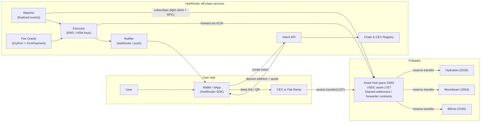
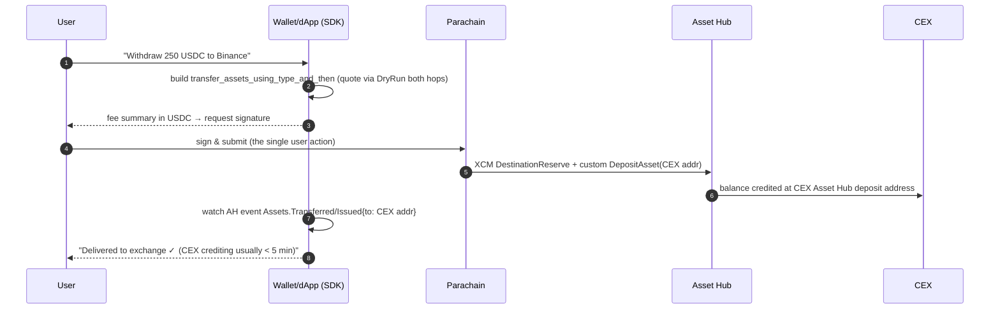

# HubRouter — One-Click USDC Transit for Polkadot

**Technical Specification — v0.9 (Draft for Review)**
**Scope:** CEX / Fiat Ramp → Asset Hub → Parachain, and Parachain → Asset Hub → CEX / Fiat
**Status:** Proposal · **Date:** July 2026 · **Language:** English

---

## 1. Summary

HubRouter is a routing layer on top of existing, production-grade infrastructure — native USDC on Polkadot Asset Hub, direct CEX/on-ramp support for Asset Hub, and XCM reserve transfers — that collapses the multi-step journey

```
Fiat → CEX → withdraw to Asset Hub → set up wallet → XCM transfer → Parachain
```

into **one user action per direction**:

- **Inbound:** the user pastes (or deep-links) a single deposit address into their exchange's withdrawal form. Everything after the exchange withdrawal — detection, fee handling, XCM routing to the destination parachain — happens automatically.
- **Outbound:** the user signs **exactly one transaction** on the parachain. The XCM program it emits hops through Asset Hub and lands the USDC directly on their exchange deposit address (or an off-ramp address) without any intermediate manual step.

HubRouter introduces **no new bridge, no new stablecoin, and no new trust-bearing asset**. It is an orchestration and abstraction layer over the canonical rails. Its trust surface shrinks over three phases, ending in a design where the operator can only *trigger* transfers, never *redirect* them.

### Design principles

1. **USDC-only UX.** The user never needs DOT, never sees XCM, never selects a network beyond "Polkadot" in their exchange UI. All fees are quoted and settled in USDC.
2. **Asset Hub is the canonical hub.** All inbound and outbound value transits Asset Hub. This is not just an architectural choice — it is required for Circle redemption compliance (Circle only accepts natively-issued Asset Hub USDC; XCM-derived USDC on parachains must return via Asset Hub before redemption).
3. **Trust-minimization as a roadmap, not a blocker.** Ship a proxy-based MVP fast; converge on counterfactual smart-contract forwarders on Polkadot Hub (EVM/REVM), where forwarding is permissionless and destinations are immutable.
4. **Fail visibly, recover automatically.** Every intent is a state machine with idempotent transitions, automated retries, and a documented recovery path (including `claim_assets` for trapped XCM assets).

### Success metrics (v1 targets)

| Metric | Target |
|---|---|
| User actions, inbound (excl. CEX-internal confirmation) | 1 (paste/scan deposit address) |
| User actions, outbound | 1 signature |
| End-to-end time, inbound, p95 | ≤ 8 min (dominated by CEX processing) |
| End-to-end time, outbound, p95 | ≤ 3 min |
| Total user cost per direction | ≤ $2.00 (target ≤ $0.50 at scale) |
| Automated success rate | ≥ 99.5% (100% incl. runbook recovery) |
| Assets requiring manual recovery | < 0.1% of volume |

---

## 2. Goals and Non-Goals

### 2.1 Goals

- G1. One-action inbound flow from any Asset-Hub-integrated CEX (Binance, Coinbase, Crypto.com, Bitfinex, WhiteBIT, MEXC, …) or fiat on-ramp (Ramp Network, …) to any supported parachain.
- G2. One-signature outbound flow from any supported parachain back to a CEX deposit address or off-ramp, always transiting Asset Hub (Circle-compliant by construction).
- G3. Complete fee abstraction: quote, charge, and settle all costs in USDC; user never acquires DOT or a parachain gas token.
- G4. Existential-deposit (ED) and account-existence handling fully automated on both hops.
- G5. Non-custodial end-state (Phase 2): operator can trigger but not redirect funds; forwarding is permissionless.
- G6. Embeddable: a TypeScript SDK + REST API that any wallet (Nova, Talisman, SubWallet), dApp, or parachain frontend can integrate in < 1 day.
- G7. Bidirectional per-chain capability registry so new parachains can be onboarded via configuration, not code.

### 2.2 Non-Goals (v1)

- N1. No new stablecoin. HOLLAR / pUSD interop is out of scope (may consume HubRouter later, not vice versa).
- N2. No Ethereum bridging. Snowbridge USDC.e ↔ native USDC conversion is explicitly out of scope for v1; a pointer to Asset Hub / Hydration swap pools is provided instead. (A CCTP-style integration is tracked as a strategic dependency, not a v1 deliverable.)
- N3. No custody product. Funds are held only transiently (seconds to minutes) and only in Phases 0–1.
- N4. No fiat money transmission by HubRouter itself. Fiat legs are always executed by licensed partners (CEXs, Ramp Network, Circle Mint for institutions).
- N5. No support for non-USDC assets at launch (USDT is a fast-follow: identical mechanics, asset ID 1984).

---

## 3. Background and Hard Constraints

These are the environmental facts the design is built around. Each carries an ID used in later sections.

| ID | Fact / Constraint | Design consequence |
|---|---|---|
| C1 | USDC is **natively issued on Polkadot Asset Hub** (Assets pallet, asset ID **1337**, 6 decimals). Its XCM reserve location is Asset Hub. | All parachain USDC is a derivative backed by the reserve on AH; AH→para uses reserve transfer, para→AH uses reserve withdraw. |
| C2 | **Circle only supports natively-issued Asset Hub USDC.** USDC moved to a parachain via XCM must be transferred back to Asset Hub before deposit to Circle (or most CEXs). Depositing parachain-derivative USDC directly can result in loss of funds. | The outbound path MUST terminate on Asset Hub before touching any CEX/off-ramp address. HubRouter enforces this structurally. |
| C3 | Major CEXs support **direct deposits/withdrawals on Asset Hub** for stablecoins (e.g., Crypto.com USDT+USDC since 2025-10-21; Binance, Bitfinex USDT; Coinbase USDC; WhiteBIT USDT+USDC; MEXC). Support matrix varies per CEX and changes over time. | A per-CEX registry (§12.4) is required; inbound design must not assume memo/tag support (most Substrate CEX integrations have **no memo field**) → unique deposit addresses are the only reliable discriminator. |
| C4 | Post-migration (2025-11-04), **Asset Hub is the primary user chain**: balances, staking, governance live there; existential deposit lowered (≈ 0.01 DOT, verify at deploy); fees ~10× cheaper than the old relay. | AH is cheap enough to be a transit hop for retail amounts. |
| C5 | **USDC and USDT are *sufficient assets* on Asset Hub**: an account can exist holding only USDC, with no DOT. | Deposit addresses need no DOT pre-funding for existence; ED handling on AH is trivial. |
| C6 | Asset Hub supports **fee payment in sufficient assets** via the asset-conversion tx-payment signed extension (on-chain USDC/DOT pool swaps fees automatically). | The executor and (Phase 2) the user can pay all AH fees in USDC. USDC-only UX is feasible without sponsorship on AH. |
| C7 | **Smart contracts are live on Polkadot Hub** (Asset Hub runtime ≥ 2.0.5, REVM/PVM via pallet-revive; Solidity + standard Ethereum tooling). H160 contract addresses map deterministically to AccountId32. | Phase 2 counterfactual forwarder contracts become possible on the Hub itself — no extra chain needed. Two runtime capabilities must be verified (D1, D2 in §18). |
| C8 | **XCM v4/v5 with `DryRunApi` and `XcmPaymentApi`** runtime APIs are available on AH and major parachains; `pallet-xcm` exposes `transfer_assets` and `transfer_assets_using_type_and_then` (custom XCM on destination). | Deterministic pre-flight simulation and exact fee quoting are possible; the one-signature outbound flow (§9) is implementable without any protocol change. |
| C9 | No memo/tag on Substrate transfers at most CEXs; withdrawal source addresses are pooled and unpredictable. | Sender-based matching is impossible → intent = deposit address (§6.1). |
| C10 | Fiat on-ramps (e.g., Ramp Network) can deliver **USDC directly on Asset Hub** to an arbitrary address via widget/API, with card/bank/Apple Pay rails in 150+ countries. | The ramp flow reuses the exact same deposit-address rail as the CEX flow (§8). |
| C11 | Parachain landscape is consolidating; deep integrations first: **Hydration (2034), Moonbeam (2004), Bifrost (2030), Astar (2006)** + Hub-native EVM dApps. | Registry-driven rollout; "any parachain" is achieved by config once the chain passes the onboarding checklist (§12.4). |

---

## 4. System Overview



**Component inventory**

| Component | Type | Purpose | Spec |
|---|---|---|---|
| Deposit addresses / Forwarders | On-chain (AH) | Per-intent receiving accounts; the only inbound discriminator (C9) | §6.1, §11 |
| Intent API | Off-chain | Creates/tracks intents, serves quotes, builds unsigned outbound payloads | §12.1 |
| Watcher | Off-chain | Finality-only event ingestion on AH + destination chains; exactly-once triggering | §12.2 |
| Executor | Off-chain | Signs and submits forwarding extrinsics (Phases 0–1) or `forward()` pokes (Phase 2) | §12.3 |
| Fee Oracle | Off-chain | Two-hop fee quoting via `XcmPaymentApi` + `DryRunApi`, with safety buffers | §13 |
| Chain & CEX Registry | Off-chain (signed config) | Per-chain XCM capabilities, EDs, fee assets; per-CEX support flags | §12.4 |
| Client SDK | Library | One-call intent creation, one-signature withdrawal builder, status streaming | §14 |
| Recovery / Ops runbooks | Process | Trapped assets, stuck intents, refunds | §15 |

---

## 5. Trust Ladder (Phase 0 → 2)

The inbound rail requires *someone* to move funds off the deposit address (CEXs can only emit a plain `assets.transfer`; they cannot attach calls). The question is who controls that address. HubRouter ships the same product three times with a shrinking trust surface:

| | **Phase 0 — HD hot addresses** | **Phase 1 — Pure-proxy forwarders** | **Phase 2 — Counterfactual contracts** |
|---|---|---|---|
| Deposit address | sr25519 address derived from KMS master key (`//intent/<index>`) | Keyless **pure proxy** account; executor is `Any` proxy | CREATE2 contract on Polkadot Hub; address computable before deploy |
| Who can move funds | Operator (full) | Operator (full, but on-chain visible delegation; reclaimable deposits) | **Nobody can redirect.** Destination is immutable in contract state; `forward()` is **permissionless** |
| Custody window | Transit (seconds–minutes) | Transit (seconds–minutes) | None (contract-bound) |
| Mitigations | HSM, per-intent/day caps, kill switch, insurance fund | Same + 2-of-3 multisig above cap thresholds, `kill_pure` deposit reclaim | Operator outage ⇒ anyone (or the user) can call `forward()` |
| Dependencies | none | none | D1: pallet-assets ERC-20 precompile on Hub; D2: XCM precompile for pallet-revive (§18) |
| Ship target | Week 6 | Week 14 | Week 24 (or when D1/D2 confirmed) |

**Honest framing for users and auditors:** Phases 0–1 are *operationally custodial during transit*. This must be disclosed in the UI ("funds are in transit via HubRouter for ~1–3 minutes; per-transfer cap $X; see security page"). Phase 2 removes the disclosure.

The **outbound** rail is non-custodial in *all* phases: the user's own signature drives an XCM program end-to-end (§9); HubRouter only computes the payload.

---

## 6. Core Concepts

### 6.1 Intents and Deposit Addresses

An **intent** is the unit of work: *"deliver USDC arriving at address A on Asset Hub to beneficiary B on chain D."*

```
Intent {
  intent_id:        uuid-v7
  mode:             INBOUND | OUTBOUND
  destination:      { chain_id, beneficiary (AccountId32 | H160) }
  deposit_address:  AccountId32 on Asset Hub        // inbound only
  refund_address:   AccountId32 on Asset Hub | null // optional, strongly recommended
  min_forward:      u128 (default 5_000_000 = 5 USDC)
  fee_quote:        { fixed_usdc, pct_bps, valid_until, quote_id }
  status:           CREATED | AWAITING_DEPOSIT | DETECTED | FORWARDING
                    | COMPLETED | PARTIAL | EXPIRED | REFUND_PENDING | REFUNDED | PARKED
  created_at / expires_at (default TTL: 7 days for CEX flows, 45 min for ramp quotes)
}
```

Rules:

- **One address ↔ one (user, destination) pair, forever.** Addresses are never reused across users. For returning users the same address MAY be kept persistently bound (exchange-style), so power users can save it in their CEX address book — repeat inbound flows then require *zero* HubRouter interaction.
- **No memos, ever** (C9). The address is the entire routing key.
- **Partial and repeated deposits** to the same address are each forwarded independently once ≥ `min_forward`. Sub-minimum amounts accumulate until the threshold is crossed or TTL expires (then: refund/park).
- Every intent state transition is idempotent and journaled (§12.2).

### 6.2 Asset identity (single source of truth)

| Asset | Location (XCM v4, relative to AH) | Notes |
|---|---|---|
| USDC (native) | `{parents: 0, interior: X2(PalletInstance(50), GeneralIndex(1337))}` | Assets pallet instance 50 on Asset Hub |
| USDC on parachain P | `{parents: 1, interior: X3(Parachain(1000), PalletInstance(50), GeneralIndex(1337))}` (as seen from P) | Derivative; reserve = AH. On Moonbeam surfaces as `xcUSDC` (XC-20 ERC-20 interface) |
| DOT | `{parents: 1, interior: Here}` | Used internally by the fee module only; never user-facing |

**Never** mix Ethereum-origin USDC.e (Snowbridge) into these flows (N2). The registry marks it as a distinct, unsupported asset with a UI hint to swap on Hydration/AH pools first.

### 6.3 Chain & CEX Registry (excerpt)

Signed JSON config, versioned, hot-reloadable (full schema in §12.4):

```jsonc
{
  "chains": {
    "assethub":   { "paraId": 1000, "ss58": 0, "xcmVersion": 5,
                    "feeInUsdc": true, "usdcSufficient": true },
    "hydration":  { "paraId": 2034, "ss58": 63, "xcmVersion": 4,
                    "feeInUsdc": true,               // native multi-asset fees
                    "usdcSufficient": true, "beneficiary": "AccountId32" },
    "moonbeam":   { "paraId": 2004, "xcmVersion": 4,
                    "feeInUsdc": "xcm-only",         // GLMR for local txs; USDC OK inside XCM BuyExecution
                    "beneficiary": "AccountKey20", "usdcRepresentation": "xcUSDC(ERC20)" },
    "bifrost":    { "paraId": 2030, "xcmVersion": 4, "feeInUsdc": true },
    "astar":      { "paraId": 2006, "xcmVersion": 4, "feeInUsdc": "partial" }
  },
  "cex": {
    "binance":   { "usdcAssetHubDeposit": "verify", "usdcAssetHubWithdraw": "verify",
                   "usdtAssetHubWithdraw": true, "xcmDepositCredited": "verify",
                   "withdrawDeepLink": "https://www.binance.com/en/my/wallet/account/main/withdrawal/crypto/USDC" },
    "coinbase":  { "usdcAssetHubDeposit": true, "usdcAssetHubWithdraw": true,
                   "xcmDepositCredited": "verify" },
    "crypto_com":{ "usdcAssetHubDeposit": true, "usdcAssetHubWithdraw": true,
                   "xcmDepositCredited": "verify" }
  }
}
```

`"verify"` entries are resolved by the CEX conformance test suite (§12.4.2) before a route is enabled in production. **`xcmDepositCredited` is the single most important flag** — it decides whether outbound can go direct-to-CEX in one XCM (§9.2) or must use the assisted fallback (§9.3).

---

## 7. Flow A — Inbound: CEX → Parachain

### 7.1 User experience contract

1. In the wallet/dApp: user taps **"Deposit from exchange"**, picks destination chain (default: current app chain) — beneficiary defaults to the connected account. → SDK displays **one Asset Hub address** (+ QR + optional prefilled CEX deep link) and a live status card.
2. User performs the withdrawal in their CEX UI (their KYC/2FA — the one step outside our control).
3. Everything else is automatic. The status card walks through: `Awaiting deposit → Detected (finalized) → Routing to Hydration → Done ✓` with block-explorer links.

That is **one HubRouter action** (paste/scan). No network selection ambiguity: the UI states exactly *"Withdraw USDC using network: **Polkadot Asset Hub** (sometimes shown as 'Polkadot' or 'Statemint')"* and validates that the CEX chosen supports it (registry).

### 7.2 Sequence

```mermaid
sequenceDiagram
  autonumber
  participant U as User
  participant SDK as Wallet/dApp (SDK)
  participant API as Intent API
  participant CEX as CEX
  participant AH as Asset Hub
  participant W as Watcher
  participant FO as Fee Oracle
  participant EX as Executor
  participant PC as Parachain (e.g. Hydration)

  U->>SDK: "Deposit from exchange" (dest = Hydration, beneficiary = self)
  SDK->>API: POST /v1/intents {destination, refundAddress}
  API->>API: allocate deposit address (Phase 0/1: derive+register; Phase 2: CREATE2 compute)
  API-->>SDK: {depositAddress, feeQuote, expiresAt, deepLinks[]}
  U->>CEX: withdraw USDC → depositAddress (network: Polkadot Asset Hub)
  CEX->>AH: assets.transfer(1337, depositAddress, amount)
  AH-->>W: finalized Assets.Transferred event
  W->>W: idempotency check (address, blockHash, extrinsicIdx)
  W->>FO: quote(dest=2034, amount)
  FO-->>W: {ahFeeUSDC, destFeeUSDC, buffer, netAmount}
  W->>EX: ForwardJob{intent, amount, netAmount, quoteId}
  EX->>AH: dryRun → submit forward extrinsic (§11)
  AH->>PC: XCM: TransferReserveAsset → [BuyExecution(USDC), DepositAsset(beneficiary)]
  PC-->>W: finalized deposit event for beneficiary (destination watcher)
  W->>API: intent = COMPLETED
  API-->>SDK: webhook/subscription update → UI "Done ✓"
```

### 7.3 Detection & exactly-once forwarding

```
on FinalizedBlock(AH):
  for ev in events where ev == Assets.Transferred{asset_id: 1337, to ∈ ActiveDepositAddresses}:
    key = (ev.to, blockHash, extrinsicIndex)
    if journal.seen(key): continue                    # replay-safe
    intent = registry.byAddress(ev.to)
    journal.append(key, DETECTED, ev.amount)
    if ev.amount + intent.pendingDust < intent.min_forward:
        intent.pendingDust += ev.amount; continue
    enqueue ForwardJob(intent, amount = ev.amount + drain(pendingDust))

on ForwardJob:
  # exactly-once guard: on-chain truth beats DB
  free = api.query.Assets.Account(1337, intent.deposit_address).balance
  assert free >= job.amount, "already forwarded or race — abort & reconcile"
  quote = FeeOracle.quote(intent.destination, job.amount)     # §13
  net   = job.amount - quote.total_usdc
  xt    = buildForward(intent, net, quote)                    # §11
  sim   = api.apis.DryRunApi.dry_run_call(origin, xt)         # both hops simulated
  assert sim.executionResult.isOk and sim.forwardedXcms deliverable
  txHash = signAndSubmit(xt)                                  # KMS/HSM, nonce-managed
  journal.transition(intent, FORWARDING, {txHash})
  awaitFinalized(txHash) ; awaitDestinationDeposit(intent)    # dest watcher, timeout 5 min
  journal.transition(intent, COMPLETED)
```

Retry policy: 3 automated retries with re-quote (fees may move); then `PARKED` + alert + runbook (§15.4). Funds parked on AH are safe indefinitely (USDC is sufficient, C5).

### 7.4 Failure modes

| # | Failure | Handling |
|---|---|---|
| F1 | User withdraws on the **wrong network** (e.g., USDC-ERC20) | Not receivable at an AH address — CEX-side validation usually blocks it because the address format (SS58) doesn't match. UI shows explicit network instructions + address-format explainer to preempt. |
| F2 | Deposit below `min_forward` | Accumulate (dust ledger) until threshold or TTL; then auto-refund to `refund_address` if set, else `PARKED` with support claim flow. |
| F3 | Wrong asset sent to deposit address (USDT, DOT, random) | Phase 0/1: swept to segregated recovery account, user claim via support. Phase 2: contract `sweep(assetId)` → DAO-controlled recovery vault; USDT MAY be auto-routed identically once USDT support ships. |
| F4 | XCM execution fails on destination (weight/fee/version) | Prevented in ≥ 99% of cases by `DryRunApi` pre-flight. If it still fails: assets trapped on dest → automated `polkadotXcm.claim_assets` recovery (§15.3), retry with fresh quote. |
| F5 | Fee spike between quote and execution | Quote includes buffer (default 25%); if buffer exceeded → re-quote; net amount changes only downward and only within disclosed max fee. |
| F6 | Destination account can't hold USDC (ED, non-sufficient asset on some chain) | Registry drives an **account-activation step**: forward includes minimal native-token dust via swap, or uses chain-specific `DepositAsset` semantics; chains failing the checklist are not enabled (§12.4.1). |
| F7 | Intent expired, deposit arrives late | Addresses remain monitored for 90 days post-expiry (cheap); late deposits follow F2 refund logic. Never silently dropped. |
| F8 | CEX delists / pauses AH withdrawals | Registry flips flag → UI steers user to alternative CEX or on-ramp; existing intents unaffected. |

---

## 8. Flow B — Inbound: Fiat On-Ramp → Parachain

Identical rail; only the first hop differs. The on-ramp (e.g., Ramp Network, which supports USDC purchase **directly on Asset Hub** with card / bank transfer / Apple Pay) is initialized with the intent's deposit address:

```ts
// SDK: fiat variant of the same intent
const intent = await hub.createIntent({ destination: { chainId: "moonbeam", beneficiary: userH160 } });
hub.openOnRamp({
  provider: "ramp",                       // registry-driven; multiple providers
  asset: "USDC_POLKADOT_ASSETHUB",        // provider-specific asset code from registry
  address: intent.depositAddress,
  fiatCurrency: "EUR", fiatValue: 200,
  webhookUrl: hub.webhookFor(intent.id)
});
```

Notes:

- Ramp quotes are short-lived → intent TTL 45 min in this mode; expiry auto-recreates the intent transparently.
- KYC lives entirely with the provider (N4).
- Because the rail is shared, **on-ramp purchases land on any parachain with zero extra engineering** the moment a provider supports Asset Hub delivery.
- Off-ramp (Flow D) is the mirror image where the provider supports selling from an AH address.

---

## 9. Flow C — Outbound: Parachain → CEX (one signature)

This is fully **non-custodial in every phase**: HubRouter only *builds* the transaction; the user's key does everything.

### 9.1 UX contract

User taps **"Withdraw to exchange"**, selects/pastes their **CEX's Asset Hub deposit address** (SDK caches it after first use, verifies SS58 checksum, and warns if it matches a known parachain-derivative-incompatible pattern), enters amount → **one signature** → status card until the CEX credits.

### 9.2 Primary route — direct-to-CEX in a single XCM (`xcm_deposit_credited = true`)

One extrinsic on the source parachain, using `pallet-xcm::transfer_assets_using_type_and_then`, which supports a **custom XCM executed on the destination (Asset Hub)**:

```
polkadotXcm.transfer_assets_using_type_and_then(
  dest:                (parents: 1, X1(Parachain(1000))),          // Asset Hub
  assets:              [ USDC_from_P (amount) ],
  assets_transfer_type: DestinationReserve,                        // burn derivative on P,
                                                                   // withdraw from P's sovereign on AH
  remote_fees_id:      USDC,
  fees_transfer_type:  DestinationReserve,
  custom_xcm_on_dest:  Xcm([
      DepositAsset {
        assets: Wild(AllCounted(1)),
        beneficiary: (parents: 0, X1(AccountId32(CEX_DEPOSIT_ADDR)))
      }
  ]),
  weight_limit:        Unlimited
)
```

Effects, atomically from the user's perspective:
1. Parachain burns the USDC derivative and instructs AH (reserve) to release from the parachain's sovereign account.
2. AH pays execution **in USDC** (`remote_fees_id`), no DOT anywhere.
3. `DepositAsset` credits the **CEX's Asset Hub address directly**. The funds arriving are, by construction, native Asset-Hub USDC — Circle/CEX-compliant (C2).

On Moonbeam the same is issued through the pallet-xcm precompile from the user's H160 (MetaMask-signable); registry stores per-chain call encodings.

### 9.3 Fallback route — assisted two-step (`xcm_deposit_credited = false | "verify"`)

Some CEX backends may only credit deposits that arrive as plain `Assets.Transferred` from a signed origin (an XCM deposit is emitted from the parachain's **sovereign account**, which conservative deposit scanners might ignore). Until the conformance suite proves crediting, the SDK degrades gracefully:

1. **Signature (the one user approval):** same extrinsic as §9.2 but `custom_xcm_on_dest` deposits to the **user's own Asset Hub address** — which is the *same AccountId32 / same key* as on the source chain (Substrate) or the mapped account (EVM chains, derived per registry).
2. **Auto-hop:** the SDK, holding the *already granted* session approval, immediately constructs `assets.transfer_keep_alive(1337, CEX_ADDR, net)` on AH, pays fees in USDC via the asset-conversion tx-payment extension (C6), and requests the wallet's second signature **in the same flow** (wallets that support batch-signing show it as one approval sheet; others show a second prompt ~30–60 s later — the UI keeps the flow open and explains it).

The registry's job is to migrate every CEX from 9.3 to 9.2 via the conformance test (§12.4.2): perform a real XCM deposit of $10, confirm crediting, flip the flag.

### 9.4 Sequence (primary route)



### 9.5 Outbound failure modes

| # | Failure | Handling |
|---|---|---|
| W1 | Dry-run fails (fee/weight/version) | Never submitted; SDK re-quotes or blocks with reason. |
| W2 | Delivered to AH but CEX doesn't credit (policy) | Funds are at the CEX's own address — CEX support case; UI provides tx proof bundle (block, extrinsic, event). Prevented by conformance gating; route ships as 9.3 until proven. |
| W3 | User pastes a **parachain** address of the CEX or an Ethereum USDC address | SDK validates SS58 network prefix + registry allowlist of known CEX AH address patterns where available; hard-warns otherwise. |
| W4 | XCM trapped on AH (extreme edge) | `claim_assets` recovery signed by the *user* (assets are claimable by the origin) — SDK offers a one-click claim builder (§15.3). |

---

## 10. Flow D — Outbound to Fiat (Off-Ramp)

Two supported terminations, both structurally Circle-compliant because value always lands on Asset Hub first (C2):

1. **Retail:** off-ramp provider (registry: Ramp off-ramp, Guardarian, …) issues a sell order with an AH deposit address → Flow C (§9) targets that address instead of a CEX. One signature; fiat hits the user's bank/card via the provider.
2. **Institutional:** Circle Mint account holders redeem 1:1; HubRouter's only role is enforcing the AH landing (which Flow C guarantees) and surfacing the "never deposit parachain-derivative USDC to Circle" rule in SDK docs and runtime guards (destination allowlist tags: `type: circle_mint` forces route via AH — always true anyway).


---

## 11. On-Chain Components

### 11.1 Phase 0/1 — Account-based forwarders (Asset Hub, no deployment needed)

**Phase 0 (HD hot addresses).** Deposit address = sr25519 public key derived from a KMS/HSM master key at path `//hubrouter/intent/<index>`. Nothing on-chain until first use. Fastest possible ship; pure operational custody in transit.

**Phase 1 (pure proxies).** Deposit address = keyless *pure proxy* account:

```
# creation (executor-signed, batched 50 at a time to amortize fees)
proxy.create_pure(proxy_type: Any, delay: 0, index: i)
  → event Proxy.PureCreated { pure: <ADDRESS>, who: executor, ... }
```

Lifecycle & properties:

- The pure account is **keyless**; only registered proxies can act for it. Creation reserves a small DOT proxy deposit from the executor (reclaimable).
- Because **USDC is sufficient on AH (C5)**, the CEX deposit alone keeps the account alive — no DOT top-up needed on the deposit address itself.
- Forwarding call (executor as proxy):

```
proxy.proxy(real: <deposit_addr>, force_proxy_type: None, call:
  utility.batch_all([
    polkadotXcm.transfer_assets(              # AH → destination parachain
      dest:        (parents: 1, X1(Parachain(<destParaId>))),
      beneficiary: (parents: 0, X1(AccountId32|AccountKey20(<user>))),
      assets:      [ (X2(PalletInstance(50), GeneralIndex(1337)), Fungible(<net>)) ],
      fee_asset_item: 0,                       # pay XCM fees in USDC itself
      weight_limit: Unlimited
    ),
    assets.transfer(1337, FEE_TREASURY, <hubrouter_fee>)   # service fee sweep
  ])
)
```

- Executor's *own* AH tx fees are paid **in USDC** via the asset-conversion tx-payment signed extension (C6) — the whole system holds no user-facing DOT.
- GC job: expired, zero-balance pure proxies are reaped with `proxy.kill_pure(...)` to reclaim deposits. Addresses bound to returning users are exempt from GC.
- Improvement over Phase 0 is transparency (delegation and every forward are on-chain inspectable) and deposit hygiene — **not** trust: an `Any` proxy could redirect. Hence caps + multisig escalation (§15.1) remain mandatory until Phase 2.

### 11.2 Phase 2 — Counterfactual forwarder contracts (Polkadot Hub, REVM)

Since contracts are live on the Hub (C7), deposit addresses become CREATE2 contracts whose **destination is immutable** and whose execution is **permissionless**:

```solidity
// SPDX-License-Identifier: Apache-2.0
pragma solidity ^0.8.26;

/// Precompile interfaces exposed by the Asset Hub runtime — availability = D1/D2 (§18)
interface IAssets {          // pallet-assets ERC20-style precompile view for asset 1337
    function balanceOf(uint32 assetId, address who) external view returns (uint128);
    function transfer(uint32 assetId, address to, uint128 amount) external returns (bool);
}
interface IXcm {             // pallet-revive XCM precompile
    function execute(bytes calldata versionedXcm, Weight calldata maxWeight) external;
    function send(bytes calldata versionedDest, bytes calldata versionedXcm) external;
    struct Weight { uint64 refTime; uint64 proofSize; }
}

struct Route {
    uint32  destParaId;        // 2034, 2004, ...
    bytes32 beneficiary;       // AccountId32 (or left-padded AccountKey20)
    uint8   beneficiaryKind;   // 0 = AccountId32, 1 = AccountKey20
    uint128 minForward;        // e.g. 5e6
    uint64  refundAfter;       // unix ts; refund() enabled after this
    address refundTo;          // mapped AH account of the user (optional)
}

contract Forwarder {
    uint32  constant USDC = 1337;
    IAssets constant ASSETS = IAssets(0x0000000000000000000000000000000000000802); // TBV
    IXcm    constant XCM    = IXcm(  0x00000000000000000000000000000000000A0000); // TBV
    Route   public route;                 // set once by factory; no setter exists
    address public immutable factory;

    event Forwarded(uint128 gross, uint128 net, uint128 fee);
    event Refunded(uint128 amount);

    constructor(Route memory r) { route = r; factory = msg.sender; }

    /// Permissionless. Operator normally pokes it, but ANYONE (incl. the user) can.
    function forward(bytes calldata quotedXcmProgram, uint128 maxFee) external {
        uint128 bal = ASSETS.balanceOf(USDC, address(this));
        require(bal >= route.minForward, "below min");
        // quotedXcmProgram is built off-chain from route + live fee quote, then
        // VERIFIED on-chain against the immutable route (dest + beneficiary + fee cap):
        _verifyProgram(quotedXcmProgram, bal, maxFee);   // decodes SCALE, checks invariants
        XCM.execute(quotedXcmProgram, _weightCap());
        emit Forwarded(bal, bal - maxFee, maxFee);
    }

    function refund() external {
        require(block.timestamp >= route.refundAfter && route.refundTo != address(0));
        uint128 bal = ASSETS.balanceOf(USDC, address(this));
        ASSETS.transfer(USDC, route.refundTo, bal);
        emit Refunded(bal);
    }

    function sweep(uint32 assetId, address recoveryVault) external {
        require(assetId != USDC && msg.sender == factory);   // wrong-asset rescue only
        ASSETS.transfer(assetId, recoveryVault, ASSETS.balanceOf(assetId, address(this)));
    }
}

contract ForwarderFactory {
    event Deployed(address forwarder, bytes32 salt);
    function compute(bytes32 salt, Route calldata r) external view returns (address) {
        return address(uint160(uint256(keccak256(abi.encodePacked(
            hex"ff", address(this), salt, keccak256(_initCode(r))))))); // CREATE2
    }
    function deploy(bytes32 salt, Route calldata r) external returns (address f) {
        f = address(new Forwarder{salt: salt}(r));
        emit Deployed(f, salt);
    }
}
```

Operational notes:

- **Counterfactual issuance:** `compute()` gives the address instantly at intent creation with **zero deployment cost**; the factory deploys lazily right before the first `forward()` (or in the same poke tx via multicall). The CEX can send to the address before any code exists — funds sit safely at the mapped AccountId32.
- **Address mapping:** the contract's H160 maps deterministically to an AccountId32 on AH (pallet-revive account mapping). The CEX-facing string is that AccountId32 in SS58(0). The SDK renders both and QR-encodes the SS58 form.
- **Trust properties:** destination and beneficiary are constructor-immutable; `_verifyProgram` pins the XCM's `DepositAsset` beneficiary and fee ceiling to `route`. The operator's only powers are *timing* and *fee choice up to `maxFee`*. Liveness failure ⇒ user self-serves `forward()` or `refund()`.
- **Gate:** ships only when D1 (assets precompile) and D2 (XCM precompile) are confirmed on the production Hub runtime, with audited `_verifyProgram` SCALE decoding. Until then Phase 1 is the production path — same API, invisible swap later.

### 11.3 XCM programs (reference sketches, XCM v4/v5 notation)

**(a) Inbound hop, AH → parachain (emitted by 11.1/11.2 forward):**

```
# executed on Asset Hub, origin = deposit address / forwarder account
WithdrawAsset( (X2(PalletInstance(50), GeneralIndex(1337)), Fungible(net + destFee)) )
BuyExecution ( fees = USDC(ahFeePortion), weight_limit = Unlimited )      # AH side, in USDC (C6)
DepositReserveAsset(
  assets: Wild(AllCounted(1)),
  dest:   (parents: 1, X1(Parachain(destParaId))),
  xcm: [
    BuyExecution( fees = USDC(destFee), weight_limit = Unlimited ),        # dest side, in USDC
    DepositAsset( assets = Wild(AllCounted(1)),
                  beneficiary = X1(AccountId32|AccountKey20(user)) )
  ]
)
```

**(b) Outbound single-signature, parachain → AH → CEX address:** see §9.2 — one `transfer_assets_using_type_and_then` with `DestinationReserve` and `custom_xcm_on_dest = [DepositAsset → CEX_ADDR]`.

**(c) Fee-quoting for both:** `XcmPaymentApi.query_delivery_fees` + `query_weight_to_asset_fee` on each hop, cross-checked by a full `DryRunApi.dry_run_call` (origin = actual sender) whose `forwarded_xcms` are then dry-run on the destination via `dry_run_xcm`. Quote = sum + buffer (§13).

---

## 12. Off-Chain Services

All services are stateless-horizontal except the journal (Postgres, single-writer per intent via advisory locks). Deploy: 2 regions, active-active watchers, active-passive executor.

### 12.1 Intent API (REST; GraphQL read layer optional)

```
POST /v1/intents
  body: { destination: { chainId, beneficiary }, refundAddress?, minForward?, mode: "cex"|"ramp" }
  201:  { intentId, depositAddress, ss58Prefix: 0, network: "polkadot-assethub",
          asset: { symbol:"USDC", assetId:1337, decimals:6 },
          feeQuote: { fixedUsdc:"0.30", pctBps:10, maxTotalUsdc, validUntil, quoteId },
          deepLinks: [ { cex:"binance", url } ], qrPayload, expiresAt }

GET  /v1/intents/{id}
  200:  { status, deposits:[{txHash, block, amount}], forwards:[{ahTx, xcmId, destTx, netAmount}],
          dustPending, timeline:[{state, at, ref}] }

POST /v1/withdrawals/quote
  body: { fromChainId, amount, target: { kind:"cex"|"offramp"|"address", address } }
  200:  { route: "DIRECT_XCM" | "ASSISTED_TWO_STEP",
          unsignedPayloads: [ scaleHex... ],          # 1 or 2, wallet-agnostic
          fees: { sourceUsdc, ahUsdc, totalUsdc }, expiresAt }

GET  /v1/registry/chains | /v1/registry/cex | /v1/health | /v1/proof/{intentId}
POST /v1/webhooks  (HMAC-signed callbacks: intent.state_changed)
```

Auth: public read for registry/health; API keys + per-key rate limits for intent creation (abuse control, §15.5); webhook HMAC.

### 12.2 Watcher

- **Sources:** embedded light client (smoldot via polkadot-api) as trust root **plus** 2 independent archive RPC providers; an event is actionable only when seen on the light client's *finalized* head (never best/unsafe heads → reorg-immune by construction).
- **Watched chains:** AH (inbound triggers + outbound delivery confirmation) and every enabled destination (completion confirmation).
- **Journal:** append-only `event_journal(address, block_hash, extrinsic_index) UNIQUE` + `intent_transitions` state machine table. Crash-safe resume from last finalized checkpoint per chain.
- **Clock SLO:** trigger emitted ≤ 1 finalized block (~12–18 s) after the deposit's finalization.

### 12.3 Executor

- Keys in KMS/HSM; sr25519 remote-signing only; nonce manager with gap-repair; mortal extrinsics (64 blocks) to bound stuck-tx ambiguity.
- **Policy engine (hard, pre-signing):** per-intent cap (default 25,000 USDC), rolling 24 h cap (default 250,000 USDC), destination ∈ registry, `net > 0`, quote fresh. Above-cap forwards require 2-of-3 multisig co-signature (pallet-multisig) — latency traded for safety, disclosed in UI ("large transfer review, ~10 min").
- Kill switch: single flag halts signing; watchers keep journaling (nothing is lost, only delayed).
- Phase 2: the executor degrades to a keeper that calls `Forwarder.forward()` with fresh quotes — key compromise then bounds damage to fee-griefing within `maxFee`.

### 12.4 Chain & CEX Registry

Signed (sr25519, 2-of-3 maintainer threshold) JSON served via API + IPFS pin; SDK verifies signature. Two gates:

**12.4.1 Parachain onboarding checklist (all must pass on production chain):**
1. USDC (AH-reserve) registered & transferable; representation documented (native asset / XC-20 / other).
2. `pallet-xcm` exposes `transfer_assets_using_type_and_then` (or an adapter mapping exists — e.g., precompile path on EVM chains).
3. `DryRunApi` + `XcmPaymentApi` available (or static fee tables accepted with 2× buffer, flagged "degraded quoting").
4. Fees payable in USDC inside `BuyExecution`; if not → activation-dust strategy defined & tested.
5. ED / sufficiency semantics for USDC documented; deposit-to-fresh-account test passes.
6. Round-trip integration test: 25 USDC in → out → CEX, executed on mainnet, receipts archived.

**12.4.2 CEX conformance suite (per exchange, re-run monthly + on incident):**
1. Withdrawal to a fresh AH address (min amount) — records network label naming ("Polkadot", "Asset Hub", "Statemint"), fee, typical latency.
2. Deposit crediting from **plain transfer** (baseline).
3. Deposit crediting from **XCM-originated `DepositAsset`** ($10 probe) → sets `xcmDepositCredited`; failure pins the CEX to route §9.3.
4. Address-book/memo behavior; whether withdrawal API/deep-link prefill is available (enables the "zero-typing" inbound variant).


---

## 13. Fee Model & ED Handling ("USDC-only" math)

### 13.1 Cost components per inbound transfer

| Leg | Payer | Asset | Mechanism |
|---|---|---|---|
| CEX withdrawal fee | user (CEX-side) | USDC | CEX policy; displayed from registry telemetry |
| AH extrinsic fee (forward) | deposit address / forwarder | USDC | asset-conversion tx-payment (C6) — runtime swaps USDC→DOT internally |
| XCM delivery + dest execution | carried in the transferred asset | USDC | `BuyExecution` in USDC on both hops (§11.3) |
| HubRouter service fee | user (netted) | USDC | `fixed (0.30) + 10 bps`, capped, transparent in quote |

**Net-amount formula:**

```
gross          = amount received on deposit address
protocol_costs = ah_fee + delivery_fee + dest_exec_fee          # from Fee Oracle
buffer         = ceil(protocol_costs * 0.25)                    # returned if unused? NO — see below
service_fee    = min(0.30 + gross * 0.0010, fee_cap)
net            = gross - protocol_costs - buffer - service_fee
invariant      : net > 0 and net >= min_forward - fee-tolerance, else refuse+refund path
```

Buffer policy: the buffer is *charged* (simplicity, no dust refunds); the quote therefore shows a single **max total fee** and the UI commits to "you will receive at least X USDC on <chain>". Fee Oracle telemetry keeps the buffer honest (target: realized ≤ 60% of buffered).

### 13.2 Quoting pipeline (per job, < 300 ms budget)

```
q1 = AH.XcmPaymentApi.query_delivery_fees(dest, msg)                 # AH → P delivery
q2 = AH.XcmPaymentApi.query_weight_to_asset_fee(weight(msg_AH), USDC)
q3 = P.XcmPaymentApi.query_weight_to_asset_fee(weight(msg_P),  USDC_on_P)
sim = AH.DryRunApi.dry_run_call(origin=forwarder, xt)                # must be Ok
sim2 = P.DryRunApi.dry_run_xcm(from=AH, sim.forwarded_xcms[0])       # must be Ok
quote = { protocol_costs: q1+q2+q3, valid_for: 120 s, sim_proofs: hashes }
```

Chains without these APIs run on static tables with 2× buffer and a "degraded" badge in the registry (12.4.1 #3).

### 13.3 ED / account-existence matrix

| Situation | Handling |
|---|---|
| Fresh deposit address on AH | Nothing to do — USDC is sufficient (C5); CEX deposit itself creates the account. |
| Fresh beneficiary on Hydration/Bifrost (USDC sufficient or multi-asset ED) | Direct `DepositAsset`; registry asserts sufficiency at onboarding (12.4.1 #5). |
| Fresh beneficiary on chains where USDC is **not** sufficient | Forward prepends an **activation micro-swap**: convert ≤ $0.10 of USDC to the native token on AH pools / dest DEX and deposit it alongside — encoded in the same XCM program; cost folded into the quote. |
| Beneficiary is a contract (EVM chains) | No ED semantics; deliver to H160 via `AccountKey20`; registry marks contract-delivery-safe assets (xcUSDC is a standard XC-20/ERC-20). |
| CEX address on AH (outbound) | Always exists (exchange-managed); `transfer` (not `transfer_keep_alive`) semantics irrelevant since we never drain it. |

### 13.4 Optional sponsorship module (growth lever)

A treasury-funded paymaster MAY zero out the service fee and/or protocol costs for (a) first N transfers per account, (b) campaign chains. Implementation: identical pipeline, `service_fee = 0`, costs booked to sponsor budget with per-campaign caps. No protocol changes — pure accounting.

---

## 14. Client SDK & UX Specification

### 14.1 TypeScript SDK surface (wallet/dApp-facing)

```ts
import { HubRouter } from "@hubrouter/sdk";
const hub = new HubRouter({ apiKey, network: "polkadot" });

// INBOUND — one call, then render
const intent = await hub.createIntent({
  destination: { chainId: "hydration", beneficiary: mySs58 },
  refundAddress: mySs58OnAssetHub,            // strongly recommended
});
render(intent.depositAddress, intent.qrPayload, intent.feeQuote, intent.deepLinks);
hub.watch(intent.id, (s) => updateStatusCard(s));   // AWAITING → DETECTED → FORWARDING → COMPLETED

// OUTBOUND — one signature
const w = await hub.buildWithdrawal({
  fromChainId: "moonbeam",
  amount: "250000000",                        // 250 USDC, 6 decimals
  target: { kind: "cex", address: binanceAhAddr },
});
for (const p of w.unsignedPayloads)           // length 1 (DIRECT_XCM) or 2 (ASSISTED)
  await wallet.signAndSubmit(p);              // batch-capable wallets show ONE sheet
hub.watchWithdrawal(w.id, updateStatusCard);
```

Helpers: `hub.validateCexAddress(addr)`, `hub.chains()`, `hub.cexSupportMatrix()`, `hub.claimTrappedAssets(...)` (§15.3), `hub.openOnRamp(...)` (§8).

### 14.2 UX rules (normative)

1. **One number.** Show the guaranteed receive-amount ("You'll receive ≥ 249.12 USDC on Hydration"), never a fee breakdown by default (expandable).
2. **Name the network exactly** as each CEX names it (registry field `networkLabelAtCex`), e.g. "On Binance choose network: *Polkadot Asset Hub*".
3. **Progress is chain-anchored:** every state links to Subscan/explorer for the relevant block; no spinner without a receipt.
4. **Never show XCM, DOT, ED, sovereign accounts, reserves.** Error copy translates: "fees moved, we re-quoted (−0.04 USDC)" not "BuyExecution TooExpensive".
5. **Address hygiene:** render SS58 with prefix highlighting + identicon; copy button appends nothing; QR contains address only.
6. **Persistence:** returning users see "Your Binance→Hydration lane" with the saved address → true one-tap repeats.
7. **Custody disclosure (Phases 0–1):** one line + link, non-dismissable on first use (§5).

---

## 15. Security, Risk & Compliance

### 15.1 Key & operator risk (Phases 0–1)

- HSM/KMS custody, no exportable keys; signing service isolated from the API network.
- Hard caps (§12.3) + 2-of-3 multisig escalation; anomaly detection (forward-rate spikes, unseen destinations) auto-trips the kill switch.
- Public **transparency page**: live journal of all forwards (intent hash ↔ AH extrinsic), daily proof-of-flow reconciliation, current caps.
- Insurance fund target: ≥ 2× rolling 24 h cap before public launch; incident policy published.

### 15.2 Protocol-level risks

| Risk | Mitigation |
|---|---|
| XCM version drift / runtime upgrades on AH or dest | Registry pins per-chain XCM version; CI replays dry-runs against upcoming runtimes (fellowship release candidates); routes auto-degrade to `PAUSED_UPGRADING`. |
| Fee spikes / pool illiquidity for USDC→DOT fee swaps | 25% buffer, re-quote on breach; alert if AH USDC/DOT pool depth < threshold; static-fee fallback. |
| Trapped assets after failed XCM | §15.3 automated claim; assets are never burned on failure — they trap claimably. |
| Duplicate forwarding (replay, race, multi-watcher) | On-chain balance pre-check + unique journal key + single-writer lock per intent (§7.3, §12.2). |
| Dust-griefing (thousands of $0.01 deposits) | `min_forward`, dust ledger, address-creation rate limits per API key. |
| Malicious "user" routing to sanctioned address | Optional screening hook (provider-pluggable) pre-forward; hits → `PARKED` + review. Jurisdictional posture is an operator decision; the spec only mandates the hook + audit log. (N4 keeps fiat/KYC at partners.) |
| Wrong-asset deposits | F3 sweep path; recovery vault is 2-of-3 multisig, never the executor key. |
| Registry compromise | Registry is threshold-signed; SDK pins maintainer keys; unsigned/invalid registry ⇒ SDK refuses new intents (fails closed). |

### 15.3 Trapped-asset recovery (runbook, automated first)

1. Dry-run replay to classify (fee vs. weight vs. version vs. asset-untrusted).
2. Assets trapped on destination: submit `polkadotXcm.claim_assets(assets, beneficiary)` from the XCM origin — the forwarder (Phases 0–1: executor via proxy; Phase 2: keeper tx through the contract) or, outbound, a **user-signed** claim the SDK builds one-click.
3. Re-forward with corrected parameters under a fresh quote; journal links original → recovery → completion.
4. > 24 h unresolved ⇒ human escalation; intent surfaces a support bundle (`/v1/proof/{id}`).

### 15.4 Stuck-intent SLA

`DETECTED → FORWARDING` > 5 min ⇒ page on-call; > 60 min ⇒ user notification with plain-language status + guarantee statement ("funds are on Asset Hub at <address>, publicly visible, refundable to your refund address on request").

### 15.5 Abuse & API hardening

Per-key intent-creation quotas; proof-of-wallet (signed nonce) required above 10 open intents; deposit addresses are cheap but not free (Phase 1 proxy deposits) → allocation batching + quotas keep cost bounded.

### 15.6 Audit plan

- Phase 1: external review of executor policy engine + journal exactly-once logic (process audit).
- Phase 2: two independent smart-contract audits (Forwarder/_verifyProgram SCALE decoding is the crown jewel) + one XCM-program review by an ecosystem XCM specialist; public bug bounty (Immunefi-class) before permissionless GA.

---

## 16. Observability & SLOs

Metrics (Prometheus): `intents_created`, `deposit_detect_latency_seconds` (SLO p95 ≤ 20 s post-finality), `forward_submit_latency_seconds` (SLO p95 ≤ 30 s), `e2e_inbound_seconds` (p95 ≤ 480 s), `e2e_outbound_seconds` (p95 ≤ 180 s), `auto_success_ratio` (≥ 0.995), `parked_value_usdc` (alert > $10k or > 2 h), `fee_buffer_utilization` (alert > 0.8), per-CEX withdrawal latency histograms (fed back into UI ETAs).

Tracing: every intent carries a trace ID through API→watcher→executor→chain events; Subscan links embedded in spans. Dashboards public where possible (transparency page, §15.1).

---

## 17. Rollout Plan

| Milestone | Weeks | Scope | Exit criteria |
|---|---|---|---|
| **M0 — Private PoC** | 0–6 | Phase 0 addresses; chains: Hydration + Moonbeam; CEX: 2 verified via conformance suite; internal wallets only | 100 round-trips, 0 fund-loss, e2e p95 < 10 min |
| **M1 — Beta** | 6–14 | Phase 1 proxies; 5 chains (＋Bifrost, Astar, Hub-EVM); outbound DIRECT_XCM for ≥ 1 CEX; SDK v1 in one wallet (Nova or Talisman); off-ramp partner live; ops audit done | 2,500 transfers, auto-success ≥ 99%, public transparency page |
| **M2 — GA** | 14–24 | Phase 2 contracts (gated on D1/D2) with permissionless `forward()`; light-client watcher default; fiat on-ramp embedded (§8); USDT fast-follow; public API + docs | Contract audits closed, bug bounty live, ≥ 3 external integrators |
| **M3 — Ecosystem** | 24+ | Registry-driven chain self-onboarding; sponsorship module for growth campaigns (§13.4); CCTP advocacy track with Circle (strategic, out of v1) | — |

---

## 18. Open Questions & External Dependencies

| ID | Item | Owner / Action | Blocking |
|---|---|---|---|
| D1 | **pallet-assets ERC-20 precompile** on production Hub runtime (address, interface stability) — required for contract to move asset 1337 | Verify against current runtime; fallback = stay on Phase 1 | Phase 2 only |
| D2 | **XCM precompile for pallet-revive** (execute/send from contract origin) — semantics of contract-origin XCM on AH | Same | Phase 2 only |
| D3 | Per-CEX **XCM-deposit crediting** policy (Binance, Coinbase, Crypto.com, Kraken, Bitfinex) | Conformance suite §12.4.2; BD contact for API/deep-link prefill | Route quality (9.2 vs 9.3) |
| D4 | Exact on-chain constants: USDC `minBalance`, AH ED, proxy deposits post-migration | Read on-chain at deploy; Appendix A placeholders | No |
| D5 | Per-chain `transfer_assets_using_type_and_then` availability (esp. EVM-chain precompile encodings) | Onboarding checklist 12.4.1 #2 | Per-chain |
| D6 | USDC-in-`BuyExecution` acceptance on each destination (fee-asset allowlists) | Checklist 12.4.1 #4 | Per-chain |
| D7 | Circle CCTP for Polkadot Hub (would obsolete Snowbridge-USDC.e fragmentation for ETH flows) | BD / governance advocacy track | No (N2) |
| D8 | Wallet batch-signing UX (single sheet for ASSISTED route) in Nova/Talisman/SubWallet | Wallet partnerships | UX polish only |

---

## Appendix A — Deployment Constants (verify on-chain before mainnet)

| Constant | Expected | Verify via |
|---|---|---|
| Asset Hub para ID | 1000 | chain spec |
| USDC asset ID / decimals | 1337 / 6 | `assets.metadata(1337)` |
| USDT asset ID / decimals | 1984 / 6 | `assets.metadata(1984)` |
| USDC multilocation (from AH) | `X2(PalletInstance(50), GeneralIndex(1337))` | xcm config |
| USDC `minBalance` on AH | ~0.01 USDC (TBV) | `assets.asset(1337).minBalance` |
| AH existential deposit (DOT) | ~0.01 DOT post-migration (TBV) | `balances` constants |
| Sufficiency of USDC/USDT on AH | true | `assets.asset(x).isSufficient` |
| Proxy deposit base/factor on AH | TBV | `proxy` constants |
| `min_forward` (policy) | 5 USDC | config |
| Intent TTL | 7 d (CEX) / 45 min (ramp) | config |
| Fee buffer | 25% | config |
| Caps (per-intent / 24 h) | 25k / 250k USDC | policy engine |
| Launch chains | 2034, 2004, 2030, 2006 | registry |

## Appendix B — Reference forward extrinsic (polkadot-api, Phase 1)

```ts
import { dot } from "@polkadot-api/descriptors";      // AH descriptors
const AH_USDC = { parents: 0, interior: XcmV4Junctions.X2([
  XcmV4Junction.PalletInstance(50), XcmV4Junction.GeneralIndex(1337n) ]) };

const forward = api.tx.PolkadotXcm.transfer_assets({
  dest:        XcmVersionedLocation.V4({ parents: 1,
                 interior: XcmV4Junctions.X1(XcmV4Junction.Parachain(2034)) }),
  beneficiary: XcmVersionedLocation.V4({ parents: 0,
                 interior: XcmV4Junctions.X1(XcmV4Junction.AccountId32({
                   id: beneficiaryPubkey, network: undefined })) }),
  assets:      XcmVersionedAssets.V4([{ id: AH_USDC, fun: XcmV4Fungibility.Fungible(netAmount) }]),
  fee_asset_item: 0,                                   // fees paid from the USDC itself
  weight_limit: XcmV3WeightLimit.Unlimited(),
});
const call = api.tx.Proxy.proxy({ real: depositAddr, force_proxy_type: undefined,
  call: api.tx.Utility.batch_all({ calls: [forward.decodedCall, feeSweep.decodedCall] }).decodedCall });
// signed extension: ChargeAssetConversionTxPayment { asset_id: AH_USDC }  → executor pays fees in USDC
```

## Appendix C — Why not… (recorded design decisions)

- **…memos?** Not supported by most CEX Substrate integrations (C9); addresses are the only universal key.
- **…a new parachain / pallet?** Governance latency and audit surface without trust benefit over Phase 2 contracts; the Hub already gives us programmability (C7).
- **…routing Ethereum USDC (Snowbridge) inbound?** Different asset (USDC.e), retail-hostile return costs, and the April 2026 Hyperbridge incident showed bridge-contract risk concentration; kept strictly out of the retail path (N2), revisit via CCTP (D7).
- **…custodial omnibus account instead of per-intent addresses?** Loses the only reliable matching key, concentrates risk, complicates proofs; per-intent addresses cost nearly nothing (counterfactual in Phase 2).

## Appendix D — References (primary sources to keep pinned)

- Circle — USDC for Polkadot (native issuance on Asset Hub; AH-only redemption rule): circle.com/multi-chain-usdc/polkadot · circle.com/blog/now-available-usdc-for-polkadot-asset-hub
- Polkadot Support — What is Asset Hub (migration, sufficient assets, smart contracts): support.polkadot.network → "What is Asset Hub and How do I Use it?"
- Polkadot Support — Withdraw USDT from exchanges on Asset Hub: support.polkadot.network → article 65000181634
- Polkadot Developer Docs — Asset Hub assets, fee payment in any sufficient asset, XCM: docs.polkadot.com / wiki.polkadot.network → "learn-assets"
- Polkadot Developer Docs — Polkadot Hub smart contracts (REVM/PVM, pallet-revive): docs.polkadot.com/smart-contracts
- Ramp Network — Asset Hub on-ramp (USDC/USDT/DOT): rampnetwork.com/blog → Asset Hub integration
- Crypto.com — USDT & USDC via Polkadot Asset Hub (2025-10-21 announcement)
- Snowbridge docs (out-of-scope ETH bridging context): docs.snowbridge.network

---

*End of specification v0.9. Review focus requested: §9.3 fallback UX, §11.2 `_verifyProgram` design, D1–D3 verification results.*
